# 工单系统 0518 反馈整改 - 实施任务卡清单（架构师 - 2026-05-20）

> 编制依据：`docs/REMEDIATION_PLAN_0518.md`、`docs/backend_audit_0518.md`、`docs/frontend_audit_0518.md`、`docs/test_cases_0518.md`。
> 编号约定：BE-XX 后端任务卡、FE-XX 前端任务卡，工期单位：天。
> 阶段：P0（必做，阻断 UAT）/ P1（核心整改）/ P2（增强与边界）。
> 验收：每张卡列出 `docs/test_cases_0518.md` 中对应用例 ID（TC-XX-NNN）。
> 接口路径：所有以 `/api/...` 表示（后端全局前缀已确认）；服务路径：所有相对工程根。

---

## 一、后端任务卡

### BE-01　工单状态机扩展（withdraw_pending / void_pending / void）+ DB 迁移

- **任务卡 ID**：BE-01
- **阶段**：P0
- **依赖任务**：无
- **工期估评**：1 天
- **改动范围**：
  - `backend/src/entities/enums.ts`
  - `backend/src/entities/work-order.entity.ts`（如有 column enum 类型注解需扩展）
  - `backend/src/database/migrations/2026XXXX-WorkOrderStatusExtend.ts`（新建）
  - `backend/src/common/auth/role-permissions.ts`（如需新增允许操作角色集）
- **具体交付点**：
  - `WorkOrderStatus` 增加 `WITHDRAW_PENDING = 'withdraw_pending'`、`VOID_PENDING = 'void_pending'`、`VOID = 'void'`
  - 撰写 migration `ALTER TYPE work_order_status ADD VALUE`，注意 PostgreSQL enum 不能用事务包裹三个 ADD VALUE，每条单独执行
  - 提供 `WORK_ORDER_TERMINAL_STATUSES = ['completed','withdrawn','void']` 常量供 service 复用
  - 单测：枚举完整性、status enum SQL 升级回滚验证
- **验收标准**：TC-STATE-001~006、TC-DETAIL-005、TC-DETAIL-006
- **与前端接口契约**：本卡仅定义状态值，状态文案在前端常量统一，详见 FE-09。无新接口。

---

### BE-02　业务员撤回 / 撤回审批接口

- **任务卡 ID**：BE-02
- **依赖任务**：BE-01
- **阶段**：P0
- **工期估评**：1 天
- **改动范围**：
  - `backend/src/modules/work-orders/work-order.controller.ts`
  - `backend/src/modules/work-orders/work-order.service.ts`
  - `backend/src/modules/work-orders/dto/withdraw.dto.ts`（新建）
  - `backend/src/modules/work-orders/dto/withdraw-approve.dto.ts`（新建）
- **具体交付点**：
  - `POST /work-orders/:id/withdraw`，仅业务员（创建人本人）+ admin；状态从 `pending|processing|returned` → `withdraw_pending`，写 `operation_logs.action_type='withdraw_request'`，给所有未办结子工单 handler 发 `withdraw_request` 通知
  - `POST /work-orders/:id/withdraw/approve`，仅未办结子工单 handler 或模块主管或 admin；body `{ approved: boolean, comment?: string }`；通过 → `withdrawn`（终态），拒绝 → 回滚至 `withdraw_pending` 之前的原状态（在 service 内记录 `previous_status` 字段或落地 `operation_logs` payload）
  - 状态回滚来源：`operation_logs` 中本工单上一条 `withdraw_request` 的 `before.status`
  - 通知：通过 → `withdraw_approved` 给业务员；拒绝 → `withdraw_rejected` 给业务员
  - 单测：状态边界（已 completed 不可撤回）、双重撤回幂等、跨人调用 403
- **验收标准**：TC-STATE-003、TC-STATE-005、TC-DETAIL-005
- **与前端接口契约**：
  ```
  POST /api/work-orders/{id}/withdraw
  Body: { "reason"?: string }
  200: { "id": "uuid", "status": "withdraw_pending" }
  403: 非创建人；409: 已终态

  POST /api/work-orders/{id}/withdraw/approve
  Body: { "approved": boolean, "comment"?: string }
  200: { "id": "uuid", "status": "withdrawn" | "<previous>" }
  ```

---

### BE-03　业务员作废 / 作废审批接口

- **任务卡 ID**：BE-03
- **依赖任务**：BE-01
- **阶段**：P0
- **工期估评**：1 天
- **改动范围**：
  - `backend/src/modules/work-orders/work-order.controller.ts`
  - `backend/src/modules/work-orders/work-order.service.ts`
  - `backend/src/modules/work-orders/dto/void.dto.ts`（新建）
  - `backend/src/modules/work-orders/dto/void-approve.dto.ts`（新建）
- **具体交付点**：
  - `POST /work-orders/:id/void`，业务员 + admin；状态机 `pending|processing|returned|withdraw_pending` → `void_pending`，作废 reason 必填
  - `POST /work-orders/:id/void/approve`，由未办结子工单 handler 或模块主管或 admin 审批；通过 → `void`（终态，不可恢复，且取消所有未完成子工单：将 `dispatched_orders.status` 由 `pending|processing` 改为 `cancelled` 或软删除——本卡选用：把 `dispatched_orders.status` 维持现值但写 `void_at` 字段，避免侵入 dispatched 状态机）
  - 拒绝 → 回滚原状态
  - 通知：`void_request`、`void_approved`、`void_rejected` 三类
  - 单测：作废后子工单不可再被办理（在 BE-04 dispatched.complete 入口加守卫）
- **验收标准**：TC-STATE-004、TC-DETAIL-005、TC-STATE-002
- **与前端接口契约**：
  ```
  POST /api/work-orders/{id}/void
  Body: { "reason": string }
  200: { "id": "uuid", "status": "void_pending" }

  POST /api/work-orders/{id}/void/approve
  Body: { "approved": boolean, "comment"?: string }
  200: { "id": "uuid", "status": "void" | "<previous>" }
  ```

---

### BE-04　催办接口 + 子工单守卫

- **任务卡 ID**：BE-04
- **依赖任务**：BE-01（仅常量复用，不强依赖逻辑）
- **阶段**：P0
- **工期估评**：0.5 天
- **改动范围**：
  - `backend/src/modules/work-orders/work-order.controller.ts`
  - `backend/src/modules/work-orders/work-order.service.ts`（新增 `urge()`）
  - `backend/src/modules/dispatched-orders/dispatched-order.service.ts`（在 complete/return/accept 入口新增对父工单 `void/void_pending/withdrawn` 的拒绝守卫）
- **具体交付点**：
  - `POST /work-orders/:id/urge`，仅业务员（创建人）+ admin；body `{ moduleCode?: string }`；不变状态机；写一条 `operation_logs.action_type='urge'`；给目标 module 的当前 handler 发 `urge_received` 通知，含发起人姓名、工单编号、距上次催办时长
  - 限流：同一工单同一 module 每 30 分钟最多 1 次（service 层用 Redis or DB 时间窗）—— P0 可只用 DB `last_urged_at` 字段，保存到 `operation_logs.payload`
  - 守卫：父工单状态为 `void/void_pending/withdraw_pending` 时，子工单 `accept/complete/return/claim` 全部 `409`
- **验收标准**：TC-DETAIL-005、TC-STATE-002、TC-STATE-005
- **与前端接口契约**：
  ```
  POST /api/work-orders/{id}/urge
  Body: { "moduleCode"?: string }
  200: { "ok": true, "notifiedHandlers": 2, "lastUrgedAt": "ISO" }
  429: 距上次催办未到 30 分钟
  ```

---

### BE-05　仪表盘 4 卡片接口（按角色取数）

- **任务卡 ID**：BE-05
- **依赖任务**：无
- **阶段**：P0
- **工期估评**：1 天
- **改动范围**：
  - `backend/src/modules/dashboard/dashboard.controller.ts`
  - `backend/src/modules/dashboard/dashboard.service.ts`
- **具体交付点**：
  - 新端点 `GET /dashboard/cards`：按当前用户角色返回统一 4 字段
    - 业务员：自己创建（`work_orders.created_by = user.sub`）
    - 业务组长：本组成员创建（`department_id IN user_dept_ids`）
    - 业务负责人：本部门所有
    - 后道角色（合同/入离职/数据录入/社保）：自己 handler 的 `dispatched_orders` 聚合到 `work_orders.id` 去重
    - 管理员：全体
    - `myMessages` 来自 `notifications WHERE user_id=:sub AND is_read=false`
  - 当月口径：`date_trunc('month', now() AT TIME ZONE 'Asia/Shanghai')`
  - `processing` = `status='processing'`；`completed` = `status='completed'`；`totalThisMonth` = 本月所有非 draft
  - 旧端点 `/dashboard/salesperson`、`/dashboard/team/:module`、`/dashboard/manager` 标记 `@Deprecated` 注释，**保留运行 1 个版本**避免前端尚未切换
- **验收标准**：TC-DASH-002~006、TC-DASH-007
- **与前端接口契约**：
  ```
  GET /api/dashboard/cards
  200: { "totalThisMonth": 24, "processing": 8, "completed": 14, "myMessages": 3, "scope": "salesperson" }
  ```

---

### BE-06　仪表盘按工单类型总表 + 业务负责人趋势图

- **任务卡 ID**：BE-06
- **依赖任务**：无（与 BE-05 可并行）
- **阶段**：P0
- **工期估评**：1 天
- **改动范围**：
  - `backend/src/modules/dashboard/dashboard.service.ts`
  - `backend/src/modules/dashboard/dashboard.controller.ts`
- **具体交付点**：
  - `GET /dashboard/order-type-matrix`：按 `work_orders.order_type` 聚合（onboarding / renewal / resignation / benefit）当月 total / processing / completed / completionRate
  - `GET /dashboard/leader-trend?orderType=...`：仅 `manager`/`business_owner`/`admin` 角色；按月分桶过去 12 个月，返回 `[{ month: 'YYYY-MM', total, completed, rate }]`
  - 数据范围按角色限定（同 BE-05）；用 `WITH bounds AS (...)` 写法保证一致
- **验收标准**：TC-DASH-008、TC-DASH-009、TC-DASH-010
- **与前端接口契约**：
  ```
  GET /api/dashboard/order-type-matrix
  200: { "rows": [ { "orderType": "onboarding", "label": "入职", "total":12, "processing":3, "completed":9, "completionRate":0.75 }, ... ] }

  GET /api/dashboard/leader-trend?orderType=onboarding
  200: { "orderType": "onboarding", "buckets": [ { "month":"2026-01", "total":30, "completed":27, "rate":0.9 }, ... ] }
  403: 非业务负责人/管理员
  ```

---

### BE-07　通知分类重写 + 计数与列表条件统一

- **任务卡 ID**：BE-07
- **依赖任务**：BE-02 / BE-03 / BE-04（依赖三类新通知 biz_type）
- **阶段**：P0
- **工期估评**：1 天
- **改动范围**：
  - `backend/src/modules/notifications/notification.service.ts`
  - `backend/src/modules/notifications/dto/query-notifications.dto.ts`
  - `backend/src/modules/notifications/biz-types.ts`（新建：集中常量）
  - `backend/src/database/seeds/seed-notification-templates.ts`（5 个新模板：urge_received / withdraw_request / withdraw_approved / void_request / void_approved）
  - `backend/src/modules/notifications/field-change.hook.ts`（收件人收紧）
- **具体交付点**：
  - 新增 `GET /notifications/unread-count-by-bucket`，返回业务员桶 + 后道桶 + 系统桶；前端按角色挑选（不强制后端按角色返回，桶字段独立）
  - 修复 BUG-3：`QueryNotificationsDto.unread` 加 `@Transform(({value}) => value === true || value === 'true')`；`list()` 与 `countUnread()` 共享 query builder（私有方法 `buildScope`），保证 `is_read=false` 与 `unread=true` 一致
  - `field-change.hook.ts onWorkOrderUpdated()`：仅向「未办结子工单的 handler」发，不向发起人本人发
  - seed-notification-templates.ts 补 5 个模板（含变量占位）；seed 在 `seed-on-bootstrap.service.ts` 中幂等写入
- **验收标准**：TC-DASH-011、TC-DASH-012、TC-BUG-005
- **与前端接口契约**：
  ```
  GET /api/notifications/unread-count-by-bucket
  200: {
    "salesperson": { "field_changed":1, "returned":2, "urge_feedback":0, "withdraw_void_result":1 },
    "backend":     { "urge_received":0, "sla_warning":0, "creator_modified":0, "withdraw_request":0 },
    "system": 1, "total": 5
  }
  ```

---

### BE-08　共享负责人按模块筛选修复（B5 root cause）

- **任务卡 ID**：BE-08
- **依赖任务**：无
- **阶段**：P0
- **工期估评**：0.5 天
- **改动范围**：
  - `backend/src/modules/dispatched-orders/dispatched-order.service.ts`
- **具体交付点**：
  - `findAll()` 内调用顺序：先 `applyCommonFilters(qb, query)`，再 `applyUserScope(qb, user, onlyPool)`；当前顺序若颠倒会让 `OR module_code IN modules` 短路过滤
  - `applyCommonFilters` 中 `moduleCode = query.moduleCode ?? query.module_code ?? query.pool` 已支持 3 种命名，仅做单测覆盖
  - 在 `applyUserScope` 里：当 `query.moduleCode` 已存在时，将 `OR module_code IN modules` 收敛为 `AND module_code IN modules`，避免 OR 把过滤条件扩散
  - 单测：江璐账号（`shared_team_owner`）按 `contract` 过滤只看 contract 子单；按 `onboarding_contact` 只看入职联系子单
- **验收标准**：TC-BUG-007
- **与前端接口契约**：无新接口；现有 `GET /api/dispatched-orders?moduleCode=contract` 行为修正

---

### BE-09　子工单批量办理路由确认 + remark 校验

- **任务卡 ID**：BE-09
- **依赖任务**：无
- **阶段**：P0
- **工期估评**：0.5 天
- **改动范围**：
  - `backend/src/modules/dispatched-orders/dispatched-order.controller.ts`（确认现有 `batch-complete`）
  - `backend/src/modules/dispatched-orders/dto/batch-complete.dto.ts`（如不存在则新建）
- **具体交付点**：
  - 现有 `POST /dispatched-orders/batch-complete`、`POST /dispatched-orders/social-insurance/batch-complete` 已具备
  - 校验 `BatchCompleteDispatchedOrderDto.remark` 必填、`ids` 长度 1~50、所有 id 必须 handler 与当前用户匹配或主管权限
  - 返回 `{ success, completed, skipped: [{id, reason}] }` 已存在；本卡只需补单测覆盖：跨 handler 的 id 在 `skipped` 里且 reason 明确
- **验收标准**：TC-BUG-006
- **与前端接口契约**：
  ```
  POST /api/dispatched-orders/batch-complete
  Body: { "ids": ["uuid1","uuid2"], "remark": "已办", "extraData": { ... } }
  200: { "success": true, "completed": 2, "skipped": [{"id":"uuid3","reason":"无权操作"}] }
  ```

---

### BE-10　主工单列表查询参数扩展（5 个 search 字段）

- **任务卡 ID**：BE-10
- **依赖任务**：无
- **阶段**：P1
- **工期估评**：0.5 天
- **改动范围**：
  - `backend/src/modules/work-orders/dto/list-query.dto.ts`
  - `backend/src/modules/work-orders/work-order.service.ts findAll()`
- **具体交付点**：
  - DTO 新增：`customerCode? / customerName? / employeeName? / idCardNo? / status?`（status 复用 enum）
  - service 中 `qb.andWhere` 接入这 5 个字段；`customerName/employeeName` 用 `ILIKE %?%`
  - 索引：`work_orders` 表如果数据量已大，建议加 `(customer_code)`、`(employee_id_card)` 索引（migration 单独写，可放本卡 P2 阶段）
  - 单测：5 个字段单独/组合搜索均正确
- **验收标准**：TC-DETAIL-003
- **与前端接口契约**：无新端点；扩展 `GET /api/work-orders?customerCode=&customerName=&employeeName=&idCardNo=&status=`

---

### BE-11　子工单列表筛选扩展（节点类型 / 工单类型 / 月份 / 客户 / 证件号）

- **任务卡 ID**：BE-11
- **依赖任务**：无（与 BE-10 可并行）
- **阶段**：P1
- **工期估评**：0.5 天
- **改动范围**：
  - `backend/src/modules/dispatched-orders/dto/list-query.dto.ts`
  - `backend/src/modules/dispatched-orders/dispatched-order.service.ts applyCommonFilters()`
- **具体交付点**：
  - DTO 新增：`nodeType? / orderType? / orderMonth?(YYYY-MM) / customerName? / employeeIdCard?`
  - `applyCommonFilters` 加：
    ```ts
    if (query.nodeType) qb.andWhere('d.node_type = :nodeType', { nodeType: query.nodeType });
    if (query.orderType) qb.andWhere('w.order_type = :orderType', ...);
    if (query.orderMonth) qb.andWhere("to_char(w.created_at AT TIME ZONE 'Asia/Shanghai','YYYY-MM') = :ym", ...);
    if (query.customerName) qb.andWhere('w.customer_name ILIKE :cn', { cn: `%${query.customerName}%` });
    if (query.employeeIdCard) qb.andWhere('w.employee_id_card = :ic', ...);
    ```
- **验收标准**：TC-DETAIL-010、TC-MYWORK-001、TC-MYWORK-002
- **与前端接口契约**：扩展 `GET /api/dispatched-orders?nodeType=&orderType=&orderMonth=2026-05&customerName=&employeeIdCard=`

---

### BE-12　删除 / 停用 social_urge 字段（含存量数据迁移）

- **任务卡 ID**：BE-12
- **依赖任务**：无
- **阶段**：P0
- **工期估评**：0.5 天
- **改动范围**：
  - `backend/src/database/seeds/seed-fields.ts`（`social_urge` 改 `isActive: false`，且 `required/defaultRequired` 改 false 兜底）
  - `backend/src/database/seeds/seed-field-permissions.ts`（移除 `social_urge` 引用）
  - `backend/src/modules/ai/ai-mapping.service.ts`（删除 `FIELD_ALIASES.social_urge`）
  - `backend/src/modules/imports/field-validation.service.ts`（删除 `HEADER_ALIASES.social_urge`）
  - 新建 `backend/src/database/migrations/2026XXXX-DropSocialUrge.ts`：
    - `UPDATE field_configs SET is_active=false, is_required=false WHERE field_code='social_urge'`
    - `DELETE FROM field_permissions WHERE field_code='social_urge'`
    - `UPDATE work_orders SET extra_data = extra_data - 'social_urge' WHERE extra_data ? 'social_urge'`
- **具体交付点**：
  - 验证：seed 重跑后字段不复活；导入流程不再要求 social_urge；存量记录的 extra_data 中无 social_urge 键
  - 不做物理 drop（保留 field_code 防止外键约束错位）
- **验收标准**：TC-DETAIL-002、TC-BUG-001
- **与前端接口契约**：无新接口；前端配套 FE-13 移除 UI

---

### BE-13　导入失败行明细返回结构对齐

- **任务卡 ID**：BE-13
- **依赖任务**：BE-12（确认 social_urge 不再触发必填）
- **阶段**：P1
- **工期估评**：0.5 天
- **改动范围**：
  - `backend/src/modules/imports/import-job.service.ts getJob()`
  - `backend/src/modules/imports/types.ts ImportJobStatusVo`
- **具体交付点**：
  - `getJob` 返回 `failures: [{ rowNo, fieldCode, message, code }]` 标准化字段，从 job.aiMappingRaw.validationErrors 透传
  - 同步 `errorReportUrl` 字段确保 UI 可下载
  - 单测：第 2 行必填缺失被拒绝、第 3 行合法行成功；返回中两行可分别识别
- **验收标准**：TC-BUG-001、TC-DETAIL-001
- **与前端接口契约**：
  ```
  GET /api/work-orders/import/{jobId}
  200: {
    "id":"uuid", "status":"completed|partial|failed",
    "totalRows":100, "successRows":95, "failRows":5,
    "failures": [
      { "rowNo":3, "fieldCode":"social_urge", "code":"required", "message":"social_urge 必填" }
    ],
    "errorReportUrl": "/work-orders/import/{jobId}/error-report"
  }
  ```

---

### BE-14　导入入口走 submit 触发派发（修 B2.子工单未派发）

- **任务卡 ID**：BE-14
- **依赖任务**：BE-13
- **阶段**：P1
- **工期估评**：1 天
- **改动范围**：
  - `backend/src/modules/imports/work-order-import.service.ts`
  - `backend/src/modules/imports/import-job.service.ts`
- **具体交付点**：
  - 在 import 提交后（`autoSubmit=true`）对每行新建 work_order 后**立即调用** `WorkOrderService.submit()`，使其走标准派发链路（生成子工单、发通知）
  - 失败行不阻塞成功行 submit
  - 异步队列方式：用 `Promise.allSettled` 并发限 5
  - 单测：批量 10 行成功后立即查询 `dispatched_orders` 应有相应子单；前端 `子工单进度` 列将不再显示「未派发」
- **验收标准**：TC-BUG-003、TC-STATE-001
- **与前端接口契约**：复用 `GET /api/work-orders/import/{jobId}` 状态轮询

---

### BE-15　社保公积金专员角色 seed + 权限矩阵

- **任务卡 ID**：BE-15
- **依赖任务**：无
- **阶段**：P1
- **工期估评**：0.5 天
- **改动范围**：
  - `backend/src/database/seeds/seed-roles.ts`：新增 `social_insurance_specialist` role（level: EXECUTION）
  - `backend/src/database/seeds/seed-field-permissions.ts`：给该角色配 `social_insurance` 模块字段权限（参考 `data_entry_team` 的 social_insurance 集合）
  - `backend/src/database/seeds/seed-module-handlers.ts`：分配若干 user 进 social_insurance 模块
  - `backend/src/database/seeds/seed-on-bootstrap.service.ts`：注册新 seed
- **具体交付点**：
  - 角色 code: `social_insurance_specialist`，name: `社保公积金专员`
  - 该角色应仅能在「我的待办 / 我的已办」看到 `module_code='social_insurance'` 子工单（已由 dispatched-order.service `getAccessibleModules` 自动过滤）
  - 单测：用该角色登录后调用 `/dispatched-orders` 仅返回 social_insurance 子单
- **验收标准**：TC-NAV-005、TC-DASH-006
- **与前端接口契约**：无新接口；前端 FE-04 同步识别新角色 code

---

### BE-16　字段管理权限非管理员可配置（permission code）

- **任务卡 ID**：BE-16
- **依赖任务**：无
- **阶段**：P2
- **工期估评**：1 天
- **改动范围**：
  - `backend/src/modules/admin/fields/fields.controller.ts`（移除 `@Roles('admin')`）
  - 新增 `backend/src/common/decorators/permissions.decorator.ts` + `backend/src/common/guards/permissions.guard.ts`
  - `backend/src/database/seeds/seed-roles.ts`：admin 默认带 `field:manage`
  - `backend/src/app.module.ts` 注册 PermissionsGuard
- **具体交付点**：
  - 新装饰器 `@Permissions('field:manage')`，guard 从 user.permissions 中校验
  - 现有 user 对象的 `permissions` 字段需在登录时由 `auth.service` 注入（基于 role_permissions 表）
  - admin 角色默认带全部 permission
- **验收标准**：TC-ADMIN-003、TC-ADMIN-004、TC-PERM-001
- **与前端接口契约**：
  ```
  GET /api/admin/role-permissions/{roleId}
  200: { "roleId":"uuid", "permissions": ["field:manage","export:manage"] }

  POST /api/admin/role-permissions/{roleId}
  Body: { "permissions": ["field:manage"] }
  200: { "ok": true }
  ```

---

### BE-17　已办结工单业务员字段修改 + 下游通知

- **任务卡 ID**：BE-17
- **依赖任务**：BE-07
- **阶段**：P2
- **工期估评**：0.5 天
- **改动范围**：
  - `backend/src/modules/work-orders/work-order.service.ts update()`
  - `backend/src/modules/notifications/field-change.hook.ts`
- **具体交付点**：
  - completed 工单的 `update` 已存在（`assertSalesEditableFields`），但本卡确保：completed 状态下修改后通知所有曾办理过的子工单 handler `bizType: order.completed_modified`
  - 仅允许业务员修改其原始填报字段；其他字段返回 403
- **验收标准**：TC-DETAIL-006、TC-STATE-006
- **与前端接口契约**：复用 `PUT /api/work-orders/{id}`

---

## 二、前端任务卡

### FE-01　WorkOrders 列表 / Detail 文件去重（阻断风险清理）

- **任务卡 ID**：FE-01
- **依赖任务**：无
- **阶段**：P0
- **工期估评**：0.5 天
- **改动范围**：
  - `frontend/src/pages/WorkOrders/index.tsx`
  - `frontend/src/pages/WorkOrders/Detail/index.tsx`
- **具体交付点**：
  - `WorkOrders/index.tsx` 删除 line 405~717 整段重复声明；保留前半段（含 撤回/作废/催办 操作按钮）
  - `WorkOrders/Detail/index.tsx` 删除 line 359~755 整段重复声明；保留前半段（含编辑/重新提交）
  - 编译报错清零（`tsc --noEmit` 通过）
- **验收标准**：阻断 UAT 前置；不直接对应 TC，但 FE-02~FE-12 全部依赖此卡
- **与后端接口契约**：无

---

### FE-02　左侧菜单按角色重排 + 「我的工单」4 子菜单

- **任务卡 ID**：FE-02
- **依赖任务**：FE-01、BE-15（社保专员角色需 seed）
- **阶段**：P0
- **工期估评**：1 天
- **改动范围**：
  - `frontend/src/layouts/BasicLayout.tsx`（重写 RAW_MENU）
  - `frontend/src/config/routeVisibility.ts`（角色映射收紧）
  - `frontend/src/constants/roles.ts`（增加 `social_insurance_specialist`）
- **具体交付点**：
  - RAW_MENU 顶层：仪表盘 / 入职管理 / 在职管理 / 离职管理 / 我的工单 / 消息通知 /（admin）管理后台
  - 「我的工单」4 个子菜单：`/my-work/initiated`（仅业务员）/ `/my-work/pending` / `/my-work/done` / `/my-work/team`
  - 在职管理（renewal+benefit）、离职管理（resignation）按 P2.1 角色规则过滤
  - 「主工单列表」与「新建入职」合并：菜单只保留「主工单列表」入口；新建按钮放在列表 toolBar 内
  - 删除菜单中独立的「新建入职 /work-orders/new」「新建续签 /renewal/new」「新建离职 /resignation/new」「新建申报 /benefit/new」
  - 「导出模板」「门户配置」改为仅 admin 可见
  - `filterMenuByRoles` 同时使用 `it.roles` 与 `canAccessPath`（双源统一），避免菜单内显示但路由层 403
- **验收标准**：TC-NAV-001~009、TC-MYWORK-001、TC-MYWORK-002
- **与后端接口契约**：无新接口；权限来源仍为 user.roles

---

### FE-03　左下角姓名直显（去 hover）

- **任务卡 ID**：FE-03
- **依赖任务**：FE-01
- **阶段**：P0
- **工期估评**：0.5 天
- **改动范围**：
  - `frontend/src/layouts/BasicLayout.tsx avatarProps`
- **具体交付点**：
  - ProLayout `avatarProps.title` 已显示姓名，但当前是悬浮图标右侧弹出菜单——需在头像旁直接渲染 `<span>{user.real_name || user.username}</span>` 文字（永久可见），下拉退出菜单移动到右键或 ChevronDown
  - 自适应：菜单收起时姓名也要保留显示
- **验收标准**：TC-DASH-001
- **与后端接口契约**：无

---

### FE-04　顶部消息铃铛 Tabs 重写 + 一致计数

- **任务卡 ID**：FE-04
- **依赖任务**：BE-07
- **阶段**：P0
- **工期估评**：0.5 天
- **改动范围**：
  - `frontend/src/layouts/BasicLayout.tsx`（顶部 Popover Tabs）
  - `frontend/src/services/notifications.ts`（新增 `getUnreadCountByBucket`）
- **具体交付点**：
  - Tabs 改为按角色出现：业务员桶（字段更新 / 退回 / 催办反馈 / 撤回作废结果 / 系统）；后道桶（待办 / 催办 / 超时 / 业务员修改 / 撤回作废申请 / 系统）
  - `fetchAll()` 改用 `getUnreadCountByBucket()` 获取桶分类计数；保证桶之和 == 全局未读
  - 移除原 `unreadByType.sla/task/system` 写死逻辑
- **验收标准**：TC-DASH-011、TC-DASH-012、TC-BUG-005
- **与后端接口契约**：依赖 BE-07 的 `/notifications/unread-count-by-bucket`

---

### FE-05　Dashboard 4 卡片 + 总表 + leader 趋势重写

- **任务卡 ID**：FE-05
- **依赖任务**：BE-05、BE-06
- **阶段**：P0
- **工期估评**：1 天
- **改动范围**：
  - `frontend/src/pages/Dashboard/index.tsx`（整页重写）
  - `frontend/src/services/dashboard.ts`（新增 3 个方法）
- **具体交付点**：
  - 删除 `PERIOD_OPTIONS`/`Segmented` period 控件
  - 顶部 4 张 Statistic Card：本月工单总数 / 处理中 / 已完成 / 我的消息（点击我的消息跳 `/notifications`）
  - 中部 ProTable 渲染 `/dashboard/order-type-matrix` 总表
  - 业务负责人/管理员额外渲染 `<LeaderTrendChart>`（recharts 折线图，按 onboarding/renewal/resignation 三标签切换）
  - `services/dashboard.ts` 新增 `getDashboardCards()`、`getOrderTypeMatrix()`、`getLeaderTrend(orderType)`；保留旧方法 1 版本待清理
- **验收标准**：TC-DASH-002~010
- **与后端接口契约**：BE-05、BE-06 的 3 个端点

---

### FE-06　WorkOrders 主列表精简 + 业务员视角修复

- **任务卡 ID**：FE-06
- **依赖任务**：FE-01、BE-02、BE-03、BE-04
- **阶段**：P0
- **工期估评**：1 天
- **改动范围**：
  - `frontend/src/pages/WorkOrders/index.tsx`
  - `frontend/src/services/workOrders.ts`（新增 `withdrawWorkOrder/voidWorkOrder/urgeWorkOrder`）
- **具体交付点**：
  - 用 `<ProTable>` 替换 `MultiViewTable`；不再使用看板/网格/列配置
  - 顶部搜索栏 5 字段（客户代码/客户名称/员工姓名/员工证件号/状态）保留
  - 操作列：详情 / 修改 / 撤回 / 作废 / 催办 / 删除（删除仅 admin；其它仅业务员且非终态）
  - 已办结/已撤回/已作废 工单只剩 `详情`
  - `viewDescription` 默认 fallback 由「共享团队视角」改为「业务员视角」（B2.3）
  - 调用 `POST /work-orders/:id/withdraw|void|urge`，配合 BE-02/03/04
- **验收标准**：TC-DETAIL-003~007、TC-BUG-004、TC-STATE-003、TC-STATE-004
- **与后端接口契约**：见 BE-02/03/04

---

### FE-07　WorkOrders 详情页删除 工单动态 / 工单进度 / 流转链

- **任务卡 ID**：FE-07
- **依赖任务**：FE-01
- **阶段**：P0
- **工期估评**：0.5 天
- **改动范围**：
  - `frontend/src/pages/WorkOrders/Detail/index.tsx`
- **具体交付点**：
  - 删除 `Tabs` 中 `TIMELINE_TAB_KEY` 项（工单动态）
  - 删除 `Card title="工单进度"` 整段（含 `Steps` + Timeline 流转链）
  - 删除顶部「工单动态」按钮
  - 保留 `Tabs` 中：工单信息 / 子工单状态
  - 已办结工单顶部按钮只剩「返回列表 / 详情查看」
- **验收标准**：TC-DETAIL-009、TC-DETAIL-006
- **与后端接口契约**：无

---

### FE-08　MyDispatched 4 视图 + 6 字段筛选 + 批量办理

- **任务卡 ID**：FE-08
- **依赖任务**：FE-01、FE-02、BE-09、BE-11
- **阶段**：P0
- **工期估评**：1.5 天
- **改动范围**：
  - `frontend/src/pages/MyDispatched/index.tsx`
  - `frontend/src/routes/index.tsx`（新增 4 路由 mapping，或在同一组件内按 `mode` query 切换）
  - `frontend/src/services/dispatchedOrders.ts`（新增 `batchCompleteDispatchedOrders`）
- **具体交付点**：
  - 路由：`/my-work/initiated|pending|done|team`，URL 参数决定查询条件
    - `initiated`: query `created_by=:me`，跳到主工单列表（按业务员）
    - `pending`: `dispatched-orders?handlerId=current&status=pending|processing`
    - `done`: `dispatched-orders?handlerId=current&status=completed`
    - `team`: `dispatched-orders/team/:module` 或聚合接口
  - 顶部筛选 6 字段：节点类型 / 工单类型 / 状态 / 工单所属月份（DatePicker.MonthPicker）/ 客户 / 员工证件号
  - toolBar 增加「批量办理」按钮 → Modal 收 remark + 可选 extraData → `POST /dispatched-orders/batch-complete`
  - 社保模块走 `social-insurance/batch-complete` 路径
  - 模块搜索字段名透传统一为 `moduleCode`（修复 B5 前端入参）
- **验收标准**：TC-MYWORK-001、TC-MYWORK-002、TC-DETAIL-010、TC-BUG-006、TC-BUG-007
- **与后端接口契约**：BE-09、BE-11

---

### FE-09　工单状态枚举映射 + UI 一致

- **任务卡 ID**：FE-09
- **依赖任务**：BE-01
- **阶段**：P0
- **工期估评**：0.5 天
- **改动范围**：
  - `frontend/src/constants/dictionaries.ts`（或新建 `frontend/src/constants/workOrderStatus.ts`）
  - 全局 grep 替换 STATUS_MAP / STATUS_TEXT_MAP 引用点（WorkOrders/index.tsx、Detail/index.tsx、MyDispatched/index.tsx 等）
- **具体交付点**：
  - 中央 STATUS_MAP：
    ```ts
    draft → 草稿（default）
    pending → 待派发（processing）
    processing → 处理中（blue）
    completed → 已完成（success）
    returned → 已退回（warning）
    withdrawn → 已撤回（default）
    withdraw_pending → 撤回审批中（gold）
    void_pending → 作废审批中（gold）
    void → 已作废（default）
    ```
  - 移除各页面内的局部 STATUS_MAP，改为 import
- **验收标准**：TC-DETAIL-005、TC-STATE-002~005
- **与后端接口契约**：无（依赖 BE-01 状态值）

---

### FE-10　Notifications 页消息分类与跳转修复

- **任务卡 ID**：FE-10
- **依赖任务**：BE-07
- **阶段**：P1
- **工期估评**：0.5 天
- **改动范围**：
  - `frontend/src/pages/Notifications/index.tsx`
- **具体交付点**：
  - Tabs 与 BasicLayout 顶部铃铛同步分桶；调用 `getUnreadCountByBucket()`
  - 列表点击跳转：仅当 `entity_type='work_order'` 且 `entity_id` 是 UUID 时跳 `/work-orders/{entity_id}`；如只有 `order_no` 则先 `GET /work-orders?keyword=...` 解析为 id，避免 `/work-orders/WO-xxxx` 路由命中失败（B3 表象之一）
- **验收标准**：TC-DASH-011、TC-DASH-012、TC-BUG-005
- **与后端接口契约**：BE-07

---

### FE-11　WorkOrders/Import 双模式选择器

- **任务卡 ID**：FE-11
- **依赖任务**：BE-13
- **阶段**：P1
- **工期估评**：1 天
- **改动范围**：
  - `frontend/src/pages/WorkOrders/Import/index.tsx`
  - `frontend/src/components/ExcelUploader/index.tsx`
- **具体交付点**：
  - Step1: Radio 选择「严格标准模板」/「AI 智能映射」
  - Step2: 上传 Excel；严格模式 → 直接 confirm；AI 模式 → 走 preview 拿到 `suggestion` 用户确认后再 confirm
  - Step3: 导入结果页，展示 `failures` 列表 + 「下载错误报告」按钮（GET `/work-orders/import/{jobId}/error-report`）
  - 失败行表头：行号 / 字段 / 错误类型 / 错误描述
- **验收标准**：TC-DETAIL-001、TC-BUG-001
- **与后端接口契约**：BE-13

---

### FE-12　Admin 工单流程配置页（新建）

- **任务卡 ID**：FE-12
- **依赖任务**：FE-02
- **阶段**：P1
- **工期估评**：1.5 天
- **改动范围**：
  - 新建 `frontend/src/pages/Admin/FlowConfig/index.tsx`
  - `frontend/src/routes/index.tsx`
  - `frontend/src/layouts/BasicLayout.tsx`（admin 子菜单加项）
  - `frontend/src/config/routeVisibility.ts`（加 `/admin/flow-config: ['admin']`）
  - `frontend/src/services/moduleConfigs.ts`（如已存在则补 listActions/saveAction）
- **具体交付点**：
  - 左侧工单类型列表（onboarding/renewal/resignation/benefit）
  - 右侧选中后渲染：节点列表（来自 `GET /admin/work-order-modules`）+ 节点字段（`GET /admin/modules/:moduleCode/fields`）+ 节点动作（`GET /admin/action-configs`）
  - 编辑能力：节点顺序拖拽 / 字段开关 / 动作 remark 必填开关
- **验收标准**：TC-ADMIN-002、TC-STATE-006
- **与后端接口契约**：复用现有 `admin/module-configs.controller.ts` 端点

---

### FE-13　删除 social_urge 字段（前端清理）

- **任务卡 ID**：FE-13
- **依赖任务**：BE-12
- **阶段**：P0
- **工期估评**：0.5 天
- **改动范围**：
  - `frontend/src/services/fields.ts`（默认字段清单移除 `social_urge`）
  - `frontend/src/pages/WorkOrders/Detail/index.tsx FIELD_GROUPS`（移除 `social_urge`）
  - `frontend/src/pages/Admin/ExportTemplates/index.tsx FIELD_OPTIONS`（移除 `social_urge`）
- **具体交付点**：
  - 全局 grep `social_urge`，所有可用引用均移除（保留 mock seed 中类型测试可不动）
  - 验证：新建入职表单不再渲染该字段；批导入不再要求该字段；导出模板字段勾选无该项
- **验收标准**：TC-DETAIL-002、TC-BUG-001
- **与后端接口契约**：无

---

### FE-14　新建入职表单分组 Card 重排

- **任务卡 ID**：FE-14
- **依赖任务**：FE-01、FE-13
- **阶段**：P1
- **工期估评**：1 天
- **改动范围**：
  - `frontend/src/pages/WorkOrders/New/index.tsx`
  - `frontend/src/components/DynamicForm/index.tsx`
- **具体交付点**：
  - DynamicForm 增加 `groupBy?: 'collection_group'` prop，按分组渲染 `<Card title="...">` + 内嵌字段
  - 分组顺序对齐 image13/14：基本信息 / 合同信息 / 工资信息 / 银行信息 / 社保公积金信息 / 其他备注
  - 多列布局：每个分组内字段 2-3 列响应式
- **验收标准**：TC-ADMIN-001
- **与后端接口契约**：依赖字段 `collection_group` 后端已就绪

---

### FE-15　Admin 字段管理页非管理员授权 UI

- **任务卡 ID**：FE-15
- **依赖任务**：BE-16
- **阶段**：P2
- **工期估评**：0.5 天
- **改动范围**：
  - `frontend/src/pages/Admin/Fields/index.tsx`
  - `frontend/src/pages/Admin/Roles/index.tsx`（增加权限授予 UI）
- **具体交付点**：
  - 字段管理页右上角加「授权角色」按钮，点击弹出 Modal 选择角色 + `field:manage` 权限 → 调 `POST /admin/role-permissions/{roleId}`
  - 角色管理页 Role 详情中增加「拥有权限」标签
- **验收标准**：TC-ADMIN-003、TC-ADMIN-004
- **与后端接口契约**：BE-16

---

### FE-16　ExportTemplates 字段勾选确认（已基本符合）

- **任务卡 ID**：FE-16
- **依赖任务**：无
- **阶段**：P2
- **工期估评**：0.5 天
- **改动范围**：
  - `frontend/src/pages/Admin/ExportTemplates/index.tsx`
- **具体交付点**：
  - 现有字段选择已是分组 Checkbox（前端摸底确认），核对：① 是否真的运行该版本（避免有旧构建）；② 模块选择 `适用模块` 当前还是 `Select` 单选——按反馈应保留单选；③ 字段排序拖拽与别名编辑保留
  - 仅做核验 + 保险性微调；如已完整可关闭此卡
- **验收标准**：TC-ADMIN-005
- **与后端接口契约**：无

---

### FE-17　子工单批量办理 + 模块筛选回归

- **任务卡 ID**：FE-17
- **依赖任务**：FE-08
- **阶段**：P1
- **工期估评**：0.5 天
- **改动范围**：
  - `frontend/src/pages/TeamDispatched/index.tsx`
- **具体交付点**：
  - TeamDispatched 顶部按模块筛选时把 select value 透传 `moduleCode`；并把 column 中 `valueEnum` 的 search.transform 设为 `{ moduleCode: v }`
  - 新增「批量办理」按钮（同 FE-08）
- **验收标准**：TC-BUG-007、TC-BUG-006
- **与后端接口契约**：BE-09、BE-11

---

## 三、实施阶段一览表

### 阶段一 P0（阻断 UAT，必须先完成）

| 类别 | 任务卡 |
|---|---|
| 后端 | BE-01 / BE-02 / BE-03 / BE-04 / BE-05 / BE-06 / BE-07 / BE-08 / BE-09 / BE-12 |
| 前端 | FE-01 / FE-02 / FE-03 / FE-04 / FE-05 / FE-06 / FE-07 / FE-08 / FE-09 / FE-13 |

### 阶段二 P1（核心整改，跟随 P0 后联调）

| 类别 | 任务卡 |
|---|---|
| 后端 | BE-10 / BE-11 / BE-13 / BE-14 / BE-15 |
| 前端 | FE-10 / FE-11 / FE-12 / FE-14 / FE-17 |

### 阶段三 P2（增强与边界）

| 类别 | 任务卡 |
|---|---|
| 后端 | BE-16 / BE-17 |
| 前端 | FE-15 / FE-16 |

---

## 四、依赖关系图（mermaid）

```mermaid
flowchart TD
  %% ========== P0 后端 ==========
  BE01[BE-01 状态机扩展+迁移]
  BE02[BE-02 撤回/审批]
  BE03[BE-03 作废/审批]
  BE04[BE-04 催办+守卫]
  BE05[BE-05 仪表盘 cards]
  BE06[BE-06 仪表盘 matrix+trend]
  BE07[BE-07 通知分类+计数对齐]
  BE08[BE-08 共享负责人筛选修复]
  BE09[BE-09 批量办理校验]
  BE12[BE-12 social_urge 下架+migration]

  %% ========== P0 前端 ==========
  FE01[FE-01 文件去重]
  FE02[FE-02 菜单+我的工单 4 视图]
  FE03[FE-03 姓名直显]
  FE04[FE-04 铃铛 Tabs+计数]
  FE05[FE-05 Dashboard 重写]
  FE06[FE-06 WorkOrders 列表精简]
  FE07[FE-07 Detail 删除动态/进度/流转]
  FE08[FE-08 MyDispatched 4 视图+批量]
  FE09[FE-09 状态枚举映射]
  FE13[FE-13 social_urge 前端清理]

  %% ========== P1 后端 ==========
  BE10[BE-10 主工单列表查询扩展]
  BE11[BE-11 子工单列表查询扩展]
  BE13[BE-13 导入失败明细对齐]
  BE14[BE-14 导入触发 submit]
  BE15[BE-15 社保专员角色 seed]

  %% ========== P1 前端 ==========
  FE10[FE-10 Notifications 页修复]
  FE11[FE-11 Import 双模式]
  FE12[FE-12 工单流程配置页]
  FE14[FE-14 新建入职分组 Card]
  FE17[FE-17 TeamDispatched 修复]

  %% ========== P2 ==========
  BE16[BE-16 字段管理权限码化]
  BE17[BE-17 已办结字段修改通知]
  FE15[FE-15 字段管理授权 UI]
  FE16[FE-16 ExportTemplates 核验]

  %% ========== 后端内部依赖 ==========
  BE01 --> BE02
  BE01 --> BE03
  BE02 --> BE07
  BE03 --> BE07
  BE04 --> BE07
  BE12 --> BE13
  BE13 --> BE14
  BE07 --> BE17

  %% ========== 前端依赖后端 ==========
  BE01 --> FE09
  BE02 --> FE06
  BE03 --> FE06
  BE04 --> FE06
  BE05 --> FE05
  BE06 --> FE05
  BE07 --> FE04
  BE07 --> FE10
  BE09 --> FE08
  BE09 --> FE17
  BE11 --> FE08
  BE12 --> FE13
  BE13 --> FE11
  BE15 --> FE02
  BE16 --> FE15

  %% ========== 前端内部依赖 ==========
  FE01 --> FE02
  FE01 --> FE06
  FE01 --> FE07
  FE01 --> FE08
  FE01 --> FE13
  FE02 --> FE08
  FE02 --> FE12
  FE13 --> FE14
  FE08 --> FE17
```



---

## 五、调度建议（给 Leader）

1. **首日同时开**：BE-01、BE-05、BE-06、BE-08、BE-09、BE-12、FE-01；其中 BE-01 是后续大量后端卡的前置必须先 merge。
2. **次日开**：BE-02、BE-03、BE-04、BE-07（依赖 BE-01）；FE-02、FE-03、FE-09 可在 FE-01 合并后启动。
3. **第三日联调**：FE-04 依赖 BE-07；FE-05 依赖 BE-05/06；FE-06 依赖 BE-02/03/04；FE-07 / FE-13 不依赖后端，可一起完成。
4. **P0 收口**：到第 4 日争取所有 P0 卡进入 review。
5. **P1**：BE-10/11 与 FE-08/17 配套联调；BE-13/14 与 FE-11 配套；BE-15 与 FE-02 配套；FE-12 单独。
6. **P2**：可作为 release 后跟进项，UAT 不阻断。

---

## 六、关键风险与缓释

| 风险 | 影响 | 缓释 |
|---|---|---|
| BE-01 enum 迁移在生产已有数据时不可回滚 | 高 | 单独发版，加 dry-run；migration 加 down 步骤但记录"不可恢复" |
| BE-02/03 涉及操作日志回滚原状态，依赖历史 log 完整性 | 中 | 在 `operation_logs.payload` 里写 `previous_status`；service 层不依赖外部读历史 |
| BE-08 修改可能影响其他 module supervisor 现状 | 中 | 先回归测试江璐场景 + 杨纯/毛雅妮场景；用集成测试覆盖 |
| FE-01 文件去重可能导致功能丢失 | 高 | 合并前 git diff 双段比对；保留 git history 方便回滚 |
| FE-08 我的工单 4 视图 URL 变更 | 中 | 加 LEGACY_ROUTE_ALIASES 兼容旧 `/my-dispatched`、`/team-dispatched` |
| BE-14 导入触发 submit 可能导致大量通知 | 中 | 按 user 维度去重通知；批量超过阈值合并为「N 条新派发」单条通知 |

---

> 任务卡总数：后端 17 张、前端 17 张，合计 34 张。  
> 估算总工期（不含联调）：后端约 11.5 天、前端约 11.5 天；并行 4 后端 + 3 前端，约 4-5 个工作日完成 P0；含 P1 总计约 7-8 个工作日。  
> 每张卡完成后请挂到 PR 描述中"实施任务卡 ID"字段，便于 QA 用例对照与回归追踪。
