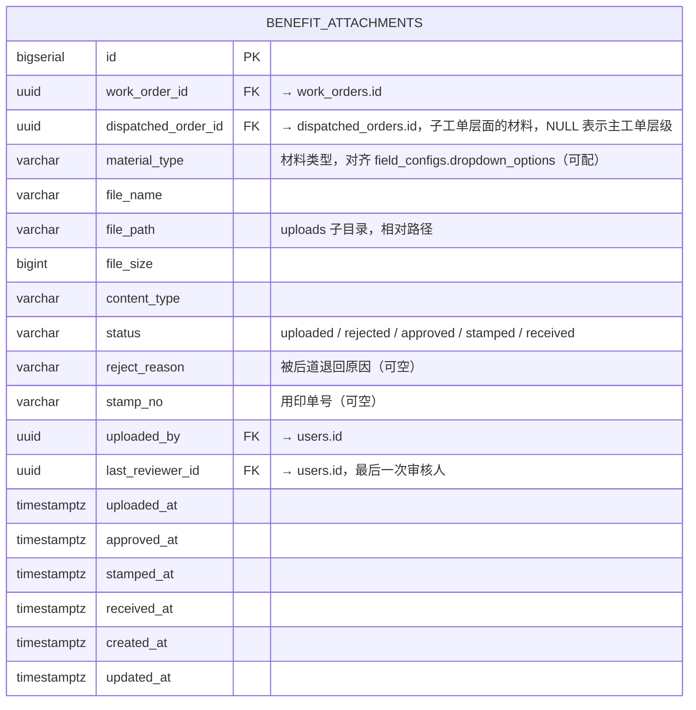
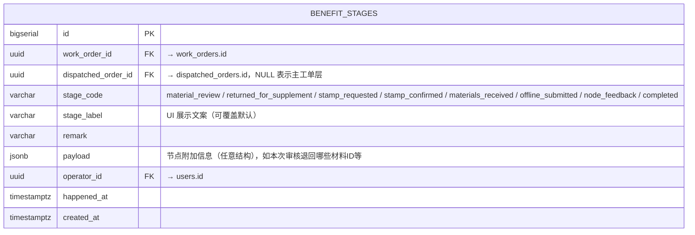
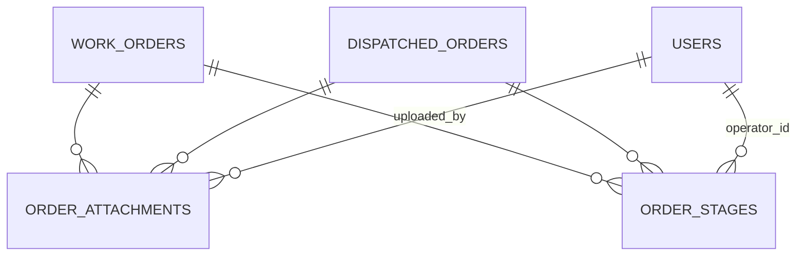

# P7 · 需求确认与实施拆分

> 版本：v1.0（架构师定稿，待用户确认）
> 日期：2026-05-12
> 适用范围：P7 一期 = 入职管理返工（删社保）+ 续签 / 离职 / 待遇申报 三条新业务 + 多维表格能力 + 通知"标已读"交互 Bug 修复
> 不改动：NestJS + TypeORM + PostgreSQL 后端骨架、已 fixed-verified 的两条 Bug（导入流 + 撤回审批的修复不回退）、Docker Compose、Nginx 配置
> 设计原则：凡能"配置化"的就不硬编码；3 条新业务全部复用已有 `work_orders → dispatched_orders` 双层模型 + `dispatch_rules` 表驱动派发 + `field_configs` / `field_permissions` 表驱动表单，不增加新的业务专属实体，除非为状态机 / 附件等通用能力兜底。

---

## 1. 范围清单（用户原话 + 架构师复述，一字不差）

### 1.1 入职管理（返工口径）

| 项 | 原语 | 本次返工后的硬约束 |
|----|------|------|
| 子工单数量 | "这是我整个项目一个入职管理模块……拆分是分为三个子表，入职联系，劳动合同签订，数据录入" | **3 个子工单**：`onboarding_contact` / `contract` / `data_entry`。**删除 `social_security`**。 |
| 角色数量 | "共 9 个角色（之前 11 个，删除社保相关 2 个）" | **9 个角色**：`admin`、`manager`、`salesperson`、`contract_team`、`onboarding_team`、`data_entry_team`、`contract_supervisor`、`onboarding_supervisor`、`data_entry_supervisor`。**删除 `social_security_team` / `social_security_supervisor`**。 |
| 派发规则 | "规则 1：订单类型=onboarding → 拆 data_entry（无条件必拆）；规则 2：AND need_onboarding_contact=是 → 拆 onboarding_contact；规则 3：AND need_company_contract=是 → 拆 contract" | `dispatch_rules` 里 `order_type=onboarding` 的规则**只留 3 条**，删掉 `target_module=social_security` 的那条。 |
| 字段权限场景 | "修正后，3 个子工单场景" | 场景键枚举缩为 **4 个**：`main` + `dispatched:contract` + `dispatched:onboarding_contact` + `dispatched:data_entry`。删除 `dispatched:social_security`。 |
| 社保字段去向 | 由架构师追问确认："社保相关 5 个字段保留供将来扩展，但 3 个子工单场景全部 hidden" | `field_configs` 中 `social_location` / `start_month` / `social_base` / `fund_base` / `fund_ratio` **保留**；`field_permissions` 在 3 个子工单场景下一律 `hidden`，在 `main` 主工单场景保持业务员 `visible`（方便业务员仍可在主工单里填，为后续接回做准备）。 |
| 字段权限（4 个场景） | 用户 §8.1 ~ §8.4 | 按 §3.2 的矩阵落地。4 个回写字段在主工单场景 salesperson 为 `readonly`：`contract_feedback`、`onboarding_feedback`、`data_entry_feedback`、~~`social_security_feedback`~~（最后一个已不存在）。 |

### 1.2 在职管理（新增）

用户原话关键点逐条摘录：

#### 1.2.1 劳动合同续签
- 业务员用"续签信息收集表（同增员表）"采集→导入工单系统
- 数据传导至合同组
- 合同组用"提前配置的合同模板"输出报表→线下交付
- 交付完成后在系统上反馈

#### 1.2.2 待遇申报
- "业务员根据员工不同待遇申报需求，提起相应的工单"
- "需提前确认常见待遇申报类型"
- "提前配置通用信息表单，但也需要保留后续新增自定义表单和流程的功能"
- **退回补充**：后道审核信息或材料有问题可退回业务员重新修改和补充
- **用印申请**：材料无问题时确认回业务员，业务员材料用印后线下提供至后道
- **收齐确认**：后道在工单系统上确认材料已收集齐，进入线下申报
- **节点反馈**：交付过程中的主要节点或完成交付后在系统上反馈

#### 1.2.3 离职管理
- 业务员收集离职信息→导入→传导至**合同组**（用户明写"合同组"，不是独立离职组）
- "合同组根据工单筛选需要进行离职联系的员工清单"
- "线下通过小程序向员工收集离职信息及材料，并根据员工反馈开具离职证明"
- 完成交付后反馈

### 1.3 系统功能层面

- 标准字段 + 支持新增采集字段（已有 `field_configs` 表，满足）
- 本地派单数据补充标记（已有 `field_supplement_logs` + `field_supplement_rules`，满足）
- 后道只能查自己模块工单（已有 `module_handlers` + `visible_fields`，满足）
- 模板配置导出（已有 `export_templates`，待遇申报要补材料类型，见 §2.2）
- 退回重提（已有 `returned` 状态，满足）
- 批导入 / 批导出 / 模糊搜索 / 批量勾选（已有，多维表格 §5 会再增强）
- 看板（已有 Phase 6 看板，3 条新业务只要 Enum 扩进来即可复用）
- 后台 用户/角色/权限/工单流程/模板 管理（已有 admin 模块，无需返工）

### 1.4 Bug 修复

**通知"标已读"点击无反应 Bug**：
- 文件：`frontend/src/pages/Notifications/index.tsx:41-45` 以及 `frontend/src/services/notifications.ts:38-41`。
- 架构师初查：Mock 模式下 `markNotificationRead` 直接返回 `undefined`，**没有修改 `mockNotifications[].is_read`**，所以点击"标已读"后 `actionRef.current?.reload()` 重新请求到的数据与点击前一模一样，UI 看起来"无反应"。实接后端的真实调用路径下存在同样的问题：`@/services/notifications` 返回 `void`，但 `ProTable` 重新请求依赖 `request()` 重新拉到已翻转的数据；若后端未实际翻转或返回 4xx 被 axios 拦截吞掉，同样会"无反应"。
- 修复口径：**Mock 层翻转 + 实接层等待后端 200 + `message.success("已标为已读")` 反馈 + `refreshCounts` 立即更新左上角 Badge**。详见 §6 前端工作包 FE-F。

### 1.5 不要改动的

- ✅ NestJS + TypeORM + PostgreSQL
- ✅ Phase1~Phase6 已 fixed-verified 的 Bug（不回退 / 不回灌旧代码）
- ✅ `docker-compose.yml` / `nginx/nginx.conf`
- ✅ 已有枚举 `OrderType` 已经定义了 `ONBOARDING / RENEWAL / RESIGNATION / BENEFIT`（见 `backend/src/entities/enums.ts:17-22`），**不需要 DDL**

---

## 2. ER 图补充

### 2.1 OrderType 枚举

已存在，确认无需改（`backend/src/entities/enums.ts`）：

```ts
export enum OrderType {
  ONBOARDING = 'onboarding',
  RENEWAL = 'renewal',
  RESIGNATION = 'resignation',
  BENEFIT = 'benefit',
}
```

> 注：由于 `dispatch_rules.order_type` 使用了 PG `enum`（见 `dispatch-rule.entity.ts:17-22`），在生产库里需要确认这 4 个值都已在 DB enum 中。迁移脚本 §7.2 会 `ALTER TYPE ... ADD VALUE IF NOT EXISTS` 兜底。

### 2.2 新增 / 扩展表

#### 2.2.1 `benefit_attachments` 待遇申报材料（新增）

**新建**。理由：待遇申报是 P7 唯一需要"文件上传 + 审核状态 + 用印流转"的子业务，这不是任何字段能承载的结构化信息，必须专表。



索引：`idx_ba_dispatched (dispatched_order_id)`、`idx_ba_wo (work_order_id)`、`idx_ba_status (status)`。
存储：文件实体沿用 `backend/uploads/`（已存在 `upload` 模块），`benefit_attachments.file_path` 只存相对路径，不入库二进制。

#### 2.2.2 `benefit_stages` 待遇申报节点（新增）

**新建**。待遇申报不是简单的 `draft → processing → completed`，有"材料审核"、"退回业务员"、"用印申请"、"收齐"、"线下申报"、"多节点反馈"6 个状态机节点，用通用的 `stage_code + happened_at + operator_id + remark` 表承载，便于未来扩展新业务的节点化反馈。



索引：`idx_bs_dispatched (dispatched_order_id, happened_at DESC)`、`idx_bs_stage (stage_code)`。
扩展性：续签 / 离职也可以复用这张表记录"节点反馈"（表名加 `benefit_` 前缀不理想，**建议重命名为 `order_stages`**）。

**架构决定**：改表名 `benefit_stages` → `order_stages`，承载**所有订单类型**的节点流。待遇申报的状态机是特例，其他订单只用到 `completed / node_feedback` 两节点。

#### 2.2.3 `resignation_contacts` 是否新建？

**不新建**。理由：
- 用户原话"数据传导至合同组" + "合同组根据工单筛选需要进行离职联系的员工清单"—— 离职就是一个走 `contract_team` 处理的子工单，**复用 `dispatched_orders`** 即可，`module_code = 'resignation_contact'`，处理角色是 `contract_team`（和合同组同一个执行岗，只是该岗位新增一个 `module_handlers` 映射）。
- 离职证明产物是材料，走 `benefit_attachments`（→`order_attachments` 见下一节）或直接走 `export_templates` 导出。

#### 2.2.4 附件表收编

既然离职也要"开具离职证明"，建议 `benefit_attachments` 重命名为 `order_attachments`，作为**所有订单类型**的附件总表，新增 `biz_purpose` 列区分用途：

```
biz_purpose 枚举：benefit_material | resignation_cert | renewal_contract | misc
```

这样：
- 待遇申报上传/退回/用印/收齐 → `biz_purpose=benefit_material`
- 离职证明开具 → `biz_purpose=resignation_cert`
- 续签合同回传（如果需要） → `biz_purpose=renewal_contract`

**最终 ER 决策**：
- ✅ **新建 `order_attachments`**（取代原 `benefit_attachments` 名）
- ✅ **新建 `order_stages`**（取代原 `benefit_stages` 名）
- ❌ **不新建 `resignation_contacts`**，复用 `dispatched_orders`

### 2.3 ER 图（增量）



---

## 3. 新字段清单

> 以下字段全部以 `field_configs` 行形式落地；`order_type` 列区分场景。字段数量刻意压缩在用户给定范围（续签 25、离职 18、待遇申报 32），并结合现有 54 个入职字段去重复用（customer_name / employee_name / id_card_no / mobile 等公共字段共 8 个在 3 类新业务都复用，不重复入 `field_configs`，通过 `order_type=NULL` 视为"全局字段"或通过 `scenario` 级联）。

### 3.1 续签（RENEWAL）25 字段

复用已有 8 公共字段（customer_name / customer_code / employee_name / id_card_no / gender / mobile / email / position），新增 **17 个续签特有字段 + 回填 8 个合同字段不算复用**：

| # | field_code | field_name | field_type | required | 备注 |
|---|-----------|-----------|-----------|----------|------|
| 1 | renewal_reason | 续签原因 | DROPDOWN | Y | 到期续签 / 调岗续签 / 其他 |
| 2 | prev_contract_no | 上一份合同编号 | TEXT | Y | |
| 3 | prev_contract_end_date | 上一份合同到期日 | DATE | Y | 核对员工身份 |
| 4 | renewal_term_type | 续签期限形式 | DROPDOWN | Y | 固定/无固定/任务期限 |
| 5 | renewal_term | 续签期限 | TEXT | Y | |
| 6 | renewal_start_date | 续签合同起始日 | DATE | Y | |
| 7 | renewal_end_date | 续签合同终止日 | DATE | Y | `renewal_term_type=固定期限` 时条件必填 |
| 8 | renewal_probation_months | 续签试用期(月) | NUMBER | N | 续签一般无试用期，可空 |
| 9 | renewal_work_city | 续签工作城市 | TEXT | Y | |
| 10 | renewal_position | 续签岗位 | TEXT | N | 调岗续签时必填，通过 `conditional_required` 实现 |
| 11 | renewal_base_salary | 续签基本工资 | NUMBER | Y | |
| 12 | renewal_other_salary | 续签其他工资 | NUMBER | N | |
| 13 | renewal_contract_subject | 续签合同主体 | TEXT | Y | |
| 14 | renewal_contract_template | 续签合同模板 | TEXT | Y | |
| 15 | need_renewal_urge | 续签是否需催办员工 | DROPDOWN | N | 是/否 |
| 16 | renewal_feedback | 续签反馈 | DROPDOWN | N | 未办/办理中/已办结（回写字段） |
| 17 | renewal_remark | 备注 | TEXT | N | |

含 8 个复用公共字段 = 25 个。

### 3.2 离职（RESIGNATION）18 字段

复用 6 公共字段（customer_name / customer_code / employee_name / id_card_no / mobile / position），新增 **12 个离职特有字段**：

| # | field_code | field_name | field_type | required | 备注 |
|---|-----------|-----------|-----------|----------|------|
| 1 | resignation_type | 离职类型 | DROPDOWN | Y | 协商一致/主动辞职/公司辞退/合同到期/其他 |
| 2 | resignation_reason | 离职原因 | TEXT | Y | |
| 3 | last_work_date | 最后工作日 | DATE | Y | |
| 4 | contract_terminate_date | 合同解除日 | DATE | Y | |
| 5 | handover_person | 工作交接人 | TEXT | N | |
| 6 | need_resignation_cert | 是否需要开具离职证明 | DROPDOWN | Y | 是/否 |
| 7 | cert_delivery_address | 离职证明送达地址 | TEXT | N | `need_resignation_cert=是` 时条件必填 |
| 8 | resignation_contact_feedback | 离职联系反馈 | DROPDOWN | N | 未联系/已联系/材料回传/不回传（回写） |
| 9 | resignation_cert_status | 离职证明开具状态 | DROPDOWN | N | 未开具/已开具/已送达（回写） |
| 10 | social_handover_done | 社保转出已办理 | DROPDOWN | N | 是/否，留给未来接回 |
| 11 | final_salary_settled | 末月工资已结算 | DROPDOWN | N | 是/否 |
| 12 | resignation_remark | 备注 | TEXT | N | |

含 6 公共字段 = 18 个。

### 3.3 待遇申报（BENEFIT）32 字段

待遇申报是"类型驱动 + 字段可扩展"。`field_configs` 预置一个**基础通用表单 20 字段**，每种"待遇申报类型"还可以在管理后台**新增自定义字段**（`field_configs.order_type=benefit`，新增行时运行时热加载）。预置字段：

复用 6 公共字段（customer_name / customer_code / employee_name / id_card_no / mobile / position）+ **26 个待遇申报特有字段**：

| # | field_code | field_name | field_type | required | 备注 |
|---|-----------|-----------|-----------|----------|------|
| 1 | benefit_type | 待遇申报类型 | DROPDOWN | Y | 工伤认定/工伤待遇/生育津贴/失业金领取/医疗报销/其他（可配） |
| 2 | benefit_region | 申报地 | TEXT | Y | 影响申报材料清单 |
| 3 | benefit_start_date | 事件起始日 | DATE | Y | 工伤/事件发生日 |
| 4 | benefit_end_date | 事件结束日 | DATE | N | |
| 5 | benefit_claim_amount | 申报金额 | NUMBER | N | |
| 6 | benefit_bank_name | 收款开户行 | TEXT | N | |
| 7 | benefit_bank_account | 收款账号 | TEXT | N | |
| 8 | benefit_contact_person | 联系人 | TEXT | Y | |
| 9 | benefit_contact_phone | 联系电话 | PHONE | Y | |
| 10 | benefit_materials_required | 所需材料清单 | TEXT | Y | `dropdown_options` 改用 `textarea`，逗号分隔，便于导出 |
| 11 | benefit_materials_received | 已收到材料 | TEXT | N | 自动从附件状态计算，回写字段 |
| 12 | benefit_review_status | 材料审核状态 | DROPDOWN | N | 未审核/部分通过/已通过/已退回（回写） |
| 13 | benefit_review_remark | 审核意见 | TEXT | N | |
| 14 | benefit_stamp_requested | 是否已发起用印 | DROPDOWN | N | 是/否 |
| 15 | benefit_stamp_no | 用印单号 | TEXT | N | |
| 16 | benefit_stamp_confirmed | 用印完成 | DROPDOWN | N | 是/否 |
| 17 | benefit_materials_collected | 材料收齐确认 | DROPDOWN | N | 是/否（业务员线下送达后后道勾选） |
| 18 | benefit_submit_date | 线下申报日 | DATE | N | |
| 19 | benefit_submit_office | 申报部门 | TEXT | N | |
| 20 | benefit_result | 申报结果 | DROPDOWN | N | 申报中/已通过/已驳回/补材料中（回写） |
| 21 | benefit_result_date | 结果反馈日 | DATE | N | |
| 22 | benefit_payout_date | 到账日 | DATE | N | |
| 23 | benefit_payout_amount | 到账金额 | NUMBER | N | |
| 24 | benefit_return_reason | 退回补充原因 | TEXT | N | 后道退回业务员时填 |
| 25 | benefit_custom_fields | 自定义字段 | TEXT(JSON) | N | 自定义扩展兜底（旧版 fallback） |
| 26 | benefit_remark | 备注 | TEXT | N | |

含 6 公共字段 = 32 个。

**自定义扩展机制**：管理员在 `admin/field-configs` 页面新增 `order_type=benefit` 的字段（如某地区特有的"工伤伤残等级鉴定编号"），前端 DynamicForm 自动渲染；对应的 `field_permissions` 走脚手架批量插入。

---

## 4. 派发规则 JSON AST（3 新场景）

规则全部写入 `dispatch_rules`；命名 `ruleName` 保证可读；`dispatch_strategy=fixed`（一期不做轮询 / 负载均衡）。

### 4.1 续签（renewal）

```json
[
  {
    "ruleName": "续签工单派发-合同组",
    "orderType": "renewal",
    "triggerConditions": null,
    "targetModule": "contract",
    "dispatchStrategy": "fixed",
    "priority": 10
  }
]
```

`triggerConditions=null` = 恒真。续签只有 1 条派发规则：一律派给合同组。

### 4.2 离职（resignation）

```json
[
  {
    "ruleName": "离职工单派发-合同组（默认）",
    "orderType": "resignation",
    "triggerConditions": null,
    "targetModule": "resignation_contact",
    "dispatchStrategy": "fixed",
    "priority": 10
  },
  {
    "ruleName": "离职工单-需要开具离职证明",
    "orderType": "resignation",
    "triggerConditions": {
      "op": "AND",
      "children": [
        { "op": "EQ", "field": "need_resignation_cert", "value": "是" }
      ]
    },
    "targetModule": "resignation_cert",
    "dispatchStrategy": "fixed",
    "priority": 20
  }
]
```

**说明**：
- `target_module=resignation_contact`（处理人：`contract_team`，按 `module_handlers` 映射）承担"筛选员工清单 + 小程序线下联系 + 信息反馈"。
- `target_module=resignation_cert`（处理人仍然是 `contract_team`）承担"开具离职证明 + 线下送达"；条件派发，只有选择需要证明时才拆。
- 用户原话"数据传导至合同组" = 派到 `contract_team`，这里用两个 module_code 来**区分处理场景**，但处理角色都在合同组。角色表不增加。

### 4.3 待遇申报（benefit）

```json
[
  {
    "ruleName": "待遇申报主派发-申报组",
    "orderType": "benefit",
    "triggerConditions": null,
    "targetModule": "benefit_apply",
    "dispatchStrategy": "fixed",
    "priority": 10
  }
]
```

单条无条件派发。**所有待遇申报类型**（工伤认定 / 生育津贴 / 失业金 / 医疗报销等）统一派给"申报组" `module_code=benefit_apply`，具体处理人由 `module_handlers` 按 `benefit_region`（申报地）做二级分配 —— 由执行岗主管在后台维护 `module_handlers` 时设置 `filter_jsonb`（Phase3 已支持）。

**处理角色复用 `contract_team`**：一期为了不增加第 10 个角色，申报组暂由合同组 + 业务员联动承担。若未来要拆出独立申报组，再加 `benefit_team` / `benefit_supervisor` 两角色即可（新建表依然不必要）。

### 4.4 待遇申报的状态机（在 `order_stages` 表上用代码驱动）

```
Stage Transitions:
  material_review         —— 材料审核中（后道接单 → 自动创建）
  returned_for_supplement —— 退回业务员补充（条件：后道勾选退回；work_orders.status → returned）
  stamp_requested         —— 业务员申请用印（业务员提交用印申请）
  stamp_confirmed         —— 用印完成（业务员回填）
  materials_received      —— 后道确认材料收齐（后道勾选）
  offline_submitted       —— 线下申报已提交（后道填 benefit_submit_date 时自动写入）
  node_feedback           —— 节点反馈（任意次，后道手填）
  completed               —— 申报完结（后道结论）
```

状态机合法转移 DAG：

```
          ┌─→ returned_for_supplement ─→ material_review
material_review
          └─→ stamp_requested ─→ stamp_confirmed ─→ materials_received ─→ offline_submitted ─→ node_feedback* ─→ completed
```

---

## 5. 多维表格实施方案

### 5.1 目标

工单列表 / 子工单列表 / 通知列表 / 待遇申报列表 等主要表格页面具备：
- **视图切换**：表格视图 / 看板视图（按 status 分列）/ 分组视图（按某列聚合）
- **动态列显示 / 隐藏 + 列顺序拖拽 + 列宽记忆**
- **多维度筛选**：任意列可开筛选，AND / OR 可组合
- **网格内编辑（inline edit）**：双击或 Enter 进入编辑；仅在字段权限 `editable=true` 时启用
- **视图保存**：把列配置 + 筛选 + 排序保存成"视图方案"，存 `localStorage` 一期足够，Phase 8 再持久化到 `user_table_views` 表

### 5.2 两个方案对比

#### 方案 A：`@ant-design/pro-components` 的 **ProTable + EditableProTable** + 自建视图切换层

| 维度 | 细节 |
|------|------|
| 现状适配 | 项目已 **全量使用 ProTable**（见 `frontend/src/components/ProTablePage/index.tsx`、`frontend/src/pages/WorkOrders/index.tsx`），返工成本最低 |
| 表格能力 | ProTable 自带 columnsState（列显隐 / 排序 / 固定）、dragSortKey 行拖拽、表头筛选、搜索栏、批量操作条、EditableProTable 支持 inline edit |
| 缺项 | 看板视图、分组视图、自定义视图方案保存 —— **均需自建**（大约 400~600 行组件代码 + react-dnd 拖拽） |
| 依赖增量 | 0（`react-dnd` 可用 `@dnd-kit/core` 替代，`@ant-design/pro-components` 已在 `package.json:22`） |
| 运行时开销 | 小，ProTable 单表 5k 行顺畅 |
| 可维护性 | 高，团队已熟悉 ProTable |
| 风险 | 自建看板视图的状态机 / 拖拽交付工单 / 乐观更新需小心 |

#### 方案 B：引入 `@tanstack/react-table v8` 作为底层 + `ag-grid-community` 作为高级网格

| 维度 | 细节 |
|------|------|
| 现状适配 | **需要重写所有 ProTable 页面**（工单、子工单、通知、我的待办、导入记录 等 10+ 页面），成本大 |
| 表格能力 | ag-grid 原生支持视图切换、透视、分组、网格编辑、列拖拽、服务端分页、虚拟滚动 5 万行流畅 |
| 缺项 | 看板视图仍需自建（ag-grid 没内置） |
| 依赖增量 | `@tanstack/react-table`（~15KB gz）+ `ag-grid-community`（~300KB gz）+ `ag-grid-react`（~15KB gz）**共约 +330KB 打包** |
| 运行时开销 | ag-grid 对企业级数据量优势显著，但一期并无 5 万行场景 |
| 可维护性 | 中，团队需要学习 ag-grid API（列定义与 antd 差异较大） |
| 风险 | 与 antd 视觉体系不统一（ag-grid 默认主题不是 antd 风格，需要定制 CSS），返工工作量最大 |

#### 架构师推荐：**方案 A**

**理由**：
1. 现有 ProTable 页面 10+ 个，方案 B 会拖垮 P7 进度。
2. 用户的诉求"像飞书多维表格那种"核心是**视图切换 + 列显隐 + 筛选保存**，这 3 样 ProTable + 自建层完全覆盖，不需要 ag-grid 级别的透视 / 千万行能力。
3. 方案 B 带来的 330KB 打包增量对一个内部系统不划算；当前 `dist` 约 1.1MB，再涨 30% 没有业务收益。
4. 未来如果真遇到"单页 5 万行 + 透视分析"诉求（不太可能 —— 工单量级不会到这里），再切 ag-grid 不晚。

### 5.3 方案 A 落地拆分

新增组件：`frontend/src/components/MultiViewTable/`

```
MultiViewTable/
├── index.tsx              # 主组件，内部状态机 viewMode: 'table' | 'kanban' | 'group'
├── TableView.tsx          # 包装 ProTable + columnsState 扩展
├── KanbanView.tsx         # 基于 @dnd-kit/core 的列拖拽看板（按某列值分列）
├── GroupView.tsx          # ProTable 的 expandable.childrenColumnName 实现分组
├── ViewSchemeBar.tsx      # 视图方案保存 / 切换（localStorage 一期）
├── FilterChips.tsx        # 多维筛选 chips（复用 AstConditionEditor 能力）
└── types.ts               # ViewScheme / ViewMode 类型定义
```

API 契约：

```ts
interface MultiViewTableProps<T> {
  columns: ProColumns<T>[];
  request: ProTableProps<T, Record<string, unknown>>['request'];
  rowKey?: string;
  viewId: string;                                    // 视图方案 localStorage key
  kanbanColumnKey?: keyof T;                         // 按哪个字段分列（例：status）
  kanbanAllowedValues?: Array<{ value: string; label: string; color?: string }>;
  onKanbanDragEnd?: (item: T, from: string, to: string) => Promise<void>;
  groupByOptions?: Array<{ key: keyof T; label: string }>;
  editableKeys?: (keyof T)[];                        // 网格内编辑白名单
  onInlineEdit?: (id: string, patch: Partial<T>) => Promise<void>;
}
```

页面迁移成本：把 `<ProTable ... />` 改成 `<MultiViewTable ... viewId="work-orders" kanbanColumnKey="status" ... />`，10 个页面每个 20~30 行改动。

---

## 6. 实施计划

> 工时单位：**人 · 天**（1 天 = 6 有效小时）。依赖图请以 §6.5 为准。

### 6.1 后端（负责人：后端工程师）

| # | 工作包 | 工时 | 依赖 | 产出 |
|---|--------|------|------|------|
| BE-A | 迁移脚本 v1.3：新建 `order_attachments` + `order_stages` + `ALTER TYPE order_type ADD VALUE IF NOT EXISTS` 兜底 | 1.5 | - | `1715800000000-P7Extend.ts` 迁移 + rollback |
| BE-B | Seed v2：角色 11→9（保留 social_security_* 但 `is_active=false`，保留历史 FK），`dispatch_rules` 新增 4 条（续签 1 + 离职 2 + 待遇 1）并停用 `target_module=social_security` 的那条 | 1.0 | BE-A | `seed-roles.ts` 调整、`seed-dispatch-rules.ts` 调整 |
| BE-C | `field_configs` 增 60 行（续签 17 + 离职 12 + 待遇申报 26 + 5 公共保留字段不动 + 避开已有 customer_name 等） | 1.0 | BE-A | `seed-fields.ts` 增量 |
| BE-D | `field_permissions` 矩阵：入职场景**删除** `dispatched:social_security`（设为 hidden 而非删行，保留历史审计），新增 4 场景（续签 main / renewal 子 / 离职 main / 离职 子 / 待遇 main / 待遇 子） | 1.5 | BE-B, BE-C | `seed-field-permissions.ts` |
| BE-E | `module_handlers` 扩：新增 `resignation_contact` / `resignation_cert` / `benefit_apply` 的处理人映射 | 0.5 | BE-B | seed 增量 |
| BE-F | `OrderAttachment` Entity + `OrderStage` Entity + DTO + Controller `/order-attachments`、`/order-stages`（基础 CRUD + 状态流转校验） | 3.0 | BE-A | `backend/src/modules/order-attachments/*` + `order-stages/*` |
| BE-G | 在 `DispatchEngineService` 里扩展对 3 新 OrderType 的派发（无代码改动，只靠数据驱动；需加测试用例） | 0.5 | BE-B, BE-D | `dispatch-engine.service.spec.ts` 新增 8 组 case |
| BE-H | `NotificationService` 通知模板新增：`benefit_material_returned` / `benefit_material_collected` / `resignation_cert_issued` | 0.5 | - | `seed-notification-templates.ts` 扩 3 行 |
| BE-I | 标已读接口稳健性：返回 `{ success: true, affected: n }` 而非空响应，便于前端判断；增 e2e | 0.5 | - | `notifications.controller.ts` 返回体修正 |
| BE-J | 单元测试 + e2e（3 条业务流 + 附件上传 + 状态机非法转移拒绝） | 2.0 | BE-F, BE-G | `test/**/*.e2e-spec.ts` |

**后端合计**：12 天

### 6.2 前端（负责人：前端工程师）

| # | 工作包 | 工时 | 依赖 | 产出 |
|---|--------|------|------|------|
| FE-A | `MultiViewTable` 组件（§5.3） | 3.0 | - | `components/MultiViewTable/*` |
| FE-B | 10 个现有列表页迁移到 `MultiViewTable` | 2.0 | FE-A | 修改 10 页 + 快照测试 |
| FE-C | 续签页面：`/work-orders/new?type=renewal`（DynamicForm 已支持 order_type 切换） + 详情页若干字段微调 | 1.0 | BE-C, BE-D | `pages/WorkOrders/New` 分支 |
| FE-D | 离职页面：`/work-orders/new?type=resignation` + 离职证明材料区（用 FE-G 上传组件） | 1.5 | BE-C, BE-F | 同上 |
| FE-E | 待遇申报页面：列表 + 详情 + 状态机 Timeline + 自定义字段热加载 | 3.5 | BE-C, BE-F | `pages/Benefits/*` |
| FE-F | **通知"标已读" Bug 修复** + Mock 层翻转 + 反馈 message + 单元测试 | 0.5 | BE-I | `pages/Notifications/index.tsx` + `services/notifications.ts` |
| FE-G | 材料上传 / 用印申请 UI 组件（复用 `ExcelUploader` + 新增 `AttachmentUploader`）；用印申请表单对话框 | 2.0 | BE-F | `components/AttachmentUploader/*` + `components/StampRequestModal/*` |
| FE-H | 状态流转 Timeline 组件（`OrderStagesTimeline`） | 1.0 | BE-F | `components/OrderStagesTimeline/*` |
| FE-I | 路由 + 菜单：3 个新业务的入口、Breadcrumb、权限守卫 | 0.5 | FE-C~FE-E | `routes/*` + `layouts/*` |
| FE-J | 看板视图的乐观更新 + 失败回滚 | 0.5 | FE-A | `MultiViewTable/KanbanView.tsx` |

**前端合计**：15.5 天

### 6.3 QA（负责人：测试工程师）

| # | 工作包 | 工时 | 依赖 | 产出 |
|---|--------|------|------|------|
| QA-A | 测试用例文档更新：§9 入职（删社保 case）+ 新增续签 18 case / 离职 14 case / 待遇申报 28 case | 2.0 | 用户确认 | `docs/Phase7测试用例.md` |
| QA-B | 标已读 Bug 回归：Mock + 实接 + 刷新验证 is_read 翻转 + Badge 同步 | 0.5 | FE-F | 回归报告一节 |
| QA-C | 多维表格 E2E（Playwright）：视图切换 / 列显隐 / 筛选 / 网格编辑 / 看板拖拽 | 1.5 | FE-A, FE-B | `e2e/multi-view-table.spec.ts` |
| QA-D | 3 新业务 E2E（各一条幸福路径 + 一条退回路径） | 2.0 | FE-C~FE-E | `e2e/benefit.spec.ts` 等 |
| QA-E | 废弃 social_security 的回归：数据库现有主工单 show 社保字段仍可见；子工单 list 不含社保；旧子工单（历史数据）仍能查询 | 1.0 | BE-B, BE-D | 回归报告 |
| QA-F | 字段权限矩阵完整性测试（4 场景 × 9 角色 × 所有字段 的权限 snapshot） | 1.5 | BE-D | `test/permissions.snapshot.spec.ts` |
| QA-G | GO/NO-GO 验收 | 0.5 | 全部 | 验收清单 |

**QA 合计**：9 天

### 6.4 文档（架构师，伴随式）

| # | 工作包 | 工时 |
|---|--------|------|
| DOC-A | 本文件（P7-需求确认与实施拆分）v1.0 | 已完成 |
| DOC-B | 架构变更日志 v1.3 条目（社保下线 + order_attachments / order_stages 上线） | 0.5 |
| DOC-C | ER 图 v1.3 | 0.5 |
| DOC-D | DispatchEngine-JSON-AST 规范新增 3 场景示例 | 0.5 |

**文档合计**：1.5 天（不影响关键路径）

### 6.5 依赖图 / 关键路径

```
BE-A ──► BE-B ──► BE-D ──► BE-G
   │         │         │
   │         └────► BE-E
   │
   └────► BE-F ──► FE-G ──► FE-E ──► QA-D
   │         │         │
   └────► BE-C ──► FE-C / FE-D / FE-E
                                 │
FE-A ──► FE-B ──► QA-C          │
                                 │
BE-I ──► FE-F ──► QA-B          │
                                 │
                  全部完成 ──► QA-F ──► QA-G（验收）
```

**关键路径**：`BE-A → BE-B → BE-D → FE-E → QA-D → QA-G`，约 **10.5 天**（可并行后的日历天）。
**总工作量**：12（BE）+ 15.5（FE）+ 9（QA）+ 1.5（DOC）= **38 人 · 天**；按 1 BE + 1 FE + 1 QA 并行，**预计 16 ~ 18 个工作日完成**（含集成 buffer）。

---

## 7. 废弃 social_security 的迁移与回退方案

### 7.1 废弃策略：软下线 + 保留审计

**不删表、不删字段、不删历史行**，而是：

| 资源 | 处理方式 |
|------|----------|
| `roles` 表中 `social_security_team` / `social_security_supervisor` | **软删**：`is_active=false`，历史 `user_roles` FK 保留 |
| `module_handlers` 中 `module_code='social_security'` | **软删**：`is_active=false` |
| `dispatch_rules` 中 `target_module='social_security'` 的规则 | **软删**：`is_active=false` |
| `field_configs` 中 social 相关 5 字段（`social_location` / `start_month` / `social_base` / `fund_base` / `fund_ratio`） | **保留 + `is_active=true`**（业务员主工单仍可见） |
| `field_permissions` 的 `scenario='dispatched:social_security'` 场景 | **保留**行，但每行 `permission='hidden'`（实际上已无该场景 UI） |
| `field_permissions` 的 `scenario='main'` 主工单场景下，社保 5 字段对 `salesperson` 保持 `visible`，对 3 个执行岗 / 主管以外角色 `hidden`（对 salesperson 只读性质可选配置） | 按 §8.1 |
| `dispatched_orders` 历史数据 `module_code='social_security'` | **保留**，不删，`status` 沿用原状；管理员在后台仍可查询，但新工单不再产生 |
| 新的派发 | `DispatchEngineService` 只匹配 `is_active=true` 的规则，自动跳过 social |

### 7.2 迁移脚本（后端 BE-A）

`backend/src/database/migrations/1715800000000-P7Extend.ts`：

```ts
import { MigrationInterface, QueryRunner } from 'typeorm';

export class P7Extend1715800000000 implements MigrationInterface {
  name = 'P7Extend1715800000000';

  public async up(q: QueryRunner): Promise<void> {
    // 1. OrderType enum 补值（如果未存在）
    await q.query(`
      DO $$ BEGIN
        IF NOT EXISTS (SELECT 1 FROM pg_enum e JOIN pg_type t ON e.enumtypid=t.oid
                       WHERE t.typname='order_type_enum' AND e.enumlabel='renewal') THEN
          ALTER TYPE order_type_enum ADD VALUE 'renewal';
        END IF;
        IF NOT EXISTS (SELECT 1 FROM pg_enum e JOIN pg_type t ON e.enumtypid=t.oid
                       WHERE t.typname='order_type_enum' AND e.enumlabel='resignation') THEN
          ALTER TYPE order_type_enum ADD VALUE 'resignation';
        END IF;
        IF NOT EXISTS (SELECT 1 FROM pg_enum e JOIN pg_type t ON e.enumtypid=t.oid
                       WHERE t.typname='order_type_enum' AND e.enumlabel='benefit') THEN
          ALTER TYPE order_type_enum ADD VALUE 'benefit';
        END IF;
      END $$;
    `);

    // 2. order_attachments
    await q.query(`
      CREATE TABLE IF NOT EXISTS order_attachments (
        id             bigserial PRIMARY KEY,
        work_order_id  uuid NOT NULL REFERENCES work_orders(id) ON DELETE CASCADE,
        dispatched_order_id uuid NULL REFERENCES dispatched_orders(id) ON DELETE SET NULL,
        biz_purpose    varchar(32) NOT NULL,
        material_type  varchar(64) NULL,
        file_name      varchar(255) NOT NULL,
        file_path      varchar(512) NOT NULL,
        file_size      bigint NOT NULL,
        content_type   varchar(128) NULL,
        status         varchar(32) NOT NULL DEFAULT 'uploaded',
        reject_reason  varchar(512) NULL,
        stamp_no       varchar(64) NULL,
        uploaded_by    uuid NOT NULL REFERENCES users(id),
        last_reviewer_id uuid NULL REFERENCES users(id),
        uploaded_at    timestamptz DEFAULT now(),
        approved_at    timestamptz NULL,
        stamped_at     timestamptz NULL,
        received_at    timestamptz NULL,
        created_at     timestamptz DEFAULT now(),
        updated_at     timestamptz DEFAULT now()
      );
      CREATE INDEX IF NOT EXISTS idx_oa_wo ON order_attachments(work_order_id);
      CREATE INDEX IF NOT EXISTS idx_oa_do ON order_attachments(dispatched_order_id);
      CREATE INDEX IF NOT EXISTS idx_oa_status ON order_attachments(status);
    `);

    // 3. order_stages
    await q.query(`
      CREATE TABLE IF NOT EXISTS order_stages (
        id             bigserial PRIMARY KEY,
        work_order_id  uuid NOT NULL REFERENCES work_orders(id) ON DELETE CASCADE,
        dispatched_order_id uuid NULL REFERENCES dispatched_orders(id) ON DELETE SET NULL,
        stage_code     varchar(64) NOT NULL,
        stage_label    varchar(128) NULL,
        remark         varchar(1024) NULL,
        payload        jsonb NULL,
        operator_id    uuid NOT NULL REFERENCES users(id),
        happened_at    timestamptz NOT NULL DEFAULT now(),
        created_at     timestamptz DEFAULT now()
      );
      CREATE INDEX IF NOT EXISTS idx_os_do_time ON order_stages(dispatched_order_id, happened_at DESC);
      CREATE INDEX IF NOT EXISTS idx_os_stage ON order_stages(stage_code);
    `);

    // 4. 软下线 social_security：停用角色 / 规则 / 处理人映射
    await q.query(`
      UPDATE roles SET is_active=false
        WHERE code IN ('social_security_team', 'social_security_supervisor');
      UPDATE dispatch_rules SET is_active=false
        WHERE target_module='social_security';
      UPDATE module_handlers SET is_active=false
        WHERE module_code='social_security';
      UPDATE field_permissions SET permission='hidden'
        WHERE scenario='dispatched:social_security';
    `);
  }

  public async down(q: QueryRunner): Promise<void> {
    // 社保复活（同时删除 P7 新表 —— 注意会丢失附件 / 状态节点）
    await q.query(`
      UPDATE field_permissions SET permission='visible'
        WHERE scenario='dispatched:social_security' AND permission='hidden';
      UPDATE module_handlers SET is_active=true WHERE module_code='social_security';
      UPDATE dispatch_rules SET is_active=true WHERE target_module='social_security';
      UPDATE roles SET is_active=true
        WHERE code IN ('social_security_team', 'social_security_supervisor');
      DROP TABLE IF EXISTS order_stages;
      DROP TABLE IF EXISTS order_attachments;
      -- order_type_enum 新值无法通过 ALTER TYPE DROP VALUE，回退不处理（无副作用）
    `);
  }
}
```

### 7.3 回退方案（社保救活 SOP）

如果未来用户要"把社保重新上线"：

1. 数据库侧：运行 P7Extend 迁移的 `down()`，或在 admin UI 上 3 个 SQL 动作：
   ```sql
   UPDATE roles SET is_active=true
     WHERE code IN ('social_security_team','social_security_supervisor');
   UPDATE dispatch_rules SET is_active=true WHERE target_module='social_security';
   UPDATE module_handlers SET is_active=true WHERE module_code='social_security';
   UPDATE field_permissions SET permission='visible'
     WHERE scenario='dispatched:social_security' AND permission='hidden';
   ```
2. 前端侧：`MODULE_LABEL` 里 `social_security: '社保'` **保留**不删（见 `frontend/src/pages/WorkOrders/index.tsx:31`），Route / 菜单保留（路由懒加载，不占包体）。
3. 角色赋权：给需要的用户重新绑定 `user_roles`。
4. 回归验证：跑一条"社保拆单"的 e2e（保留 Phase3 的用例）。

**预期回退时间**：不足 30 分钟。

### 7.4 风险 & 校验清单

- ⚠️ PG `enum` 的 `ADD VALUE` 不支持回滚。一旦 v1.3 上线，`order_type_enum` 就是 4 值，降级版本时需兼容。
- ⚠️ 如果线上已有 `dispatched_orders WHERE module_code='social_security' AND status='pending'` 的待办，本次软下线会导致**业务员看不到对应的主工单社保字段必填提示**但子工单仍"挂在那里"。BE-E 要提供 admin 工单批量清理工具（把历史未处理的 social_security 子单标记 `completed` 并附 `returned_reason="P7 社保下线，自动归档"`）。
- ✅ 单测：`field_permissions` 删除社保场景后，`main` 场景对 salesperson 仍能访问 5 字段；`data_entry` 场景下看不到 5 字段。
- ✅ e2e：新建入职工单，`dispatched_orders` 行数恰好 3（无论 need_onboarding_contact / need_company_contract 如何组合），永远有 `data_entry` 一行。

---

## 8. 确认要点（请用户回复 ✅/❌ 或补充意见）

请用户对以下 7 点逐一确认，任何 ❌ 我都会先返工本文件再开工：

1. ✅/❌ **角色 9 个、入职 3 子工单、派发规则 3 条**（§1.1 / §1.2）——
2. ✅/❌ **社保字段 5 个保留在 `field_configs`，但 3 个子工单场景 hidden**（§1.1 最后一行）——
3. ✅/❌ **离职复用合同组、不新建离职组**（§1.2.3 / §4.2）——
4. ✅/❌ **待遇申报 6 节点状态机 + 材料审核 + 用印 + 收齐 + 线下申报 + 节点反馈**（§4.4）——
5. ✅/❌ **多维表格走方案 A（ProTable + 自建视图层）**（§5.2 推荐）——
6. ✅/❌ **`order_attachments` + `order_stages` 两张通用表命名**（§2.2.4）——
7. ✅/❌ **social_security 软下线而非硬删**（§7.1）——

收到确认后我会广播给后端 / 前端 / QA 进入实施。

---

## 9. 附录

### 9.1 场景 × 角色 × 字段权限矩阵（完整版）

**入职场景（order_type=onboarding）**：

| 场景 | Role | 可见 | 可编辑 | 隐藏 |
|------|------|------|--------|------|
| main | salesperson | 全 54 字段 | 全 54 - 4 回写字段（其中社保 5 字段保持 visible+editable，因为主工单仍在填） | - |
| main | manager / admin | 全 54 | 同上 | - |
| dispatched:contract | contract_team / contract_supervisor | 合同 + 基础 37 字段 | 47=`contract_feedback` + `special_remark` | 社保 5、薪资细节（`other_salary` / `probation_salary` 可商议）、银行 2 |
| dispatched:onboarding_contact | onboarding_team / onboarding_supervisor | 基础 + 银行 + 联系类 16 字段 | 38、39（`bank_name` / `bank_account`）+ 49（`onboarding_feedback`） | 薪资 / 社保 / 合同细节 |
| dispatched:data_entry | data_entry_team / data_entry_supervisor | 几乎全部 49 字段（除社保 5 个） | 54（`data_entry_feedback`） | 社保 5 字段 |

**续签场景（order_type=renewal）**：

| 场景 | Role | 可见 | 可编辑 | 隐藏 |
|------|------|------|--------|------|
| main | salesperson | 全 25 续签字段 | 全 - `renewal_feedback` | - |
| main | manager / admin | 全 | 同上 | - |
| dispatched:contract | contract_team / contract_supervisor | 全 | `renewal_feedback`、`renewal_remark` | - |

**离职场景（order_type=resignation）**：

| 场景 | Role | 可见 | 可编辑 | 隐藏 |
|------|------|------|--------|------|
| main | salesperson | 全 18 | 全 - `resignation_contact_feedback` / `resignation_cert_status` | - |
| dispatched:resignation_contact | contract_team | 全 18 | `resignation_contact_feedback` / `handover_person` | - |
| dispatched:resignation_cert | contract_team | 基础 + 证明相关 | `resignation_cert_status` / `cert_delivery_address` | - |

**待遇申报场景（order_type=benefit）**：

| 场景 | Role | 可见 | 可编辑 | 隐藏 |
|------|------|------|--------|------|
| main | salesperson | 全 32 | 全 - 后道回写（`benefit_review_status` / `benefit_result` / `benefit_payout_*` / `benefit_materials_received`） | - |
| dispatched:benefit_apply | contract_team（兼任申报组） | 全 32 | 后道回写字段 + `benefit_return_reason`（退回时） | - |

### 9.2 风险登记

| 风险 | 可能性 | 影响 | 预案 |
|------|-------|------|------|
| 多维表格方案 A 的看板拖拽性能不足 | 低 | 中 | 超过 500 行时用虚拟滚动（`react-window`） |
| PG enum 无法回退导致灰度回滚受限 | 低 | 低 | 本次不涉及 enum `DROP VALUE`，只新增 |
| 待遇申报自定义字段过多导致表单难用 | 中 | 中 | 一期限制每种 `benefit_type` 最多 20 自定义字段 |
| 社保历史数据变脏 | 中 | 低 | admin 侧提供"批量归档脚本" + 运营手册一节 |
| 通知标已读 Bug 源于后端 204 响应被 axios 拦截 | 中 | 低 | BE-I 统一返回 200 + JSON |

### 9.3 与现有文档的联动

- `docs/架构变更日志.md` 追加 v1.3 条目（DOC-B）
- `docs/数据库ER图.md` 升级到 v1.3（DOC-C）
- `docs/DispatchEngine-JSON-AST规范.md` §7 追加 3 个业务示例（DOC-D）
- `docs/开发规范.md`、`docs/API规范.md` 如涉及文件上传 / 状态机需增小节
- `docs/回归用例总纲.md` + `docs/Phase7测试用例.md` 新建（QA-A）

---

**文档结束。等待用户确认 §8 的 7 个点后进入实施。**
