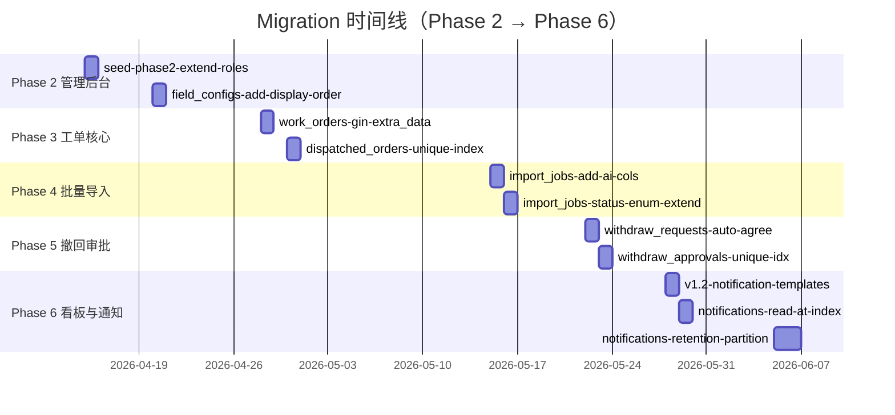
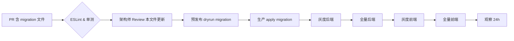

# Phase 2 → Phase 6 Migration 清单（规范文档，非迁移代码）

> 版本：v1.0（2026-05-11）
> 面向：后端开发 / 架构师 / 运维发布
> 目的：按**时间顺序**登记项目生命周期内全部预期 migration，明确 **SQL 指令、上下游依赖、下游风险、回滚方案、验证指令**。该文档不落真正的 migration 代码（代码放 `backend/src/database/migrations/`），但所有 migration 在正式入仓前**必须先改这里**，走架构师评审。
>
> 依赖：
> - `docs/数据库ER图.md` v1.2
> - `docs/架构变更日志.md`
> - `docs/Phase4导入与回流设计.md`、`docs/Phase5撤回审批设计.md`、`docs/Phase6看板与通知设计.md`

---

## 0. 发布纪律

1. 每个 migration 必须**可回滚**（`up()` + `down()` 成对），TypeORM CLI 生成骨架后手工校核 `down()`。
2. 文件命名：`{unix_ms}-{主题}.ts`，`{主题}` 与本文条目 `ID` 完全一致，便于 grep。
3. 发布顺序：**按时间戳升序**，线上按本清单里的编号顺序 apply，不得跳号。
4. 危险操作（`DROP COLUMN` / `DROP INDEX CONCURRENTLY` 失败时的处理、大表改列）一律在 pre-release 环境先跑一次 `EXPLAIN (ANALYZE, BUFFERS)`，观测耗时；预期 > 1s 的走 `CONCURRENTLY` 或批量拆解。
5. 生产禁用 `synchronize: true`；凡是实体变更必须同步写 migration。
6. **DB 变更广播**：每个 migration 落盘前，作者须在 `架构变更日志.md` 追加条目，说明下游影响与回滚策略。

---

## 1. 时间线总览



---

## 2. Migration 明细

### 2.1 `v1.2-notification-templates-extend-cols`（Phase 6，最高优先级）

- **时间**：2026-05-28 前
- **主题**：`notification_templates` 扩列，承接 v1.2 架构变更
- **上游依赖**：`docs/架构变更日志.md` v1.2 已广播
- **下游依赖**：`NotificationService.send()` 必须在此 migration 后 deploy；`backend/src/database/seeds/seed-notification-templates.ts` 必须在启动时 rerun（upsert 语义，幂等）

**SQL**：

```sql
-- up
ALTER TABLE notification_templates
  ADD COLUMN default_channels JSONB NOT NULL DEFAULT '{"in_app":true,"email":false,"sms":false}'::jsonb,
  ADD COLUMN variables JSONB NULL;

COMMENT ON COLUMN notification_templates.default_channels IS 'v1.2: 默认下发通道，如 {"in_app":true,"email":false,"sms":false}';
COMMENT ON COLUMN notification_templates.variables         IS 'v1.2: 模板变量的 JSON Schema（Draft 2020-12），NULL 视为不校验';

-- down
ALTER TABLE notification_templates
  DROP COLUMN IF EXISTS variables,
  DROP COLUMN IF EXISTS default_channels;
```

**下游风险**：
- 老代码若先部署（不认识新列），`INSERT` 不指定两列时依赖 DEFAULT，`SELECT *` 不受影响 → 低风险；
- 新代码若先部署（读不到新列），将 fail-fast 启动报错 → **必须先 migration 再 deploy 后端**。

**回滚**：
- 先回滚后端；
- 跑 `down` 删两列；
- seed 回退到 v1.1 版本（历史 commit 已保留）。

**验证**：
```bash
psql -c "\d+ notification_templates"   # 查看列
psql -c "SELECT default_channels, variables FROM notification_templates LIMIT 1;"
pnpm --filter backend test -- notification-service
```

---

### 2.2 `phase4-import-jobs-add-ai-cols`

- **时间**：2026-05-15
- **主题**：`import_jobs` 追加 AI 映射调试与重跑字段
- **依据**：`docs/Phase4AI导入服务分层设计.md` §3（AiMappingService）

**新增列**：

| 列名 | 类型 | 可空 | 默认 | 说明 |
|------|------|------|------|------|
| `ai_model_used` | `varchar(64)` | ✔ | NULL | 实际命中的 LLM 模型名（`openai:gpt-4o-mini` / `qwen:qwen-turbo` / `fallback:fuzzy`） |
| `ai_prompt_hash` | `varchar(64)` | ✔ | NULL | Prompt 模板 + candidateFields 的 sha256；便于 A/B 追溯 |
| `ai_mapping_raw` | `jsonb` | ✔ | NULL | 保留 LLM 原始返回，便于调试；发布 30 天后可通过另一 migration 归档删除 |
| `ai_fallback_reason` | `varchar(32)` | ✔ | NULL | 降级原因：`no_api_key` / `timeout` / `rate_limit` / `schema_invalid` |
| `retry_count` | `smallint` | ✘ | `0` | 该任务被重跑次数 |
| `parent_job_id` | `bigint` | ✔ | NULL | 指向被重跑的母任务 id（无外键，因旧数据可能丢） |

**SQL**：

```sql
-- up
ALTER TABLE import_jobs
  ADD COLUMN ai_model_used       varchar(64),
  ADD COLUMN ai_prompt_hash      varchar(64),
  ADD COLUMN ai_mapping_raw      jsonb,
  ADD COLUMN ai_fallback_reason  varchar(32),
  ADD COLUMN retry_count         smallint NOT NULL DEFAULT 0,
  ADD COLUMN parent_job_id       bigint;

CREATE INDEX CONCURRENTLY idx_import_jobs_parent ON import_jobs(parent_job_id) WHERE parent_job_id IS NOT NULL;

-- down
DROP INDEX CONCURRENTLY IF EXISTS idx_import_jobs_parent;
ALTER TABLE import_jobs
  DROP COLUMN IF EXISTS parent_job_id,
  DROP COLUMN IF EXISTS retry_count,
  DROP COLUMN IF EXISTS ai_fallback_reason,
  DROP COLUMN IF EXISTS ai_mapping_raw,
  DROP COLUMN IF EXISTS ai_prompt_hash,
  DROP COLUMN IF EXISTS ai_model_used;
```

**下游风险**：
- `ai_mapping_raw` 可能较大（单次 ~5KB），不建 GIN；日志留存 30 天后归档。
- 老代码 `SELECT *` 会多取 6 列 / 行，网络增量 < 1KB，可接受。
- `idx_import_jobs_parent` 用 `CONCURRENTLY` 避免长事务锁表；**不能**在事务内执行，TypeORM migration 要把索引拆到独立 `queryRunner.query` 且不包事务。

**回滚**：按 `down` 顺序撤列。`CONCURRENTLY` 失败时用 `DROP INDEX IF EXISTS idx_import_jobs_parent` 兜底。

---

### 2.3 `phase4-import-jobs-status-enum-extend`

- **时间**：2026-05-16
- **主题**：`import_jobs.status` 枚举追加 `parsing` / `ai_mapping` / `validating` / `writing` 过程态，用于前端进度展示

**变更前**：`status IN ('processing','completed','failed')`
**变更后**：`status IN ('pending','parsing','ai_mapping','validating','writing','completed','failed','cancelled')`

**SQL**（沿用 `varchar + CHECK`，不使用 PG ENUM 类型）：

```sql
-- up
ALTER TABLE import_jobs DROP CONSTRAINT IF EXISTS import_jobs_status_check;
ALTER TABLE import_jobs
  ADD CONSTRAINT import_jobs_status_check
  CHECK (status IN ('pending','parsing','ai_mapping','validating','writing',
                    'processing','completed','failed','cancelled'));

-- 回写历史：保留旧 processing 值，避免破坏已有行
UPDATE import_jobs SET status = 'processing' WHERE status = 'processing';
COMMENT ON COLUMN import_jobs.status IS 'Phase4: 增加过程态，旧 processing 保留以兼容历史记录';

-- down
ALTER TABLE import_jobs DROP CONSTRAINT IF EXISTS import_jobs_status_check;
-- 先把新态统一拍回 processing，避免回滚后枚举值违反旧约束
UPDATE import_jobs SET status = 'processing'
  WHERE status IN ('pending','parsing','ai_mapping','validating','writing','cancelled');
ALTER TABLE import_jobs
  ADD CONSTRAINT import_jobs_status_check
  CHECK (status IN ('processing','completed','failed'));
```

**下游风险**：
- 回滚会**丢失**细粒度状态（被压回 `processing`），需运维提前备份 `import_jobs`；
- 前端 Phase 4 发布后会消费新枚举，如果后端先回滚、前端不回滚会显示"未知状态"。

**回滚预案**：
- 回滚前端 → 回滚后端 → `down()`。

---

### 2.4 `phase5-withdraw-requests-add-auto-agree`

- **时间**：2026-05-22
- **主题**：撤回审批支持"X 小时未审批自动通过"

**新增列**：

| 列名 | 类型 | 说明 |
|------|------|------|
| `auto_agree_after_hours` | `smallint` NULL | 24 / 48 / 72；NULL 表示不自动 |
| `auto_agreed_at` | `timestamptz` NULL | 实际自动通过的时刻；cron 写入 |
| `auto_agree_trigger` | `varchar(32)` NULL | `cron` / `manual_override`；便于审计 |

**SQL**：

```sql
-- up
ALTER TABLE withdraw_requests
  ADD COLUMN auto_agree_after_hours smallint,
  ADD COLUMN auto_agreed_at         timestamptz,
  ADD COLUMN auto_agree_trigger     varchar(32);

CREATE INDEX CONCURRENTLY idx_wr_auto_agree_pending
  ON withdraw_requests(status, created_at)
  WHERE status = 'pending' AND auto_agree_after_hours IS NOT NULL;

COMMENT ON COLUMN withdraw_requests.auto_agree_after_hours IS '自动通过阈值（小时），NULL 表示不自动通过';

-- down
DROP INDEX CONCURRENTLY IF EXISTS idx_wr_auto_agree_pending;
ALTER TABLE withdraw_requests
  DROP COLUMN IF EXISTS auto_agree_trigger,
  DROP COLUMN IF EXISTS auto_agreed_at,
  DROP COLUMN IF EXISTS auto_agree_after_hours;
```

**下游风险**：
- cron 扫描 SQL 依赖此局部索引，老代码不使用 `auto_agree_after_hours`，字段为 NULL 不会命中索引，零影响；
- 老 `withdraw_requests` 行 `auto_agree_after_hours` 全部 NULL，cron 自然跳过。

**回滚**：回滚后端 → `down()`；cron 同步撤回扫描任务。

---

### 2.5 `phase5-withdraw-approvals-unique-idx`

- **时间**：2026-05-23
- **主题**：审批明细 `(request_id, approver_id)` 加唯一，防止"同一审批人重复提交意见"

**SQL**：

```sql
-- up
-- 先清重（保留最后一条）
DELETE FROM withdraw_approvals a USING withdraw_approvals b
 WHERE a.request_id = b.request_id
   AND a.approver_id = b.approver_id
   AND a.id < b.id;

CREATE UNIQUE INDEX CONCURRENTLY uk_wa_request_approver
  ON withdraw_approvals(request_id, approver_id);

-- down
DROP INDEX CONCURRENTLY IF EXISTS uk_wa_request_approver;
```

**下游风险**：
- DELETE 在大表上会锁行；建议凌晨执行且提前 `SELECT count(*)` 评估重复数量；
- 线上重复数据应先审计（跑 `SELECT request_id, approver_id, count(*) FROM withdraw_approvals GROUP BY 1,2 HAVING count(*)>1`）并告知业务后再清。

**回滚**：`down()` 后即可；清过的行无法恢复，需依赖 `pg_dump` 备份。

---

### 2.6 `phase6-notifications-read-at-index`

- **时间**：2026-05-29
- **主题**：为未读计数、标记已读、90 天清理任务建三条索引

**SQL**：

```sql
-- up
CREATE INDEX CONCURRENTLY idx_nt_user_unread
  ON notifications(user_id, created_at DESC)
  WHERE is_read = false;

CREATE INDEX CONCURRENTLY idx_nt_ref
  ON notifications(ref_entity_type, ref_entity_id);

CREATE INDEX CONCURRENTLY idx_nt_created_at
  ON notifications(created_at);

-- down
DROP INDEX CONCURRENTLY IF EXISTS idx_nt_user_unread;
DROP INDEX CONCURRENTLY IF EXISTS idx_nt_ref;
DROP INDEX CONCURRENTLY IF EXISTS idx_nt_created_at;
```

> 注：`ref_entity_type` / `ref_entity_id` 列在 Phase 6 时新增，见 §2.7。

**下游风险**：
- 索引建立期间不阻塞读写；
- 若单机磁盘紧张，分批顺序建（间隔观察 vacuum）。

---

### 2.7 `phase6-notifications-add-ref-cols`

- **时间**：2026-05-29（与 §2.6 同一批次，先列后索引）
- **主题**：`notifications` 增加 `ref_entity_type` / `ref_entity_id` / `priority`（对齐 §6.1.1 设计）

**SQL**：

```sql
-- up
ALTER TABLE notifications
  ADD COLUMN ref_entity_type varchar(32),
  ADD COLUMN ref_entity_id   bigint,
  ADD COLUMN priority        varchar(16) NOT NULL DEFAULT 'normal';

ALTER TABLE notifications
  ADD CONSTRAINT notifications_priority_check
  CHECK (priority IN ('low','normal','high'));

-- down
ALTER TABLE notifications DROP CONSTRAINT IF EXISTS notifications_priority_check;
ALTER TABLE notifications
  DROP COLUMN IF EXISTS priority,
  DROP COLUMN IF EXISTS ref_entity_id,
  DROP COLUMN IF EXISTS ref_entity_type;
```

**下游风险**：
- 默认 `priority=normal`，老数据一律取此值；符合原设计"未标注即普通"语义。
- 执行顺序：**先跑本 migration 再跑 §2.6** 的索引，以避免 `WHERE` 条件列不存在。

---

### 2.8 `phase6-notifications-retention-partition`（可选，按容量评估）

- **时间**：2026-06-05
- **主题**：`notifications` 按月做 `PARTITION BY RANGE (created_at)`，旧分区定期 DETACH + DROP
- **触发条件**：`SELECT count(*) FROM notifications;` 超过 500 万行时启用

**SQL 骨架**：

```sql
-- up
CREATE TABLE notifications_new (LIKE notifications INCLUDING ALL) PARTITION BY RANGE (created_at);
-- 建最近 3 个月分区
CREATE TABLE notifications_y2026m05 PARTITION OF notifications_new FOR VALUES FROM ('2026-05-01') TO ('2026-06-01');
CREATE TABLE notifications_y2026m06 PARTITION OF notifications_new FOR VALUES FROM ('2026-06-01') TO ('2026-07-01');
CREATE TABLE notifications_y2026m07 PARTITION OF notifications_new FOR VALUES FROM ('2026-07-01') TO ('2026-08-01');
-- 默认分区兜底
CREATE TABLE notifications_default PARTITION OF notifications_new DEFAULT;

-- 迁移旧数据
INSERT INTO notifications_new SELECT * FROM notifications;

-- 锁切
BEGIN;
  ALTER TABLE notifications RENAME TO notifications_legacy;
  ALTER TABLE notifications_new RENAME TO notifications;
COMMIT;

-- 清理（确认业务无异常后）
DROP TABLE notifications_legacy;
```

**下游风险**：
- 表改名、数据搬迁过程是**高风险**操作，需停机窗或蓝绿；
- 先在预发布验证应用查询兼容（特别是 TypeORM `repo.findBy` 性能）。

**回滚**：把 `notifications_legacy` 改回主表，丢弃 `notifications_new`。

---

## 3. 每次发布流程（Runbook 摘录）



- **硬卡点**：
  - 任何 migration 文件的 PR 必须引用本清单条目编号（如 `refs: v1.2-notification-templates-extend-cols`）；
  - PR 描述必须包含 `下游风险 / 回滚方案 / 验证命令` 三段，缺一不合入；
  - 合入后 24 小时内不可再提交针对同一张表的结构 migration（冷却期，防止事故叠加）。

---

## 4. 未列入（待评估）

- Phase 7 的 `renewals` / `resignations` / `benefit_applications` 三张业务表（续签/离职/待遇），计划用 `extra_data` JSONB 继续承载，视业务量再决定是否抽表；
- 审计域 `operation_logs` 按月分区（同 §2.8 套路），但当前写入量 < 10w/月，暂不做；
- 全文搜索：若需要搜工单备注，另起一份 `phase7-fts-gin` 的 migration，本清单届时补条目。

---

## 5. 变更日志

- v1.0 (2026-05-11)：首版，登记 Phase 4 / 5 / 6 预期 migration 8 项。
