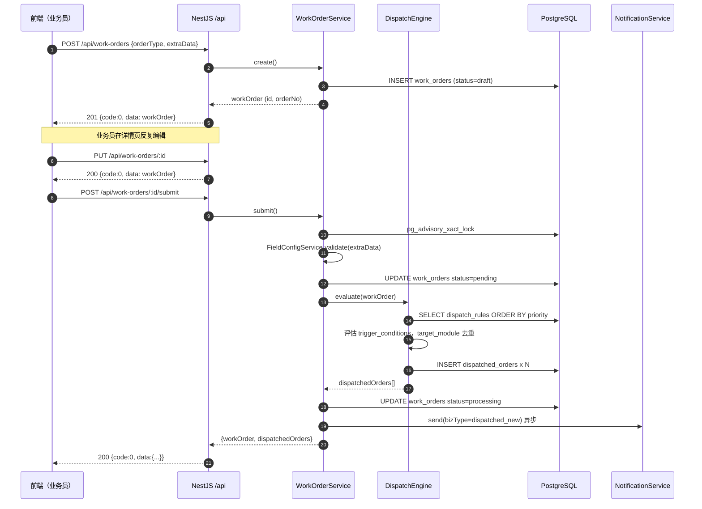

# Phase 3 前后端联调契约（手动新建 → 提交 → 派发 → 子工单全流程）

> 版本：v1.0（2026-05-11）
> 面向：前端、后端、QA
> 目的：为 Phase 3 前后端**并行开发**提供对齐基准。所有样例可直接用作前端 mock / 后端断言 / QA e2e baseline。
>
> 依赖文档：
> - `docs/API规范.md`：统一响应结构、错误码、分页
> - `docs/Phase3工单核心设计.md`：状态机、DispatchEngine、DTO、错误码扩展
> - `docs/数据库ER图.md` v1.1
> - `docs/DispatchEngine-JSON-AST规范.md`
>
> 所有时间戳采用 `timestamptz` ISO8601 `+08:00`；`traceId` 均为假值。

## 目录
- [0. 通用约定](#0-通用约定)
- [1. 新建 → 提交 → 派发（时序）](#1-新建--提交--派发时序)
- [2. 场景 A/B/C 全量样例](#2-场景-abc-全量样例)
- [3. 子工单全流程（按 module 分节）](#3-子工单全流程按-module-分节)
- [4. 列表过滤样例](#4-列表过滤样例)
- [5. 错误响应样例](#5-错误响应样例)
- [6. Mock Server 建议](#6-mock-server-建议)

---

## 0. 通用约定

### 0.1 统一响应结构

```json
{
  "code": 0,
  "data": { },
  "message": "ok",
  "traceId": "req_01HZMOCKTRACEID1234"
}
```

- `code=0` → 成功；分页列表 `data` 形态 `{ items, pagination: { page, pageSize, total, totalPages } }`。

### 0.2 用户人设

| 人设 | userId | username | 主角色 | 部门 |
|------|--------|----------|--------|------|
| 业务员 A | 11 | `sales_a` | `salesperson` | 业务部 (1) |
| 合同组 B | 21 | `contract_b` | `contract_team` | 合同中心 (2) |
| 入职联系 C | 31 | `onboard_c` | `onboarding_team` | 共享服务中心 (3) |
| 数据录入 D | 41 | `entry_d` | `data_entry_team` | 集约岗 (4) |
| 社保 E | 51 | `social_e` | `social_security_team` | 社保团队 (5) |
| 合同主管 F | 22 | `contract_sup` | `contract_supervisor` | 合同中心 (2) |
| 管理员 | 1 | `admin` | `admin` | 全局 |

### 0.3 字段权限 payload 约定

详情接口 `fields[]` 已由 FieldPermissionInterceptor 过滤：

- `permission=hidden` 字段**不出现**在 `fields[]` 中；
- `permission=masked` 的 `value` 已脱敏（如 `330102********1234`）；
- `permission=readonly` 的 `value` 正常，前端需禁用编辑控件。

详情附带 4 个互不重叠的 code 数组：`visibleFieldCodes`、`maskedFieldCodes`、`readonlyFieldCodes`、`editableFieldCodes`。

---

## 1. 新建 → 提交 → 派发（时序）



关键不变量：
1. 派发全部成功后主工单 `status=processing`；若零子工单命中则保留 `pending` 并抛 `4202`；
2. `submit` 幂等：`status != draft/returned` 时二次提交立即返回 `4113/4114`；
3. 派发引擎与主工单写入同一事务，失败整体回滚。

---

## 2. 场景 A/B/C 全量样例

> 三个场景**公用创建请求模板**，仅 `need_onboarding_contact` / `need_company_contract` 及相关依赖字段不同。

### 2.1 公用创建请求

```http
POST /api/work-orders HTTP/1.1
Authorization: Bearer <sales_a.token>
Content-Type: application/json
```

**基础 extraData（共 45 字段，以下省略为 `$BASE_EXTRA`）**：

```json
{
  "customer_name": "示例客户股份有限公司",
  "customer_code": "C-0001",
  "outsource_type": "全风险",
  "position": "高级软件工程师",
  "employee_name": "张伟",
  "id_card_no": "330102199001011234",
  "gender": "男",
  "birth_date": "1990-01-01",
  "age": 35,
  "household_type": "非农业",
  "ethnicity": "汉",
  "mobile": "13800138000",
  "email": "zhangwei@example.com",
  "current_address": "浙江省宁波市北仑区新碶街道明州路88号",
  "household_address": "浙江省宁波市北仑区新碶街道明州路88号",
  "postal_code": "315800",
  "contract_term_type": "固定期限",
  "contract_term": "3年",
  "contract_start_date": "2026-06-01",
  "contract_end_date": "2029-05-31",
  "probation_start_date": "2026-06-01",
  "probation_months": "3",
  "probation_end_date": "2026-08-31",
  "work_city": "宁波",
  "work_hour_system": "标准",
  "work_cycle": "月",
  "salary_form": "月薪",
  "base_salary": 15000,
  "other_salary": 2000,
  "probation_salary": 12000,
  "payroll_cycle": "次月",
  "payroll_date": "15日",
  "social_location": "宁波市",
  "start_month": "2026-06",
  "social_base": 6000,
  "fund_base": 6000,
  "fund_ratio": "单位12%+个人12%",
  "business_mode": "北仑自营",
  "employee_type": "全日制",
  "need_company_payroll": "是",
  "payroll_location": "宁波",
  "social_urge": "否",
  "special_remark": ""
}
```

### 2.2 场景 A：`need_onboarding_contact=是 AND need_company_contract=是` → 4 个子工单

#### 2.2.1 创建请求（场景 A 差异字段）

```json
{
  "orderType": "onboarding",
  "customerId": 1001,
  "departmentId": 1,
  "extraData": {
    "__BASE__": "$BASE_EXTRA 全部字段",
    "need_company_contract": "是",
    "contract_subject": "示例企服有限公司",
    "contract_template": "标准",
    "need_contract_urge": "否",
    "need_onboarding_contact": "是"
  }
}
```

#### 2.2.2 创建响应（201 Created）

```json
{
  "code": 0,
  "data": {
    "id": 5001,
    "orderNo": "ON20260511001",
    "orderType": "onboarding",
    "status": "draft",
    "createdBy": { "id": 11, "name": "业务员甲" },
    "department": { "id": 1, "name": "业务部" },
    "customer": { "id": 1001, "name": "示例客户股份有限公司" },
    "employeeName": "张伟",
    "employeeIdCard": "330102199001011234",
    "submittedAt": null,
    "completedAt": null,
    "createdAt": "2026-05-11T09:00:00+08:00",
    "updatedAt": "2026-05-11T09:00:00+08:00",
    "dispatchedOrders": []
  },
  "message": "草稿已创建",
  "traceId": "req_01A_CREATE"
}
```

#### 2.2.3 提交请求

```http
POST /api/work-orders/5001/submit HTTP/1.1
Authorization: Bearer <sales_a.token>
Content-Type: application/json
```

```json
{}
```

#### 2.2.4 提交响应（200 OK）

```json
{
  "code": 0,
  "data": {
    "workOrder": {
      "id": 5001,
      "orderNo": "ON20260511001",
      "orderType": "onboarding",
      "status": "processing",
      "submittedAt": "2026-05-11T09:15:00+08:00",
      "completedAt": null,
      "updatedAt": "2026-05-11T09:15:00+08:00"
    },
    "dispatchedOrders": [
      {
        "id": 70011,
        "parentOrderId": 5001,
        "moduleCode": "data_entry",
        "status": "pending",
        "handler": { "id": 41, "name": "录入员丁" },
        "dispatchStrategy": "fixed",
        "dispatchedAt": "2026-05-11T09:15:00+08:00"
      },
      {
        "id": 70012,
        "parentOrderId": 5001,
        "moduleCode": "social_security",
        "status": "pending",
        "handler": { "id": 51, "name": "社保戊" },
        "dispatchStrategy": "fixed",
        "dispatchedAt": "2026-05-11T09:15:00+08:00"
      },
      {
        "id": 70013,
        "parentOrderId": 5001,
        "moduleCode": "onboarding_contact",
        "status": "pending",
        "handler": { "id": 31, "name": "联络丙" },
        "dispatchStrategy": "fixed",
        "dispatchedAt": "2026-05-11T09:15:00+08:00"
      },
      {
        "id": 70014,
        "parentOrderId": 5001,
        "moduleCode": "contract",
        "status": "pending",
        "handler": { "id": 21, "name": "合同乙" },
        "dispatchStrategy": "fixed",
        "dispatchedAt": "2026-05-11T09:15:00+08:00"
      }
    ]
  },
  "message": "工单已派发，共生成 4 个子工单",
  "traceId": "req_01A_SUBMIT"
}
```

### 2.3 场景 B：`need_onboarding_contact=是 AND need_company_contract=否` → 3 个子工单

#### 2.3.1 创建请求差异

```json
{
  "orderType": "onboarding",
  "customerId": 1001,
  "departmentId": 1,
  "extraData": {
    "__BASE__": "$BASE_EXTRA 全部字段",
    "need_company_contract": "否",
    "need_onboarding_contact": "是"
  }
}
```

> 注意：`need_company_contract=否` 时 `contract_subject / contract_template / need_contract_urge` **非必填**，前端可不提交。

#### 2.3.2 提交响应（200 OK，关键差异）

```json
{
  "code": 0,
  "data": {
    "workOrder": {
      "id": 5002,
      "orderNo": "ON20260511002",
      "status": "processing",
      "submittedAt": "2026-05-11T09:30:00+08:00"
    },
    "dispatchedOrders": [
      { "id": 70021, "moduleCode": "data_entry",         "status": "pending", "handler": { "id": 41, "name": "录入员丁" }, "dispatchedAt": "2026-05-11T09:30:00+08:00" },
      { "id": 70022, "moduleCode": "social_security",    "status": "pending", "handler": { "id": 51, "name": "社保戊" },   "dispatchedAt": "2026-05-11T09:30:00+08:00" },
      { "id": 70023, "moduleCode": "onboarding_contact", "status": "pending", "handler": { "id": 31, "name": "联络丙" },   "dispatchedAt": "2026-05-11T09:30:00+08:00" }
    ]
  },
  "message": "工单已派发，共生成 3 个子工单",
  "traceId": "req_01B_SUBMIT"
}
```

### 2.4 场景 C：两个都=否 → 仅 data_entry + social_security（2 个子工单）

#### 2.4.1 创建请求差异

```json
{
  "orderType": "onboarding",
  "customerId": 1001,
  "departmentId": 1,
  "extraData": {
    "__BASE__": "$BASE_EXTRA 全部字段",
    "need_company_contract": "否",
    "need_onboarding_contact": "否"
  }
}
```

#### 2.4.2 提交响应（200 OK）

```json
{
  "code": 0,
  "data": {
    "workOrder": {
      "id": 5003,
      "orderNo": "ON20260511003",
      "status": "processing",
      "submittedAt": "2026-05-11T09:45:00+08:00"
    },
    "dispatchedOrders": [
      { "id": 70031, "moduleCode": "data_entry",      "status": "pending", "handler": { "id": 41, "name": "录入员丁" }, "dispatchedAt": "2026-05-11T09:45:00+08:00" },
      { "id": 70032, "moduleCode": "social_security", "status": "pending", "handler": { "id": 51, "name": "社保戊" },   "dispatchedAt": "2026-05-11T09:45:00+08:00" }
    ]
  },
  "message": "工单已派发，共生成 2 个子工单",
  "traceId": "req_01C_SUBMIT"
}
```

### 2.5 派发规则决策表（对齐 `seed-dispatch-rules.ts`）

| 规则名 | 触发条件 | 目标模块 | priority |
|--------|----------|----------|----------|
| 入职工单默认派发-数据录入 | 无条件 | `data_entry` | 10 |
| 入职工单默认派发-社保公积金 | 无条件 | `social_security` | 20 |
| 入职联系条件派发 | `need_onboarding_contact == "是"` | `onboarding_contact` | 30 |
| 劳动合同条件派发 | `need_company_contract == "是"` | `contract` | 40 |

> 同 `target_module` 命中多条规则时，`DispatchEngine` 取 `priority` 最小者，详见 `docs/DispatchEngine-JSON-AST规范.md`。

---

## 3. 子工单全流程（按 module 分节）

每个 module 的详情响应结构一致，差异仅在字段权限。以下分 4 节覆盖四种 module。

### 3.1 data_entry 子工单

#### 3.1.1 `GET /api/dispatched-orders/70011`（由 entry_d 访问）

```json
{
  "code": 0,
  "data": {
    "id": 70011,
    "moduleCode": "data_entry",
    "status": "pending",
    "parentOrder": {
      "id": 5001,
      "orderNo": "ON20260511001",
      "orderType": "onboarding",
      "employeeName": "张伟",
      "customerName": "示例客户股份有限公司"
    },
    "handler": { "id": 41, "name": "录入员丁" },
    "dispatchedAt": "2026-05-11T09:15:00+08:00",
    "acceptedAt": null,
    "completedAt": null,
    "returnReason": null,
    "feedbackData": {},
    "visibleFieldCodes": [
      "customer_name","customer_code","outsource_type","position","employee_name",
      "id_card_no","gender","birth_date","age","household_type","ethnicity","mobile",
      "email","current_address","household_address","postal_code",
      "contract_term_type","contract_term","contract_start_date","contract_end_date",
      "probation_start_date","probation_months","probation_end_date","work_city",
      "work_hour_system","work_cycle","salary_form","base_salary","other_salary","probation_salary",
      "payroll_cycle","payroll_date","social_location","start_month","social_base",
      "fund_base","fund_ratio","bank_name","bank_account",
      "business_mode","employee_type","need_company_contract",
      "need_onboarding_contact","need_company_payroll","payroll_location",
      "special_remark","data_entry_feedback"
    ],
    "maskedFieldCodes": [],
    "readonlyFieldCodes": [
      "customer_name","customer_code","outsource_type","position","employee_name",
      "id_card_no","gender","birth_date","age","household_type","ethnicity","mobile",
      "email","current_address","household_address","postal_code",
      "contract_term_type","contract_term","contract_start_date","contract_end_date",
      "probation_start_date","probation_months","probation_end_date","work_city",
      "work_hour_system","work_cycle","salary_form","base_salary","other_salary","probation_salary",
      "payroll_cycle","payroll_date","social_location","start_month","social_base",
      "fund_base","fund_ratio","bank_name","bank_account",
      "business_mode","employee_type","need_company_contract",
      "need_onboarding_contact","need_company_payroll","payroll_location","special_remark"
    ],
    "editableFieldCodes": ["data_entry_feedback"],
    "availableSupplements": [],
    "availableTemplates": [
      { "id": 9001, "name": "数据录入标准导出模板" }
    ],
    "fields": [
      { "fieldCode": "employee_name", "fieldName": "姓名", "fieldType": "text",
        "value": "张伟", "permission": "readonly",
        "validation": { "required": true } },
      { "fieldCode": "id_card_no", "fieldName": "身份证号", "fieldType": "text",
        "value": "330102199001011234", "permission": "readonly",
        "validation": { "required": true, "regex": "^[0-9Xx]{15,18}$", "regexMsg": "身份证号格式错误" } },
      { "fieldCode": "mobile", "fieldName": "移动电话", "fieldType": "phone",
        "value": "13800138000", "permission": "readonly",
        "validation": { "required": false, "regex": "^1[3-9]\\d{9}$" } },
      { "fieldCode": "data_entry_feedback", "fieldName": "数据录入反馈", "fieldType": "dropdown",
        "value": null, "permission": "visible",
        "validation": { "required": false },
        "dropdownOptions": [
          { "label": "未办",   "value": "未办" },
          { "label": "办理中", "value": "办理中" },
          { "label": "已办结", "value": "已办结" }
        ] }
    ]
  },
  "message": "ok",
  "traceId": "req_03_DE_DETAIL"
}
```

> `fields[]` 为示意节选（实际返回所有 visible 字段）。

#### 3.1.2 `POST /api/dispatched-orders/70011/accept`

请求：

```json
{ "note": "开始录入" }
```

响应：

```json
{
  "code": 0,
  "data": {
    "id": 70011,
    "status": "processing",
    "handler": { "id": 41, "name": "录入员丁" },
    "acceptedAt": "2026-05-11T09:20:00+08:00"
  },
  "message": "接单成功",
  "traceId": "req_03_DE_ACCEPT"
}
```

#### 3.1.3 `POST /api/dispatched-orders/70011/complete`

请求：

```json
{
  "feedback": { "data_entry_feedback": "已办结" }
}
```

响应：

```json
{
  "code": 0,
  "data": {
    "id": 70011,
    "status": "completed",
    "completedAt": "2026-05-11T11:00:00+08:00",
    "mainOrderStatusChanged": false,
    "mainOrder": { "id": 5001, "status": "processing" }
  },
  "message": "子工单已完成",
  "traceId": "req_03_DE_COMPLETE"
}
```

> `mainOrderStatusChanged=true` 表示该次 complete 触发了主工单收敛为 `completed`（即最后一个子工单）。

#### 3.1.4 `POST /api/dispatched-orders/70011/return`

请求：

```json
{ "returnReason": "身份证照片模糊，请业务员重新上传" }
```

响应：

```json
{
  "code": 0,
  "data": {
    "id": 70011,
    "status": "returned",
    "returnReason": "身份证照片模糊，请业务员重新上传",
    "mainOrder": { "id": 5001, "status": "returned" }
  },
  "message": "子工单已退回",
  "traceId": "req_03_DE_RETURN"
}
```

#### 3.1.5 `POST /api/dispatched-orders/70011/supplement`

> data_entry 默认无可补充字段；此处样例仅演示接口形态（后道一般补 `bank_name` / `bank_account`，见 3.2）。

### 3.2 onboarding_contact 子工单

#### 3.2.1 `GET /api/dispatched-orders/70013`（由 onboard_c 访问）

```json
{
  "code": 0,
  "data": {
    "id": 70013,
    "moduleCode": "onboarding_contact",
    "status": "pending",
    "parentOrder": {
      "id": 5001,
      "orderNo": "ON20260511001",
      "orderType": "onboarding",
      "employeeName": "张伟",
      "customerName": "示例客户股份有限公司"
    },
    "handler": { "id": 31, "name": "联络丙" },
    "dispatchedAt": "2026-05-11T09:15:00+08:00",
    "visibleFieldCodes": [
      "customer_name","customer_code","position","employee_name","id_card_no",
      "ethnicity","mobile","email","current_address","household_address","postal_code",
      "bank_name","bank_account","need_onboarding_contact","onboarding_feedback","special_remark"
    ],
    "maskedFieldCodes": ["id_card_no"],
    "readonlyFieldCodes": [
      "customer_name","customer_code","position","employee_name",
      "ethnicity","mobile","email","current_address","household_address","postal_code",
      "need_onboarding_contact","special_remark"
    ],
    "editableFieldCodes": ["bank_name","bank_account","onboarding_feedback"],
    "availableSupplements": ["bank_name","bank_account"],
    "availableTemplates": [
      { "id": 9002, "name": "入职联系通讯录模板" }
    ],
    "fields": [
      { "fieldCode": "employee_name", "fieldName": "姓名", "fieldType": "text",
        "value": "张伟", "permission": "readonly",
        "validation": { "required": true } },
      { "fieldCode": "id_card_no", "fieldName": "身份证号", "fieldType": "text",
        "value": "330102********1234", "permission": "masked",
        "validation": { "required": true } },
      { "fieldCode": "mobile", "fieldName": "移动电话", "fieldType": "phone",
        "value": "13800138000", "permission": "readonly",
        "validation": { "required": false, "regex": "^1[3-9]\\d{9}$" } },
      { "fieldCode": "bank_name", "fieldName": "开户银行信息", "fieldType": "text",
        "value": null, "permission": "visible", "supplementable": true,
        "validation": { "required": false } },
      { "fieldCode": "bank_account", "fieldName": "银行借记卡账号", "fieldType": "text",
        "value": null, "permission": "visible", "supplementable": true,
        "validation": { "required": false } },
      { "fieldCode": "onboarding_feedback", "fieldName": "入职联系反馈", "fieldType": "dropdown",
        "value": null, "permission": "visible",
        "validation": { "required": false },
        "dropdownOptions": [
          { "label": "未办", "value": "未办" },
          { "label": "办理中", "value": "办理中" },
          { "label": "已办结", "value": "已办结" }
        ] }
    ]
  },
  "message": "ok",
  "traceId": "req_03_OC_DETAIL"
}
```

#### 3.2.2 `POST /api/dispatched-orders/70013/supplement`

请求：

```json
{
  "fields": {
    "bank_name": "中国工商银行宁波北仑支行",
    "bank_account": "6222021234567890123"
  },
  "workOrderUpdatedAt": "2026-05-11T09:15:00+08:00"
}
```

响应：

```json
{
  "code": 0,
  "data": {
    "id": 70013,
    "supplemented": ["bank_name","bank_account"],
    "syncedToModules": ["data_entry","social_security"],
    "workOrder": {
      "id": 5001,
      "updatedAt": "2026-05-11T10:05:00+08:00"
    },
    "logIds": [30011, 30012]
  },
  "message": "字段已补充",
  "traceId": "req_03_OC_SUP"
}
```

#### 3.2.3 `POST /api/dispatched-orders/70013/complete`

请求：

```json
{
  "feedback": { "onboarding_feedback": "已办结" }
}
```

响应：

```json
{
  "code": 0,
  "data": {
    "id": 70013,
    "status": "completed",
    "completedAt": "2026-05-11T10:30:00+08:00",
    "mainOrderStatusChanged": false,
    "mainOrder": { "id": 5001, "status": "processing" }
  },
  "message": "子工单已完成",
  "traceId": "req_03_OC_COMPLETE"
}
```

### 3.3 contract 子工单

#### 3.3.1 `GET /api/dispatched-orders/70014`（由 contract_b 访问）

```json
{
  "code": 0,
  "data": {
    "id": 70014,
    "moduleCode": "contract",
    "status": "pending",
    "parentOrder": {
      "id": 5001,
      "orderNo": "ON20260511001",
      "orderType": "onboarding",
      "employeeName": "张伟",
      "customerName": "示例客户股份有限公司"
    },
    "handler": { "id": 21, "name": "合同乙" },
    "dispatchedAt": "2026-05-11T09:15:00+08:00",
    "visibleFieldCodes": [
      "customer_name","customer_code","outsource_type","position","employee_name",
      "id_card_no","gender","birth_date","age","household_type","ethnicity","mobile",
      "email","current_address","household_address","postal_code",
      "contract_term_type","contract_term","contract_start_date","contract_end_date",
      "probation_start_date","probation_months","probation_end_date","work_city",
      "work_hour_system","work_cycle",
      "business_mode","employee_type","need_company_contract",
      "contract_subject","contract_template","need_contract_urge","contract_feedback",
      "special_remark"
    ],
    "maskedFieldCodes": ["id_card_no"],
    "readonlyFieldCodes": [
      "customer_name","customer_code","outsource_type","position","employee_name",
      "gender","birth_date","age","household_type","ethnicity","mobile",
      "email","current_address","household_address","postal_code",
      "contract_term_type","contract_term","contract_start_date","contract_end_date",
      "probation_start_date","probation_months","probation_end_date","work_city",
      "work_hour_system","work_cycle",
      "business_mode","employee_type","need_company_contract",
      "contract_subject","contract_template","need_contract_urge","special_remark"
    ],
    "editableFieldCodes": ["contract_feedback"],
    "availableSupplements": [],
    "availableTemplates": [
      { "id": 9003, "name": "劳动合同标准模板" },
      { "id": 9004, "name": "劳动合同特殊模板" }
    ],
    "fields": [
      { "fieldCode": "contract_subject", "fieldName": "劳动合同主体", "fieldType": "text",
        "value": "示例企服有限公司", "permission": "readonly",
        "validation": { "required": true } },
      { "fieldCode": "contract_template", "fieldName": "劳动合同模板", "fieldType": "text",
        "value": "标准", "permission": "readonly",
        "validation": { "required": true } },
      { "fieldCode": "contract_feedback", "fieldName": "劳动合同签订反馈", "fieldType": "dropdown",
        "value": null, "permission": "visible",
        "validation": { "required": false },
        "dropdownOptions": [
          { "label": "未办", "value": "未办" },
          { "label": "办理中", "value": "办理中" },
          { "label": "已办结", "value": "已办结" }
        ] }
    ]
  },
  "message": "ok",
  "traceId": "req_03_CT_DETAIL"
}
```

#### 3.3.2 `POST /api/dispatched-orders/70014/complete`

```json
{ "feedback": { "contract_feedback": "已办结" } }
```

```json
{
  "code": 0,
  "data": {
    "id": 70014, "status": "completed",
    "completedAt": "2026-05-11T14:30:00+08:00",
    "mainOrderStatusChanged": true,
    "mainOrder": { "id": 5001, "status": "completed", "completedAt": "2026-05-11T14:30:00+08:00" }
  },
  "message": "子工单已完成，主工单已全部办结",
  "traceId": "req_03_CT_COMPLETE"
}
```

### 3.4 social_security 子工单

#### 3.4.1 `GET /api/dispatched-orders/70012`（由 social_e 访问）

```json
{
  "code": 0,
  "data": {
    "id": 70012,
    "moduleCode": "social_security",
    "status": "pending",
    "parentOrder": {
      "id": 5001, "orderNo": "ON20260511001",
      "orderType": "onboarding", "employeeName": "张伟",
      "customerName": "示例客户股份有限公司"
    },
    "handler": { "id": 51, "name": "社保戊" },
    "dispatchedAt": "2026-05-11T09:15:00+08:00",
    "visibleFieldCodes": [
      "customer_name","customer_code","position","employee_name","id_card_no",
      "gender","household_type","ethnicity",
      "social_location","start_month","social_base","fund_base","fund_ratio",
      "business_mode","need_company_payroll","social_urge","special_remark"
    ],
    "maskedFieldCodes": ["id_card_no"],
    "readonlyFieldCodes": [
      "customer_name","customer_code","position","employee_name",
      "gender","household_type","ethnicity",
      "social_location","start_month","social_base","fund_base","fund_ratio",
      "business_mode","need_company_payroll","social_urge","special_remark"
    ],
    "editableFieldCodes": [],
    "availableSupplements": [],
    "availableTemplates": [
      { "id": 9005, "name": "社保公积金申报模板" }
    ],
    "fields": [
      { "fieldCode": "social_location", "fieldName": "参保地", "fieldType": "text",
        "value": "宁波市", "permission": "readonly", "validation": { "required": true } },
      { "fieldCode": "social_base", "fieldName": "社保基数", "fieldType": "number",
        "value": 6000, "permission": "readonly", "validation": { "required": true } },
      { "fieldCode": "fund_ratio", "fieldName": "公积金比例", "fieldType": "text",
        "value": "单位12%+个人12%", "permission": "readonly", "validation": { "required": true } }
    ]
  },
  "message": "ok",
  "traceId": "req_03_SS_DETAIL"
}
```

> 社保模块的 `completed` 反馈通过模块专属 `feedback` 字段提交（Phase 6 将新增 `social_security_feedback` 字段进 seed，避免与其它模块反馈冲突）。本期 Phase 3 先按 `{feedback: {}}` 留空形式完成。

---

## 4. 列表过滤样例

### 4.1 业务员看自己创建的主工单

#### 请求

```http
GET /api/work-orders?page=1&pageSize=10&keyword=张 HTTP/1.1
Authorization: Bearer <sales_a.token>
```

> 业务员只能看到 `created_by=11` 的工单。后端 WHERE 自动注入 `created_by=<currentUser.id>`。

#### 响应（200）

```json
{
  "code": 0,
  "data": {
    "items": [
      { "id": 5001, "orderNo": "ON20260511001", "orderType": "onboarding",
        "status": "processing", "employeeName": "张伟",
        "customerName": "示例客户股份有限公司",
        "dispatchedSummary": { "total": 4, "completed": 0, "returned": 0 },
        "submittedAt": "2026-05-11T09:15:00+08:00",
        "updatedAt": "2026-05-11T09:15:00+08:00" },
      { "id": 5002, "orderNo": "ON20260511002", "orderType": "onboarding",
        "status": "processing", "employeeName": "张磊",
        "customerName": "示例客户股份有限公司",
        "dispatchedSummary": { "total": 3, "completed": 1, "returned": 0 },
        "submittedAt": "2026-05-11T09:30:00+08:00",
        "updatedAt": "2026-05-11T09:30:00+08:00" },
      { "id": 5003, "orderNo": "ON20260511003", "orderType": "onboarding",
        "status": "processing", "employeeName": "张敏",
        "customerName": "示例客户股份有限公司",
        "dispatchedSummary": { "total": 2, "completed": 0, "returned": 0 },
        "submittedAt": "2026-05-11T09:45:00+08:00",
        "updatedAt": "2026-05-11T09:45:00+08:00" }
    ],
    "pagination": { "page": 1, "pageSize": 10, "total": 3, "totalPages": 1 }
  },
  "message": "ok",
  "traceId": "req_04_WO_LIST"
}
```

### 4.2 合同组执行层看分到本组的子工单

#### 请求

```http
GET /api/dispatched-orders?page=1&pageSize=20&moduleCode=contract&status=pending HTTP/1.1
Authorization: Bearer <contract_b.token>
```

> 合同组成员只看 `handler_id=self.id` 或（`handler_id IS NULL AND module_code IN self.modules`）。

#### 响应（200）

```json
{
  "code": 0,
  "data": {
    "items": [
      { "id": 70014, "parentOrderId": 5001, "moduleCode": "contract", "status": "pending",
        "handler": { "id": 21, "name": "合同乙" },
        "parentOrder": { "orderNo": "ON20260511001", "employeeName": "张伟",
                         "customerName": "示例客户股份有限公司" },
        "dispatchedAt": "2026-05-11T09:15:00+08:00",
        "slaHoursLeft": 47.3 },
      { "id": 70024, "parentOrderId": 5007, "moduleCode": "contract", "status": "pending",
        "handler": { "id": 21, "name": "合同乙" },
        "parentOrder": { "orderNo": "ON20260510015", "employeeName": "李强",
                         "customerName": "另一客户" },
        "dispatchedAt": "2026-05-10T17:00:00+08:00",
        "slaHoursLeft": 7.8 }
    ],
    "pagination": { "page": 1, "pageSize": 20, "total": 2, "totalPages": 1 }
  },
  "message": "ok",
  "traceId": "req_04_DO_CONTRACT"
}
```

### 4.3 合同组主管看本部门全部子工单

#### 请求

```http
GET /api/dispatched-orders?page=1&pageSize=20&scope=team HTTP/1.1
Authorization: Bearer <contract_sup.token>
```

> `scope=team` 仅对主管 / 管理层有效；后端 WHERE 注入 `handler_id IN (SELECT user_id FROM user_roles WHERE department_id IN <self.departments>) OR module_code IN <self.supervisedModules>`。

#### 响应（200）

```json
{
  "code": 0,
  "data": {
    "items": [
      { "id": 70014, "parentOrderId": 5001, "moduleCode": "contract", "status": "pending",
        "handler": { "id": 21, "name": "合同乙" },
        "parentOrder": { "orderNo": "ON20260511001", "employeeName": "张伟" },
        "dispatchedAt": "2026-05-11T09:15:00+08:00", "slaHoursLeft": 47.3 },
      { "id": 70024, "parentOrderId": 5007, "moduleCode": "contract", "status": "pending",
        "handler": { "id": 21, "name": "合同乙" },
        "parentOrder": { "orderNo": "ON20260510015", "employeeName": "李强" },
        "dispatchedAt": "2026-05-10T17:00:00+08:00", "slaHoursLeft": 7.8 },
      { "id": 70025, "parentOrderId": 5008, "moduleCode": "contract", "status": "processing",
        "handler": { "id": 23, "name": "合同丙" },
        "parentOrder": { "orderNo": "ON20260510020", "employeeName": "赵伟" },
        "dispatchedAt": "2026-05-10T15:30:00+08:00",
        "acceptedAt": "2026-05-10T16:00:00+08:00", "slaHoursLeft": 5.2 },
      { "id": 70026, "parentOrderId": 5009, "moduleCode": "contract", "status": "completed",
        "handler": { "id": 23, "name": "合同丙" },
        "parentOrder": { "orderNo": "ON20260509030", "employeeName": "孙芳" },
        "completedAt": "2026-05-10T09:00:00+08:00" }
    ],
    "pagination": { "page": 1, "pageSize": 20, "total": 4, "totalPages": 1 }
  },
  "message": "ok",
  "traceId": "req_04_DO_TEAM"
}
```

---

## 5. 错误响应样例

> 所有错误响应 HTTP 状态码按 `docs/API规范.md` §2 约定；`code` 为业务码。

### 5.1 `401` 未登录

```http
GET /api/work-orders HTTP/1.1
(缺 Authorization)
```

```json
{
  "code": 2000,
  "data": null,
  "message": "未登录或令牌已失效",
  "traceId": "req_05_401"
}
```

HTTP 状态码：`401`。

---

### 5.2 `403` 无权限

#### 5.2.1 业务员看别人的主工单

```http
GET /api/work-orders/6999 HTTP/1.1
Authorization: Bearer <sales_a.token>
(工单 6999 的 created_by=17，非本人)
```

```json
{
  "code": 5000,
  "data": null,
  "message": "无权访问该工单",
  "details": { "resource": "work_order", "resourceId": 6999 },
  "traceId": "req_05_403_WO"
}
```

HTTP 状态码：`403`。

#### 5.2.2 合同组查看社保子工单

```http
GET /api/dispatched-orders/70012 HTTP/1.1
Authorization: Bearer <contract_b.token>
(70012 moduleCode=social_security，合同组无该 module 权限)
```

```json
{
  "code": 5000,
  "data": null,
  "message": "无权访问该子工单：模块不匹配",
  "details": { "resource": "dispatched_order", "resourceId": 70012, "module": "social_security" },
  "traceId": "req_05_403_DO"
}
```

HTTP 状态码：`403`。

---

### 5.3 `422` 字段校验失败

#### 5.3.1 身份证格式错误

```http
POST /api/work-orders/5001/submit HTTP/1.1
Authorization: Bearer <sales_a.token>
(extraData.id_card_no = "12345")
```

```json
{
  "code": 3002,
  "data": null,
  "message": "字段校验失败",
  "details": {
    "errors": [
      { "fieldCode": "id_card_no", "reason": "regex", "message": "身份证号格式错误" }
    ]
  },
  "traceId": "req_05_422_REGEX"
}
```

HTTP 状态码：`422`。

#### 5.3.2 条件必填未填

```http
POST /api/work-orders/5001/submit HTTP/1.1
Authorization: Bearer <sales_a.token>
(extraData.need_company_contract = "是" 但 contract_subject / contract_template / need_contract_urge 全部未填)
```

```json
{
  "code": 4111,
  "data": null,
  "message": "条件必填字段缺失",
  "details": {
    "missing": ["contract_subject","contract_template","need_contract_urge"],
    "conditions": [
      { "fieldCode": "need_company_contract", "value": "是" }
    ]
  },
  "traceId": "req_05_422_COND"
}
```

HTTP 状态码：`422`（按约定条件必填走 `4111` → 422）。

---

### 5.4 `409` 状态冲突

#### 5.4.1 重复接单

```http
POST /api/dispatched-orders/70011/accept HTTP/1.1
Authorization: Bearer <entry_d.token>
(70011 已被 entry_d 接过，status=processing)
```

```json
{
  "code": 4220,
  "data": null,
  "message": "接单失败：该子工单已被接单",
  "details": { "dispatchedOrderId": 70011, "currentStatus": "processing",
               "currentHandler": { "id": 41, "name": "录入员丁" } },
  "traceId": "req_05_409_ACCEPT"
}
```

HTTP 状态码：`409`。

#### 5.4.2 已完成子工单又退回

```http
POST /api/dispatched-orders/70011/return HTTP/1.1
Authorization: Bearer <entry_d.token>
(70011.status=completed)
```

```json
{
  "code": 4201,
  "data": null,
  "message": "子工单已完成，无法退回",
  "details": { "dispatchedOrderId": 70011, "currentStatus": "completed" },
  "traceId": "req_05_409_RETURN"
}
```

HTTP 状态码：`409`。

#### 5.4.3 重复提交主工单

```http
POST /api/work-orders/5001/submit HTTP/1.1
Authorization: Bearer <sales_a.token>
(5001.status=processing)
```

```json
{
  "code": 4113,
  "data": null,
  "message": "工单已提交，请勿重复操作",
  "details": { "workOrderId": 5001, "currentStatus": "processing" },
  "traceId": "req_05_409_SUBMIT"
}
```

HTTP 状态码：`409`。

---

## 6. Mock Server 建议

### 6.1 前端 MSW 组织

```
frontend/src/mocks/
├── handlers/
│   ├── auth.ts
│   ├── work-orders.ts       # 2.x 场景样例放这里
│   ├── dispatched-orders.ts # 3.x 子工单样例
│   ├── errors.ts            # 5.x 错误样例
│   └── index.ts
└── fixtures/
    ├── users.ts
    ├── work-order-5001.ts   # 场景 A 主工单
    ├── work-order-5002.ts   # 场景 B
    ├── work-order-5003.ts   # 场景 C
    └── dispatched-70011.ts  # data_entry 样例
```

- 所有 fixture 从本文档**直接复制 JSON**，不要重建；字段顺序建议保持一致便于 diff。
- `traceId` 前缀 `req_MOCK_*` 以便和真实请求区分。

### 6.2 后端 e2e Fixture

- Jest `testFixtures/` 下放本文档同构 JSON；
- supertest 断言建议：
  ```ts
  const res = await request(app).post('/api/work-orders/5001/submit')
    .set('Authorization', `Bearer ${salesAToken}`);
  expect(res.status).toBe(200);
  expect(res.body.code).toBe(0);
  expect(res.body.data.dispatchedOrders).toHaveLength(4);
  expect(res.body.data.dispatchedOrders.map(d => d.moduleCode).sort())
    .toEqual(['contract','data_entry','onboarding_contact','social_security']);
  ```

### 6.3 QA e2e

- `tests/e2e/phase3/` 用 Playwright；
- 建议覆盖：
  1. 登录业务员 → 填单（覆盖场景 A / B / C 各一遍）→ 提交 → 核对子工单数量；
  2. 合同组登录 → 列表只含自己 handler_id 的单 → 点详情 → 字段权限与 §3.3 一致；
  3. 错误路径：用 `node tests/e2e/phase3/forgeRequest.ts` 伪造跨权限请求，断言 `code=5000`。

---

## 附录 A：字段权限视图矩阵（与 seed-field-permissions 对齐）

> 简化展示，同 `docs/Phase2管理后台设计.md` §5 权限矩阵，**以本表为接口侧的实际落地**。

| 字段 code | salesperson（主工单） | contract | onboarding_contact | data_entry | social_security |
|-----------|----|----|----|----|----|
| `customer_name` | editable | readonly | readonly | readonly | readonly |
| `customer_code` | editable | readonly | readonly | readonly | readonly |
| `outsource_type` | editable | readonly | hidden | readonly | hidden |
| `position` | editable | readonly | readonly | readonly | readonly |
| `employee_name` | editable | readonly | readonly | readonly | readonly |
| `id_card_no` | editable | masked | masked | readonly | masked |
| `gender` | editable | readonly | hidden | readonly | readonly |
| `mobile` | editable | readonly | readonly | readonly | hidden |
| `email` | editable | readonly | readonly | readonly | hidden |
| `current_address` | editable | readonly | readonly | readonly | hidden |
| `bank_name` | editable | hidden | editable | readonly | hidden |
| `bank_account` | editable | hidden | editable | readonly | hidden |
| `base_salary` | editable | readonly | hidden | readonly | hidden |
| `probation_salary` | editable | readonly | hidden | readonly | hidden |
| `social_location` | editable | hidden | hidden | readonly | readonly |
| `social_base` | editable | hidden | hidden | readonly | readonly |
| `fund_base` | editable | hidden | hidden | readonly | readonly |
| `contract_subject` | editable | readonly | hidden | readonly | hidden |
| `contract_template` | editable | readonly | hidden | readonly | hidden |
| `need_contract_urge` | editable | readonly | hidden | readonly | hidden |
| `contract_feedback` | readonly | editable | hidden | readonly | hidden |
| `onboarding_feedback` | readonly | hidden | editable | readonly | hidden |
| `data_entry_feedback` | readonly | hidden | hidden | editable | hidden |
| `special_remark` | editable | readonly | readonly | readonly | readonly |

> 任何调整以 `seed-field-permissions.ts` 实际数据为准；本表仅对齐前 24 个高频字段，其余 30 字段规则同类别延用。

---

## 变更日志
- v1.0（2026-05-11）：首版，覆盖 Phase 3 前后端全部核心链路样例。
