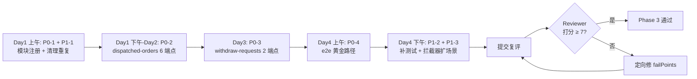

# Phase 3 后端返工指导

> 版本：v1.0（2026-05-11）
> 面向：Phase 3 后端返工同事、Reviewer
> 作者：architect
>
> **定位**：本文件是 Phase 3 后端被打回后的**唯一返工依据**。所有返工改动按本文的 P0 → P1 → P2 顺序推进；改完后 Reviewer 按 §4 验收准则复评。
>
> 同步阅读：
> - `docs/Phase3工单核心设计.md`（权威设计，**不变更**）
> - `docs/Phase3前后端联调契约.md`（接口契约，**不变更**）
> - `docs/Phase3测试用例.md`（验收清单）
> - `docs/Phase3字段权限拦截器设计.md`（本次同批新产出）
> - `docs/Phase3派发触发调度设计.md`（本次同批新产出）

---

## 目录
- [1. 评审结果摘要](#1-评审结果摘要)
- [2. driftLabel 深度诊断](#2-driftlabel-深度诊断)
- [3. 修复优先级切分](#3-修复优先级切分)
- [4. 验收准则](#4-验收准则)
- [5. 返工执行节奏建议](#5-返工执行节奏建议)

---

## 1. 评审结果摘要

| 指标 | 值 |
|------|----|
| 任务 ID | `8292b550-0a33-44df-8f5b-3e3ef0c27f2e` |
| 任务名 | Phase 3 后端 - 工单核心 + 派发引擎 + 字段权限 |
| 评审轮次 | 1 |
| 评审分数 | **5.55 / 10**（未达通过阈值） |
| 评审结论 | `review_pending` → 要求返工 |
| driftLabels | `drift:deliverable_missing`（唯一） |

### 1.1 五个维度的得分

| 维度 | 得分 | 权重 | 评审意见（摘） |
|------|------|------|----------------|
| completeness | 4 | 0.3 | 三大缺口：WorkOrderModule 未注册；dispatched-orders 模块 6 端点全缺；withdraw-requests 模块 2 端点全缺 |
| accuracy | 6 | 0.25 | `WorkOrderService` 内部逻辑、`DispatchEngine` 集成、字段权限装饰器、`Phase3Core` migration 都 OK；但 `AppModule` 同时导入 `DispatchModule` 与 `DispatchEngineModule`，存在重复 |
| codeQuality | 7 | 0.2 | `work-order.service.ts` 430 行未超 500 行限制，职责拆分清晰（validation/mapper/types/dto），Jest 348 行覆盖核心路径 |
| adherence | 5 | 0.15 | 模块注册违反 NestJS 规范；Phase 3 §4.2 API 清单大部分未实现 |
| innovation | 7 | 0.1 | 拦截器 + 装饰器模式合理，GIN 索引体现性能前瞻 |

### 1.2 Reviewer 给出的 5 条 suggestions

> 原文照录（作为 P0/P1 的任务源）：
>
> 1. 将 `WorkOrderModule` 注册到 `AppModule` 的 `imports` 数组，使 `/work-orders` 端点可达；
> 2. 实现 `dispatched-orders` 模块：controller/service/module，覆盖 `accept/complete/return/supplement/reassign/export` 6 个端点；
> 3. 实现 `withdraw-requests` 模块：controller/service/module，覆盖 `GET /withdraw-requests/pending` 和 `POST /withdraw-requests/:id/approve`；
> 4. 清理 `AppModule` 中的旧 `DispatchModule` 导入，统一使用 `DispatchEngineModule`（通过 `WorkOrderModule` 间接导入即可）；
> 5. 补充 `dispatched-orders` 和 `withdraw-requests` 的单元测试或 e2e 测试。

### 1.3 Reviewer summary（原文）

> "Phase 3 后端存在关键交付缺口：WorkOrderModule 已实现但未注册到 AppModule（所有 /work-orders 端点运行时不可达），dispatched-orders 模块完全缺失（6 个端点），withdraw-requests 模块完全缺失（2 个端点）。Phase 3 要求的 17 个 API 端点中，仅 9 个有代码实现且因未注册而不可达，8 个完全未实现。虽然 WorkOrderService 内部逻辑、DispatchEngine 集成、字段权限过滤、Phase3Core 迁移脚本质量较高，但核心交付物缺失导致无法通过验收。"

---

## 2. driftLabel 深度诊断

> **整体根因**：Phase 3 后端交付是"**单模块深度开发 + 其它模块未开工**"的分布，`drift:deliverable_missing` 是**多点交付缺失**的总标签。下面按 Reviewer 指出的三大缺口逐项做深度诊断——区分"真正的根因"与"表层症状"。

### 2.1 Symptom A：`WorkOrderModule` 未注册到 `AppModule`

**表层症状**：
- 所有 `/api/work-orders` 端点运行时返回 404（路由表里根本没注册）；
- e2e / supertest 对 work-orders 的断言一律跑不通；
- 单测能过，因为它们直接 `Test.createTestingModule({ providers:[WorkOrderService] })`，绕过了 AppModule。

**根因**：
- NestJS 的 **"模块可达性"** 依赖 `AppModule.imports` 里的显式登记；只写 `@Module()` 不登记 = 孤岛；
- 返工的同事可能被单测跑绿误导，没用"全流程集成测试"作为真实门禁；
- 与 `docs/Phase3工单核心设计.md` §8 DTO 清单的落地**解耦了**：DTO 定义齐全并不代表路由已装。

**验证方式**：
```bash
# 启 backend 后
curl -i http://localhost:3000/api/work-orders        # 期望 200/401，实际 404 = 模块未注册
```

**修复动作（P0-1）**：把 `WorkOrderModule` 加入 `AppModule.imports`；顺便用 `nest list` 或打印 `app.getHttpAdapter().getInstance()._router.stack` 自检路由表。

---

### 2.2 Symptom B：`dispatched-orders` 模块 0/6 端点

**表层症状**：6 个端点 `POST /accept`、`POST /complete`、`POST /return`、`POST /supplement`、`POST /reassign`、`GET /export` 全缺。

**根因**：
- 交付范围被误理解为"把 WorkOrderService 写厚=Phase 3 完成"；但 Phase 3 §4.2 把子工单当 **对等域** 交付；
- 子工单的接单并发（乐观锁）、完成聚合（主单自动 completed）、返工（退回主单召回）都是**业务的真正复杂度**所在；不写这 6 个端点，Phase 3 的业务闭环成立不了；
- 设计文档 §4.1/4.2 的状态转换规则未落成代码。

**深度影响**：
- Phase 4 批量导入 `dispatched_orders` 预生成依赖 `DispatchedOrderService.bulkCreate`——模块不存在就没有 API；
- Phase 5 撤回要审批人列表查询、Phase 6 看板 SQL 都依赖 `dispatched_orders.status` 的事件驱动更新——现在状态流从源头就不会变化。

**修复动作（P0-2）**：按 `docs/Phase3派发触发调度设计.md` §3-5 实现 6 端点及乐观锁、主单聚合 checker、退回召回；对照 §8.2 DTO 清单对齐响应体。

---

### 2.3 Symptom C：`withdraw-requests` 模块 0/2 端点

**表层症状**：`GET /withdraw-requests/pending`、`POST /withdraw-requests/:id/approve` 全缺。

**根因**：
- 交付边界把 Phase 3 的"撤回入口"与 Phase 5 的"审批落地"混淆：Phase 3 至少要把"发起申请 + 当前用户的待审批列表 + 审批动作"写通；Phase 5 负责加 `auto_agree_after`、`settleWithdrawRequest`、admin 强制等增强；
- `WorkOrderService.withdraw` 已经在写 `withdraw_requests/approvals`，但没有读端（pending 列表）和写端（approve 动作）→ 业务员提交后永远查不到、审批人永远点不了。

**深度影响**：
- Phase 5 的"多审批人并发 + auto_agree"只能在 Phase 3 有雏形的基础上增量；模块不存在等于 Phase 5 的 ~40% 工作必须先回炉 Phase 3；
- 操作日志 `operation_logs.action_type='withdraw_approved/rejected'` 没有触发点，审计链断掉。

**修复动作（P0-3）**：按 `docs/Phase5撤回与审批设计.md` §10.1 状态语义 + 本文 §3 的 P0-3 要求，最小闭环实现读端 + 写端。

---

### 2.4 Symptom D：`AppModule` 同时导入 `DispatchModule` 与 `DispatchEngineModule`

**根因**：
- Phase 2 留下的旧 `DispatchModule` 没清理，Phase 3 又加了新的 `DispatchEngineModule`；
- 两者功能重叠，冲突表现为"依赖注入时拿到旧实现"的潜在风险（accuracy 维度扣分）。

**修复动作（P1-1）**：删除 `AppModule` 的 `DispatchModule` import；`DispatchEngineModule` 由 `WorkOrderModule` 间接导出即可。

---

### 2.5 Symptom E：`dispatched-orders` / `withdraw-requests` 测试缺失

**根因**：源模块都还没写，测试自然也没写。修好 P0-2 / P0-3 后补齐测试。

**修复动作（P1-2）**：按本文 §4.2 给出测试清单补齐。

---

## 3. 修复优先级切分

### 3.1 P0 · 必修（不修过不了复评）

| 编号 | 动作 | 依据 | 估时 |
|------|------|------|------|
| P0-1 | 把 `WorkOrderModule` 加入 `AppModule.imports`；启动后 `curl /api/work-orders` 返 200/401 | suggestion #1 | 0.5h |
| P0-2 | 实现 `dispatched-orders` 模块全 6 端点（controller + service + module + DTO + guard） | suggestion #2、`docs/Phase3派发触发调度设计.md` §3 | 2d |
| P0-3 | 实现 `withdraw-requests` 模块 2 端点（pending 列表 + approve 动作） | suggestion #3、`docs/Phase5撤回与审批设计.md` §10.1 | 1d |
| P0-4 | 跑通 Phase3 e2e 黄金路径 `submit → dispatched → accept → complete → main order completed` | `docs/Phase3测试用例.md` §3 | 0.5d |

### 3.2 P1 · 应修（复评前最好修）

| 编号 | 动作 | 依据 | 估时 |
|------|------|------|------|
| P1-1 | 删 `AppModule` 的 `DispatchModule` import；确认只剩 `DispatchEngineModule`（经由 `WorkOrderModule`） | suggestion #4 | 0.5h |
| P1-2 | 补齐 `dispatched-orders` 单测（accept 乐观锁、complete 聚合、return 召回 三类共 ≥ 10 用例）和 `withdraw-requests` 单测（pending 列表过滤、approve 幂等 共 ≥ 6 用例） | suggestion #5、`docs/Phase3测试用例.md` §5 | 1d |
| P1-3 | 拦截器按 `docs/Phase3字段权限拦截器设计.md` 扩出 `dispatched:<module>` scenario（本次已补完设计，代码需跟进） | 本次补的设计文档 | 0.5d |

### 3.3 P2 · 可缓（不影响复评，但进入 Phase 4 前要收）

| 编号 | 动作 | 依据 | 估时 |
|------|------|------|------|
| P2-1 | 把 `HandlerPickerService` 的 `round_robin` 与 `load_balance` 单独抽成 strategy provider（现在在 service 内 switch 可以，但 Phase 4 批量时会出性能瓶颈） | `docs/Phase3派发触发调度设计.md` §2 | 0.5d |
| P2-2 | 为 `work_orders.extra_data` / `dispatched_orders.feedback_data` 的 GIN 索引写一份 `EXPLAIN ANALYZE` 归档，证明 p95 < 200ms | 压测脚本原型 | 0.5d |
| P2-3 | `operation_logs` 写入统一接入 `@Audit` 装饰器，减少散落写点 | 设计一致性 | 1d |

---

## 4. 验收准则

> 以下条款**全部**命中 = Reviewer 复评通过；任何一条落空 = 打回。

### 4.1 接口可达性（0 容忍）

- [ ] `curl http://localhost:3000/api/work-orders`、`/api/dispatched-orders`、`/api/withdraw-requests/pending` 全返非 404（401 可接受）
- [ ] `nest start` 启动日志能看到 `WorkOrderModule`、`DispatchedOrderModule`、`WithdrawRequestModule` 三者的路由映射打印
- [ ] `AppModule.imports` 里**没有** `DispatchModule`，只有 `DispatchEngineModule`（或通过 `WorkOrderModule` 间接）

### 4.2 功能闭环（Phase 3 黄金路径）

- [ ] 业务员登录 → 建 draft → submit → `work_orders.status='pending'` → N 条 `dispatched_orders`
- [ ] handler 登录 → `POST /dispatched-orders/:id/accept` 成功 → `status='processing'`；**再次 accept** 返 `409` + 错误码 `4220`（乐观锁生效）
- [ ] handler `POST /dispatched-orders/:id/complete` 成功 → 当所有子工单 completed 时主单 `status='completed'`（triggerMainOrderComplete）
- [ ] handler `POST /dispatched-orders/:id/return { reason }` → 子工单 `status='returned'`，主工单被召回 `status='returned'`
- [ ] 业务员 `POST /work-orders/:id/withdraw { reason }` → 产生 `withdraw_requests` + N 条 `withdraw_approvals`
- [ ] 审批人 `GET /withdraw-requests/pending` 能查到自己的待审批行
- [ ] 审批人 `POST /withdraw-requests/:id/approve { decision: 'approved'|'rejected', comment }` 能落地，对应 approval 行 `status` 更新

### 4.3 字段权限

- [ ] 业务员 `GET /work-orders/:id` 响应 `data.extra_data` 里 `id_card_no` 脱敏成 `****` 格式
- [ ] handler `GET /dispatched-orders/:id` 拿到的 `extra_data` 按 `field_permissions.scenario='dispatched:<module>'` 裁剪
- [ ] 响应体同时返回 `_fieldPermissions` map（visible/masked/readonly/hidden 四态）给前端渲染

### 4.4 测试

- [ ] `pnpm --filter backend test` 全绿；新增 dispatched-orders / withdraw-requests 模块单测 ≥ 16 条
- [ ] `pnpm --filter backend test:e2e -- --grep "phase-3-golden"` 至少一条端到端测通过黄金路径

### 4.5 代码规范

- [ ] 新增模块 controller/service/module 分离；每个文件不超 500 行
- [ ] 所有响应走统一响应体（`{ code, data, message }`）
- [ ] `operation_logs` 在 accept / complete / return / withdraw_approve 四个动作处写入

---

## 5. 返工执行节奏建议



**里程碑卡点**：
- 每完成一个 P0 编号就在 `operation_logs` 跑一个"冒烟脚本"留证据；
- P1-3（拦截器扩 dispatched scenario）在 P1-2 测试里 **必测**；
- 复评前跑一遍 `docs/回归用例总纲.md` 的 L1 核心回归（黄金路径 10 步），允许对 Phase 4-6 相关步骤 skip。

---

## 变更日志

- v1.0（2026-05-11）：首版，对应评审分 5.55 的返工诊断 + 验收准则。
