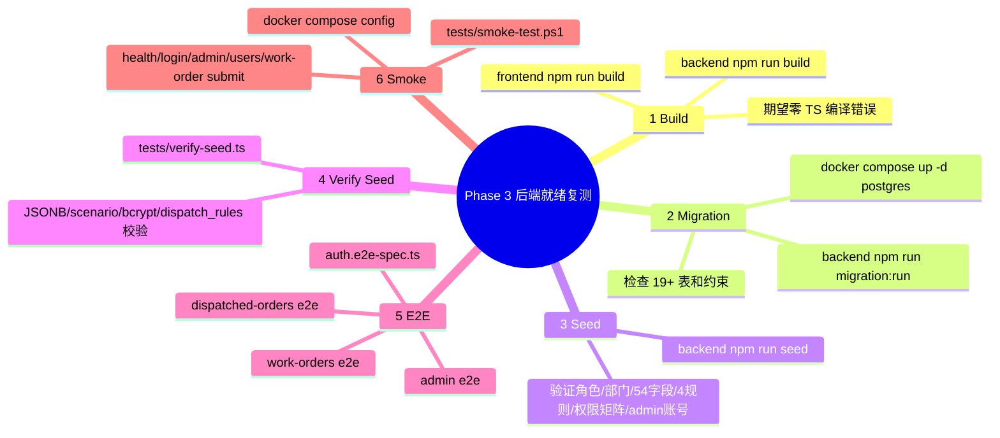

# Phase 3 复测脚本脑图

适用时机：后端 Phase 2 返工完成且 Phase 3 工单核心接口就绪后执行。

## 1. 复测总流程



## 2. 命令顺序

> Windows PowerShell 环境示例。若 Docker 不可用，先切换到“本地 PostgreSQL + Node 原生启动”备选流程。

```powershell
# 1. 构建检查
cd backend
npm.cmd run build
npm.cmd run test
cd ..\frontend
npm.cmd run build
cd ..

# 2. 启动数据库
# 后端返工中时只拉 postgres；后端就绪后再拉 backend/frontend/nginx
docker compose up -d postgres

# 3. 迁移与 seed
cd backend
npm.cmd run migration:run
npm.cmd run seed
cd ..

# 4. 初始数据验证
npx ts-node -r tsconfig-paths/register tests/verify-seed.ts

# 5. 后端 E2E
cd backend
npm.cmd run test:e2e
cd ..

# 6. Docker 冒烟
powershell -ExecutionPolicy Bypass -File tests/smoke-test.ps1
```

## 3. Phase 3 重点 E2E 路径

1. admin 登录 → `GET /api/admin/users` 返回 `{code,data,message,traceId}`。
2. 业务员创建 draft 主工单 → submit → processing。
3. 校验生成子工单数量：2/3/4 三种命中组合。
4. 后道接单 accept → complete → 最后一个子工单完成后主工单 completed。
5. 后道 return → 主工单 returned。
6. 字段权限：main、dispatched:contract、dispatched:onboarding_contact、dispatched:data_entry、dispatched:social_security 五场景均验证 hidden/masked/readonly/visible。
7. 并发安全：重复 submit/accept/complete/supplement 返回 409 或乐观锁错误。

## 4. Windows 原生 PostgreSQL 复测流程

当前 Docker Desktop 为硬限制时，使用 Windows 原生/便携 PostgreSQL 路径：

### 4.1 一键准备环境

```powershell
powershell -ExecutionPolicy Bypass -File tests/setup-windows-native.ps1
```

脚本职责：

1. 优先使用免安装 PostgreSQL 16 二进制包，解压到 `D:\pgsql16portable`。
2. 初始化数据目录 `D:\pgsql16portable\data`。
3. 启动 PostgreSQL：`127.0.0.1:5432`。
4. 创建数据库/用户：`ticket_system` / `ticket` / `ticket123`。
5. 写入 `backend/.env`。
6. 执行 `npm ci`、`migration:run`、`seed`、`verify-seed`。

### 4.2 清库重跑

```powershell
powershell -ExecutionPolicy Bypass -File tests/reset-windows-native.ps1
```

脚本会终止当前 `ticket_system` 连接、drop/create 数据库，并重跑 migration + seed + verify-seed。

### 4.3 手动命令

```powershell
# 启动 PostgreSQL
D:\pgsql16portable\pgsql\bin\pg_ctl.exe -D D:\pgsql16portable\data -l D:\pgsql16portable\postgres.log -o "-p 5432" start
D:\pgsql16portable\pgsql\bin\pg_isready.exe -h 127.0.0.1 -p 5432 -U postgres

# 后端环境
cd backend
npm.cmd ci
npm.cmd run migration:run
npm.cmd run seed

# verify-seed
$env:PGHOST='127.0.0.1'
$env:PGPORT='5432'
$env:PGDATABASE='ticket_system'
$env:PGUSER='ticket'
$env:PGPASSWORD='ticket123'
$env:NODE_PATH=(Resolve-Path .\node_modules).Path
$env:TS_NODE_COMPILER_OPTIONS='{\"module\":\"commonjs\",\"esModuleInterop\":true,\"strict\":false}'
node -r ts-node/register/transpile-only ..\tests\verify-seed.ts

# 后端启动
npm.cmd run start:dev
```

### 4.4 原生 smoke

Docker 不可用时跳过 `docker compose config`，只保留：

1. `GET http://localhost:3000/api/health`
2. `POST http://localhost:3000/api/auth/login`
3. `GET http://localhost:3000/api/auth/me`
4. Phase 2 admin 接口冒烟：`GET /api/admin/users`
5. Phase 3 工单核心路径：create → submit → dispatched accept/complete。

## 5. 结果记录模板

| 步骤 | 命令/接口 | 结果 | 证据 | 问题 ID |
|---|---|---|---|---|
| build | `npm.cmd run build` | 待测 | 终端日志 |  |
| migration | `npm.cmd run migration:run` | 待测 | 表结构/日志 |  |
| seed | `npm.cmd run seed` | 待测 | 计数校验 |  |
| verify-seed | `tests/verify-seed.ts` | 待测 | 脚本输出 |  |
| e2e | `npm.cmd run test:e2e` | 待测 | Jest 输出 |  |
| smoke | `tests/smoke-test.ps1` | 待测 | PowerShell 输出 |  |
