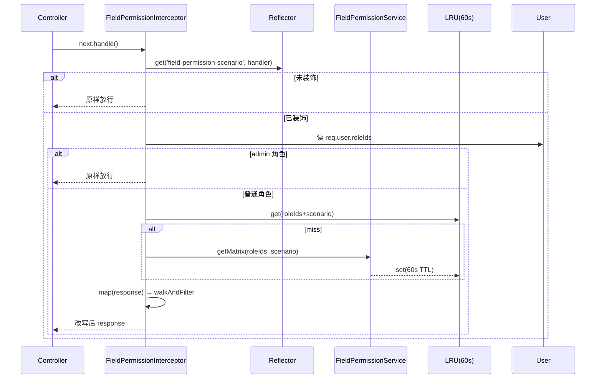

# Phase 3 字段权限拦截器设计

> 版本：v1.0（2026-05-11）
> 作者：architect
> 面向：Phase 3 后端返工同事
> 关联：`docs/Phase3工单核心设计.md` §6、`docs/Phase3后端返工指导.md` P1-3、`FieldPermissionService.filterExtraData`（已实现）
>
> **定位**：把"字段权限如何从配置端一路作用到 HTTP 响应"落成**一个拦截器 + 一个装饰器 + 一个小缓存**的固定工程。返工时按本文机械实施即可。

---

## 目录
- [1. 设计目标与非目标](#1-设计目标与非目标)
- [2. 总体流程](#2-总体流程)
- [3. `@FieldPermissionScenario` 装饰器](#3-fieldpermissionscenario-装饰器)
- [4. `FieldPermissionInterceptor` 设计](#4-fieldpermissioninterceptor-设计)
- [5. 四态（visible / masked / readonly / hidden）输出协议](#5-四态visible--masked--readonly--hidden输出协议)
- [6. 缓存策略](#6-缓存策略)
- [7. 使用示例](#7-使用示例)
- [8. 单测矩阵（≥ 12 条）](#8-单测矩阵-12-条)
- [9. 观测与降级](#9-观测与降级)

---

## 1. 设计目标与非目标

### 1.1 目标

- **一个拦截器把 HTTP 层响应中的 `extraData` 按当前用户权限自动脱敏/隐藏**，业务代码不再手写 `filterExtraData`；
- 同一响应可能是"单对象 / 列表 / 嵌套 dispatched"，拦截器要能递归走到所有字段挂载点；
- 前端可以凭 `_fieldPermissions` 做表单控件的 readonly / hidden / mask 渲染，**不再自己查权限矩阵**；
- 性能：读多写少（权限矩阵 60s 级别变更）→ LRU 缓存 `roleId+scenario`。

### 1.2 非目标

- **不负责写入校验**（写入校验由 `FieldValidationService` + DTO 做，不能依赖 HTTP 响应头）；
- **不负责字段级审计**（审计由 `@Audit` 装饰器 + `operation_logs` 负责）；
- **不覆盖 admin**：`admin` 角色直接绕过（通过短路判断 `roles.includes('admin')` 返回原样）。

---

## 2. 总体流程

```mermaid
flowchart LR
    A[HTTP Request] --> B[AuthGuard<br/>解出 user.roleIds]
    B --> C[Controller + Handler]
    C --> D[RxJS tap/map]
    D -->|response body| E{FieldPermissionInterceptor}
    E -->|装饰器解析 scenario| F[FieldPermissionService<br/>.getMatrix(roleIds, scenario)]
    F --> G[LRU cache 60s]
    G --> H[遍历 data / data.items / data.dispatchedOrders]
    H --> I[filterExtraData 单对象改写]
    I --> J[附加 _fieldPermissions 字段]
    J --> K[HTTP Response]
```

**关键点**：
1. **作用范围**：全局注册（`APP_INTERCEPTOR`），但通过装饰器 **opt-in**——没加 `@FieldPermissionScenario` 的接口直接放行；
2. **响应结构假设**：统一响应体 `{ code, data, message }`；`data` 里可能是对象、`{ items, pagination }`、或嵌套对象（work-order 详情带 `dispatchedOrders[]`）。拦截器递归处理；
3. **admin 捷径**：`user.roleCodes.includes('admin')` 时整体直通；
4. **无权限矩阵兜底**：`FieldPermissionService.getMatrix` 返回空 → 拦截器视为"全部 hidden"并写日志（防止误开放）。

---

## 3. `@FieldPermissionScenario` 装饰器

### 3.1 形态

```ts
// 静态 scenario —— 用于工单主视图、dispatched 列表之类的固定语义
@FieldPermissionScenario('main')
// 动态 scenario —— 用于 dispatched 详情，module 从 request 解析
@FieldPermissionScenario((ctx) => `dispatched:${ctx.params.module || ctx.body?.module}`)
```

### 3.2 定义

- 使用 NestJS `Reflector` + `SetMetadata('field-permission-scenario', ...)`；
- 接受 `string | (ctx: ExecutionContextHelper) => string`；
- 动态 resolver 的 `ctx` 是对 `ExecutionContext` 的薄封装：暴露 `req`、`params`、`query`、`body`、`user`、`response`。

### 3.3 允许的 scenario 命名

| scenario | 覆盖视图 | 典型接口 |
|----------|----------|----------|
| `main` | 工单主视图（业务员 / 主管 / admin 看整单） | `GET /api/work-orders`、`GET /api/work-orders/:id` |
| `dispatched:<moduleCode>` | 子工单视图（handler 只看对应模块的权限矩阵） | `GET /api/dispatched-orders`、`:id`、`/accept`、`/complete` |
| `export:<template>` | 导出模板视图（Phase 5 导出专用） | `GET /api/work-orders/export?template=...` |
| `audit` | 审计视图（admin 看全部字段，无脱敏） | `GET /admin/operation-logs/:id` |

> 命名规则：`<domain>[:<qualifier>]`，小写短横分词；新加 scenario 必须**同时**在 `FieldPermissionService` 加 matrix。

---

## 4. `FieldPermissionInterceptor` 设计

### 4.1 生命周期图



### 4.2 核心职责清单

| # | 职责 | 实现要点 |
|---|------|----------|
| 1 | 读取 scenario 元数据 | `Reflector.getAllAndOverride('field-permission-scenario', [handler, class])` |
| 2 | 解析动态 scenario | 若是函数，传入 `ctx` 运行；异常退化为 `main` 并写 `warn` 日志 |
| 3 | 短路 admin | `user.roleCodes.includes('admin')` 时直接 `return next.handle()` |
| 4 | 取权限矩阵 | `FieldPermissionService.getMatrix(roleIds, scenario)`，带 LRU |
| 5 | 递归改写 | 使用 `.pipe(map(body => walk(body, matrix)))`；`walk` 处理对象 / 数组 / `data.items` / `dispatchedOrders` |
| 6 | 附注 `_fieldPermissions` | 每个被处理的对象都挂一个字段 → 前端无需二次查询 |
| 7 | 异常隔离 | 拦截器内任何异常 → 降级为全部 hidden + pino error；不穿透让整个接口挂掉 |

### 4.3 响应递归 walk 规则

- 若 body 里出现 **`extraData` 或 `feedbackData` 字段**（对象类型），调用 `FieldPermissionService.filterExtraData(field, matrix)`；
- 若 body 包含 `items: []` / `dispatchedOrders: []` / `children: []`，对数组每个元素再 `walk`；
- 深度限制：最大 4 层（防御环引用），超出写 warn 日志；
- 忽略的键：`password_hash`, `token`, `_debug`（保留原样，不处理）。

---

## 5. 四态（visible / masked / readonly / hidden）输出协议

### 5.1 语义

| 模式 | 后端响应 `extraData` | 附加 `_fieldPermissions[code]` | 前端渲染 |
|------|----------------------|--------------------------------|----------|
| visible | 原值 | `"visible"` | 明文显示 + 可编辑（如接口允许） |
| readonly | 原值 | `"readonly"` | 明文显示 + 禁用编辑 |
| masked | 脱敏值（如 `****1234`） | `"masked"` | 显示脱敏 + 禁用编辑 |
| hidden | 字段从 `extraData` 中剔除 | `"hidden"` | 不渲染控件 |

### 5.2 脱敏规则（摘 `docs/Phase3工单核心设计.md` §6.4）

| 字段类型 | 规则 |
|----------|------|
| 身份证号 | 前 3 + `****` + 末 4 |
| 手机号 | 前 3 + `****` + 末 4 |
| 邮箱 | 首字 + `****` + `@后面原样` |
| 地址 | 留省市，后面 `****` |
| 金额 | 打码为 `****` |
| 其它 | `****`（固定） |

### 5.3 响应示例

```jsonc
{
  "code": 0,
  "data": {
    "id": "wo-001",
    "extraData": {
      "id_card_no": "320***1234",
      "mobile": "138****5678",
      "bank_account": null           // 被 hidden → 剔出序列化
    },
    "_fieldPermissions": {
      "id_card_no": "masked",
      "mobile": "masked",
      "bank_account": "hidden",
      "salary": "readonly",
      "name": "visible"
    }
  },
  "message": "ok"
}
```

> **前端契约**：若 `_fieldPermissions[code]` 不存在则按 `visible` 处理；`hidden` 字段**不**出现在 `_fieldPermissions`（剔除即隐藏）——写入 `"hidden"` 是为了告知前端"这里有个看不到的字段，编辑表单别重建"。

---

## 6. 缓存策略

### 6.1 LRU 参数

| 项 | 值 | 说明 |
|----|----|------|
| key | `hash(sortedRoleIds) + ':' + scenario` | 多角色用户按角色 id 排序后 hash |
| value | `FieldPermissionMatrix` | `{ fieldCode -> mode }` |
| TTL | 60 s | 与字段权限维护页的"实时生效"延迟挂钩 |
| 容量 | 1024 | 足够覆盖常见角色组合 |
| 驱逐 | LRU | 低频角色组合自然淘汰 |

### 6.2 失效时机

- **主动失效**：`POST /admin/field-permissions` 或 `PATCH /admin/roles/:id/permissions` 写入成功后，拦截器的缓存 key 全部清空（`cache.clear()`）；
- **TTL 到期**：60s 自然过期；
- **进程内**：单实例 LRU；多实例部署需重复各实例，**不需**分布式锁（写入延迟可接受）。

### 6.3 度量

- `field_permission_cache_hit_total` / `field_permission_cache_miss_total`（Phase 6 Prometheus 指标）；
- 命中率 < 80% 触发 warn（可能是 scenario 太散）。

---

## 7. 使用示例

### 7.1 主工单详情

```ts
@Controller('work-orders')
export class WorkOrderController {
  @Get(':id')
  @FieldPermissionScenario('main')
  findOne(@Param('id') id: string) {
    return this.workOrderService.findOne(id);  // 返 { id, extraData: {...}, dispatchedOrders: [...] }
  }
}
```

拦截器会：
- 用 `main` matrix 处理顶层 `extraData`；
- 对 `dispatchedOrders[].feedbackData` 按"该子工单 module" 再跑一次 `dispatched:<module>`（由 `walk` 的子路径 resolver 处理）。

### 7.2 子工单详情（动态 scenario）

```ts
@Controller('dispatched-orders')
export class DispatchedOrderController {
  @Get(':id')
  @FieldPermissionScenario((ctx) => `dispatched:${ctx.body?.module ?? ctx.params?.moduleCode ?? 'default'}`)
  findOne(@Param('id') id: string) { ... }
}
```

若 handler 无 moduleCode 信息，装饰器 fallback 为 `dispatched:default`（默认矩阵）。

### 7.3 导出（只读视图）

```ts
@Controller('work-orders/export')
@FieldPermissionScenario('export:basic')   // 类级装饰，整个 controller 生效
export class ExportController { ... }
```

### 7.4 列表

```ts
@Get()
@FieldPermissionScenario('main')
list(@Query() q: ListDto) {
  return this.service.list(q);  // 返 { items: [...], pagination: {...} }
}
```

拦截器遇到 `data.items[]` 自动遍历。

---

## 8. 单测矩阵（≥ 12 条）

> 4 种 scenario × 4 种模式 = 16 组理论；下面圈出强制必测的 12 条（其余可抽样）。

| # | scenario | 测试字段模式 | 给定输入 | 期望输出 |
|---|----------|--------------|----------|----------|
| T-01 | `main` | visible | `extraData.name='张三'` matrix=visible | 响应原样 + `_fieldPermissions.name='visible'` |
| T-02 | `main` | masked | `extraData.id_card_no='...1234'` matrix=masked | 脱敏 `320***1234` + mode masked |
| T-03 | `main` | readonly | `extraData.salary=9000` matrix=readonly | 原值 + mode readonly |
| T-04 | `main` | hidden | `extraData.bank_account='...'` matrix=hidden | 字段被剔出 |
| T-05 | `dispatched:data_entry` | masked | handler 只看身份证脱敏 | 脱敏 + mode |
| T-06 | `dispatched:data_entry` | hidden | 薪资字段 hidden 对录入 | 字段被剔出 |
| T-07 | `dispatched:social_security` | visible | 社保字段对社保 handler visible | 原值 |
| T-08 | `dispatched:contract` | readonly | 合同 handler 只能读 | 原值 + readonly |
| T-09 | `export:basic` | masked | 导出视图对普通用户脱敏 | 脱敏 |
| T-10 | `export:full` | visible | 管理层导出可见全部 | 原值 |
| T-11 | `audit` (admin 短路) | —— | admin 调用 | 响应与原始一致，不加 `_fieldPermissions` |
| T-12 | 递归 | 混合 | 顶层 + `dispatchedOrders[].feedbackData` 二级 | 顶层按 main，二级按各自 module 矩阵 |

### 8.1 额外建议（加分）

- T-13 LRU 命中：两次同 roleId + scenario 调用，第二次不应触达 `FieldPermissionService.getMatrix`；
- T-14 权限写入后缓存失效：`POST /admin/field-permissions` 后立即调接口应返回新矩阵；
- T-15 拦截器内部异常 → 降级为全部 hidden 并写 error；
- T-16 动态 resolver 抛错 → fallback `main`。

---

## 9. 观测与降级

### 9.1 日志字段（pino）

```json
{
  "level":"info",
  "module":"FieldPermissionInterceptor",
  "event":"filter",
  "scenario":"main",
  "roleIds":["salesperson"],
  "cacheHit":true,
  "fieldCount":54,
  "hiddenCount":3,
  "maskedCount":6,
  "durationMs":2
}
```

### 9.2 异常降级

- 拦截器抛任何异常 → catch 后把 `data` 原样返回**去掉所有 `extraData`**（hidden-all）并写 `error` 日志；宁可前端空白也不要越权；
- 度量：`field_permission_interceptor_error_total{reason=...}` 超过 10/min 触发告警。

### 9.3 回退开关

- 配置项 `FIELD_PERMISSION_INTERCEPTOR_ENABLED=true`（默认 true）；紧急情况可 `false` 让接口原样吐出，但必须同步下线敏感角色的访问（拉 session）。

---

## 变更日志

- v1.0（2026-05-11）：初版，对齐 Reviewer suggestion #1-5 返工场景；4 scenario × 4 模式的装饰器与拦截器协议固定。
