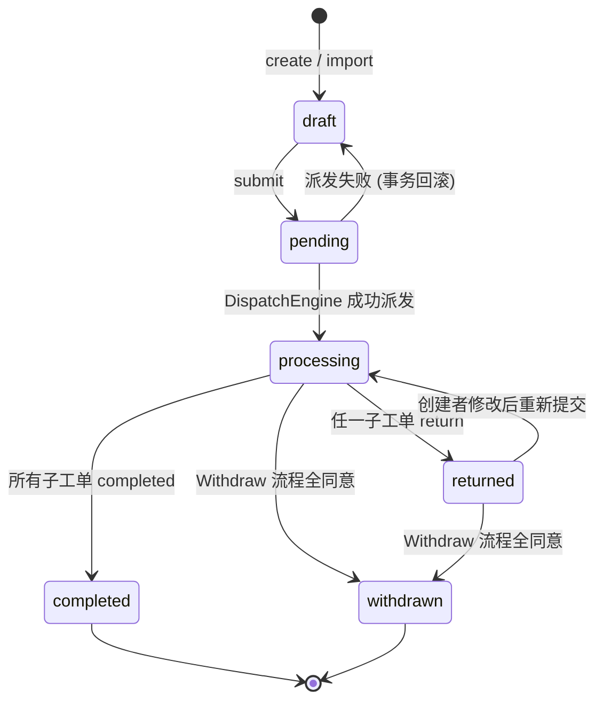
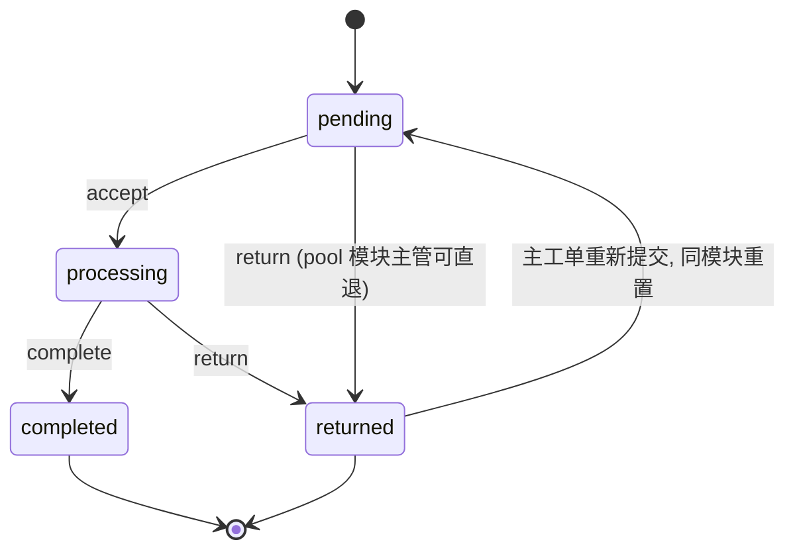
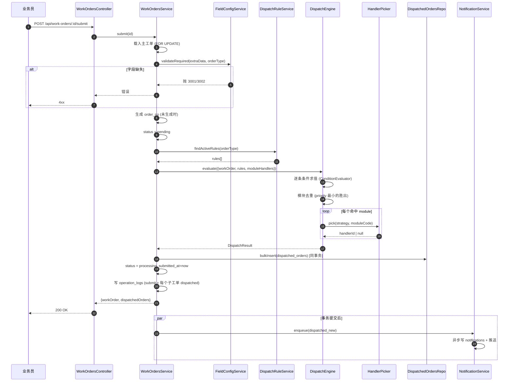

# Phase 3 · 工单核心模块设计

> 版本：v1.0（Phase 3 定稿）
> 覆盖：主工单 + 子工单生命周期、派发引擎实现、字段权限过滤、列表权限控制、核心 DTO 清单。
> 依赖：`docs/架构设计.md`、`docs/数据库ER图.md`、`docs/DispatchEngine-JSON-AST规范.md`、`docs/API规范.md`。

---

## 1. 工单状态机

### 1.1 状态定义
| 状态 | 含义 | 可读 | 可写 | 触发者 |
|------|------|------|------|--------|
| `draft` | 草稿（手动新建或导入未提交） | 创建者/管理员 | 创建者 | 创建/保存 |
| `pending` | 已提交，等待派发（短暂过渡态，派发完成立刻到 processing） | 创建者/admin | — | `submit` |
| `processing` | 派发完成，至少有一个子工单未完成 | 数据权限内相关方 | 仅 `extra_data` 通过补充/修改审批更新 | DispatchEngine |
| `completed` | 所有子工单 completed，业务闭环 | 同上 | — | 聚合 Checker |
| `returned` | 存在任一子工单被退回，需业务员修改 | 同上 | 创建者修改字段，再次提交 | 后道 `return` |
| `withdrawn` | 撤回流程全通过，整单关闭 | 同上 | — | Withdraw 流程 |

> 说明：`pending` 本期只作瞬态使用（事务内落成 `processing`）。为了便于日志观察仍保留该枚举；若提交事务在派发阶段失败会回滚到 `draft` 并抛错。

### 1.2 状态转换图


- `completed` 不可再变更。
- `withdrawn` 不可再变更。
- 进入 `returned` 后，创建者仅能修改 `extra_data`（不能修改 `customer_id`、`order_type`）。
- 业务员在 `processing` 想改数据必须走撤回/修改审批（见 Phase 5）。

### 1.3 子工单状态机
| 状态 | 含义 |
|------|------|
| `pending` | 派发完成，未接单（pool 时全员可见，fixed 时指向固定人） |
| `processing` | 已接单（pool 首次 accept 时 `handler_id` 落到操作者） |
| `completed` | 反馈字段已填 + 业务闭环 |
| `returned` | 被退回到主工单 |



- 约束：同一主工单内**每个 module_code 最多一条有效子工单**（`uk_do_parent_module`）；"返工"不是新建，是把旧记录 `returned→pending`。

---

## 2. 派发流程时序



要点：
- 主工单载入使用 `SELECT ... FOR UPDATE` 防并发重复提交。
- 校验 → 派发 → 子工单落库 → 状态切换 → 审计日志：**同一事务**；否则全部回滚。
- 通知写入在事务提交**之后**异步触发（避免事务未提交就给用户发通知）。
- `order_no` 生成算法：`ON` + `yyyyMMdd` + 当日流水 4 位（从数据库序列或 `SELECT MAX` 加锁生成）；未来新 `order_type` 复用 `PREFIX_MAP`。

---

## 3. DispatchEngine 接口设计

文件路径：`backend/src/modules/work-orders/dispatch/`

### 3.1 核心类型
```ts
// dispatch.types.ts

export type DispatchStrategy = 'fixed' | 'round_robin' | 'load_balance' | 'pool';

export interface WorkOrderSnapshot {
  id: number;
  orderNo: string;
  orderType: string;
  createdBy: number;
  departmentId: number | null;
  customerId: number | null;
  extraData: Record<string, unknown>;
}

export interface DispatchRule {
  id: number;
  ruleName: string;
  orderType: string;
  triggerConditions: AstNode | null;
  targetModule: string;
  dispatchStrategy: DispatchStrategy;
  priority: number;
  isActive: boolean;
}

export interface ModuleHandler {
  id: number;
  moduleCode: string;
  handlerId: number;
  weight: number;
  isBackup: boolean;
  isActive: boolean;
  rrCursorVersion: number;
}

export interface DispatchContext {
  workOrder: WorkOrderSnapshot;
  rules: DispatchRule[];
  moduleHandlers: ModuleHandler[];
  /** module_code → 该模块可见字段列表（由 FieldPermissionService 预计算） */
  visibleFieldsByModule: Record<string, string[]>;
}

export interface RuleHit {
  ruleId: number;
  ruleName: string;
  targetModule: string;
  priority: number;
  trace: AstEvalTrace;
  deduped: boolean;
}

export interface ChildToCreate {
  moduleCode: string;
  handlerId: number | null;
  visibleFields: string[];
  ruleId: number;
  ruleName: string;
}

export interface DispatchResult {
  hits: RuleHit[];
  childrenToCreate: ChildToCreate[];
}

export interface DispatchEngine {
  evaluate(ctx: DispatchContext): DispatchResult;
}
```

### 3.2 Engine 主体（参考实现）
```ts
@Injectable()
export class DispatchEngineImpl implements DispatchEngine {
  constructor(
    private readonly cond: ConditionEvaluator,
    private readonly picker: HandlerPicker,
  ) {}

  evaluate(ctx: DispatchContext): DispatchResult {
    const hits: RuleHit[] = [];
    const rulesSorted = [...ctx.rules]
      .filter(r => r.isActive && r.orderType === ctx.workOrder.orderType)
      .sort((a, b) => a.priority - b.priority);

    for (const rule of rulesSorted) {
      const { result, trace } = this.cond.evaluate(rule.triggerConditions, {
        extraData: ctx.workOrder.extraData,
      });
      if (!result) continue;
      hits.push({
        ruleId: rule.id,
        ruleName: rule.ruleName,
        targetModule: rule.targetModule,
        priority: rule.priority,
        trace,
        deduped: false,
      });
    }

    // 模块去重：同 module 只保留最小 priority
    const winners = new Map<string, RuleHit>();
    for (const hit of hits) {
      const existing = winners.get(hit.targetModule);
      if (!existing) winners.set(hit.targetModule, hit);
      else if (hit.priority < existing.priority) {
        existing.deduped = true;
        winners.set(hit.targetModule, hit);
      } else {
        hit.deduped = true;
      }
    }

    const childrenToCreate: ChildToCreate[] = [];
    for (const [moduleCode, winner] of winners) {
      const rule = rulesSorted.find(r => r.id === winner.ruleId)!;
      const handlerId = this.picker.pick(
        rule.dispatchStrategy,
        moduleCode,
        ctx.moduleHandlers,
      );
      childrenToCreate.push({
        moduleCode,
        handlerId,
        visibleFields: ctx.visibleFieldsByModule[moduleCode] ?? [],
        ruleId: winner.ruleId,
        ruleName: winner.ruleName,
      });
    }

    return { hits, childrenToCreate };
  }
}
```

### 3.3 HandlerPicker（派发策略）

#### 3.3.1 接口
```ts
export interface HandlerPicker {
  pick(
    strategy: DispatchStrategy,
    moduleCode: string,
    handlers: ModuleHandler[],
  ): number | null;
}
```

#### 3.3.2 各策略实现要点

**fixed**
- 过滤 `moduleCode` + `is_active=true` + `is_backup=false`，按 `weight` 降序取第一名；若无则取 `is_backup=true` 的第一名；都没有则返回 `null`（后端记 warn，管理员应补配置）。

**round_robin（RR）**
- 本期**不引入 Redis**（Phase 1 约束），游标存 `module_handlers.rr_cursor_version`：
  - 在 `module_handlers` 同模块的所有候选中按 `id` 升序排列，形成循环。
  - 每个模块的"下一个游标"存一个单独的 `module_rr_state(module_code PK, next_handler_id)` 表（本期复用 `module_handlers.weight=-1` 的虚拟占位行；为简化，直接在 `module_handlers` 表上加 `rr_cursor_version` 乐观锁，算法如下：
    1. 读取该模块候选列表与当前 `cursor`（由 max(rr_cursor_version) 决定）。
    2. 计算 `next = candidates[(cursor+1) % n]`。
    3. `UPDATE module_handlers SET rr_cursor_version = rr_cursor_version + 1 WHERE id = next.id AND rr_cursor_version = <读到的值>`；更新失败则重试，最多 3 次。
- 补充：`weight` 在 RR 模式下被解释为"该人连续获得 N 单后才轮到下一个"，实现方式：为每个候选生成"扩展候选列表"（重复 `weight` 次），再按循环数组取。

**load_balance**
```sql
SELECT u.id AS handler_id, COUNT(d.id) AS open_cnt
FROM users u
JOIN module_handlers mh ON mh.handler_id = u.id
 AND mh.module_code = $1 AND mh.is_active = true AND mh.is_backup = false
LEFT JOIN dispatched_orders d
  ON d.handler_id = u.id AND d.status IN ('pending','processing')
WHERE u.is_active = true
GROUP BY u.id
ORDER BY open_cnt ASC, u.id ASC
LIMIT 1;
```
- 并发同秒命中同一人 → 允许负载略微不均；不为此上锁。

**pool**
- 返回 `null`；列表查询（§5）把 `handler_id IS NULL` 的子工单暴露给该模块全组成员。

#### 3.3.3 策略选择时的健壮性
- 所有策略返回 `null` 前都要记 warn 日志（`moduleCode` + `strategy` + `reason`）。
- `fixed` 没人时不降级到 pool；而是让子工单落库但 `handler_id=null`，并额外推送管理员"模块无人可派"告警通知。

---

## 4. 子工单生命周期

### 4.1 状态转换规则
| 操作 | 前置状态 | 后置状态 | 校验 |
|------|----------|----------|------|
| `accept` | `pending` | `processing` | `handler_id=null`（pool）时设为当前用户；`handler_id=me` 时直接通过；`handler_id=other` 时拒绝 |
| `complete` | `processing` | `completed` | 反馈字段必填（由模块配置） |
| `return`  | `processing`/`pending` | `returned` | 必填 `return_reason` |
| `reassign` | `pending`/`processing` | 同状态 | 主管/管理员操作；记审计 |
| `supplement` | `processing` | 同状态 | 字段在 `field_supplement_rules` 允许；目标字段权限 ≥ readonly（详见 Phase 4） |

### 4.2 主工单聚合 Checker
```ts
async function checkMainOrderComplete(parentId: number, tx: EntityManager) {
  const { open, returned } = await tx.query(`
    SELECT
      COUNT(*) FILTER (WHERE status IN ('pending','processing')) AS open,
      COUNT(*) FILTER (WHERE status = 'returned') AS returned
    FROM dispatched_orders WHERE parent_order_id = $1
  `, [parentId]);

  if (Number(returned) > 0) {
    // 任一 returned → 主工单 returned
    await tx.update(WorkOrder, parentId, { status: 'returned' });
    return 'returned';
  }
  if (Number(open) === 0) {
    await tx.update(WorkOrder, parentId, {
      status: 'completed',
      completedAt: () => 'now()',
    });
    return 'completed';
  }
  return 'processing';
}
```
- 每次 `complete / return / supplement-without-change` 后都触发一次。
- `returned` 优先级高于 `completed`（防止边界情况：有子工单被退回但其他已完成）。

### 4.3 返工重派（由 Phase 4 主工单 resubmit 使用）
- 业务员在 `returned` 态修改 `extra_data` 后点"重新提交"：
  1. 仅当 `status=returned` 时允许。
  2. 按现有 `dispatched_orders`：`returned` 的子工单全部 `UPDATE status='pending', return_reason=null`，`handler_id` **保持原值**（如果原 handler 已禁用，则置 null 回到 pool）。
  3. `completed` 子工单保留原样，**不重新派发**。
  4. 主工单 `status=processing`，写审计 `resubmit_after_return`。

---

## 5. 列表查询权限控制

### 5.1 主工单列表 `GET /api/work-orders`
- **业务员 salesperson**：`where created_by = :userId`（默认）；可加 `departmentId` 过滤给自己同部门同事的单（只读），受额外开关控制，本期默认关。
- **项目经理 manager**：看当前部门发起的所有单（`department_id IN :userPrimaryDepartments`）。
- **后道执行/主管**：默认**不给查主工单列表**（只通过子工单反查详情）；列表请求返回空或 403，由 admin 开关决定（本期返回空 + 提示"请到我的子工单"）。
- **admin**：全量可见。

SQL 片段（以 salesperson 为例）：
```sql
WHERE created_by = :userId
  AND ($orderType::text IS NULL OR order_type = $orderType)
  AND ($status::text IS NULL OR status = $status)
  AND ($keyword::text IS NULL
       OR employee_name ILIKE '%'||$keyword||'%'
       OR employee_id_card ILIKE '%'||$keyword||'%'
       OR order_no ILIKE '%'||$keyword||'%')
```

### 5.2 子工单列表 `GET /api/dispatched-orders`
默认返回"我能处理/可见"的子工单，权限 SQL：
```sql
WHERE d.status <> 'returned' -- 返工态默认折叠，可通过 includeReturned=true 开关
  AND (
    d.handler_id = :userId                                            -- 分给我
    OR (
      d.handler_id IS NULL                                           -- pool
      AND d.module_code IN (
        SELECT mh.module_code FROM module_handlers mh
        WHERE mh.handler_id = :userId AND mh.is_active = true
      )
    )
  )
```

主管视图 `GET /api/dispatched-orders/team/:module`：
```sql
WHERE d.module_code = :module
  AND EXISTS (
    SELECT 1 FROM user_roles ur
    JOIN roles r ON r.id = ur.role_id
    WHERE ur.user_id = :userId
      AND r.code IN ('<module>_supervisor', 'manager', 'admin')
  )
```
- 角色编码命名约定：`<module>_supervisor`；如 `contract_supervisor`。
- 未授权角色直接 403。

### 5.3 主工单详情 `GET /api/work-orders/:id`
- 创建者 / 同部门主管 / admin：完整可见。
- 子工单 handler：仅该子工单 module 场景下的字段（**走 FieldPermissionInterceptor**），并携带"我能操作的子工单"字段；其它子工单信息只返回 `id/moduleCode/status/handlerName`。
- 禁止跨部门/跨模块越权。

实现通过 `DataPermissionService.canView(userId, workOrderId, scenario)` 统一判定；Service 层先做粗粒度校验，Interceptor 再做字段级过滤。

---

## 6. FieldPermissionInterceptor 实现思路

### 6.1 责任定义
- 入口：所有返回 `WorkOrder` / `DispatchedOrder` 详情的 Controller 使用 `@UseInterceptors(FieldPermissionInterceptor)` 并以 `@FieldScenario(...)` 装饰器声明场景。
- 职责：读取当前用户的权限 map，遍历 `extra_data`（或 `fields[]`），对每个键应用 `hidden / readonly / masked / visible`。
- 禁止在 Controller 直接返回原始 `extra_data`。

### 6.2 装饰器
```ts
export const FieldScenario = (scenarioResolver: (req: Request) => Scenario) =>
  SetMetadata('fieldScenario', scenarioResolver);

// 例：主工单详情
@Get(':id')
@FieldScenario(req => ({ kind: 'main' }))
getDetail(@Param('id') id: number) { ... }

// 例：子工单详情 scenario 由参数决定
@Get(':id')
@FieldScenario(async (req, ctx) => {
  const d = await ctx.get(DispatchedOrdersService).findModuleCode(req.params.id);
  return { kind: 'dispatched', moduleCode: d };
})
getDispatchedDetail(...) { ... }
```

### 6.3 核心流程
```ts
@Injectable()
export class FieldPermissionInterceptor implements NestInterceptor {
  constructor(
    private readonly reflector: Reflector,
    private readonly perm: FieldPermissionService,
  ) {}

  intercept(ctx: ExecutionContext, next: CallHandler) {
    const req = ctx.switchToHttp().getRequest();
    const resolver = this.reflector.get<(req: any) => Scenario | Promise<Scenario>>(
      'fieldScenario',
      ctx.getHandler(),
    );
    if (!resolver) return next.handle();

    return from(resolver(req)).pipe(
      mergeMap(async scenario => ({
        scenario,
        permMap: await this.perm.resolve(req.user.id, scenario),
      })),
      mergeMap(({ permMap }) =>
        next.handle().pipe(map(payload => this.applyPayload(payload, permMap))),
      ),
    );
  }

  private applyPayload(payload: any, permMap: PermMap) {
    if (!payload) return payload;
    if (Array.isArray(payload)) return payload.map(p => this.applyPayload(p, permMap));
    if (payload.extraData) {
      const { data, readonlyFields } = this.perm.apply(payload.extraData, permMap);
      payload.extraData = data;
      payload.readonlyFields = readonlyFields;
    }
    if (payload.fields) {
      payload.fields = payload.fields
        .filter((f: any) => permMap[f.fieldCode] !== 'hidden')
        .map((f: any) => ({
          ...f,
          permission: permMap[f.fieldCode] ?? 'hidden',
          value: this.maskValue(f.fieldCode, f.value, permMap[f.fieldCode]),
        }));
    }
    return payload;
  }

  private maskValue(code: string, v: unknown, perm: FieldPermission | undefined) {
    if (perm !== 'masked' || v == null) return v;
    return MaskingRegistry.resolve(code).mask(v);
  }
}
```

### 6.4 脱敏规则
```ts
export const MaskingRegistry = {
  resolve(fieldCode: string): MaskingStrategy {
    return strategies[fieldCode] ?? DefaultMask;
  },
};

const strategies: Record<string, MaskingStrategy> = {
  id_card_no:       { mask: v => maskBetween(String(v), 6, 4) },
  mobile:           { mask: v => maskBetween(String(v), 3, 4) },
  bank_account:     { mask: v => maskTail(String(v), 4) },
  base_salary:      { mask: () => '***' },
  other_salary:     { mask: () => '***' },
  probation_salary: { mask: () => '***' },
};

function maskBetween(v: string, head: number, tail: number): string {
  if (v.length <= head + tail) return v;
  return v.slice(0, head) + '*'.repeat(v.length - head - tail) + v.slice(-tail);
}
function maskTail(v: string, keep: number): string {
  if (v.length <= keep) return '*'.repeat(v.length);
  return '*'.repeat(v.length - keep) + v.slice(-keep);
}
const DefaultMask: MaskingStrategy = { mask: () => '***' };
```
- `hidden` → 直接从 `extraData` 删除键，`fields[]` 不返回该项。
- `readonly` → 返回值但 `permission='readonly'`，前端禁用编辑控件。
- `masked` → 按 `MaskingRegistry` 输出脱敏值。
- `visible` → 原样返回。
- 写接口（`PUT /work-orders/:id`、`supplement` 等）另有独立校验：`permission < readonly` 时拒绝。

### 6.5 合并多角色权限
```ts
function mergePerms(perms: FieldPermission[]): FieldPermission {
  if (perms.includes('visible')) return 'visible';
  if (perms.includes('readonly')) return 'readonly';
  if (perms.includes('masked')) return 'masked';
  return 'hidden';
}
```
- admin 隐式 `visible`，不进入合并。
- 未定义的 `(role, scenario, field)` 视为 `hidden`。

---

## 7. 错误码扩展（本阶段新增）

| code | HTTP | 含义 |
|------|------|------|
| 4110 | 400 | 必填字段缺失（`details: { missing: string[] }`） |
| 4111 | 400 | 条件必填字段缺失 |
| 4112 | 400 | 字段值枚举非法 |
| 4113 | 409 | 重复提交（已 processing/completed） |
| 4114 | 409 | 主工单非 `returned` 态，不能重新提交 |
| 4210 | 409 | 子工单尚有未完成处理人，不能派发新单 |
| 4220 | 400 | 接单失败：已分配给他人 |
| 4221 | 400 | 完成失败：反馈字段缺失 |
| 4222 | 400 | 退回失败：缺 return_reason |

> 这些错误码追加到 `docs/API规范.md` §2；本文件记录触发点，便于前端映射。

---

## 8. DTO 清单（与后端模块一一对应）

### 8.1 work-orders 模块

```ts
// create-work-order.dto.ts
export class CreateWorkOrderDto {
  @IsIn(['onboarding', 'renewal', 'resignation'])
  orderType!: string;
  @IsOptional() @IsInt() customerId?: number;
  @IsOptional() @IsInt() departmentId?: number;      // 默认取当前用户主部门
  @IsObject() extraData!: Record<string, unknown>;
}

// update-work-order.dto.ts
export class UpdateWorkOrderDto {
  @IsOptional() @IsInt() customerId?: number;
  @IsObject() extraData!: Record<string, unknown>;   // 全量替换，非 merge
}

// query-work-order.dto.ts
export class QueryWorkOrderDto extends BasePaginationDto {
  @IsOptional() @IsString() orderType?: string;
  @IsOptional() @IsString() status?: WorkOrderStatus;
  @IsOptional() @IsString() keyword?: string;
  @IsOptional() @IsInt() customerId?: number;
  @IsOptional() @IsDateString() createdAfter?: string;
  @IsOptional() @IsDateString() createdBefore?: string;
}

// submit-work-order.dto.ts
export class SubmitWorkOrderDto {
  /** 允许一次性补充缺失字段 */
  @IsOptional() @IsObject() extraData?: Record<string, unknown>;
}

// resubmit-work-order.dto.ts（returned -> processing）
export class ResubmitWorkOrderDto {
  @IsObject() extraData!: Record<string, unknown>;
  @IsOptional() @IsString() note?: string;
}

// work-order-detail.vo.ts（响应）
export interface WorkOrderDetailVo {
  id: number;
  orderNo: string;
  orderType: string;
  status: WorkOrderStatus;
  createdBy: { id: number; name: string };
  department?: { id: number; name: string };
  customer?: { id: number; name: string };
  employeeName?: string;
  employeeIdCard?: string;
  extraData: Record<string, unknown>;   // 已经 FieldPermissionInterceptor 过滤
  readonlyFields: string[];
  fields: Array<FieldView>;
  dispatchedOrders: Array<DispatchedOrderSummaryVo>;
  submittedAt?: string;
  completedAt?: string;
  createdAt: string;
  updatedAt: string;
}
```

### 8.2 dispatched-orders 模块

```ts
// query-dispatched.dto.ts
export class QueryDispatchedOrderDto extends BasePaginationDto {
  @IsOptional() @IsString() moduleCode?: string;
  @IsOptional() @IsString() status?: DispatchedOrderStatus;
  @IsOptional() @IsString() keyword?: string;
  @IsOptional() @IsBoolean() includeReturned?: boolean;  // 默认 false
  @IsOptional() @IsBoolean() onlyPool?: boolean;         // 只看公共池
}

// accept-dispatched.dto.ts
export class AcceptDispatchedOrderDto {
  /** 无需 body，显式定义便于将来扩展 */
  @IsOptional() @IsString() note?: string;
}

// complete-dispatched.dto.ts
export class CompleteDispatchedOrderDto {
  /** 各模块反馈字段：onboarding_feedback / contract_feedback / data_entry_feedback / ... */
  @IsObject() feedback!: Record<string, unknown>;
  /** 可选：补充字段（见 Phase 4） */
  @IsOptional() @IsObject() supplements?: Record<string, unknown>;
}

// return-dispatched.dto.ts
export class ReturnDispatchedOrderDto {
  @IsString() @MinLength(2) @MaxLength(500) returnReason!: string;
}

// supplement-dispatched.dto.ts
export class SupplementDispatchedOrderDto {
  @IsObject() fields!: Record<string, unknown>;
  /** 乐观锁：客户端回填的主工单 updatedAt */
  @IsDateString() workOrderUpdatedAt!: string;
}

// reassign-dispatched.dto.ts
export class ReassignDispatchedOrderDto {
  /** null 表示丢回 pool */
  @IsOptional() @IsInt() handlerId?: number | null;
  @IsOptional() @IsString() reason?: string;
}

// export-dispatched.dto.ts
export class ExportDispatchedOrdersDto {
  @IsInt() templateId!: number;
  @IsArray() @IsInt({ each: true }) @ArrayMinSize(1) dispatchedOrderIds!: number[];
}

// dispatched-order-detail.vo.ts
export interface DispatchedOrderDetailVo {
  id: number;
  moduleCode: string;
  status: DispatchedOrderStatus;
  parentOrder: { id: number; orderNo: string; employeeName: string };
  handler?: { id: number; name: string };
  fields: FieldView[];                  // 已走字段权限过滤
  feedbackData: Record<string, unknown>;
  returnReason?: string;
  dispatchedAt: string;
  acceptedAt?: string;
  completedAt?: string;
  availableSupplements: string[];       // 允许补充的 field_code
  availableTemplates: Array<{ id: number; name: string }>;
}
```

### 8.3 通用视图

```ts
// field-view.vo.ts
export interface FieldView {
  fieldCode: string;
  fieldName: string;
  fieldType: string;
  value: unknown;
  permission: 'visible' | 'readonly' | 'masked';   // hidden 不会出现在 fields[]
  supplementable?: boolean;
  dropdownOptions?: Array<{ label: string; value: string }>;
  validation?: {
    required: boolean;
    regex?: string;
    regexMsg?: string;
  };
}
```

---

## 9. 并发与幂等

- `submit` 入口使用"工单 id 互斥锁"：
  - Postgres Advisory Lock：`SELECT pg_advisory_xact_lock(hashtext('work_order:submit:' || :id))`。
  - 避免同一工单被两次提交并发派发。
- `accept` 接口使用 `UPDATE ... WHERE status='pending' AND (handler_id IS NULL OR handler_id=:me)` 的 CAS 更新；影响行数为 0 时抛 4220。
- `complete` 使用状态 CAS：`WHERE status='processing' AND handler_id=:me`；失败抛 4201。
- `supplement` 使用主工单版本号（`work_orders.updated_at` 作版本），客户端回传 `workOrderUpdatedAt`，Service 检查匹配后再更新（详见 Phase 4 §5）。

---

## 10. 单测与 e2e 覆盖

### 10.1 单测
- `DispatchEngine`：
  - 命中 0 条（无规则）→ 无子工单，主工单报错 `4202`。
  - 命中多条同模块 → 去重保留最小 priority。
  - 混合策略（fixed / pool）→ handlerId 分别为固定人 / null。
- `ConditionEvaluator`：见 JSON AST 规范 §7 的 12 个示例。
- `HandlerPicker`：
  - RR：3 人 weight=[2,1,1] 连派 8 单，序列固定；并发 10 调用去重后总分配数 = 10。
  - load_balance：存在多个零负载候选时按 `id` 稳定排序。
  - fixed：无主选人回退备份。

### 10.2 e2e
- 业务员手动创建 → 提交 → 生成子工单 → 后道接单 → 完成 → 主工单 completed。
- 业务员提交 → 某子工单 return → 主工单 returned → 创建者修改 extraData → 重新提交 → 只有 returned 子工单被重置。
- 字段权限：合同组看子工单详情时 `base_salary` 为 `masked`；数据录入看 `base_salary` 为 `visible`。
- 并发提交同一工单两次只成功一次。

---

## 11. 观测

- 日志：所有派发成功 `log.info({ action: 'dispatch', orderId, children: [...], ruleHits: [...] })`；派发失败 `log.error`。
- 指标（Phase 6 扩展）：
  - `dispatch_duration_ms`：派发耗时（p50/p95）。
  - `dispatch_success_ratio`：成功/总数。
  - `pool_pending_count`：各模块 pool 中积压数。
  - `handler_load_stddev`：同模块人均负载标准差（load_balance 健康度）。

---

## 12. 变更纪律
- 本期实现锁定在本文件。任何偏离（如 RR 引入 Redis、派发事件上消息队列）需走 `[架构变更]`。
- `WorkOrderDetailVo` / `DispatchedOrderDetailVo` 即前端 Ant Pro 动态表单的渲染契约，增减字段必须同步本文件与 `docs/API规范.md`。
