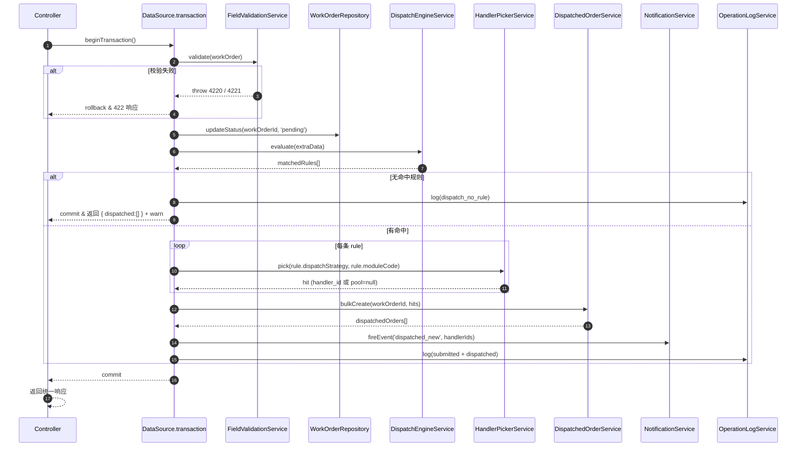
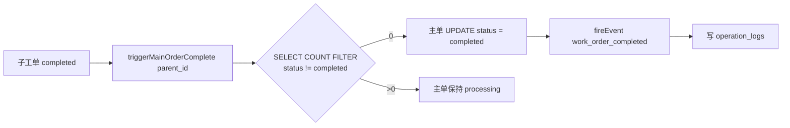
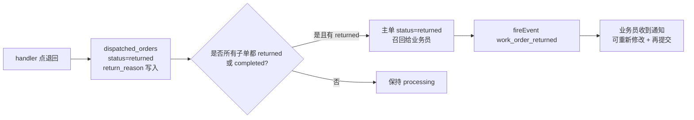

# Phase 3 派发触发调度设计

> 版本：v1.0（2026-05-11）
> 作者：architect
> 面向：Phase 3 后端返工同事
> 关联：`docs/Phase3工单核心设计.md` §2-4、§9；`DispatchEngine-JSON-AST规范.md`；`docs/Phase3前后端联调契约.md`；`docs/Phase3后端返工指导.md` P0-2。
>
> **定位**：把「提交 → 派发 → 接单 → 完成 → 召回」这条链路落成**固定的 service 调用顺序 + 固定的事务边界 + 固定的并发控制**。返工按本文实施，**不改设计**。

---

## 目录
- [1. submit 端到端流程 mermaid](#1-submit-端到端流程-mermaid)
- [2. 事务边界与错误处理](#2-事务边界与错误处理)
- [3. HandlerPickerService 四策略实现](#3-handlerpickerservice-四策略实现)
- [4. accept 接口乐观锁](#4-accept-接口乐观锁)
- [5. complete 触发主单聚合](#5-complete-触发主单聚合)
- [6. return 召回流程](#6-return-召回流程)
- [7. 补充 supplement 与 reassign](#7-补充-supplement-与-reassign)
- [8. 并发与幂等矩阵](#8-并发与幂等矩阵)
- [9. 错误码约定](#9-错误码约定)

---

## 1. submit 端到端流程 mermaid



**核心纪律**：
1. **单一事务**：校验、状态改主单、派发写子单、通知与审计入队**必须在同一个 `dataSource.transaction`**；失败则整体回滚；
2. **通知入队，非同步**：`NotificationService.fireEvent` 只是把事件打进队列，**不能**阻塞事务；SMTP / SSE 失败不影响主流程；
3. **审计与业务同事务**：`operation_logs` 与 `work_orders` / `dispatched_orders` 的落地必须原子；审计丢不可接受。

### 1.1 submit 接口调用骨架（伪代码）

```ts
// pseudo code，不是交付代码
await dataSource.transaction(async (mgr) => {
  const wo = await mgr.findOne(WorkOrder, { where: { id }, lock: { mode: 'pessimistic_write' } });
  assertStatus(wo, 'draft');

  await fieldValidationService.validate(wo);            // 必填/条件必填/格式

  wo.status = 'pending';
  wo.submittedAt = new Date();
  await mgr.save(wo);

  const matchedRules = await dispatchEngine.evaluate(wo.extraData);
  const hits: DispatchHit[] = [];
  for (const rule of matchedRules) {
    const hit = await handlerPicker.pick(rule.dispatchStrategy, rule.moduleCode, mgr);
    hits.push({ moduleCode: rule.moduleCode, handlerId: hit.handlerId, ruleId: rule.id });
  }
  const dispatched = await dispatchedOrderService.bulkCreate(wo.id, hits, mgr);

  notificationService.enqueue('dispatched_new', dispatched);
  await operationLogService.log(mgr, 'work_order_submitted', wo.id, { ruleIds: matchedRules.map(r => r.id) });
  for (const d of dispatched) {
    await operationLogService.log(mgr, 'dispatch_executed', d.id, { strategy: d.dispatchStrategy });
  }
});
```

---

## 2. 事务边界与错误处理

| 发生位置 | 期望行为 | 错误码 |
|----------|----------|--------|
| 工单不存在 | 抛 404 | 4040 |
| 工单状态非 `draft` | 抛 409 | 4210 |
| 字段校验失败 | 抛 422 + `fieldErrors[]` | 4220 |
| 条件必填未满足 | 抛 422 + `conditionErrors[]` | 4221 |
| DispatchEngine 执行异常 | 抛 500（不提交主单状态） | 5001 |
| HandlerPicker 所有策略都挑不到人 | 落 `pool` 兜底 + warn | 4230（可配置是否抛） |
| DB 冲突（并发 submit） | 回滚 + 提示 | 4099 |
| Notification / OperationLog 队列失败 | **不影响事务**，降级记 pino error | - |

### 2.1 并发保护

- 以 `work_orders.id` 做 `pessimistic_write`（FOR UPDATE）锁，防止同一单被两个请求同时 submit；
- 提交后 `work_orders.status` 已转 `pending`，二次请求在状态断言处失败返回 4210；
- Phase 5 的撤回并不走 submit；不会和 submit 互相抢锁。

---

## 3. HandlerPickerService 四策略实现

> 数据源：`module_handlers(user_id, module_code, weight, rr_cursor, version, is_backup, is_active)`、`module_handlers_round_robin_state(module_code, rr_cursor, version)`。
>
> 入参：`pick(strategy, moduleCode, mgr)` → 返回 `{ handlerId: string | null }`。
> 所有 SQL 都走传入的 `mgr`（事务内）。

### 3.1 fixed —— 固定最高权重

```sql
SELECT user_id
  FROM module_handlers
 WHERE module_code = :moduleCode
   AND is_backup   = false
   AND is_active   = true
 ORDER BY weight DESC, created_at ASC
 LIMIT 1;
```

- 返回 `user_id`；若为空则退化为 `pool`（`handler_id = null`）；
- 权重并列 → 先创建优先（`created_at ASC`）。

### 3.2 round_robin —— 循环指针 + 乐观锁

```sql
-- 1. 取指针 + version
SELECT rr_cursor, version
  FROM module_handlers_round_robin_state
 WHERE module_code = :moduleCode
 FOR UPDATE;              -- 事务内悲观锁更稳妥

-- 2. 查候选人列表（按 user_id 排序保证可重放）
SELECT user_id
  FROM module_handlers
 WHERE module_code = :moduleCode
   AND is_backup   = false
   AND is_active   = true
 ORDER BY user_id;

-- 3. 计算下一个
-- hit = list[(rr_cursor + 1) mod list.length]

-- 4. 乐观锁写回
UPDATE module_handlers_round_robin_state
   SET rr_cursor = :next,
       version   = version + 1,
       updated_at = now()
 WHERE module_code = :moduleCode
   AND version     = :currentVersion
RETURNING rr_cursor, version;
```

- `RETURNING` 行数 = 0 → 并发冲突，抛 `ConflictException('4231 rr_cursor_race')`；**重试 1 次**后再失败则降级 `fixed`；
- 候选列表为空 → pool 兜底；
- 指针越界自动取模。

### 3.3 load_balance —— 实时最少活跃

```sql
SELECT mh.user_id,
       COUNT(do.id) FILTER (WHERE do.status IN ('pending','processing')) AS active_count
  FROM module_handlers mh
  LEFT JOIN dispatched_orders do
         ON do.handler_id = mh.user_id
        AND do.module_code = mh.module_code
 WHERE mh.module_code = :moduleCode
   AND mh.is_backup   = false
   AND mh.is_active   = true
 GROUP BY mh.user_id, mh.weight
 ORDER BY active_count ASC,      -- 少者优先
          mh.weight DESC,        -- 平票按权重
          mh.user_id ASC         -- 最终 tiebreak 稳定
 LIMIT 1;
```

- 复合索引建议：`dispatched_orders(handler_id, status, module_code)`；
- 统计时用 `FILTER (WHERE status IN (...))` 避免 `count(case when ... end)`。

### 3.4 pool —— 不分配具体 handler

- `handler_id = NULL`；
- 路由约定：`dispatched_orders.status = 'pending'` + `handler_id IS NULL` → 对应 module 的所有活跃 handler 都能看见（字段权限 scenario = `dispatched:<moduleCode>`）；
- 谁先 accept 谁接管（见 §4 乐观锁）。

### 3.5 兜底矩阵

| 策略返回空 | 兜底策略 | 审计日志 |
|------------|----------|----------|
| fixed → 空 | 退化 `pool`（null） | `dispatch_fallback: fixed→pool` |
| round_robin → 并发失败重试失败 | 退化 `fixed` | `dispatch_fallback: round_robin→fixed` |
| load_balance → 空 | 退化 `pool` | `dispatch_fallback: load_balance→pool` |
| pool | 不兜底，保持 null | - |

---

## 4. accept 接口乐观锁

**端点**：`POST /api/dispatched-orders/:id/accept`

### 4.1 SQL

```sql
UPDATE dispatched_orders
   SET handler_id = :userId,
       status     = 'processing',
       accepted_at = now(),
       updated_at = now(),
       version    = version + 1
 WHERE id = :id
   AND status = 'pending'
   AND (handler_id IS NULL OR handler_id = :userId)
RETURNING id, handler_id, status, version;
```

### 4.2 行为

- 返回 **1 行** → 接单成功；
- 返回 **0 行** → 抛 `ConflictException('4220 accept_race')`；前端提示"该子工单已被他人接走"；
- 同一用户对同一单重复 accept → 第二次因 `status != 'pending'` 返回 0 行，也走 4220（幂等友好，不需要"成功兼容"）。

### 4.3 配套动作

- 事务同一批写入：
  - `operation_logs.action_type = 'dispatched_accepted'`；
  - 若 `handler_id` 原为 null（pool），写 `pool_accepted_by`；
- 通知：`fireEvent('dispatched_accepted', [salespersonId, supervisorId])`（业务员 + 模块主管）；
- 不触发主单状态变化（只有 complete/return 才改主单）。

### 4.4 guard

- 非 pool 单：`req.user.id === dispatched.handler_id`，否则 403 / 5002；
- pool 单：`req.user.roleIds` 命中 `module_handlers.moduleCode = dispatched.moduleCode`，否则 403 / 5003。

---

## 5. complete 触发主单聚合

**端点**：`POST /api/dispatched-orders/:id/complete`（body 含 `feedbackData`）

### 5.1 子工单变更

```sql
UPDATE dispatched_orders
   SET status       = 'completed',
       completed_at = now(),
       feedback_data = :feedbackData::jsonb,
       updated_at   = now(),
       version      = version + 1
 WHERE id          = :id
   AND handler_id  = :userId
   AND status      = 'processing'
RETURNING *;
```

- 0 行 → 4221 `complete_state_invalid`；
- 字段补充规则（`field_supplement_rules`）在此触发：读该规则把 `feedbackData` 映射回主单 `extraData` —— 必须在同一事务。

### 5.2 主单聚合 Checker



#### 聚合 SQL

```sql
SELECT COUNT(*) FILTER (WHERE status <> 'completed') AS pending_count
  FROM dispatched_orders
 WHERE parent_id = :parentId;
```

- `pending_count = 0` → 主单更新：

```sql
UPDATE work_orders
   SET status       = 'completed',
       completed_at = now(),
       updated_at   = now()
 WHERE id     = :parentId
   AND status IN ('pending','processing');
```

- 同事务写 `operation_logs.action_type = 'work_order_completed'`；
- `fireEvent('work_order_completed', [createdBy, supervisorId])`；
- **幂等**：已是 `completed` 的主单再次触发不做任何事（SQL 条件 `status IN ('pending','processing')` 天然去重）。

---

## 6. return 召回流程

**端点**：`POST /api/dispatched-orders/:id/return`（body：`return_reason`）



### 6.1 子工单 return

```sql
UPDATE dispatched_orders
   SET status        = 'returned',
       return_reason = :reason,
       returned_at   = now(),
       updated_at    = now(),
       version       = version + 1
 WHERE id         = :id
   AND handler_id = :userId
   AND status     = 'processing'
RETURNING *;
```

- 0 行 → 4222 `return_state_invalid`；
- `reason` 必填（`class-validator` DTO 校验，长度 ≥ 5）。

### 6.2 主单召回判定

```sql
SELECT
  COUNT(*) FILTER (WHERE status = 'returned')  AS returned_count,
  COUNT(*) FILTER (WHERE status = 'completed') AS completed_count,
  COUNT(*)                                     AS total_count
  FROM dispatched_orders
 WHERE parent_id = :parentId;
```

- `returned_count > 0` **且** `returned_count + completed_count = total_count`（无 pending / processing）→ 主单 `status = 'returned'`；
- 否则保持原状态（其它子单还在处理，业务员暂时不能改）。

### 6.3 再提交路径

- 业务员从 `returned` 状态再改 `extraData` → 调 `PUT /api/work-orders/:id`（状态仍 returned）→ 再 `POST /submit`；
- submit 前要把 `dispatched_orders` 中 `status='returned'` 的子单打上 `superseded=true`（软删除标识），重新走派发，产生新一批 `dispatched_orders`；
- 新旧子单通过 `revision` 字段区分（主单的 `revision += 1`）。

---

## 7. 补充 supplement 与 reassign

### 7.1 supplement（后道补充主单字段）

**端点**：`POST /api/dispatched-orders/:id/supplement`

- 入参：`{ supplementData: Record<string, any> }`；
- 流程：
  1. guard：`status = 'processing'` 且 `handler_id = :userId`；
  2. 校验：`field_supplement_rules` 说当前模块允许补充哪些字段，其余拒绝；
  3. 事务内 `work_orders.extra_data = extra_data || :supplementData`（JSONB merge）；
  4. `operation_logs.action_type='work_order_supplemented'`；
  5. **不**改子单状态。

### 7.2 reassign（主管换人）

**端点**：`POST /api/dispatched-orders/:id/reassign`

- 权限：仅同模块 `supervisor` 或 `admin`；
- 入参：`{ newHandlerId: string, reason: string }`；
- 流程：
  1. guard：`status IN ('pending','processing')`；
  2. `dispatched_orders.handler_id = :newHandlerId`，`status = 'pending'`（强制回到未接单状态，防止新人接手 processing 导致状态污染）；
  3. `fireEvent('dispatched_reassigned', [oldHandler, newHandler, supervisor])`；
  4. `operation_logs.action_type='dispatched_reassigned'`，`payload` 含 `before/after/reason`。

---

## 8. 并发与幂等矩阵

| 场景 | 并发风险 | 防护 |
|------|----------|------|
| 同一主单并发 submit | 规则重复执行 → 重复子单 | `work_orders` 行级悲观锁 + 状态断言 |
| round_robin 并发 | rr_cursor 跳号 | `version` 乐观锁 + 重试 1 次 + 降级 fixed |
| pool 多人抢 accept | 同一单被抢到 | `UPDATE WHERE status='pending' AND handler_id IS NULL` 的 RETURNING |
| 重复 complete | 状态污染 | `UPDATE WHERE status='processing'` 的 RETURNING 保证幂等 |
| Notification 重发 | 用户收到两次 | 队列消费侧去重（`eventKey = event:targetId:resourceId:bucketMinute`） |
| OperationLog 丢失 | 审计链断 | 与业务同事务，失败则整体回滚 |

---

## 9. 错误码约定

| code | 场景 | HTTP |
|------|------|------|
| 4040 | 工单/子单不存在 | 404 |
| 4099 | 并发冲突（行锁等待超时 / 行级重复 submit） | 409 |
| 4210 | 主单状态非 `draft`（submit 前置）或 `returned/pending`（PUT 前置） | 409 |
| 4220 | accept 乐观锁失败（被他人抢走 / 状态非 pending） | 409 |
| 4221 | complete 状态非 processing 或 handler 不匹配 | 409 |
| 4222 | return 状态非 processing 或 handler 不匹配 | 409 |
| 4230 | 所有策略都挑不到 handler 且不允许降级 pool | 409 |
| 4231 | round_robin 并发乐观锁重试耗尽 | 409 |
| 4250 | supplement 字段不在补充规则允许列表 | 422 |
| 4251 | reassign 目标 handler 不属于当前 module | 422 |
| 5001 | DispatchEngine AST 执行异常（不回滚子单） | 500 |

> 所有错误码与 `docs/API规范.md` 保持一致；新增 **4222 / 4231 / 4250 / 4251** 由本设计文引入，返工时同步到 `docs/API规范.md`。

---

## 变更日志

- v1.0（2026-05-11）：初版，固化 submit 端到端流程、4 策略 picker、accept 乐观锁、complete/return 聚合、supplement/reassign 分支、错误码矩阵。