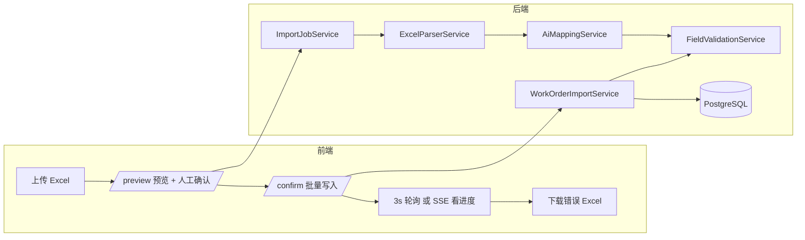
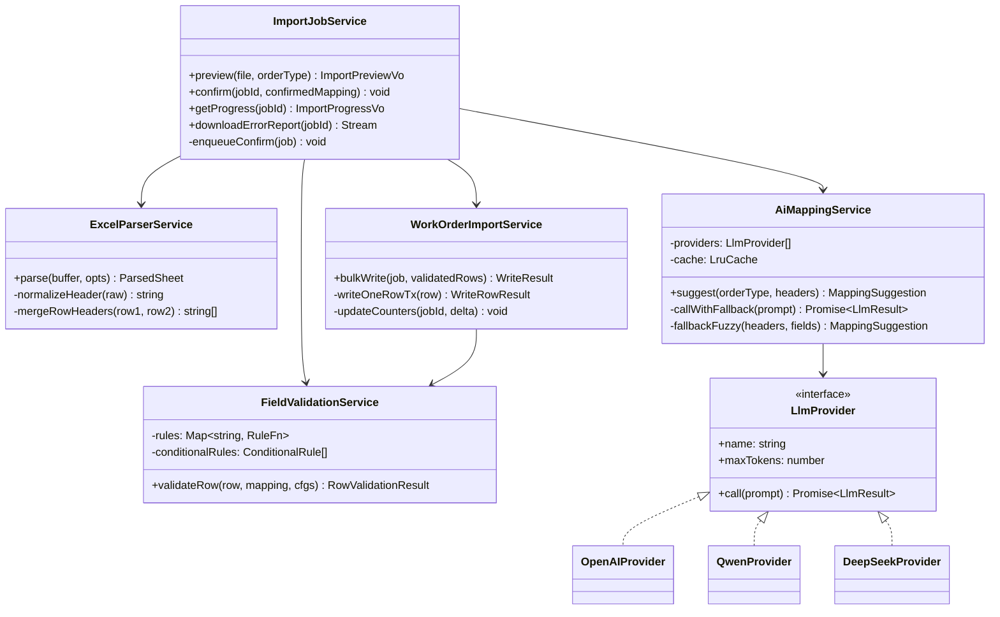
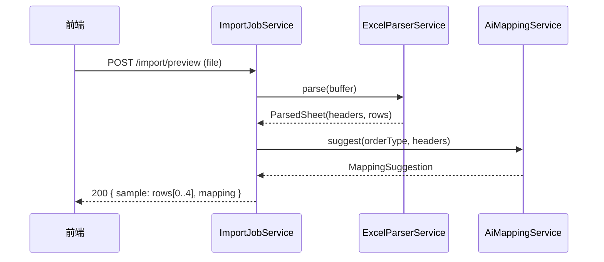
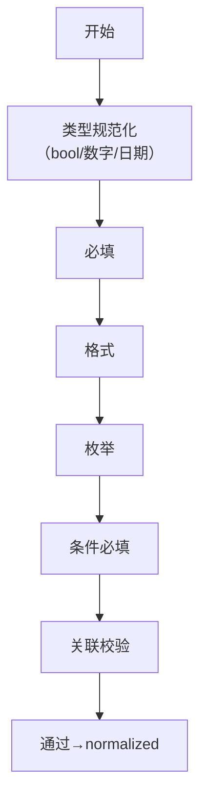
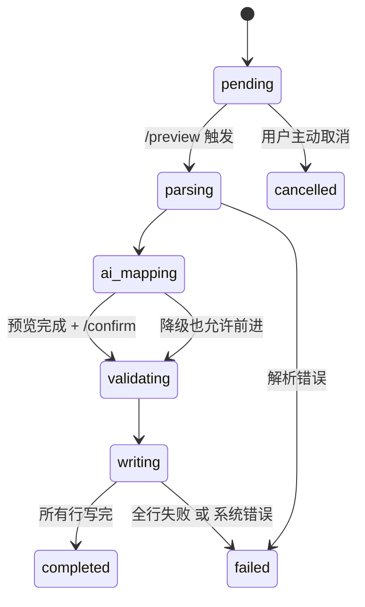

# Phase 4 AI 导入服务分层设计（运行时）

> 版本：v1.0（2026-05-11）
> 面向：后端实施者、架构师、QA、SRE
> 目的：补充 `docs/Phase4导入与回流设计.md`，把 AI 导入从"接口协议层"延伸到**运行时分层 + 鲁棒性 + 可观测**。
>
> 依赖文档：
> - `docs/Phase4导入与回流设计.md`（接口、Prompt 模板、降级策略）
> - `docs/Phase4AI映射样本库.md`（Golden samples）
> - `docs/Phase2到Phase6_migration清单.md` §2.2/§2.3（import_jobs 新增列）
> - `docs/API规范.md`（错误码 4400/4401/4402/4500/4501）

---

## 目录
- [1. 总览](#1-总览)
- [2. 五层服务职责与类图](#2-五层服务职责与类图)
- [3. AiMappingService：提供者注册 & 降级](#3-aimappingservice提供者注册--降级)
- [4. ExcelParserService：多行表头 / 合并单元格](#4-excelparserservice多行表头--合并单元格)
- [5. FieldValidationService：规则网](#5-fieldvalidationservice规则网)
- [6. WorkOrderImportService：ImportTxn & 批量提交](#6-workorderimportserviceimporttxn--批量提交)
- [7. 错误 Excel 生成（exceljs 流式）](#7-错误-excel-生成exceljs-流式)
- [8. 异步任务 & 进度轮询](#8-异步任务--进度轮询)
- [9. 观测、指标、告警](#9-观测指标告警)
- [10. 测试金字塔](#10-测试金字塔)

---

## 1. 总览



### 1.1 设计原则

1. **分层单一职责**：每层只处理一件事。上层编排，下层实现。
2. **预览不写库**：`/preview` 全过程只读 + 内存；`/confirm` 才真正写 work_orders。
3. **AI 只输出"建议"**：最终字段值由 `FieldValidationService` 决定；LLM 可用则 suggest，不可用则走相似度 fallback。
4. **一行失败不炸全批**：`WorkOrderImportService` 在**行级事务**中提交，单行失败记入 `ai_mapping_raw` / 错误报表。
5. **预览走同步、落库走异步**：`/preview` 10s 内完成；`/confirm` 放进 BullMQ 队列，前端轮询 `import_jobs`。
6. **PII 不出网**：给 LLM 的 prompt 只含表头字符串，禁止发送数据行。
7. **可观测**：所有耗时、失败、降级原因落 `import_jobs` + Prometheus 指标。

---

## 2. 五层服务职责与类图

### 2.1 职责矩阵

| 层 | 类名 | 输入 | 输出 | 是否写库 | 调用时机 |
|----|------|------|------|----------|----------|
| 编排 | `ImportJobService` | 上传文件/确认请求 | `ImportJob` | ✔ `import_jobs` | `/preview` `/confirm` `/jobs/:id` |
| 解析 | `ExcelParserService` | `Buffer` | `ParsedSheet`（headers + rows） | ✘ | preview / confirm 均调用 |
| 映射 | `AiMappingService` | `headers[]` + `candidateFields[]` | `MappingSuggestion` | 可选写 `import_jobs.ai_mapping_raw` | preview |
| 校验 | `FieldValidationService` | `row` + `mapping` + `fieldConfigs` | `RowValidationResult` | ✘ | preview（采样） + confirm（全量） |
| 写入 | `WorkOrderImportService` | 校验通过的 rows | `WriteResult` | ✔ `work_orders` / `dispatched_orders` | confirm |

### 2.2 类图



### 2.3 关键数据结构（TypeScript 签名）

```ts
interface ParsedSheet {
  headers: string[];              // 规范化后的一维表头
  rows: Array<Record<string, unknown>>;  // header -> cell
  meta: { sheetName: string; totalRows: number; headerRows: number };
}

interface MappingSuggestion {
  suggestion: Record<string, string>;      // header -> field_code
  confidence: Record<string, number>;
  unmatched: string[];
  missingRequired: string[];
  modelUsed: string;                        // 'openai:gpt-4o-mini' / 'fallback:fuzzy'
  promptHash: string;
  fallbackReason?: 'no_api_key' | 'timeout' | 'rate_limit' | 'schema_invalid';
  raw?: unknown;                            // LLM 原始返回（仅非 fallback 时留）
}

interface RowValidationResult {
  ok: boolean;
  rowNo: number;                            // Excel 原始行号（含表头偏移）
  errors: Array<{
    fieldCode: string;
    reason: 'required' | 'regex' | 'enum' | 'conditional' | 'relation';
    message: string;
  }>;
  normalized: Record<string, unknown>;      // 校验通过后的规范化值
}

interface WriteResult {
  success: number;
  fail: number;
  failRows: number[];     // 行号数组
}
```

---

## 3. AiMappingService：提供者注册 & 降级

### 3.1 Provider 接口

```ts
interface LlmProvider {
  readonly name: 'openai' | 'qwen' | 'deepseek';
  readonly modelId: string;           // 'gpt-4o-mini' / 'qwen-turbo' / 'deepseek-chat'
  readonly maxTokens: number;
  readonly timeoutMs: number;
  call(prompt: LlmPrompt): Promise<LlmResult>;
  isAvailable(): Promise<boolean>;   // 启动时探活；失败 → skip
}
```

### 3.2 注册 & 选举

```mermaid
flowchart TB
    Start([请求 suggest]) --> Cache{LRU 缓存<br/>hash(orderType + headers)}
    Cache -- hit --> Return([返回缓存])
    Cache -- miss --> Pick[按优先级拿第一个 available provider]
    Pick --> Call[调用 LLM，超时 10s]
    Call -- success --> Validate{JSON Schema 校验}
    Validate -- ok --> Write[写入 LRU + 返回]
    Validate -- fail --> Fallback[走 fuzzy 相似度]
    Call -- timeout / rate_limit / 5xx --> Fallback
    Pick -- 无可用 provider --> Fallback
    Fallback --> Return2([返回 fallback 建议])
```

配置（`.env` + `config.ts`）：

```
AI_PROVIDER_ORDER=openai,qwen,deepseek      # 逗号分隔，按顺序 try
OPENAI_API_KEY=...
QWEN_API_KEY=...
DEEPSEEK_API_KEY=...
AI_MAPPING_TIMEOUT_MS=10000
AI_MAPPING_CACHE_TTL_MS=86400000
AI_MAPPING_CACHE_MAX=1000
```

**选举纪律**：
- 启动时对每个配置的 provider 调用 `isAvailable()`（GET `/models` 或 401 早期失败即 skip）；
- 运行时失败计数 ≥ 3 次则 30 秒**冷却**不再调用，冷却期直接下一个 provider；
- 全部冷却 → 降级到 `fuzzy`。

### 3.3 Fallback 相似度

实现思路（不依赖 LLM）：

```
score(header, field) = 0.6 * jaccard(bigram(header), bigram(field.fieldName))
                     + 0.4 * jaroWinkler(header, field.fieldName)
```

- 超过 `0.6` 进 `suggestion`，否则 `unmatched`；
- 同 field_code 被多 header 映射 → 取最高分者，其余 unmatched；
- 停用词表：`["的","之","是","否"]`，剔除后再计算。

### 3.4 Prompt 与合约复用

- Prompt 模板沿用 `Phase4导入与回流设计.md §2.2`；
- 为避免 token 爆炸：`candidateFields` 只传 `{fieldCode, fieldName, fieldType, required}`，不传 regex；
- Few-shot 固定注入 2 条（见 `Phase4AI映射样本库.md §3.2`）；
- `response_format: { type: 'json_object' }`（OpenAI）或等价的 Qwen/DeepSeek 强 JSON 选项。

### 3.5 `import_jobs` 落库

成功调用 LLM：
```sql
UPDATE import_jobs SET
  ai_model_used = 'openai:gpt-4o-mini',
  ai_prompt_hash = '<sha256>',
  ai_mapping_raw = '<json>',
  ai_fallback_reason = NULL
WHERE id = :jobId;
```

降级：
```sql
UPDATE import_jobs SET
  ai_model_used = 'fallback:fuzzy',
  ai_prompt_hash = '<sha256>',
  ai_mapping_raw = NULL,
  ai_fallback_reason = 'timeout'
WHERE id = :jobId;
```

---

## 4. ExcelParserService：多行表头 / 合并单元格

### 4.1 解析库与模式

- 采用 `exceljs` **stream reader**，避免整表读内存；
- 读完表头区（≤ 2 行）后，数据区按 row event 增量处理。

### 4.2 规则

1. **首行非空**：第 1 行全空即 `4400` Excel 解析失败。
2. **合并单元格展开**：`ws.mergedCells` 拆出子坐标，把合并的值复制到每个子格。
3. **单行表头**：直接取 row1。
4. **双行表头**（合并单元格提示）：
   - 若 row1 存在合并单元格 → 视作分组行；拼接规则 `row1[i] + "/" + row2[i]`；
   - 若 row1 无合并但有空白 → 按"row1 优先，为空时取 row2"做补齐，不拼接；
   - row1 / row2 都为空 → `"__col_{index}__"`，并在 `headers` 里标红，进 unmatched。
5. **规范化**：
   - `trim()` + `replace(/\s+/g, ' ')` + 全角空格转半角；
   - 去除首尾括号里的纯单位标注（通过"仅含 `单位` / `元` / `%` / `数字` 等"的启发式）——该步骤**不做**，以免误伤 `基本工资(元)` 这类语义。Prompt/相似度层再处理。
6. **数据行**：
   - 数值单元自动转 `number`；
   - 日期单元按 Excel serial 转为 `YYYY-MM-DD`；
   - 布尔字符串（`"是"/"否"/"Yes"/"No"/"Y"/"N"/"TRUE"/"FALSE"`）延后到 `FieldValidationService` 再判，解析层不硬转。

### 4.3 边界用例

| 场景 | 解析结果 | 备注 |
|------|----------|------|
| 表头超 100 列 | 抛 `4400`，`details={reason:"too_many_headers", count:N}` | 与 Prompt token 限一致 |
| 数据行 > 5000 | `/confirm` 拒绝，引导拆分 | 线上压测阈值；可通过配置调 |
| 单元格公式 | 读 value（exceljs 自动求值） | 若返回 `null`，视作空 |
| `.xls`（非 .xlsx） | 拒绝并抛 `4400` | xlsx 专用 |
| 被加密 / 受保护 | 抛 `4400`，message="文件受保护" | exceljs 原始错误捕获 |

### 4.4 时序



---

## 5. FieldValidationService：规则网

### 5.1 规则五类

| 类型 | 来源 | 示例 |
|------|------|------|
| 必填 | `field_configs.required=true` | `customer_name` 不能为空 |
| 格式（regex） | `field_configs.validation_regex` | 身份证 `^[0-9Xx]{15,18}$` |
| 枚举 | `field_configs.dropdown_options` | `business_mode` ∈ {"北仑自营","外派"...} |
| 条件必填 | `field_configs.conditional_required` | `need_company_contract=是` → `contract_subject` 必填 |
| 关联校验 | `field_configs.relations` 或硬编码 | `contract_end_date > contract_start_date` |

### 5.2 执行顺序



- 每层失败立即 push 错误，但**不短路**后续规则（便于一次性告诉用户全部问题）；
- `normalized` 最终 payload 进 `WorkOrderImportService.bulkWrite`；
- 行级结果形如：

```json
{
  "ok": false,
  "rowNo": 3,
  "errors": [
    { "fieldCode": "id_card_no", "reason": "regex", "message": "身份证号格式错误" },
    { "fieldCode": "contract_subject", "reason": "conditional", "message": "选择需要企服合同时必填" }
  ],
  "normalized": {}
}
```

### 5.3 性能

- 单行校验目标 ≤ 5ms；
- 5000 行预期 ≤ 25s；超过则 `/confirm` 走队列并发（worker=CPU数，按 400 行/chunk）。

---

## 6. WorkOrderImportService：ImportTxn & 批量提交

### 6.1 行级事务

```ts
async writeOneRowTx(row: NormalizedRow): Promise<WriteRowResult> {
  const qr = this.dataSource.createQueryRunner();
  await qr.startTransaction('READ COMMITTED');
  try {
    const wo = await qr.manager.insert(WorkOrder, { ...row });
    await this.dispatchEngine.evaluate(wo, qr.manager);   // 派发在同一事务
    await qr.commitTransaction();
    return { ok: true, workOrderId: wo.id };
  } catch (err) {
    await qr.rollbackTransaction();
    return { ok: false, reason: err.message };
  } finally {
    await qr.release();
  }
}
```

**设计纪律**：
- **不用**全批事务：一行失败不应回滚其他；
- 每行独立事务保证主工单 + 子工单派发的原子性；
- 失败行记入 `import_job_errors`（见 §7）。

### 6.2 批量写入

- 并发：`p-limit(8)` 控制，避免打满连接池；
- 每完成 50 行 → 累加 `success_rows` / `fail_rows`；
- 完成后把 `status` 由 `writing` 转 `completed` / `failed`（全败才算 failed）。

### 6.3 计数器更新策略

使用乐观累加避免长事务：

```sql
UPDATE import_jobs
SET success_rows = success_rows + :delta_success,
    fail_rows    = fail_rows    + :delta_fail,
    updated_at   = now()
WHERE id = :jobId;
```

不使用单独 `SELECT … FOR UPDATE`；`UPDATE … WHERE id =` 走行锁即可。

### 6.4 状态机



**非法转移**由 `ImportJobService` 守卫，违反则抛 `4201`。

---

## 7. 错误 Excel 生成（exceljs 流式）

### 7.1 产物规格

- 文件名：`import_errors_{jobId}_{yyyyMMddHHmmss}.xlsx`；
- 保留原表头 + 追加两列：`错误列` `错误原因`；
- 错误所在单元格背景黄色、字体红；`错误原因` 列宽 60，自动换行；
- 单文件 sheet1 放失败行（不混成功行），便于修正后重新上传。

### 7.2 生成方式

```ts
import { stream } from 'exceljs';

async generateErrorReport(jobId: bigint, res: Response) {
  const wb = new stream.xlsx.WorkbookWriter({ stream: res });
  const ws = wb.addWorksheet('errors');

  const headers = await this.getHeaders(jobId);
  ws.columns = [...headers.map(h => ({ header: h, key: h })), 
                { header: '错误列', key: '__col__' },
                { header: '错误原因', key: '__reason__' }];

  for await (const err of this.repo.streamErrors(jobId)) {
    const row = ws.addRow({ ...err.raw, __col__: err.fieldCode, __reason__: err.message });
    row.getCell(err.fieldCode).fill = { type: 'pattern', pattern: 'solid', fgColor: { argb: 'FFFFFF00' } };
    row.getCell(err.fieldCode).font = { color: { argb: 'FFFF0000' } };
    row.commit();   // 流式刷盘
  }
  await wb.commit();
}
```

### 7.3 存储 & 清理

- `import_jobs` 下游 `import_job_errors(id, job_id, row_no, field_code, reason, message, raw jsonb)`；
- 生成的 .xlsx **不落盘**，直接 HTTP 响应流给前端；如客户选下载保留，放对象存储 + 预签名 URL，7 天过期。

---

## 8. 异步任务 & 进度轮询

### 8.1 队列

- 使用 BullMQ（Redis 依赖在 Phase 6 其它模块一并引入；若 Redis 未上线，Phase 4 用 `@nestjs/bull` 的内存 adapter 兜底，切换不改 API）。
- 任务名：`import.confirm`；payload `{jobId}`；
- 并发度：`concurrency=2`（受 DB 写入限）；
- 失败重试：`attempts=1`（业务性失败不重试，重试由用户走 retry endpoint）。

### 8.2 进度协议（前端 3s 轮询）

**GET `/api/import-jobs/:id/progress`**

```json
{
  "code": 0,
  "data": {
    "id": 901,
    "status": "writing",
    "totalRows": 1234,
    "successRows": 600,
    "failRows": 2,
    "progressPercent": 49,
    "aiModelUsed": "openai:gpt-4o-mini",
    "aiFallbackReason": null,
    "startedAt": "2026-05-28T10:00:00+08:00",
    "updatedAt": "2026-05-28T10:03:20+08:00",
    "estimatedEta": "2026-05-28T10:04:40+08:00"
  },
  "message": "ok",
  "traceId": "req_08_PROGRESS"
}
```

### 8.3 SSE 升级（可选，Phase 6 同步做）

- `GET /api/import-jobs/:id/stream` 在后端以 `text/event-stream` 每 2s 推一次进度；
- 前端按 `capability.sseEnabled` 选择 SSE / 轮询；
- 后端实现：Nest `@Sse()` + `interval(2000)` map to progress snapshot，`complete()` 于 status ∈ {completed, failed, cancelled}。

### 8.4 取消

- `POST /api/import-jobs/:id/cancel`：
  - 若 status ∈ {pending, parsing, ai_mapping} → 直接标 cancelled；
  - 若 status=writing → 设置 `cancel_requested=true`，worker 在每 chunk 结束时检查，提前收尾；已写入的不回滚（一致性由"行级事务"保障）。

---

## 9. 观测、指标、告警

### 9.1 Prometheus 指标

| 名称 | 类型 | 标签 | 说明 |
|------|------|------|------|
| `import_job_duration_seconds` | Histogram | `stage=parsing/ai/validating/writing` | 每阶段耗时 |
| `import_job_rows_total` | Counter | `status=success/fail` | 写入行数 |
| `ai_mapping_calls_total` | Counter | `provider, outcome=ok/timeout/rate_limit/schema_invalid` | LLM 调用分布 |
| `ai_mapping_fallback_total` | Counter | `reason` | 降级次数 |
| `ai_mapping_confidence_bucket` | Histogram | `provider` | 置信度分布 |

### 9.2 告警规则

- `rate(ai_mapping_fallback_total[5m]) > 0.3` → 5 分钟内 ≥ 30% 走 fallback，PagerDuty warning；
- `histogram_quantile(0.95, import_job_duration_seconds{stage="writing"}) > 60` → p95 > 60s，SRE 值班；
- `import_job_rows_total{status="fail"} / sum(import_job_rows_total) > 0.2` → 失败率高，通知业务主管。

### 9.3 结构化日志

每条 import_job 生命周期 4 条日志：`job.start` / `job.ai` / `job.write` / `job.done`，带 `trace_id` / `job_id` / `ai_model_used` / `success_rows` / `fail_rows`，用于 ELK 检索。

---

## 10. 测试金字塔

### 10.1 单测

- `ExcelParserService`：10 份 Excel fixture（单行 / 双行 / 合并 / 公式 / 加密 / 超大 / 空表）；
- `AiMappingService`：10 组 golden samples（见 `Phase4AI映射样本库.md`）+ fallback 离线；
- `FieldValidationService`：每种 reason 至少 1 条用例；
- `WorkOrderImportService`：行级事务失败 / 全批成功 / 局部失败的三类；
- `LlmProvider`：mock HTTP，验证超时 / 429 / 非 JSON 的降级路径。

### 10.2 集成

- `POST /preview` 上传测试 Excel → 断言 mapping；
- `POST /confirm` → 轮询 `/progress` 直到 completed，断言 `work_orders` / `dispatched_orders` 计数；
- 错误报表下载 → 校验 xlsx 内容（用 exceljs 读回）。

### 10.3 e2e

- Playwright：业务员上传 → 人工修正映射 → 确认 → 等待完成 → 下载错误报表；
- 灾难路径：
  - `OPENAI_API_KEY` 被抠掉 → 仍能 confirm，页面提示"AI 不可用，使用本地相似度"；
  - 网络中断模拟（chrome-devtools-protocol）→ 前端轮询退避，恢复后自动续看进度。

---

## 11. 与设计文档的映射

| 运行时主题 | 设计文档位置 |
|-----------|--------------|
| Prompt / Few-shot | `Phase4导入与回流设计.md §2.2 / §2.3`；`Phase4AI映射样本库.md §2-§3` |
| 错误码 | `API规范.md §2`（4400 / 4401 / 4402 / 4500 / 4501） |
| DB 迁移 | `Phase2到Phase6_migration清单.md §2.2 / §2.3` |
| v1.2 架构变更 | `架构变更日志.md` |

---

## 变更日志

- v1.0 (2026-05-11)：首版，五层服务、提供者注册 / 降级、异步进度、观测告警、测试金字塔齐备。
