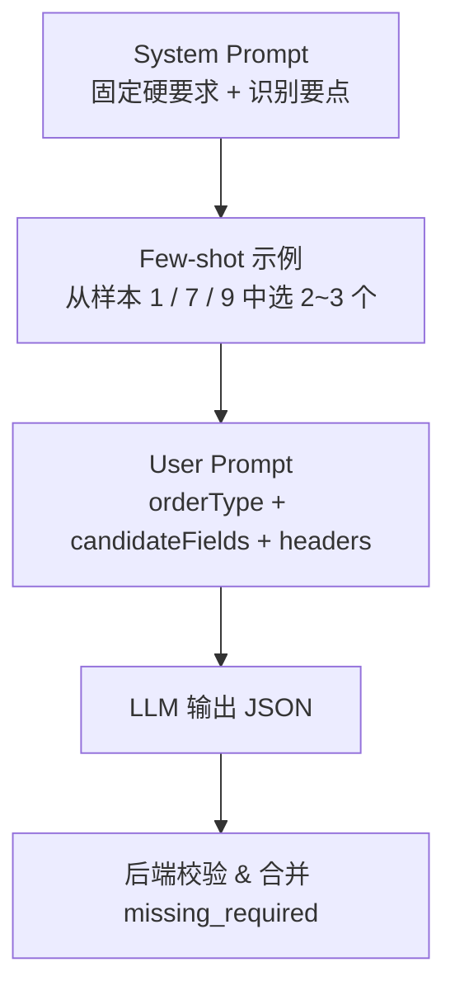

# Phase 4 AI 字段映射 Few-Shot 样本库（Golden Samples）

> 版本：v1.0（2026-05-11）
> 面向：后端（Phase 4 实施时做 prompt engineering + 离线评估）、QA（回归基线）
> 依赖文档：
> - `docs/Phase4导入与回流设计.md` §2（Prompt 模板、输入/输出协议、降级策略）
> - `docs/API规范.md` §2（错误码 4400/4401/4402/4500/4501）
> - 54 个字段定义见 `backend/src/database/seeds/seed-fields.ts`
>
> 目的：
> - 提供 10 组**表头 → 映射**的 golden samples，作为 `LLM 输出` 的期望值；
> - 每个样本同时给出 **输入表头、期望 JSON、Prompt 嵌入位置、评估维度**，backend 可直接拿来：
>   - 写 Jest 快照 / e2e（对真实 LLM 允许 ≤1 个字段偏差，对降级相似度算法允许 ≤2 个偏差）；
>   - 做 prompt 变体 A/B 的回归集；
>   - 生成错误报表的测试 fixture。

---

## 目录
- [0. 输入 / 输出协议（回顾）](#0-输入--输出协议回顾)
- [1. 候选字段集（10 样本共用）](#1-候选字段集10-样本共用)
- [2. 10 组 Golden Samples](#2-10-组-golden-samples)
- [3. Prompt 模板嵌入位置](#3-prompt-模板嵌入位置)
- [4. 评估指标与通过阈值](#4-评估指标与通过阈值)
- [5. 离线跑测脚本建议](#5-离线跑测脚本建议)

---

## 0. 输入 / 输出协议（回顾）

### 0.1 输入（`/api/work-orders/import/preview` 后端再调 LLM）
- `orderType`：`onboarding` / `renewal` / `resignation`（本期仅 `onboarding`）。
- `headers`：Excel 第一行表头字符串数组，去除前后空格；若带换行，统一替换为单个空格。
- `candidateFields`：系统字段候选清单，按 `order_type + is_active=true` 过滤；形如：
  ```json
  [
    {"fieldCode":"employee_name","fieldName":"姓名","fieldType":"text","required":true},
    {"fieldCode":"id_card_no","fieldName":"身份证号","fieldType":"text","required":true}
  ]
  ```

### 0.2 LLM 输出契约（严格 JSON）
```json
{
  "suggestion": { "<原表头>": "<field_code>" },
  "confidence": { "<原表头>": 0.0 },
  "unmatched":  [ "<原表头>" ],
  "missing_required": [ "<field_code>" ]
}
```
- `suggestion` 和 `confidence` 的 key 必须严格一致；
- 所有 `field_code` 必须来自 `candidateFields`，虚构视为模型违反约束；
- `missing_required` 由后端**再校验**：LLM 可给建议，但最终以后端比对 `candidateFields.required=true ∖ suggestion.values` 为准；
- `confidence < 0.5` 的条目**后端**自动降级到 `unmatched`（前端会提示"需人工确认"）。

### 0.3 安全与成本约束
- 仅发送表头到 LLM，**禁止**发送任意数据行（PII）；
- 表头条数 ≤ 100，超出直接 4400；
- 单次 prompt token 数上限 2k（含 few-shot），超出直接走降级相似度；
- 同 `hash(orderType + sortedHeaders)` 命中 24h 内存缓存直接复用。

---

## 1. 候选字段集（10 样本共用）

> 本样本库在评估时使用**入职工单 54 个字段**的完整清单（见 `seed-fields.ts`）。为便于阅读，样本描述中的 `candidateFields` 用 `$ONBOARDING_FIELDS_54` 占位指代；实际 Prompt 需注入全部 54 条 `{fieldCode, fieldName, fieldType, required}` 对象（按 `display_order` 升序）。

关键 field_code 速查（样本文案中出现的）：

| field_code | fieldName | required |
|------------|-----------|----------|
| customer_name | 客户名称 | ✔ |
| customer_code | 客户代码 | ✔ |
| outsource_type | 外包类型 | ✔ |
| position | 岗位 | ✔ |
| employee_name | 姓名 | ✔ |
| id_card_no | 身份证号 | ✔ |
| gender | 性别 | ✔ |
| birth_date | 出生日期 | ✔ |
| mobile | 移动电话 | ✘ |
| email | 电子邮件 | ✔ |
| current_address | 现住地址 | ✔ |
| household_address | 户籍地址 | ✔ |
| contract_term_type | 合同期限形式 | ✔ |
| contract_start_date | 合同开始日期 | ✔ |
| contract_end_date | 合同终止日期 | ✔ |
| probation_months | 试用期(月) | ✔ |
| work_city | 工作城市 | ✔ |
| base_salary | 基本工资 | ✔ |
| probation_salary | 试用期工资 | ✔ |
| payroll_cycle | 发薪周期 | ✔ |
| payroll_date | 发薪日期 | ✔ |
| social_location | 参保地 | ✔ |
| social_base | 社保基数 | ✔ |
| fund_base | 公积金基数 | ✔ |
| fund_ratio | 公积金比例 | ✔ |
| bank_name | 开户银行信息 | ✘ |
| bank_account | 银行借记卡账号 | ✘ |
| business_mode | 业务模式 | ✔ |
| employee_type | 人员类型 | ✔ |
| need_company_contract | 是否企服发起劳动合同 | ✔ |
| need_onboarding_contact | 入职材料是否需要集约收集 | ✔ |
| need_company_payroll | 是否企服发薪 | ✔ |
| special_remark | 特殊备注 | ✘ |

---

## 2. 10 组 Golden Samples

### 样本 1：标准模板完全一致（baseline）

**输入表头**：
```json
["客户名称","客户代码","外包类型","岗位","姓名","身份证号(护照)","性别","出生日期","移动电话","电子邮件","现住地址","户籍地址","合同期限形式","合同开始日期","合同终止日期","试用期(月)","工作城市","基本工资","试用期工资","发薪周期","发薪日期","参保地","社保基数","公积金基数","公积金比例","业务模式","人员类型","是否企服发起劳动合同","入职材料是否需要集约收集","是否企服发薪"]
```

**期望 LLM 输出**：
```json
{
  "suggestion": {
    "客户名称": "customer_name",
    "客户代码": "customer_code",
    "外包类型": "outsource_type",
    "岗位": "position",
    "姓名": "employee_name",
    "身份证号(护照)": "id_card_no",
    "性别": "gender",
    "出生日期": "birth_date",
    "移动电话": "mobile",
    "电子邮件": "email",
    "现住地址": "current_address",
    "户籍地址": "household_address",
    "合同期限形式": "contract_term_type",
    "合同开始日期": "contract_start_date",
    "合同终止日期": "contract_end_date",
    "试用期(月)": "probation_months",
    "工作城市": "work_city",
    "基本工资": "base_salary",
    "试用期工资": "probation_salary",
    "发薪周期": "payroll_cycle",
    "发薪日期": "payroll_date",
    "参保地": "social_location",
    "社保基数": "social_base",
    "公积金基数": "fund_base",
    "公积金比例": "fund_ratio",
    "业务模式": "business_mode",
    "人员类型": "employee_type",
    "是否企服发起劳动合同": "need_company_contract",
    "入职材料是否需要集约收集": "need_onboarding_contact",
    "是否企服发薪": "need_company_payroll"
  },
  "confidence": {
    "客户名称": 0.99, "客户代码": 0.99, "外包类型": 0.98, "岗位": 0.98,
    "姓名": 0.99, "身份证号(护照)": 0.99, "性别": 0.99, "出生日期": 0.98,
    "移动电话": 0.99, "电子邮件": 0.99, "现住地址": 0.98, "户籍地址": 0.98,
    "合同期限形式": 0.97, "合同开始日期": 0.98, "合同终止日期": 0.98,
    "试用期(月)": 0.95, "工作城市": 0.97, "基本工资": 0.98, "试用期工资": 0.97,
    "发薪周期": 0.98, "发薪日期": 0.97, "参保地": 0.97, "社保基数": 0.98,
    "公积金基数": 0.98, "公积金比例": 0.97, "业务模式": 0.95, "人员类型": 0.95,
    "是否企服发起劳动合同": 0.95, "入职材料是否需要集约收集": 0.94,
    "是否企服发薪": 0.95
  },
  "unmatched": [],
  "missing_required": [
    "contract_term","probation_start_date","probation_end_date","work_hour_system",
    "start_month"
  ]
}
```

**重点**：
- `missing_required` 并非 LLM 自己填全，而是**后端合并后的期望值**——候选 required 集减去 `suggestion.values` 得到；
- 期望 prompt 中已列出 `"missing_required": []` 作为空占位，由后端兜底补齐。

---

### 样本 2：表头用别名（手机号 / 联系电话 → mobile）

**输入表头**：
```json
["客户名称","客户代码","员工姓名","身份证号","手机号","联系电话","邮箱","现住地","岗位","基本工资"]
```

**期望 LLM 输出**：
```json
{
  "suggestion": {
    "客户名称": "customer_name",
    "客户代码": "customer_code",
    "员工姓名": "employee_name",
    "身份证号": "id_card_no",
    "手机号": "mobile",
    "邮箱": "email",
    "现住地": "current_address",
    "岗位": "position",
    "基本工资": "base_salary"
  },
  "confidence": {
    "客户名称": 0.99, "客户代码": 0.99, "员工姓名": 0.95, "身份证号": 0.99,
    "手机号": 0.93, "邮箱": 0.95, "现住地": 0.90, "岗位": 0.98, "基本工资": 0.98
  },
  "unmatched": ["联系电话"],
  "missing_required": [
    "outsource_type","gender","birth_date","household_address","contract_term_type",
    "contract_term","contract_start_date","contract_end_date",
    "probation_start_date","probation_months","probation_end_date",
    "work_city","work_hour_system","probation_salary","payroll_cycle","payroll_date",
    "social_location","start_month","social_base","fund_base","fund_ratio",
    "business_mode","employee_type","need_company_contract",
    "need_onboarding_contact","need_company_payroll"
  ]
}
```

**要点**：同一字段被两列命中（`手机号` 与 `联系电话` 都指 `mobile`），按 prompt 约束取相似度最高者，其它放 `unmatched`。相似度规则：纯中文短词优先、字面命中 `mobile` 字段名 `移动电话` 的更接近 `手机号`。

---

### 样本 3：中英混合（ID Card / 身份证号 → id_card_no）

**输入表头**：
```json
["Customer Name","Employee","ID Card","身份证号","Gender","DOB","Mobile","Email","Work City","Base Salary"]
```

**期望 LLM 输出**：
```json
{
  "suggestion": {
    "Customer Name": "customer_name",
    "Employee": "employee_name",
    "身份证号": "id_card_no",
    "Gender": "gender",
    "DOB": "birth_date",
    "Mobile": "mobile",
    "Email": "email",
    "Work City": "work_city",
    "Base Salary": "base_salary"
  },
  "confidence": {
    "Customer Name": 0.95, "Employee": 0.88, "身份证号": 0.99,
    "Gender": 0.97, "DOB": 0.85, "Mobile": 0.97, "Email": 0.98,
    "Work City": 0.96, "Base Salary": 0.96
  },
  "unmatched": ["ID Card"],
  "missing_required": [
    "customer_code","outsource_type","position","current_address","household_address",
    "contract_term_type","contract_term","contract_start_date","contract_end_date",
    "probation_start_date","probation_months","probation_end_date",
    "work_hour_system","probation_salary","payroll_cycle","payroll_date",
    "social_location","start_month","social_base","fund_base","fund_ratio",
    "business_mode","employee_type","need_company_contract",
    "need_onboarding_contact","need_company_payroll"
  ]
}
```

**要点**：英文 `ID Card` 与中文 `身份证号` 同语义竞争；中文列通常在国内 Excel 中更权威，模型应选中文，`ID Card` 进 `unmatched`。

---

### 样本 4：多余无关列（需返回 unmapped）

**输入表头**：
```json
["客户名称","员工姓名","身份证号","手机号","邮箱","岗位","基本工资",
 "内部编号","打卡指纹ID","备用联系人","公司车牌号"]
```

**期望 LLM 输出**：
```json
{
  "suggestion": {
    "客户名称": "customer_name",
    "员工姓名": "employee_name",
    "身份证号": "id_card_no",
    "手机号": "mobile",
    "邮箱": "email",
    "岗位": "position",
    "基本工资": "base_salary"
  },
  "confidence": {
    "客户名称": 0.99, "员工姓名": 0.95, "身份证号": 0.99,
    "手机号": 0.93, "邮箱": 0.95, "岗位": 0.98, "基本工资": 0.98
  },
  "unmatched": ["内部编号","打卡指纹ID","备用联系人","公司车牌号"],
  "missing_required": [
    "customer_code","outsource_type","gender","birth_date","current_address","household_address",
    "contract_term_type","contract_term","contract_start_date","contract_end_date",
    "probation_start_date","probation_months","probation_end_date",
    "work_city","work_hour_system","probation_salary","payroll_cycle","payroll_date",
    "social_location","start_month","social_base","fund_base","fund_ratio",
    "business_mode","employee_type","need_company_contract",
    "need_onboarding_contact","need_company_payroll"
  ]
}
```

**要点**：
- 4 个无关列必须进 `unmatched`，禁止强行映射到语义不相关的字段（如"公司车牌号" 映到 `special_remark`）；
- `confidence < 0.5` 的后端会强制降级到 `unmatched`，LLM 最好保守不给建议。

---

### 样本 5：缺少必填字段（需返回 missing_required）

**输入表头**（只给常用业务信息，漏了合同 / 社保必填）：
```json
["客户名称","员工姓名","身份证号","手机号","邮箱","岗位","基本工资","试用期工资"]
```

**期望 LLM 输出**：
```json
{
  "suggestion": {
    "客户名称": "customer_name",
    "员工姓名": "employee_name",
    "身份证号": "id_card_no",
    "手机号": "mobile",
    "邮箱": "email",
    "岗位": "position",
    "基本工资": "base_salary",
    "试用期工资": "probation_salary"
  },
  "confidence": {
    "客户名称": 0.99, "员工姓名": 0.95, "身份证号": 0.99,
    "手机号": 0.93, "邮箱": 0.95, "岗位": 0.98,
    "基本工资": 0.98, "试用期工资": 0.97
  },
  "unmatched": [],
  "missing_required": [
    "customer_code","outsource_type","gender","birth_date","current_address","household_address",
    "contract_term_type","contract_term","contract_start_date","contract_end_date",
    "probation_start_date","probation_months","probation_end_date",
    "work_city","work_hour_system","payroll_cycle","payroll_date",
    "social_location","start_month","social_base","fund_base","fund_ratio",
    "business_mode","employee_type","need_company_contract",
    "need_onboarding_contact","need_company_payroll"
  ]
}
```

**要点**：
- 前端会以 `missing_required` 高亮提示"必填字段未映射，请在 confirm 时补齐或上传带该列的 Excel"；
- backend 的 `import/confirm` 若仍缺 required 字段 → 返回 `4401` 列映射不完整。

---

### 样本 6：合并单元格表头（两行表头）

Excel 源：
- 第 1 行：`基本信息 | 基本信息 | 基本信息 | 合同信息 | 合同信息 | 社保 | 社保`
- 第 2 行：`姓名 | 身份证号 | 性别 | 开始日期 | 结束日期 | 社保基数 | 公积金基数`

后端预处理规则：展开合并单元格，两行用 `/` 拼接。传给 LLM 的 `headers`：

```json
["基本信息/姓名","基本信息/身份证号","基本信息/性别","合同信息/开始日期","合同信息/结束日期","社保/社保基数","社保/公积金基数"]
```

**期望 LLM 输出**：
```json
{
  "suggestion": {
    "基本信息/姓名": "employee_name",
    "基本信息/身份证号": "id_card_no",
    "基本信息/性别": "gender",
    "合同信息/开始日期": "contract_start_date",
    "合同信息/结束日期": "contract_end_date",
    "社保/社保基数": "social_base",
    "社保/公积金基数": "fund_base"
  },
  "confidence": {
    "基本信息/姓名": 0.98, "基本信息/身份证号": 0.98, "基本信息/性别": 0.97,
    "合同信息/开始日期": 0.96, "合同信息/结束日期": 0.96,
    "社保/社保基数": 0.97, "社保/公积金基数": 0.97
  },
  "unmatched": [],
  "missing_required": [
    "customer_name","customer_code","outsource_type","position","birth_date","email",
    "current_address","household_address","contract_term_type","contract_term",
    "probation_start_date","probation_months","probation_end_date","work_city",
    "work_hour_system","base_salary","probation_salary","payroll_cycle","payroll_date",
    "social_location","start_month","fund_ratio","business_mode","employee_type",
    "need_company_contract","need_onboarding_contact","need_company_payroll"
  ]
}
```

**要点**：
- 分组前缀（"合同信息/"、"社保/"）是重要**语义锚点**，能消除 `开始日期` 的歧义：合同分组 → `contract_start_date`；若出现 `试用期/开始日期` 则映 `probation_start_date`；
- 预处理职责在后端，不要让 LLM 自己处理 Excel 结构。

---

### 样本 7：带单位的列（基本薪资(元) / 社保基数(元/月)）

**输入表头**：
```json
["客户名称","员工姓名","基本薪资(元)","其他工资(元)","试用期工资(元)","社保基数(元/月)","公积金基数(元/月)","公积金比例(单位%+个人%)"]
```

**期望 LLM 输出**：
```json
{
  "suggestion": {
    "客户名称": "customer_name",
    "员工姓名": "employee_name",
    "基本薪资(元)": "base_salary",
    "其他工资(元)": "other_salary",
    "试用期工资(元)": "probation_salary",
    "社保基数(元/月)": "social_base",
    "公积金基数(元/月)": "fund_base",
    "公积金比例(单位%+个人%)": "fund_ratio"
  },
  "confidence": {
    "客户名称": 0.99, "员工姓名": 0.95,
    "基本薪资(元)": 0.94, "其他工资(元)": 0.93, "试用期工资(元)": 0.95,
    "社保基数(元/月)": 0.95, "公积金基数(元/月)": 0.95,
    "公积金比例(单位%+个人%)": 0.94
  },
  "unmatched": [],
  "missing_required": [
    "customer_code","outsource_type","position","id_card_no","gender","birth_date",
    "mobile","email","current_address","household_address",
    "contract_term_type","contract_term","contract_start_date","contract_end_date",
    "probation_start_date","probation_months","probation_end_date",
    "work_city","work_hour_system","payroll_cycle","payroll_date",
    "social_location","start_month","business_mode","employee_type",
    "need_company_contract","need_onboarding_contact","need_company_payroll"
  ]
}
```

**要点**：括号中的单位 / 说明必须被忽略，`基本薪资(元)` ≈ `基本工资`。本样本宜作为 few-shot 嵌入，提高鲁棒性。

---

### 样本 8：带换行 / 空白字符（业务员手录常见脏数据）

Excel 原表头含 `\n`、全角空格、首尾空格；后端预处理：`trim()` + `replace(/\s+/g, ' ')` + 全角转半角。

**预处理后表头**：
```json
["姓名","身份证号","手机 号","合同开始 日期","合同终止 日期","是否 入职联系","是否 企服发起劳动合同","社保 基数","公积金 基数"]
```

**期望 LLM 输出**：
```json
{
  "suggestion": {
    "姓名": "employee_name",
    "身份证号": "id_card_no",
    "手机 号": "mobile",
    "合同开始 日期": "contract_start_date",
    "合同终止 日期": "contract_end_date",
    "是否 入职联系": "need_onboarding_contact",
    "是否 企服发起劳动合同": "need_company_contract",
    "社保 基数": "social_base",
    "公积金 基数": "fund_base"
  },
  "confidence": {
    "姓名": 0.99, "身份证号": 0.99, "手机 号": 0.92,
    "合同开始 日期": 0.95, "合同终止 日期": 0.95,
    "是否 入职联系": 0.92, "是否 企服发起劳动合同": 0.92,
    "社保 基数": 0.95, "公积金 基数": 0.95
  },
  "unmatched": [],
  "missing_required": [
    "customer_name","customer_code","outsource_type","position","gender","birth_date",
    "email","current_address","household_address","contract_term_type","contract_term",
    "probation_start_date","probation_months","probation_end_date",
    "work_city","work_hour_system","base_salary","probation_salary","payroll_cycle","payroll_date",
    "social_location","start_month","fund_ratio","business_mode","employee_type",
    "need_company_payroll"
  ]
}
```

**要点**：空白字符在前后端都必须**统一清洗**，LLM 不应因为空格数量导致映射失败。

---

### 样本 9：别名剧烈变体（业务部使用内部黑话）

**输入表头**：
```json
["客户全称","员工大名","身份证","掌机号","电邮","省市区详细","单位地",
 "工作所在地","合同起始","合同到期","试用期月数","工资档","薪口","参保城市","缴费基数","公积金基"]
```

**期望 LLM 输出**：
```json
{
  "suggestion": {
    "客户全称": "customer_name",
    "员工大名": "employee_name",
    "身份证": "id_card_no",
    "掌机号": "mobile",
    "电邮": "email",
    "省市区详细": "current_address",
    "单位地": "work_city",
    "工作所在地": "work_city",
    "合同起始": "contract_start_date",
    "合同到期": "contract_end_date",
    "试用期月数": "probation_months",
    "工资档": "base_salary",
    "参保城市": "social_location",
    "缴费基数": "social_base",
    "公积金基": "fund_base"
  },
  "confidence": {
    "客户全称": 0.90, "员工大名": 0.85, "身份证": 0.98, "掌机号": 0.70,
    "电邮": 0.90, "省市区详细": 0.82, "单位地": 0.60, "工作所在地": 0.85,
    "合同起始": 0.95, "合同到期": 0.95, "试用期月数": 0.93,
    "工资档": 0.68, "参保城市": 0.92, "缴费基数": 0.90, "公积金基": 0.90
  },
  "unmatched": ["薪口"],
  "missing_required": [
    "customer_code","outsource_type","position","gender","birth_date","household_address",
    "contract_term_type","contract_term","probation_start_date","probation_end_date",
    "work_hour_system","probation_salary","payroll_cycle","payroll_date",
    "start_month","fund_ratio","business_mode","employee_type",
    "need_company_contract","need_onboarding_contact","need_company_payroll"
  ]
}
```

**要点**：
- `单位地` / `工作所在地` 同时出现时，**重复映射**到 `work_city` 触发后端去重：选 confidence 更高者，低分者进 `unmatched`；
- `薪口` 语义不明 → unmatched；
- 低置信字段（`单位地` 0.60、`掌机号` 0.70）由前端高亮为黄色，提示人工复核。

---

### 样本 10：混合型（中英 + 单位 + 无关列 + 缺必填）—— 集成挑战样本

**输入表头**：
```json
["Customer Name","Employee Name","ID Card No.","Mobile","E-mail","Hire Date","Contract End",
 "月薪(元)","Social Base (元)","是否需要合同","社保户","考勤组","内部编号","紧急联系人"]
```

**期望 LLM 输出**：
```json
{
  "suggestion": {
    "Customer Name": "customer_name",
    "Employee Name": "employee_name",
    "ID Card No.": "id_card_no",
    "Mobile": "mobile",
    "E-mail": "email",
    "Hire Date": "contract_start_date",
    "Contract End": "contract_end_date",
    "月薪(元)": "base_salary",
    "Social Base (元)": "social_base",
    "是否需要合同": "need_company_contract",
    "社保户": "social_location"
  },
  "confidence": {
    "Customer Name": 0.95, "Employee Name": 0.93, "ID Card No.": 0.97,
    "Mobile": 0.97, "E-mail": 0.97,
    "Hire Date": 0.80, "Contract End": 0.90,
    "月薪(元)": 0.90, "Social Base (元)": 0.92,
    "是否需要合同": 0.85, "社保户": 0.75
  },
  "unmatched": ["考勤组","内部编号","紧急联系人"],
  "missing_required": [
    "customer_code","outsource_type","position","gender","birth_date",
    "current_address","household_address","contract_term_type","contract_term",
    "probation_start_date","probation_months","probation_end_date",
    "work_city","work_hour_system","probation_salary","payroll_cycle","payroll_date",
    "start_month","fund_base","fund_ratio","business_mode","employee_type",
    "need_onboarding_contact","need_company_payroll"
  ]
}
```

**要点**：
- `Hire Date` → `contract_start_date` 是**弱推断**（现实中可能是 `probation_start_date`），`confidence` 应压低到 0.8 以下，给前端"建议 + 需确认"双重提示；
- 该样本涵盖 4 种变体合集，适合作为 prompt A/B 测试的**压测基准**。

---

## 3. Prompt 模板嵌入位置



### 3.1 System Prompt（沿用 `docs/Phase4导入与回流设计.md` §2.2）

```
你是一个字段映射助手，任务是把用户 Excel 表头对齐到系统字段。

硬要求：
1. 仅允许映射到 <候选字段> 列表中给出的 field_code；不得虚构。
2. 输出严格 JSON，不含解释、markdown、注释。
3. 对于无法判断的列，放入 unmatched；不要猜。
4. confidence 是 0~1 浮点，反映匹配把握程度。
5. 同一 field_code 只能被一个原表头映射；候选其它列放 unmatched。

识别要点：
- 中英文混写：以语义为准，如 "Id Card" → 身份证号。
- 括号里的单位必须忽略：如 "基本薪资(元)" 对齐 "基本工资"。
- 分组前缀（"基本信息/"、"合同信息/"）用作语义锚点消歧。
- 全空格 / 换行 / 全角空格应视作同一词。
- "是/否"类列优先匹配 boolean 或 dropdown 字段。
```

### 3.2 Few-shot 选取策略

- 固定两条 few-shot：
  - **样本 1 简化版**（只保留 6~8 列），教模型"简单直译"；
  - **样本 7 简化版**（保留带单位、中英混合的列），教模型"忽略单位、识别同义"。
- 可选第三条：**样本 6 简化版**（分组表头），当检测到 `headers` 里含 `/` 时再注入，节省 token。

### 3.3 User Prompt 插槽

```text
<订单类型>: {{orderType}}

<候选字段>（JSON）:
{{JSON.stringify(candidateFields)}}

<Excel 表头>（JSON 数组）:
{{JSON.stringify(headers)}}

请输出如下结构的 JSON:
{
  "suggestion": { "<原表头>": "<field_code>" },
  "confidence": { "<原表头>": 0.0 },
  "unmatched":  [ "<原表头>" ],
  "missing_required": [ ]
}
```

> `missing_required` 允许 LLM 返回空数组，后端会再次计算"候选 required 集合 ∖ suggestion.values"覆写最终值。

---

## 4. 评估指标与通过阈值

### 4.1 指标定义

| 指标 | 公式 | 说明 |
|------|------|------|
| 字段准确率 (FA) | ∑正确映射 / ∑`candidateFields ∩ headers` | 严格匹配 field_code |
| 无关列召回 (UR) | ∑正确 unmatched / ∑真实无关列 | `unmatched` 精度 |
| 必填覆盖 (MC) | 1 − (剩余 missing_required / 总 required) | 后端合并后的覆盖率 |
| 置信度校准 (CC) | Pearson(confidence, 0/1 正确) | 反映置信度可信度 |

### 4.2 阈值（样本库整体）

| 样本 | FA ≥ | UR ≥ | CC ≥ |
|------|------|------|------|
| 1、7 | 0.95 | — | 0.8 |
| 2、3、8、9 | 0.85 | 0.90 | 0.6 |
| 4 | 0.90 | 1.00 | 0.7 |
| 5 | 0.95 | — | 0.8 |
| 6 | 0.90 | — | 0.7 |
| 10 | 0.75 | 0.85 | 0.5 |

> 阈值首次集成时用于 smoke test；上线后每月跑一次对比报告。

---

## 5. 离线跑测脚本建议

### 5.1 目录结构

```
backend/
  src/modules/ai-field-mapping/
    __golden__/
      sample-01.standard.json
      sample-02.alias.json
      ...
      sample-10.mixed.json
    evaluate.ts           // 跑 10 个 golden，比对实际 LLM 输出 vs expected
    prompt.ts             // 拼 prompt
    service.ts            // LLM 调用 + 降级相似度
```

### 5.2 每个 JSON golden 文件格式

```json
{
  "id": "sample-01",
  "title": "标准模板完全一致",
  "orderType": "onboarding",
  "headers": ["..."],
  "expected": {
    "suggestion": { },
    "confidence": { },
    "unmatched": [],
    "missing_required": []
  },
  "thresholds": { "fieldAccuracy": 0.95, "unmatchedRecall": null, "confCalibration": 0.8 }
}
```

### 5.3 运行方式

```bash
# 对接真实 LLM
pnpm --filter backend run eval:field-mapping

# 对接降级相似度
pnpm --filter backend run eval:field-mapping -- --fallback

# 只跑单个样本
pnpm --filter backend run eval:field-mapping -- --id sample-04
```

### 5.4 报告输出（控制台 + `reports/field-mapping-YYYYMMDD.md`）

- 每个样本的 FA / UR / MC / CC；
- 总体加权平均；
- 未通过阈值的样本列红警示；
- 记录本次 prompt 版本 hash（便于追溯）。

---

## 变更日志
- v1.0（2026-05-11）：首版，覆盖 10 组 golden samples（标准、别名、中英混合、多余列、缺必填、合并表头、带单位、空白清洗、剧烈变体、混合型）、prompt 嵌入位置、评估阈值与离线脚本骨架。

