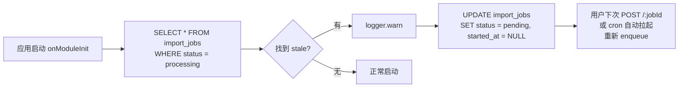

# Phase 4 ImportJob 队列双版设计

> 版本：v1.0（2026-05-11）
> 面向：Phase 4 后端（第二轮返工）
> 作者：architect
>
> **核心决定**：**Phase 4 交方案 A（内存队列 MVP），Phase 6 升级方案 B（BullMQ 生产版）**。方案 A 的代码必须写成"接口和 B 保持一致"的样子，换实现时前后端都不用改 DTO。
>
> 关联：`docs/Phase4AI导入服务分层设计.md` §8、`docs/Phase4导入与回流设计.md` §1.6-§1.8、`docs/Phase4后端返工指导.md` §4.3。

---

## 目录
- [1. 为什么不一步到位上 BullMQ](#1-为什么不一步到位上-bullmq)
- [2. 共用抽象：`ImportQueue` 接口](#2-共用抽象importqueue-接口)
- [3. 方案 A：内存队列（Phase 4 MVP）](#3-方案-a内存队列phase-4-mvp)
- [4. 方案 A：ImportJobProcessor（业务 Worker）](#4-方案-aimportjobprocessor业务-worker)
- [5. 方案 A：启动自恢复](#5-方案-a启动自恢复)
- [6. 方案 B：BullMQ 生产版（Phase 6 上线）](#6-方案-bbullmq-生产版phase-6-上线)
- [7. SSE 推送（方案 B 才启用）](#7-sse-推送方案-b-才启用)
- [8. 两方案切换矩阵](#8-两方案切换矩阵)
- [9. 观测与告警](#9-观测与告警)
- [10. 测试骨架](#10-测试骨架)

---

## 1. 为什么不一步到位上 BullMQ

| 维度 | 方案 A（内存） | 方案 B（BullMQ） |
|------|----------------|------------------|
| 部署依赖 | **零** | Redis 必须 |
| 故障恢复 | DB 重扫 `status=processing` | BullMQ stall 重派 |
| 多进程并发 | ❌ 单进程 | ✅ 多 worker |
| 重试 / 退避 | 手工实现 | `attempts + backoff` 开箱即用 |
| 进度推送 | 前端 2s 轮询 | SSE + pub/sub |
| Phase 4 需求覆盖 | ✅ 单进程 5000 行 5-15s | ✅ 超量 |
| Phase 6 看板需求 | ❌（SSE 需要 Redis） | ✅ |

**决定**：Phase 4 以"快速可验收"为目标 → 方案 A；Phase 6 在上线站内通知/SSE 时同步切到方案 B。**接口形状必须一致**，这是本文的核心纪律。

---

## 2. 共用抽象：`ImportQueue` 接口

> **文件**：`backend/src/modules/imports/queue/import-queue.interface.ts`
>
> 两方案实现这一个接口。切换时只改 `imports.module.ts` 的 `provide`，业务代码不动。

```ts
export interface ImportQueuePayload {
  jobId: string;
  userId: string;
  filePath: string;
  orderType: string;
  customerId?: string;
  mapping: Array<{ header: string; fieldCode: string; defaultValue?: string }>;
  autoSubmit: boolean;
}

export interface ImportQueueProgress {
  jobId: string;
  total: number;
  processed: number;
  succeeded: number;
  failed: number;
  percent: number;
  state: 'processing' | 'completed' | 'failed' | 'cancelled';
  errorFileUrl?: string;
}

export abstract class ImportQueue {
  abstract enqueue(payload: ImportQueuePayload): Promise<void>;
  abstract cancel(jobId: string): Promise<boolean>;
  abstract getRunningCount(): number;
  abstract onProgress(
    handler: (progress: ImportQueueProgress) => void,
  ): () => void;
}
```

---

## 3. 方案 A：内存队列（Phase 4 MVP）

> **文件**：`backend/src/modules/imports/queue/memory-import-queue.ts`

```ts
import { Injectable, Logger, OnModuleInit } from '@nestjs/common';
import { InjectRepository } from '@nestjs/typeorm';
import { DataSource, Repository } from 'typeorm';
import { EventEmitter2 } from '@nestjs/event-emitter';
import { ImportJob } from '../entities/import-job.entity';
import {
  ImportQueue,
  ImportQueuePayload,
  ImportQueueProgress,
} from './import-queue.interface';
import { ImportJobProcessor } from './import-job.processor';

const MAX_CONCURRENCY = 2;

@Injectable()
export class MemoryImportQueue
  extends ImportQueue
  implements OnModuleInit
{
  private readonly logger = new Logger(MemoryImportQueue.name);
  private readonly pending: ImportQueuePayload[] = [];
  private readonly running = new Map<string, AbortController>();
  private readonly cancelled = new Set<string>();

  constructor(
    @InjectRepository(ImportJob)
    private readonly jobRepo: Repository<ImportJob>,
    private readonly dataSource: DataSource,
    private readonly events: EventEmitter2,
    private readonly processor: ImportJobProcessor,
  ) {
    super();
  }

  async onModuleInit(): Promise<void> {
    await this.recoverCrashedJobs();
  }

  async enqueue(payload: ImportQueuePayload): Promise<void> {
    this.pending.push(payload);
    setImmediate(() => this.drain());
  }

  async cancel(jobId: string): Promise<boolean> {
    this.cancelled.add(jobId);
    const controller = this.running.get(jobId);
    if (controller) {
      controller.abort();
      return true;
    }
    const idx = this.pending.findIndex((p) => p.jobId === jobId);
    if (idx >= 0) {
      this.pending.splice(idx, 1);
      await this.jobRepo.update(
        { id: jobId },
        { status: 'cancelled', completedAt: new Date() },
      );
      return true;
    }
    return false;
  }

  getRunningCount(): number {
    return this.running.size;
  }

  onProgress(
    handler: (progress: ImportQueueProgress) => void,
  ): () => void {
    const listener = (progress: ImportQueueProgress) => handler(progress);
    this.events.on('import.progress', listener);
    return () => this.events.off('import.progress', listener);
  }

  private async drain(): Promise<void> {
    while (
      this.running.size < MAX_CONCURRENCY &&
      this.pending.length > 0
    ) {
      const payload = this.pending.shift()!;
      if (this.cancelled.has(payload.jobId)) {
        this.cancelled.delete(payload.jobId);
        continue;
      }
      const controller = new AbortController();
      this.running.set(payload.jobId, controller);
      this.runOne(payload, controller.signal)
        .catch((err) =>
          this.logger.error(
            `job ${payload.jobId} failed: ${(err as Error).message}`,
            (err as Error).stack,
          ),
        )
        .finally(() => {
          this.running.delete(payload.jobId);
          setImmediate(() => this.drain());
        });
    }
  }

  private async runOne(
    payload: ImportQueuePayload,
    signal: AbortSignal,
  ): Promise<void> {
    const locked = await this.tryLock(payload.jobId);
    if (!locked) {
      this.logger.warn(`job ${payload.jobId} already running elsewhere`);
      return;
    }

    const emit = (progress: ImportQueueProgress): void => {
      this.events.emit('import.progress', progress);
    };

    try {
      await this.processor.process(payload, {
        signal,
        onProgress: emit,
        isCancelled: () => this.cancelled.has(payload.jobId),
      });
    } catch (err) {
      const reason = (err as Error)?.name === 'AbortError'
        ? 'cancelled'
        : 'failed';
      await this.jobRepo.update(
        { id: payload.jobId },
        {
          status: reason,
          completedAt: new Date(),
          errorSummary: (err as Error).message.slice(0, 500),
        },
      );
    } finally {
      this.cancelled.delete(payload.jobId);
    }
  }

  private async tryLock(jobId: string): Promise<boolean> {
    return this.dataSource.transaction(async (mgr) => {
      const row = await mgr
        .createQueryBuilder(ImportJob, 'j')
        .setLock('pessimistic_write')
        .where('j.id = :id', { id: jobId })
        .getOne();
      if (!row || row.status !== 'pending') return false;
      row.status = 'processing';
      row.startedAt = new Date();
      await mgr.save(row);
      return true;
    });
  }

  private async recoverCrashedJobs(): Promise<void> {
    const stale = await this.jobRepo.find({ where: { status: 'processing' } });
    if (stale.length === 0) return;
    this.logger.warn(
      `recovering ${stale.length} crashed jobs: ${stale.map((s) => s.id).join(', ')}`,
    );
    for (const job of stale) {
      await this.jobRepo.update(
        { id: job.id },
        { status: 'pending', startedAt: null },
      );
    }
  }
}
```

---

## 4. 方案 A：ImportJobProcessor（业务 Worker）

> **文件**：`backend/src/modules/imports/queue/import-job.processor.ts`
>
> 把"解析 Excel → 逐行校验 → 500 行一批写入 → 生成错误报表"的核心业务写在这里。两方案共享这个 processor（BullMQ 的 consumer 也调用它）。

```ts
import { Injectable, Logger } from '@nestjs/common';
import { InjectRepository } from '@nestjs/typeorm';
import { DataSource, Repository } from 'typeorm';
import { ImportJob } from '../entities/import-job.entity';
import { ImportQueuePayload, ImportQueueProgress } from './import-queue.interface';
import { ExcelParserService } from '../services/excel-parser.service';
import { FieldValidationService } from '../services/field-validation.service';
import { WorkOrderImportService } from '../services/work-order-import.service';
import { ErrorReportService } from '../services/error-report.service';

const BATCH_SIZE = 500;

export interface ProcessContext {
  signal: AbortSignal;
  onProgress: (progress: ImportQueueProgress) => void;
  isCancelled: () => boolean;
}

@Injectable()
export class ImportJobProcessor {
  private readonly logger = new Logger(ImportJobProcessor.name);

  constructor(
    @InjectRepository(ImportJob)
    private readonly jobRepo: Repository<ImportJob>,
    private readonly dataSource: DataSource,
    private readonly parser: ExcelParserService,
    private readonly validator: FieldValidationService,
    private readonly importer: WorkOrderImportService,
    private readonly reporter: ErrorReportService,
  ) {}

  async process(
    payload: ImportQueuePayload,
    ctx: ProcessContext,
  ): Promise<void> {
    const sheet = await this.parser.parse(payload.filePath, {
      orderType: payload.orderType,
    });
    const total = sheet.rows.length;

    let processed = 0;
    let succeeded = 0;
    let failed = 0;
    const errors: Array<{ rowNo: number; fieldCode: string; reason: string; message: string }> = [];

    for (let i = 0; i < sheet.rows.length; i += BATCH_SIZE) {
      if (ctx.signal.aborted || ctx.isCancelled()) {
        throw new DOMException('Job cancelled', 'AbortError');
      }

      const batch = sheet.rows.slice(i, i + BATCH_SIZE);
      const validated = batch.map((row, j) =>
        this.validator.validateRow(row, payload.mapping, {
          orderType: payload.orderType,
          rowNo: i + j + 2,
        }),
      );

      const writeResult = await this.importer.bulkWrite({
        jobId: payload.jobId,
        userId: payload.userId,
        customerId: payload.customerId,
        autoSubmit: payload.autoSubmit,
        rows: validated,
      });

      succeeded += writeResult.success;
      failed += writeResult.fail;
      processed += batch.length;

      for (const v of validated) {
        if (!v.ok) {
          for (const e of v.errors) {
            errors.push({ rowNo: v.rowNo, ...e });
          }
        }
      }

      await this.jobRepo.update(
        { id: payload.jobId },
        { successRows: succeeded, failRows: failed },
      );

      ctx.onProgress({
        jobId: payload.jobId,
        total,
        processed,
        succeeded,
        failed,
        percent: Math.round((processed / total) * 100),
        state: 'processing',
      });
    }

    let errorFileUrl: string | undefined;
    if (errors.length > 0) {
      errorFileUrl = await this.reporter.generate(payload.jobId, errors);
    }

    await this.jobRepo.update(
      { id: payload.jobId },
      {
        status: 'completed',
        completedAt: new Date(),
        errorReportPath: errorFileUrl,
      },
    );

    ctx.onProgress({
      jobId: payload.jobId,
      total,
      processed,
      succeeded,
      failed,
      percent: 100,
      state: 'completed',
      errorFileUrl,
    });
  }
}
```

---

## 5. 方案 A：启动自恢复

流程图：



**要点**：
- 不做"自动重派"——避免崩溃-重启-爆炸循环；只是把状态降级为 `pending`；
- `import_jobs.extra_data.__importRef = { jobId, rowNo }` 与 `work_orders` 的**部分唯一索引**（见 `Phase4导入与回流设计.md` §1.6）保证"恢复后重跑"幂等：已经 INSERT 的行不会重复写；
- 该逻辑已经写在 §3 的 `recoverCrashedJobs()` 里。

---

## 6. 方案 B：BullMQ 生产版（Phase 6 上线）

> **文件**：`backend/src/modules/imports/queue/bullmq-import-queue.ts`

```ts
import { Injectable, Logger } from '@nestjs/common';
import { Queue, Worker, QueueEvents, Job } from 'bullmq';
import { InjectRepository } from '@nestjs/typeorm';
import { Repository } from 'typeorm';
import { EventEmitter2 } from '@nestjs/event-emitter';
import { ImportJob } from '../entities/import-job.entity';
import {
  ImportQueue,
  ImportQueuePayload,
  ImportQueueProgress,
} from './import-queue.interface';
import { ImportJobProcessor } from './import-job.processor';

const QUEUE_NAME = 'imports';

@Injectable()
export class BullmqImportQueue extends ImportQueue {
  private readonly logger = new Logger(BullmqImportQueue.name);
  private readonly queue: Queue<ImportQueuePayload>;
  private readonly worker: Worker<ImportQueuePayload>;
  private readonly events: QueueEvents;

  constructor(
    @InjectRepository(ImportJob)
    private readonly jobRepo: Repository<ImportJob>,
    private readonly emitter: EventEmitter2,
    private readonly processor: ImportJobProcessor,
  ) {
    super();
    const connection = {
      host: process.env.REDIS_HOST ?? '127.0.0.1',
      port: Number(process.env.REDIS_PORT ?? 6379),
      password: process.env.REDIS_PASSWORD,
    };

    this.queue = new Queue(QUEUE_NAME, { connection });
    this.events = new QueueEvents(QUEUE_NAME, { connection });

    this.worker = new Worker<ImportQueuePayload>(
      QUEUE_NAME,
      (job) => this.handleJob(job),
      {
        connection,
        concurrency: Number(process.env.IMPORTS_WORKER_CONCURRENCY ?? 2),
      },
    );

    this.events.on('progress', ({ jobId, data }) => {
      this.emitter.emit('import.progress', {
        ...(data as ImportQueueProgress),
        jobId,
      });
    });

    this.worker.on('failed', (job, err) => {
      if (job) {
        this.logger.error(`job ${job.id} failed: ${err.message}`);
      }
    });
  }

  async enqueue(payload: ImportQueuePayload): Promise<void> {
    await this.queue.add(payload.jobId, payload, {
      jobId: payload.jobId,
      attempts: 3,
      backoff: { type: 'exponential', delay: 5000 },
      removeOnComplete: 1000,
      removeOnFail: false,
    });
  }

  async cancel(jobId: string): Promise<boolean> {
    const job = await this.queue.getJob(jobId);
    if (!job) return false;
    const state = await job.getState();
    if (state === 'waiting' || state === 'delayed') {
      await job.remove();
      await this.jobRepo.update(
        { id: jobId },
        { status: 'cancelled', completedAt: new Date() },
      );
      return true;
    }
    if (state === 'active') {
      await job.updateData({ ...(job.data as object), __cancelled: true } as any);
      return true;
    }
    return false;
  }

  getRunningCount(): number {
    return this.worker.opts.concurrency ?? 1;
  }

  onProgress(
    handler: (progress: ImportQueueProgress) => void,
  ): () => void {
    const listener = (progress: ImportQueueProgress) => handler(progress);
    this.emitter.on('import.progress', listener);
    return () => this.emitter.off('import.progress', listener);
  }

  private async handleJob(job: Job<ImportQueuePayload>): Promise<void> {
    const payload = job.data;
    const controller = new AbortController();

    await this.processor.process(payload, {
      signal: controller.signal,
      onProgress: (progress) => {
        void job.updateProgress({
          total: progress.total,
          processed: progress.processed,
          succeeded: progress.succeeded,
          failed: progress.failed,
          percent: progress.percent,
          state: progress.state,
          errorFileUrl: progress.errorFileUrl,
        });
      },
      isCancelled: () =>
        !!(job.data as ImportQueuePayload & { __cancelled?: boolean })
          .__cancelled,
    });
  }
}
```

**`package.json` 追加**（方案 B 时才装）：

```jsonc
{
  "dependencies": {
    "bullmq": "^5.12.0",
    "ioredis": "^5.4.1"
  }
}
```

**环境变量**：

```
REDIS_HOST=127.0.0.1
REDIS_PORT=6379
REDIS_PASSWORD=
IMPORTS_WORKER_CONCURRENCY=2
```

---

## 7. SSE 推送（方案 B 才启用）

> **文件**：`backend/src/modules/imports/controllers/import-progress.sse.controller.ts`

```ts
import {
  Controller,
  MessageEvent,
  Param,
  Sse,
  UseGuards,
} from '@nestjs/common';
import { JwtAuthGuard } from '../../auth/jwt-auth.guard';
import { Observable, Subject, filter, map } from 'rxjs';
import { EventEmitter2, OnEvent } from '@nestjs/event-emitter';
import { ImportQueueProgress } from '../queue/import-queue.interface';

@Controller('work-orders/import')
@UseGuards(JwtAuthGuard)
export class ImportProgressSseController {
  private readonly bus = new Subject<ImportQueueProgress>();

  constructor(private readonly emitter: EventEmitter2) {
    this.emitter.on('import.progress', (p: ImportQueueProgress) =>
      this.bus.next(p),
    );
  }

  @Sse(':jobId/progress')
  stream(@Param('jobId') jobId: string): Observable<MessageEvent> {
    return this.bus.pipe(
      filter((p) => p.jobId === jobId),
      map((p) => ({ data: p })),
    );
  }
}
```

前端消费（示意）：

```ts
const es = new EventSource(`/api/work-orders/import/${jobId}/progress`, {
  withCredentials: true,
});
es.onmessage = (ev) => {
  const progress = JSON.parse(ev.data);
  // 更新进度条
};
```

**纪律**：方案 A 上线时**不**提供这个 controller；前端走 2s 轮询 `GET /:jobId`。

---

## 8. 两方案切换矩阵

> **文件**：`backend/src/modules/imports/imports.module.ts`

```ts
import { Module } from '@nestjs/common';
import { TypeOrmModule } from '@nestjs/typeorm';
import { EventEmitterModule } from '@nestjs/event-emitter';
import { ImportJob } from './entities/import-job.entity';
import { ImportQueue } from './queue/import-queue.interface';
import { MemoryImportQueue } from './queue/memory-import-queue';
import { BullmqImportQueue } from './queue/bullmq-import-queue';
import { ImportJobProcessor } from './queue/import-job.processor';
import { ExcelParserService } from './services/excel-parser.service';
import { FieldValidationService } from './services/field-validation.service';
import { WorkOrderImportService } from './services/work-order-import.service';
import { ErrorReportService } from './services/error-report.service';
import { ImportsController } from './controllers/imports.controller';

const USE_BULLMQ = process.env.IMPORTS_QUEUE_DRIVER === 'bullmq';

@Module({
  imports: [
    TypeOrmModule.forFeature([ImportJob]),
    EventEmitterModule.forRoot({ wildcard: false }),
  ],
  controllers: [ImportsController],
  providers: [
    ImportJobProcessor,
    ExcelParserService,
    FieldValidationService,
    WorkOrderImportService,
    ErrorReportService,
    {
      provide: ImportQueue,
      useClass: USE_BULLMQ ? BullmqImportQueue : MemoryImportQueue,
    },
  ],
  exports: [ImportQueue],
})
export class ImportsModule {}
```

**切换清单**：

| 操作 | 方案 A | 方案 B |
|------|--------|--------|
| `.env` | `IMPORTS_QUEUE_DRIVER=memory`（默认） | `IMPORTS_QUEUE_DRIVER=bullmq` |
| 依赖 | 无新增 | `bullmq` + `ioredis` |
| 部署 | 无 | Redis |
| 前端 | 轮询 `GET /:jobId` | SSE `/progress` |
| 多实例 | ❌ | ✅ |

---

## 9. 观测与告警

**指标**（Prometheus）：

```
# 共用
imports_job_total{status="completed|failed|cancelled"}
imports_job_duration_seconds_bucket{le="..."}
imports_queue_running_jobs
imports_queue_pending_jobs

# 方案 B 独有
bullmq_stalled_jobs_total
bullmq_retry_attempts_total
```

**告警规则（PromQL 骨架）**：

```promql
# 任何 job 跑超过 10 分钟
(time() - imports_job_started_timestamp) > 600

# pending 积压 > 20
imports_queue_pending_jobs > 20

# 失败率 5% 以上（滚动 15 分钟）
rate(imports_job_total{status="failed"}[15m])
  / rate(imports_job_total[15m]) > 0.05
```

---

## 10. 测试骨架

> **文件**：`backend/src/modules/imports/queue/__tests__/memory-import-queue.spec.ts`

```ts
import { Test } from '@nestjs/testing';
import { MemoryImportQueue } from '../memory-import-queue';
import { ImportJobProcessor } from '../import-job.processor';

describe('MemoryImportQueue', () => {
  let queue: MemoryImportQueue;
  let processorSpy: jest.SpyInstance;

  beforeEach(async () => {
    const module = await Test.createTestingModule({
      providers: [
        MemoryImportQueue,
        { provide: ImportJobProcessor, useValue: { process: jest.fn() } },
        // ... mock jobRepo / dataSource / EventEmitter2
      ],
    }).compile();
    queue = module.get(MemoryImportQueue);
    processorSpy = jest.spyOn(
      module.get(ImportJobProcessor),
      'process',
    );
  });

  it('enqueue 触发 drain，concurrency 不超过 2', async () => {
    processorSpy.mockImplementation(
      () => new Promise((r) => setTimeout(r, 100)),
    );
    for (let i = 0; i < 5; i++) {
      await queue.enqueue(fakePayload(`job-${i}`));
    }
    await tick();
    expect(queue.getRunningCount()).toBeLessThanOrEqual(2);
  });

  it('cancel 正在运行的 job 会 abort', async () => {
    // ...
  });

  it('启动自恢复会把 processing 置回 pending', async () => {
    // ...
  });
});
```

---

## 变更日志

- v1.0（2026-05-11）：初版，交付 **6 个 TypeScript 源文件**（接口 / 方案 A 队列 / Processor / 方案 B 队列 / SSE controller / imports.module），**1 份测试骨架**，Phase 4 MVP 用 memory，Phase 6 一键切 bullmq。