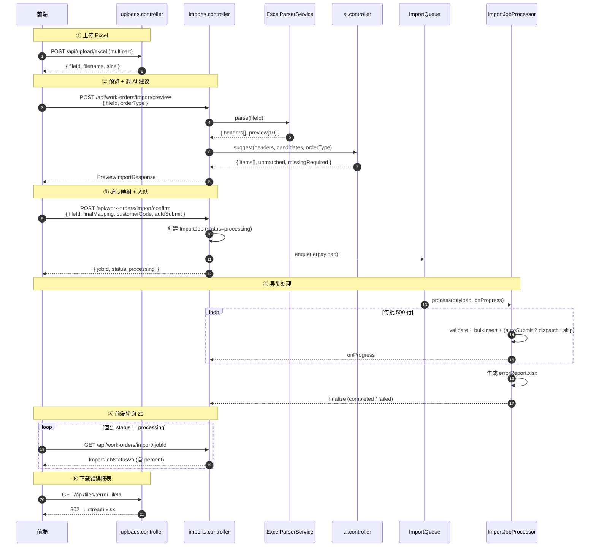

# Phase 4 三模块接口契约（uploads / ai / imports）

> 版本：v1.0（2026-05-11）
> 面向：Phase 4 后端（第二轮返工）+ Phase 5/6 前端对接
> 作者：architect
>
> **定位**：把 `docs/Phase4导入与回流设计.md` §1.2-§1.3 的接口描述**落到 class-validator 级的 DTO + sequence 图 + 错误码矩阵**，backend 按本文写 controller / dto 一次即可过 Reviewer。
>
> 本文与下列文档互补：
> - `docs/Phase4AI导入服务分层设计.md`（内部分层）
> - `docs/Phase4_AI_Provider实现参考.md`（Provider 可粘贴源码）
> - `docs/Phase4_ImportJob队列双版设计.md`（异步与进度）
> - `docs/Phase4后端返工指导.md`（评审返工整体路线）

---

## 目录
- [1. 三模块职责边界](#1-三模块职责边界)
- [2. sequenceDiagram：preview → confirm → :jobId](#2-sequencediagrampreview--confirm--jobid)
- [3. uploads 模块契约](#3-uploads-模块契约)
- [4. ai 模块契约](#4-ai-模块契约)
- [5. imports 模块契约（核心）](#5-imports-模块契约核心)
- [6. 错误码矩阵（与 `API规范.md` 对齐）](#6-错误码矩阵与-api规范md-对齐)
- [7. 鉴权与字段权限叠加](#7-鉴权与字段权限叠加)
- [8. 前端接入示例（fetch）](#8-前端接入示例fetch)

---

## 1. 三模块职责边界

| 模块 | 路径前缀 | 职责 | 不做 |
|------|----------|------|------|
| **uploads** | `/api/upload/*`、`/api/files/*` | Excel / 附件落盘、签名下载 | 不解析 Excel、不调 AI、不改业务状态 |
| **ai** | `/api/ai/*` | 对接 LlmProvider，**只返映射建议** | 不访问业务数据、不写库 |
| **imports** | `/api/work-orders/import/*` | 编排：parse → ai → validate → bulkCreate → reportExcel | 不落磁盘、不独立持有 LLM 客户端 |

> **纪律**：imports 依赖 uploads（拿 Excel） + ai（拿建议）；**不允许** uploads / ai 反向依赖 imports。模块 import 关系保持单向。

---

## 2. sequenceDiagram：preview → confirm → :jobId



---

## 3. uploads 模块契约

### 3.1 `POST /api/upload/excel`

| 项 | 规格 |
|----|------|
| 方法 | POST |
| 路径 | `/api/upload/excel` |
| 鉴权 | JWT；角色 ∈ {`salesperson`, `admin`} |
| Content-Type | `multipart/form-data` |
| 字段 | `file: File`（.xlsx / .xls，≤ 20 MB），`purpose: 'import'` |
| 依赖 Service | `UploadsService.saveExcel` |

**请求体**（multer 接住 `file`）：

```ts
// backend/src/modules/uploads/dto/upload-excel.dto.ts
import { IsIn, IsOptional, IsString } from 'class-validator';

export class UploadExcelDto {
  @IsString()
  @IsIn(['import'])
  purpose!: 'import';

  @IsOptional()
  @IsString()
  orderType?: string;
}
```

**响应**：

```ts
export interface UploadExcelResponse {
  fileId: string;         // uuid v4
  filename: string;       // 原始文件名
  size: number;           // bytes
  mimeType: string;
  uploadedAt: string;     // ISO8601
  expiresAt: string;      // fileId 有效期 7 天
}
```

**错误码**：

| HTTP | code | 场景 |
|------|------|------|
| 400 | 4400 | 无文件 / 类型非 xlsx / 超过 20MB |
| 401 | 4010 | 未登录 |
| 403 | 4030 | 角色无权限 |
| 500 | 5000 | 磁盘不可写 |

### 3.2 `POST /api/upload/attachment`

同 3.1，但 `purpose='attachment'`，允许 `.pdf/.jpg/.png`，绑定 `workOrderId`。

```ts
export class UploadAttachmentDto {
  @IsString() @IsIn(['attachment']) purpose!: 'attachment';
  @IsString() workOrderId!: string;
  @IsOptional() @IsString() tag?: 'id_card' | 'diploma' | 'contract' | 'other';
}
```

### 3.3 `GET /api/files/:id`

| 项 | 规格 |
|----|------|
| 方法 | GET |
| 路径 | `/api/files/:id` |
| 鉴权 | JWT；文件归属者 / admin / 文件所属工单的业务员或主管 |
| 响应 | `application/octet-stream` + `Content-Disposition: attachment; filename=...` |
| 依赖 Service | `UploadsService.openStream`、`FileAclService.canRead` |

**错误码**：

| HTTP | code | 场景 |
|------|------|------|
| 404 | 4040 | fileId 不存在或已过期 |
| 403 | 4030 | 无权读 |
| 410 | 4100 | 文件被清理（7 天期过） |

---

## 4. ai 模块契约

### 4.1 `POST /api/ai/field-mapping`

| 项 | 规格 |
|----|------|
| 方法 | POST |
| 路径 | `/api/ai/field-mapping` |
| 鉴权 | JWT；角色 ∈ {`salesperson`, `supervisor`, `admin`} |
| 依赖 Service | `AiMappingService.suggest` |

**入参 DTO**：

```ts
// backend/src/modules/ai/dto/field-mapping.dto.ts
import {
  ArrayMaxSize,
  ArrayNotEmpty,
  IsArray,
  IsIn,
  IsString,
  Length,
} from 'class-validator';

export class FieldMappingRequestDto {
  @IsString()
  @IsIn(['onboarding', 'renewal', 'resignation'])
  orderType!: string;

  @IsArray()
  @ArrayNotEmpty()
  @ArrayMaxSize(100)
  @IsString({ each: true })
  @Length(1, 100, { each: true })
  headers!: string[];
}
```

**响应 DTO**：

```ts
export interface MappingSuggestionItem {
  headerIndex: number;
  header: string;
  fieldCode: string | null;
  confidence: number;        // 0~1
  reason?: 'exact' | 'alias' | 'semantic' | 'fuzzy' | 'unmatched';
  alt?: Array<{ fieldCode: string; confidence: number }>;
}

export interface FieldMappingResponseDto {
  items: MappingSuggestionItem[];
  unmatchedHeaders: string[];
  missingRequired: string[];
  modelUsed: string;         // 'openai:gpt-4o-mini' / 'fallback:fuzzy'
  cached: boolean;
}
```

**错误码**：

| HTTP | code | 场景 |
|------|------|------|
| 400 | 4400 | headers 为空 / > 100 |
| 401 | 4010 | 未登录 |
| 422 | 4220 | orderType 非法 |
| 503 | 5030 | 所有 provider 都冷却且 fuzzy 亦失败（极罕见） |

> **约束**：此端点 **只返建议不写库**；import_jobs 的 `ai_model_used` 由 `imports` 模块在 preview 时写。

---

## 5. imports 模块契约（核心）

### 5.1 `POST /api/work-orders/import/preview`

| 项 | 规格 |
|----|------|
| 方法 | POST |
| 路径 | `/api/work-orders/import/preview` |
| 鉴权 | JWT；角色 ∈ {`salesperson`, `admin`} |
| 依赖 Service | `ExcelParserService`、`AiMappingService`、`FieldConfigService` |

**入参 DTO**：

```ts
// backend/src/modules/imports/dto/preview-import.dto.ts
import { IsIn, IsInt, IsOptional, IsString, Max, Min } from 'class-validator';

export class PreviewImportDto {
  @IsString()
  fileId!: string;

  @IsString()
  @IsIn(['onboarding', 'renewal', 'resignation'])
  orderType!: string;

  @IsOptional()
  @IsInt()
  @Min(1)
  @Max(50)
  sampleRows?: number = 10;
}
```

**响应 DTO**：

```ts
export interface PreviewImportSuggestionItem {
  headerIndex: number;
  header: string;
  fieldCode: string | null;
  confidence: number;
  reason?: 'exact' | 'alias' | 'semantic' | 'fuzzy' | 'unmatched';
  alt?: Array<{ fieldCode: string; confidence: number }>;
}

export interface PreviewImportResponse {
  fileId: string;
  orderType: string;
  headers: string[];
  rowCount: number;            // 总行数（不含表头）
  preview: Array<Record<string, unknown>>;  // 前 sampleRows 行
  suggestions: PreviewImportSuggestionItem[];
  unmatchedHeaders: string[];
  missingRequired: string[];
  availableFields: Array<{
    fieldCode: string;
    fieldName: string;
    required: boolean;
    fieldType: 'text' | 'textarea' | 'number' | 'date' | 'boolean' | 'dropdown';
  }>;
  modelUsed: string;
}
```

**错误码**：

| HTTP | code | 场景 |
|------|------|------|
| 400 | 4400 | fileId 不存在 / 空表 / > 5000 行 |
| 401 | 4010 | 未登录 |
| 403 | 4030 | 非文件归属者 |
| 422 | 4220 | orderType 非法 / 表头全空 |
| 413 | 4130 | 文件 > 20MB |

---

### 5.2 `POST /api/work-orders/import/confirm`

| 项 | 规格 |
|----|------|
| 方法 | POST |
| 路径 | `/api/work-orders/import/confirm` |
| 鉴权 | JWT；角色 ∈ {`salesperson`, `admin`} |
| 依赖 Service | `ImportJobService.createAndEnqueue`、`ImportQueue` |

**入参 DTO**：

```ts
// backend/src/modules/imports/dto/confirm-import.dto.ts
import {
  ArrayMaxSize,
  ArrayNotEmpty,
  IsArray,
  IsBoolean,
  IsIn,
  IsOptional,
  IsString,
  Length,
  ValidateNested,
} from 'class-validator';
import { Type } from 'class-transformer';

export class MappingItem {
  @IsString() @Length(1, 100)
  header!: string;

  @IsString() @Length(1, 64)
  fieldCode!: string;

  @IsOptional() @IsString()
  defaultValue?: string;
}

export class ConfirmImportDto {
  @IsString()
  fileId!: string;

  @IsString()
  @IsIn(['onboarding', 'renewal', 'resignation'])
  orderType!: string;

  @IsOptional() @IsString() @Length(1, 64)
  customerCode?: string;

  @IsArray()
  @ArrayNotEmpty()
  @ArrayMaxSize(200)
  @ValidateNested({ each: true })
  @Type(() => MappingItem)
  finalMapping!: MappingItem[];

  @IsBoolean()
  autoSubmit!: boolean;

  @IsOptional() @IsString() @Length(1, 120)
  jobName?: string;
}
```

**响应 DTO**：

```ts
export interface ConfirmImportResponse {
  jobId: string;
  status: 'processing';
  queuedAt: string;   // ISO8601
}
```

**错误码**：

| HTTP | code | 场景 |
|------|------|------|
| 400 | 4400 | finalMapping 为空 / fieldCode 不在启用字段 |
| 401 | 4010 | 未登录 |
| 409 | 4091 | 同 fileId 已有 running 的 job（重复确认） |
| 422 | 4221 | 必填字段未映射 |
| 422 | 4222 | customerCode 不存在 |
| 503 | 5031 | 队列已满（方案 A：pending 长度 ≥ 100） |

---

### 5.3 `GET /api/work-orders/import/:jobId`

| 项 | 规格 |
|----|------|
| 方法 | GET |
| 路径 | `/api/work-orders/import/:jobId` |
| 鉴权 | JWT；job 归属者 / admin |
| 依赖 Service | `ImportJobService.getStatus` |

**响应 DTO（最终契约）**：

```ts
export interface ImportJobStatusVo {
  jobId: string;
  status: 'processing' | 'completed' | 'failed' | 'cancelled';
  total: number;
  processed: number;
  succeeded: number;
  failed: number;
  percent: number;            // Math.round((processed/total)*100)
  fieldMapping: MappingItem[];
  errorFileUrl?: string;      // 指向 /api/files/:errorFileId
  errorSummary?: string;
  startedAt: string;
  completedAt?: string;
  modelUsed?: string;
}
```

**轮询约定**：前端 2s 一次；`status !== 'processing'` 停止；
`percent` 由后端计算，前端**不要**自己用 succeeded/total 推。

**错误码**：

| HTTP | code | 场景 |
|------|------|------|
| 404 | 4040 | jobId 不存在 |
| 403 | 4030 | 非 job 归属者 |

---

### 5.4 `GET /api/work-orders/import/:jobId/error-report`

- 等价于 `GET /api/files/:errorFileId`，**便利别名**；
- 服务端在 job 完成后把 `errorFileId` 写入 `import_jobs.error_file_id`；
- 如果 `status != 'completed'` 或无失败行 → 404。

### 5.5 `POST /api/work-orders/import/:jobId/cancel`

| 项 | 规格 |
|----|------|
| 方法 | POST |
| 路径 | `/api/work-orders/import/:jobId/cancel` |
| 鉴权 | JWT；job 归属者 / admin |
| 依赖 Service | `ImportQueue.cancel`、`ImportJobService.markCancelled` |

**响应**：

```ts
export interface CancelImportResponse {
  jobId: string;
  cancelled: boolean;  // true=成功取消；false=任务已完成/不在队列
  state: 'processing' | 'completed' | 'cancelled' | 'failed';
}
```

**错误码**：

| HTTP | code | 场景 |
|------|------|------|
| 404 | 4040 | jobId 不存在 |
| 409 | 4092 | 已是终态（completed/failed/cancelled） |

---

## 6. 错误码矩阵（与 `API规范.md` 对齐）

| code | 含义 | 出现于 |
|------|------|--------|
| 4010 | 未登录 | 全部 |
| 4030 | 角色 / 归属越权 | 全部 |
| 4040 | 资源不存在 | uploads, imports |
| 4091 | 同 fileId 已有 running job | imports.confirm |
| 4092 | cancel 已终态 | imports.cancel |
| 4100 | 文件已过期被清理 | uploads.files |
| 4130 | 文件体积超限 | uploads.excel |
| 4220 | orderType 非法 | ai, imports |
| 4221 | 必填字段未映射 | imports.confirm |
| 4222 | customerCode 不存在 | imports.confirm |
| 4400 | 文件无效 / 为空 / 行数超上限 | uploads, imports |
| 5000 | 磁盘写失败 | uploads |
| 5030 | 所有 provider 都失败 | ai |
| 5031 | 队列已满 | imports.confirm |

> 所有错误**必须**走 `GlobalExceptionFilter`，返回 `{ code, message, data: null }`，HTTP status 与上表对齐。

---

## 7. 鉴权与字段权限叠加

1. **全部端点**先过 `JwtAuthGuard + RolesGuard`；角色白名单见各节表格；
2. imports 的 `preview` 与 `confirm` 返回 `availableFields` 时，**按当前用户的角色做字段权限过滤**（调 `FieldPermissionService` 的 `listVisibleFieldCodes(roleId, 'main')`），只把用户能"see/edit"的字段塞进候选；
3. `/api/files/:id` 下发之前查 `FileAclService.canRead(userId, fileId)`：
   - 上传者本人 ✅
   - 文件所属工单的业务员 / 模块主管 ✅
   - admin ✅
   - 其它 → 403；
4. 错误报表文件天然只给 `import_jobs.user_id` 或 admin。

---

## 8. 前端接入示例（fetch）

```ts
// frontend/src/api/imports.ts
import { fetcher } from './fetcher';

export const uploadsApi = {
  uploadExcel: (file: File) => {
    const fd = new FormData();
    fd.append('file', file);
    fd.append('purpose', 'import');
    return fetcher.postForm<{ fileId: string }>('/api/upload/excel', fd);
  },
};

export const importsApi = {
  preview: (fileId: string, orderType: string) =>
    fetcher.post<PreviewImportResponse>(
      '/api/work-orders/import/preview',
      { fileId, orderType },
    ),

  confirm: (body: ConfirmImportDto) =>
    fetcher.post<ConfirmImportResponse>(
      '/api/work-orders/import/confirm',
      body,
    ),

  getStatus: (jobId: string) =>
    fetcher.get<ImportJobStatusVo>(
      `/api/work-orders/import/${jobId}`,
    ),

  cancel: (jobId: string) =>
    fetcher.post<CancelImportResponse>(
      `/api/work-orders/import/${jobId}/cancel`,
    ),
};

// 轮询 hook
export function useImportJobPolling(jobId: string | null) {
  const [status, setStatus] = React.useState<ImportJobStatusVo | null>(null);
  React.useEffect(() => {
    if (!jobId) return;
    let alive = true;
    const tick = async () => {
      if (!alive) return;
      const s = await importsApi.getStatus(jobId);
      if (!alive) return;
      setStatus(s);
      if (s.status === 'processing') {
        window.setTimeout(tick, 2000);
      }
    };
    tick();
    return () => { alive = false; };
  }, [jobId]);
  return status;
}
```

---

## 变更日志

- v1.0（2026-05-11）：初版，交付 3 模块 11 端点的完整 class-validator DTO + 错误码矩阵 + sequenceDiagram + 前端 fetch 示例。