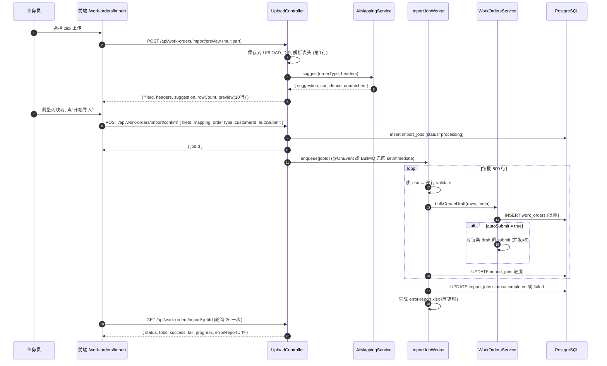
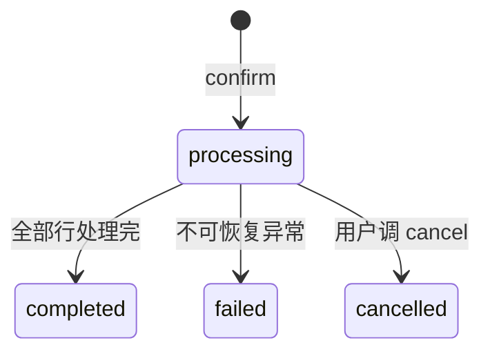
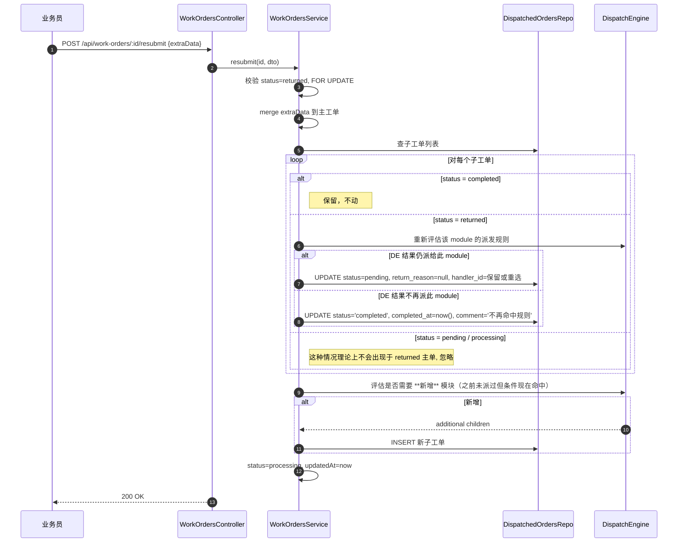

# Phase 4 · 批量导入与字段回流设计

> 版本：v1.0（Phase 4 定稿）
> 覆盖：Excel 批导（上传→AI 映射→校验→落库→错误报告）、字段补充回流（并发安全）、主工单返工重派。
> 依赖：`docs/Phase3工单核心设计.md`、`docs/DispatchEngine-JSON-AST规范.md`、`docs/数据库ER图.md`。

---

## 1. Excel 导入全流程

### 1.1 总流程图


### 1.2 接口清单（追加到 `docs/API规范.md` §4.3）
| 方法 | 路径 | 功能 |
|------|------|------|
| POST | `/api/work-orders/import/preview` | 上传 + 解析表头 + AI 映射 |
| POST | `/api/work-orders/import/confirm` | 确认映射并启动异步任务 |
| GET  | `/api/work-orders/import/:jobId` | 查询任务状态（轮询） |
| GET  | `/api/work-orders/import/:jobId/error-report` | 下载错误报表 |
| POST | `/api/work-orders/import/:jobId/cancel` | 任务取消（仅 processing 态） |

### 1.3 请求/响应 DTO

```ts
// POST /preview
// multipart: file (xlsx), orderType, sampleRows?=10
export interface PreviewImportResponse {
  fileId: string;                     // 服务器端临时文件 id
  orderType: string;
  headers: string[];                  // 原始表头
  rowCount: number;
  preview: Array<Record<string, unknown>>;  // 前 10 行（以表头原名为 key）
  suggestion: Record<string, string>; // header → fieldCode
  confidence: Record<string, number>; // 每列 0~1
  unmatched: string[];                // AI 无法判断的列
  availableFields: Array<{ fieldCode: string; fieldName: string; required: boolean; fieldType: string }>;
}

// POST /confirm
export class ConfirmImportDto {
  @IsString() fileId!: string;
  @IsString() orderType!: string;
  @IsOptional() @IsInt() customerId?: number;    // 可空 → 每行必须携带 customerCode 字段映射
  @ValidateNested() @Type(() => MappingItem) mapping!: MappingItem[];
  @IsBoolean() autoSubmit!: boolean;              // true = 导入后立即 submit 触发派发
  @IsOptional() @IsString() jobName?: string;
}
export class MappingItem {
  @IsString() header!: string;
  @IsString() fieldCode!: string;     // 必须在 field_configs 启用清单
  @IsOptional() @IsString() defaultValue?: string;  // 空列时的默认值
}

// GET /:jobId
export interface ImportJobStatusVo {
  id: number;
  status: 'processing' | 'completed' | 'failed' | 'cancelled';
  totalRows: number;
  successRows: number;
  failRows: number;
  progress: number;                   // 0~100
  fieldMapping: MappingItem[];
  errorReportUrl?: string;
  errorSummary?: string;
  startedAt: string;
  completedAt?: string;
}
```

### 1.4 文件生命周期
- Excel 原文件以 `UPLOAD_DIR/imports/{userId}/{uuid}.xlsx` 存放；`import_jobs.file_path` 记录。
- 任务完成后保留 **7 天**，定期清理（Phase 6 加 cron；本期先不清，交 QA 确认容量）。
- 错误报表：`UPLOAD_DIR/imports/{userId}/{uuid}-errors.xlsx`；由 `/files/:id` 下发（内部签名 URL）。
- 允许最大行数：`MAX_IMPORT_ROWS`（默认 5000）；超出返回 `4400`。

### 1.5 单行校验规则
按顺序执行，任一步失败即把该行记入错误报告（不中断后续行）：
1. **映射覆盖**：所有必填字段是否有映射或 `defaultValue`；否则 `missing_required`。
2. **字段类型转换**：
   - `text` / `textarea`：`String(v).trim()`；空串 → null。
   - `number`：`Number(v)`；失败 → 错误。
   - `date`：`dayjs(v)` 接受 `yyyy-MM-dd`、`yyyy/M/d`、Excel 序列号（用 `xlsx.SSF`）；失败 → 错误。
   - `boolean`：`true/false/是/否/1/0` 大小写不敏感；其它 → 错误。
   - `dropdown`：值必须在 `dropdown_options.value` 中（大小写敏感）；或匹配 `label`（大小写不敏感）后替换为 `value`。
3. **正则校验**：按 `field_configs.validation_regex`。
4. **条件必填**：执行 `ConditionEvaluator.evaluate(conditionalRequired)`，若为真且值为空则 `conditional_required_missing`。
5. **重复检测**：同 `order_type + id_card_no` 在本次导入中或数据库中（近 90 天 `draft/pending/processing/returned`）已存在 → 告警级（`duplicate_suspect`，不阻止导入但报告中标注，`autoSubmit` 时跳过该行）。

错误分类码：
| 错误码 | 含义 |
|--------|------|
| `missing_required` | 必填缺失 |
| `conditional_required_missing` | 条件必填缺失 |
| `type_convert` | 类型转换失败 |
| `regex_invalid` | 正则未通过 |
| `enum_invalid` | 枚举不匹配 |
| `duplicate_suspect` | 疑似重复 |
| `customer_not_found` | 客户编码未匹配 |
| `field_disabled` | 映射到已停用字段 |

### 1.6 分批与事务
- 每批 500 行独立事务：
  - 构造 500 个 `draft` `work_orders` 记录，`INSERT ... RETURNING id`。
  - 若 `autoSubmit = true`：出事务后，进入 "submit 子任务池"（并发 5，避免瞬时打爆 DispatchEngine）。
- 单行失败（非事务级）不影响整批；整批事务仅在"数据库异常"时回滚（网络抖动/约束冲突），此时整批视为失败并重试一次。
- 幂等：`import_jobs.id` + 行号共同构成"导入单元"唯一键，重试逻辑对已写入的行 skip（通过 `work_orders.extra_data.__importRef = {jobId, rowNo}` 冗余存储，数据库建部分唯一索引）。

```sql
CREATE UNIQUE INDEX uk_wo_import_ref ON work_orders (
  ((extra_data->'__importRef'->>'jobId')),
  ((extra_data->'__importRef'->>'rowNo'))
) WHERE extra_data ? '__importRef';
```

### 1.7 状态转换

- `completed` 覆盖两种情形："全部成功" 与 "部分失败但流程完成"。前端看 `failRows` 区分。

### 1.8 进度上报方案
- **轮询**：前端 2s 间隔调用 `GET /:jobId`，返回 `progress`（`Math.round((success+fail)/total*100)`）。
- 为什么不 SSE：本期无长连接通道（Phase 1 nginx WebSocket 已预留但未启用）；轮询对 5000 行 5~15s 任务足够。
- Phase 6 站内通知上线后，额外在 `completed/failed` 时推一条 `import_done` 通知。

---

## 2. AI 字段映射

### 2.1 输入 / 输出
```ts
POST /api/ai/field-mapping
Request:
{
  "orderType": "onboarding",
  "headers": ["姓名", "手机号", "Id Card", "基本薪资(元)", "是否需要集约"]
}
Response:
{
  "suggestion": {
    "姓名": "employee_name",
    "手机号": "mobile",
    "Id Card": "id_card_no",
    "基本薪资(元)": "base_salary",
    "是否需要集约": "need_onboarding_contact"
  },
  "confidence": { ... },
  "unmatched": []
}
```

### 2.2 Prompt 模板

系统消息（固定中文 + 严格 JSON 输出约束）：
```
你是一个字段映射助手，任务是把用户 Excel 表头对齐到系统字段。

硬要求：
1. 仅允许映射到 <候选字段> 列表中给出的 field_code；不得虚构。
2. 输出严格 JSON，不含解释、markdown、注释。
3. 对于无法判断的列，把列名放入 unmatched，不要猜。
4. confidence 是 0~1 浮点数，反映你对匹配的把握程度。
5. 允许一对多重复（同一 field_code 被多列命中时，选最相似的一列，其余列放 unmatched）。

识别要点：
- 中英文混写：以语义为准，如 "Id Card" → 身份证号。
- 括号里的单位可忽略：如 "基本薪资(元)" 对齐 "基本工资"。
- 是/否 类列优先匹配 boolean 或 dropdown 字段。
- 地址类列区分 "户籍/现住"；若只说"地址"，优先 current_address。
```

用户消息：
```
<订单类型>: {{orderType}}

<候选字段>（JSON）:
[
  {"fieldCode":"employee_name","fieldName":"姓名","fieldType":"text"},
  {"fieldCode":"id_card_no","fieldName":"身份证号","fieldType":"text"},
  {"fieldCode":"mobile","fieldName":"移动电话","fieldType":"text"},
  ...
]

<Excel 表头>（JSON 数组）:
["姓名","手机号","Id Card","基本薪资(元)","是否需要集约"]

请输出如下结构的 JSON:
{
  "suggestion": { "<原表头>": "<field_code>" },
  "confidence": { "<原表头>": 0.0~1.0 },
  "unmatched": ["<原表头>"]
}
```

### 2.3 Few-shot（嵌入系统消息或作为多轮示例）

示例 1：
```
输入表头: ["姓名","性别","身份证号码","手机","合同起","合同止"]
输出:
{
  "suggestion": {
    "姓名": "employee_name",
    "性别": "gender",
    "身份证号码": "id_card_no",
    "手机": "mobile",
    "合同起": "contract_start_date",
    "合同止": "contract_end_date"
  },
  "confidence": {"姓名":0.99,"性别":0.98,"身份证号码":0.97,"手机":0.96,"合同起":0.9,"合同止":0.9},
  "unmatched": []
}
```

示例 2：
```
输入表头: ["客户代码","员工","派遣地","基本工资","其他工资","公积金基数","是否入职联系"]
输出:
{
  "suggestion": {
    "客户代码": "customer_code",
    "员工": "employee_name",
    "派遣地": "work_city",
    "基本工资": "base_salary",
    "其他工资": "other_salary",
    "公积金基数": "fund_base",
    "是否入职联系": "need_onboarding_contact"
  },
  "confidence": {...},
  "unmatched": []
}
```

示例 3（模糊/不可判断）：
```
输入表头: ["xxx字段","unknown","备注1"]
输出:
{
  "suggestion": { "备注1": "special_remark" },
  "confidence": { "备注1": 0.6 },
  "unmatched": ["xxx字段", "unknown"]
}
```

### 2.4 降级策略（AI 不可用）
- 若 `OPENAI_API_KEY` 未配置或 4500/4501 错误：**回落到字符串相似度算法**（基于 `field_name` + `field_code` 的 Jaccard / Levenshtein 综合打分）。
- 前端行为不变：`suggestion / confidence / unmatched` 仍然返回；前端提示用户"AI 不可用，已使用本地相似度"。
- 相似度阈值：`score >= 0.6` 才进入 `suggestion`，否则进 `unmatched`。

### 2.5 安全与成本
- Prompt 仅包含**表头字符串**，不含用户数据行；避免 PII 外发。
- 超时：10s；失败不阻断预览，按降级返回。
- 可接入缓存：同 orderType + 同 header 集合 sha256 hash 命中则复用（24 小时 TTL，内存 LRU，不引入 Redis）。

---

## 3. 字段补充回流

### 3.1 场景
后道 handler 在子工单详情页看到"可补充字段"区（由 `field_supplement_rules` 决定）。例如 `onboarding_contact` 模块可补充 `bank_name / bank_account`，并 `sync_to_modules = ["data_entry","social_security"]`。

### 3.2 流程
```mermaid
sequenceDiagram
    autonumber
    participant H as 后道 handler
    participant DOS as DispatchedOrdersService
    participant FSR as FieldSupplementRuleService
    participant WOS as WorkOrdersService
    participant FSL as SupplementLogRepo
    participant NS as NotificationService
    H ->> DOS: POST /:id/supplement {fields, workOrderUpdatedAt}
    DOS ->> DOS: 校验 scenario + FieldPermission (readonly 及以上)
    DOS ->> FSR: canSupplement(fieldCode, moduleCode)
    FSR -->> DOS: allowed / denied (reason)
    DOS ->> WOS: tx { 读主工单 FOR UPDATE; 校验 updated_at 匹配 }
    alt 版本不匹配
        WOS -->> DOS: 抛 4301 (stale)
    end
    WOS ->> WOS: merge extra_data, updated_at=now
    WOS ->> FSL: insert 多条 field_supplement_logs
    WOS ->> DOS: 对 sync_to_modules 中 dispatched_orders 更新 visible_fields/cache
    DOS -->> H: 200 OK
    par 事务提交后
        DOS ->> NS: enqueue(field_supplemented) → 主工单创建者 + 其他相关子工单 handler
    end
```

### 3.3 并发冲突（乐观锁）
- 主工单 `updated_at` 即版本。前端获取详情后持有 `workOrderUpdatedAt`；提交补充时回传。
- Service 内：
  ```ts
  const wo = await tx.getOne(`SELECT * FROM work_orders WHERE id=$1 FOR UPDATE`, [parentId]);
  if (wo.updatedAt.toISOString() !== dto.workOrderUpdatedAt) {
    throw new BusinessException(4301, '工单已被他人更新，请刷新后重试', 409, { latest: wo.updatedAt });
  }
  ```
- 更新时 `UPDATE work_orders SET extra_data = ..., updated_at = now() WHERE id = $1 AND updated_at = $2`；影响行数为 0 → 抛 `4301`。
- `sync_to_modules` 中的子工单更新只改 `updated_at` 与 `visible_fields` 快照（不改 `status`），避免误触发状态机。

### 3.4 字段级合法性（写路径）
在回流之前逐字段检查：
1. `field_supplement_rules.supplementer_module` 是否含当前模块；否则 `5001`。
2. 字段权限 map 中该 `fieldCode` 的 `permission` 必须 ∈ `{visible, readonly}`（注意：`readonly` 指 UI 不可编辑但支持经"补充"写入——**语义区分**：`readonly` 允许通过补充路径写入，因为补充是由系统白名单控制；纯 UI 编辑无法写入）。
3. 字段类型转换 + 正则校验（复用单行校验器）。
4. 冲突覆盖规则：若该字段已有值，且本次值不同 → 默认 `reject`，返回 `4302`；通过可选参数 `?overwrite=true` 允许覆盖（写 `operation_logs` 记录旧值）。

### 3.5 日志与审计
- `field_supplement_logs` 每字段一条；`old_value/new_value` 字符串化存储。
- `operation_logs` 写一条 `action_type='supplement'`，`before_data` 为补充前主工单片段，`after_data` 为变更后的 `{fieldCode: value}` 合集。

### 3.6 补充的同步语义
- **主工单**：`extra_data` 真实更新；将来任一模块查看都看到最新值。
- **其它模块子工单**：由于我们在 `dispatched_orders` 上存 `visible_fields` 快照，**值**始终实时从主工单 JSONB 读取；所以"补充立即对其他模块生效"。
- **对 `sync_to_modules` 指定的模块**：额外发通知，促使其尽快处理（UX 效果）。
- **对没列在 `sync_to_modules` 的模块**：仍能读到最新值（数据一致），但不收到补充通知。

---

## 4. 退回与返工重派

### 4.1 退回
- 子工单 handler 在详情页点"退回"，填 `returnReason`。
- Service：
  ```ts
  await tx.update(DispatchedOrder, id, {
    status: 'returned',
    returnReason: dto.returnReason,
    updatedAt: () => 'now()',
  });
  await checkMainOrderComplete(parentId, tx);  // 结果 returned
  ```
- 主工单状态立刻变为 `returned`；其他 `completed` 子工单保留。

### 4.2 返工重派（业务员）
触发：业务员在主工单详情（`returned` 态）修改字段 → 点"重新提交"。


### 4.3 handler 保留规则
- returned → pending 时默认保留原 `handler_id`（减少换人成本）。
- 若原 handler 已 `is_active=false` 或已从 `module_handlers` 移除，则置 null（回 pool）。
- 若主工单对应模块的 `dispatch_strategy` 为 `pool`，永远 `handler_id=null`。

### 4.4 新增子工单的合法性
如果业务员修改后新条件命中了之前未派过的模块（例：以前没勾合同，现在勾了），允许新增派发：
- 正常 `INSERT dispatched_orders`，走 HandlerPicker。
- 唯一约束 `uk_do_parent_module` 保证不会重复。

### 4.5 错误码
| code | HTTP | 含义 |
|------|------|------|
| 4114 | 409 | 主工单非 returned 态 |
| 4115 | 400 | resubmit 未提供任何字段变更 |
| 4301 | 409 | 乐观锁失败（工单已被他人更新） |
| 4302 | 409 | 字段补充冲突（已有不同值） |

---

## 5. 接口一览（Phase 4 新增/完善）

### 5.1 主工单相关
| 方法 | 路径 | 功能 |
|------|------|------|
| POST | `/api/work-orders/import/preview` | 预览 + AI 映射 |
| POST | `/api/work-orders/import/confirm` | 启动导入任务 |
| GET  | `/api/work-orders/import/:jobId` | 查询进度 |
| GET  | `/api/work-orders/import/:jobId/error-report` | 下载错误报表 |
| POST | `/api/work-orders/import/:jobId/cancel` | 取消任务 |
| POST | `/api/work-orders/:id/resubmit` | returned → processing 重新派发 |

### 5.2 子工单相关
| 方法 | 路径 | 功能 |
|------|------|------|
| POST | `/api/dispatched-orders/:id/supplement` | 字段补充（可回流） |
| POST | `/api/dispatched-orders/:id/return` | 退回主工单 |

---

## 6. 错误报表 Excel 格式

- Sheet1 = 导入原始表头 + **两列新增**：`__error_code`、`__error_message`；仅保留出错行。
- Sheet2 = 汇总：统计各错误码行数 + 描述。
- 所有列宽 auto；冻结首行；错误列标红底。
- 命名：`import-{yyyyMMddHHmmss}-errors.xlsx`。

实现库：**exceljs**（见 Phase 5 §3，统一使用 exceljs）。

---

## 7. 观测与运维

- 日志关键字段：`jobId, userId, total, success, fail, durationMs, avgRowMs`。
- 慢任务告警：单批 > 30s 记 warn，整体 > 5min 记 error。
- 磁盘：每 100 MB 导入文件单独目录，便于批量清理。

---

## 8. 单测与 e2e

### 8.1 单测
- `SingleRowValidator`：每种错误码至少一条正反例。
- `AIMappingService`：降级路径（无 API Key）、缓存命中、超时回退。
- `FieldSupplementService`：权限拒绝、版本冲突、覆盖同值不报错、覆盖异值报 4302。

### 8.2 e2e
- 上传 200 行 xlsx（含 10 行错误）→ 预览正常 → 确认导入 → 180 行成功 + 10 行错误报告。
- `autoSubmit=true` 时 180 行全部变 `processing`；并发派发耗时可接受。
- 子工单补充银行账号 → 主工单 `extra_data.bank_account` 更新 → `data_entry` 子工单详情立即可见。
- returned 主工单 resubmit → 只有 returned 的子工单被重置；已 completed 的保留；新条件命中时新增子工单。

---

## 9. 变更与兼容
- 若将来从轮询切换为 SSE/WebSocket，前端接口 `ImportJobStatusVo` 形态不变；仅传输通道改变。
- `import_jobs` 不再删除的历史记录保留"任务透明度"，不影响性能（`user_id + created_at` 索引覆盖）。
- 本期严格禁用 Redis/队列中间件，`IJ` Worker 用 Nest `@OnEvent` 或直接 `setImmediate` 调度；Phase 6 再考虑 BullMQ。
