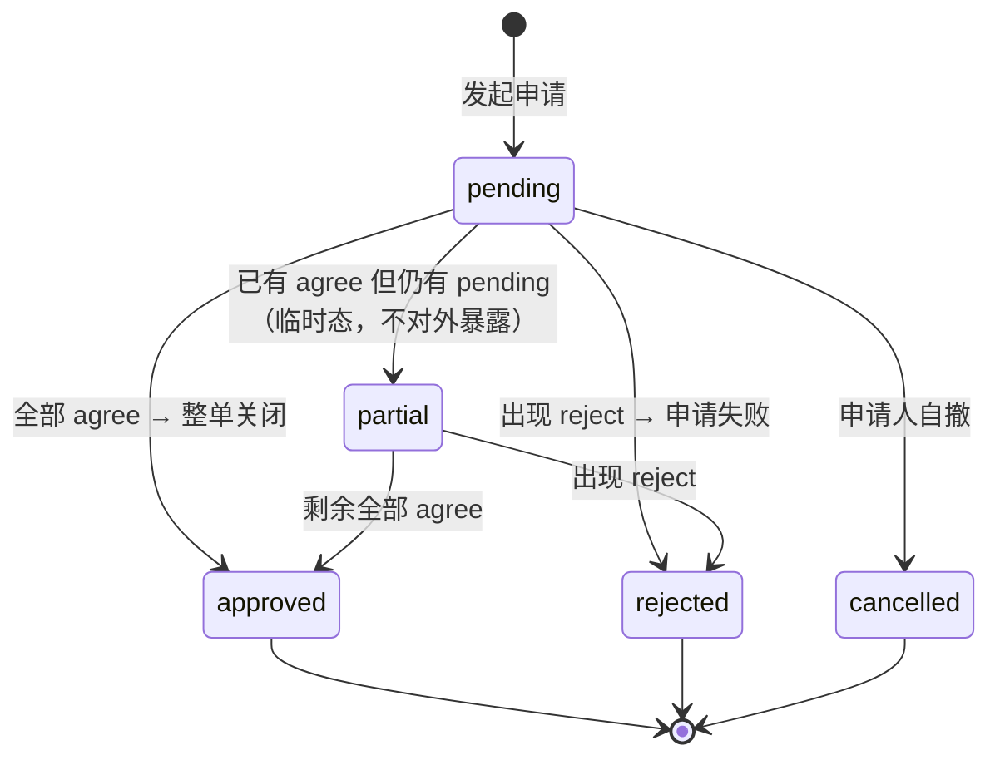
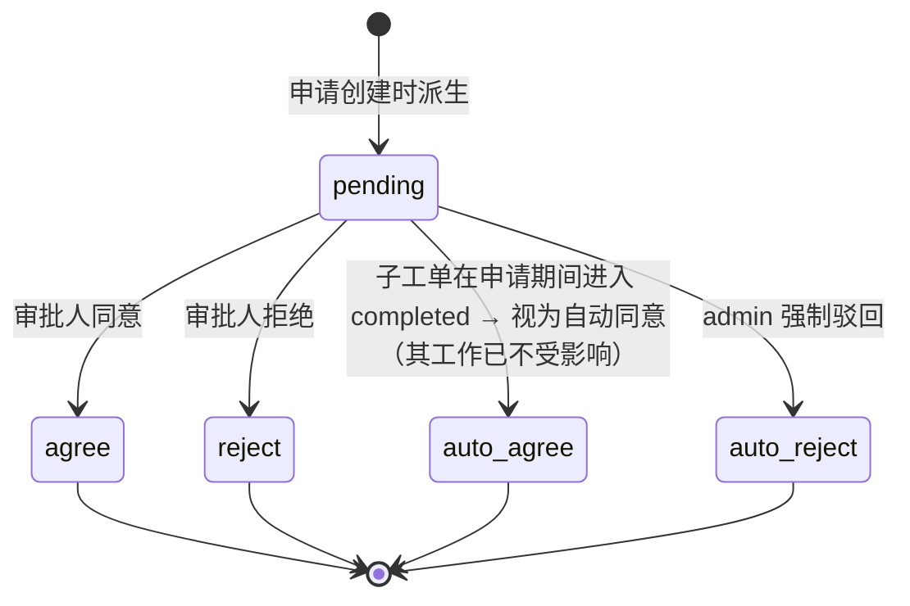
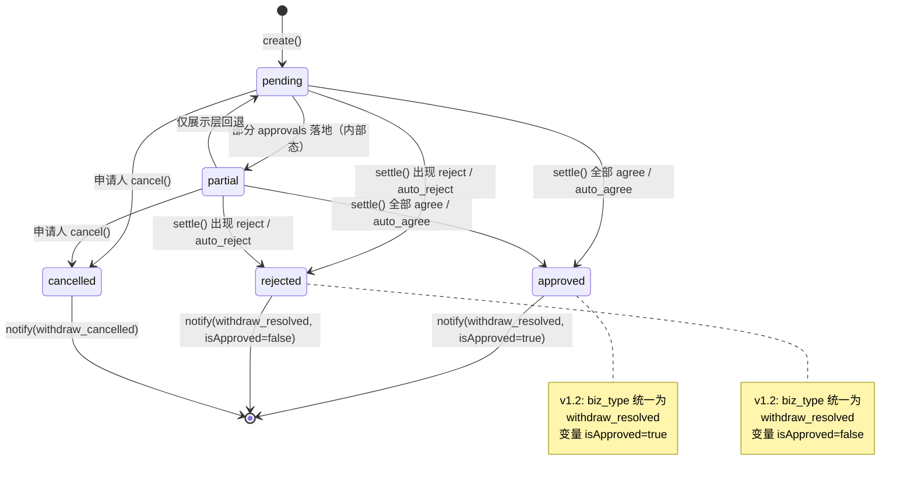

# Phase 5 · 撤回/修改与审批、导出模板、操作日志设计

> 版本：v1.0（Phase 5 定稿）
> 覆盖：撤回/修改申请、审批状态机、按模板导出（大数据量流式）、`@Audit` 装饰器与权限隔离。
> 依赖：`docs/Phase3工单核心设计.md`、`docs/数据库ER图.md`、`docs/Phase2管理后台设计.md` §6 §7。

---

## 1. 撤回 / 修改申请总览

### 1.1 业务动机
- 主工单进入 `processing` 后业务员发现信息有误：
  - **撤回（withdraw）**：把整单作废（很多时候是客户突然说"这个人不来了"）。
  - **修改（modify）**：字段个别修订（如修正身份证号、工资）。
- 所有 **未完成子工单** 的 handler 必须审批，避免后道已经开工却被悄悄变更数据。
- 已 `completed` 的子工单无审批权：因为它们的工作已结束，撤回/修改不影响其交付物（合同已签完无法撤回，对这些子工单仍保留原状）。

### 1.2 参与对象
| 角色 | 作用 |
|------|------|
| 申请人 | 主工单的 `created_by`，即业务员 |
| 审批人 | 主工单下状态 ∈ `{pending, processing}` 的每个子工单的 `handler_id`（或 pool 时该模块全员都可代表处理） |
| admin | 全局管理员，可越权"强制通过/驳回"（仅紧急情况使用） |

---

## 2. 状态机

### 2.1 `withdraw_requests`


说明：
- `partial` 是**内部过渡态**，UI 仅展示 "审批中 x/y 已同意"，不暴露为独立状态按钮。
- `cancelled` 是申请人在任一 approval 落地前主动撤销。

### 2.2 `withdraw_approvals`


- `auto_agree`：某个子工单在申请未结单时被其 handler 完成 → 视为对撤回的"默认同意"（因其交付不变；对于 modify 的处理见 §3.5）。
- `auto_reject`：admin 操作，记录 `reject_reason='admin_force_reject'`。

### 2.3 总决策规则（每次审批变化后执行）
```
function settle(request):
  approvals = request.approvals
  if any(a.status == 'reject' or 'auto_reject'): request.status = 'rejected'; return
  if all(a.status in ['agree','auto_agree']): request.status = 'approved'; return
  request.status = 'pending' | 'partial'
```

- `approved` 时：
  - `withdraw`：主工单 `status=withdrawn`，所有 `open` 子工单 `status=completed` 并 `feedback_data.withdrawn=true`（做数据痕迹）。
  - `modify`：把 `modify_data` 合并到 `work_orders.extra_data`，写 `operation_logs`；子工单状态不变；对 `sync_to_modules` 的影响同 Phase 4 §3.6。
- `rejected` 时：通知申请人；主工单保持原状。

---

## 3. 接口与流程

### 3.1 发起申请 `POST /api/work-orders/:id/withdraw`

```ts
export class CreateWithdrawRequestDto {
  @IsIn(['withdraw', 'modify'])
  requestType!: 'withdraw' | 'modify';

  /** modify 时必填：要更新的字段键值（与 extra_data 同结构） */
  @ValidateIf(o => o.requestType === 'modify')
  @IsObject()
  modifyData?: Record<string, unknown>;

  @IsString() @MinLength(2) @MaxLength(500)
  reason!: string;
}
```

Service：
```ts
async create(userId, workOrderId, dto) {
  return this.dataSource.transaction(async tx => {
    const wo = await tx.getRepository(WorkOrder).findOneForUpdate(workOrderId);
    assert(wo.createdBy === userId, 5000);
    assert(['processing','returned'].includes(wo.status), 4101);
    // 同一主工单禁止并发多个 pending 申请
    const exists = await tx.getRepository(WithdrawRequest).findPendingByWorkOrder(workOrderId);
    if (exists) throw new BusinessException(4502, '已有未结单的撤回/修改申请');

    const req = await tx.save(WithdrawRequest, {
      workOrderId, requestType: dto.requestType,
      modifyData: dto.modifyData ?? null, requesterId: userId,
      reason: dto.reason, status: 'pending',
    });

    const openDispatched = await tx.getRepository(DispatchedOrder).findOpenByParent(workOrderId);
    assert(openDispatched.length > 0, 4503, '没有进行中的子工单可审批');

    await tx.save(WithdrawApproval, openDispatched.map(d => ({
      withdrawRequestId: req.id,
      dispatchedOrderId: d.id,
      approverId: d.handlerId ?? null,    // pool 时 approverId 设为 null，由模块主管/任一成员代审
      approvalStatus: 'pending',
    })));

    return req;
  });
}
```

后置（事务外）：给审批人发通知 `withdraw_requested`。

### 3.2 审批 `POST /api/withdraw-requests/:id/approve`

```ts
export class ApproveWithdrawDto {
  /** 目标 approval 记录 id（一次一条） */
  @IsInt() approvalId!: number;
  @IsIn(['agree','reject']) decision!: 'agree'|'reject';
  @ValidateIf(o => o.decision === 'reject')
  @IsString() @MinLength(2) @MaxLength(500) rejectReason?: string;
}
```

权限：
- 当前用户必须是 `approvals.approver_id`；
- 若 `approver_id IS NULL`（pool），当前用户必须是该 module 的 handler 之一（`module_handlers` 包含）。

Service 关键：
```ts
return this.dataSource.transaction(async tx => {
  const approval = await tx.getRepository(WithdrawApproval).findOneForUpdate(dto.approvalId);
  assert(approval.withdrawRequestId === id, 4500);
  assert(approval.approvalStatus === 'pending', 4501);
  this.assertApproverAuthorized(userId, approval);

  approval.approvalStatus = dto.decision;
  approval.rejectReason   = dto.decision === 'reject' ? dto.rejectReason : null;
  approval.resolvedAt     = new Date();
  await tx.save(approval);

  // 聚合结算
  const request = await tx.getRepository(WithdrawRequest).findOneForUpdate(approval.withdrawRequestId);
  const approvals = await tx.getRepository(WithdrawApproval).findByRequest(request.id);
  const settled = this.settle(request, approvals);
  if (settled === 'approved') await this.applyApproved(tx, request);
  if (settled === 'rejected') await this.applyRejected(tx, request);
  return { request, approval };
});
```

### 3.3 自撤 `POST /api/withdraw-requests/:id/cancel`
- 仅申请人；前置：`status ∈ {pending}`（若已有任一审批结果则禁止）。
- 标记 `status='cancelled'`，通知审批人"申请已取消"。

### 3.4 admin 强制落地
- `POST /api/withdraw-requests/:id/force` `{ decision: 'approve' | 'reject', reason }`。
- 把所有 `pending` 的 approvals 批量设为 `auto_agree` 或 `auto_reject`，触发 `settle`。

### 3.5 modify 的字段级审批（重要细节）
`modify` 申请落地时：
- 对 `modifyData` 中每个字段：先过当前 `field_configs` 的类型/正则/枚举校验（与单行导入共用 validator）。
- 若字段被任一仍在流转的子工单「已读取」（通过 `field_supplement_logs` 或 `feedback_data` 间接体现），仍允许修改；但会发"字段被修改"通知给该子工单 handler。
- `approved` 落地后：执行与 Phase 4 §3.4 相同的回流逻辑（含乐观锁比对 `updated_at`），写审计。

### 3.6 申请与子工单并发
- 提交申请时会**冻结**子工单的 `complete` 动作：在事务中对 open 子工单加行锁（`SELECT ... FOR UPDATE`），申请落地后释放。审批期间 handler 尝试 `complete` 子工单会返回 `4504 "工单正在撤回审批，暂不能完成"`。
- 但 handler 允许继续 `supplement` 字段（不会改状态）。

### 3.7 错误码
| code | HTTP | 含义 |
|------|------|------|
| 4500 | 404 | 审批记录不存在 |
| 4501 | 409 | 审批记录非 pending |
| 4502 | 409 | 同一主工单已有未结单申请 |
| 4503 | 400 | 无可审批子工单（全部 completed） |
| 4504 | 409 | 工单正在撤回审批，暂不能完成 |
| 4505 | 403 | 非授权审批人 |
| 4506 | 409 | 申请状态非 pending，不能取消 |

### 3.8 审批页视图
```ts
// GET /api/withdraw-requests/:id
export interface WithdrawRequestDetailVo {
  id: number;
  workOrder: { id: number; orderNo: string; employeeName?: string };
  requestType: 'withdraw' | 'modify';
  status: 'pending' | 'approved' | 'rejected' | 'cancelled';
  requester: { id: number; name: string };
  reason: string;
  modifyDataPreview?: Array<{ fieldCode: string; fieldName: string; oldValue: unknown; newValue: unknown; permission: FieldPermission }>;
  approvals: Array<{
    id: number;
    dispatchedOrder: { id: number; moduleCode: string; status: string };
    approver?: { id: number; name: string };
    approvalStatus: 'pending' | 'agree' | 'reject' | 'auto_agree' | 'auto_reject';
    rejectReason?: string;
    resolvedAt?: string;
  }>;
  createdAt: string;
  resolvedAt?: string;
}
```
- `modifyDataPreview` 由 Service 结合 `FieldPermissionService` 生成；审批人只能看到自己场景下可见字段的变更，其它字段显示 "********（无权查看）"。

---

## 4. 导出模板实现

### 4.1 技术选型
- **exceljs**（非 xlsx）。
  - 原因：支持流式写入（`WorkbookWriter`）、更细的样式控制、面向 Node 稳定版本活跃。
  - `xlsx` (SheetJS) 适合读 / 轻量写；本项目需要"1 万行+ 流式"，`exceljs` 是更合适的选择。
  - 唯一的交换场景（Phase 4 解析上传的表头）已经用 `xlsx` 读取——**读用 xlsx，写用 exceljs**。
- 字体/样式最小化：表头粗体 + 底色；列宽自适应（auto-width）有代价，改为"根据 `exportTemplate.fieldList[i].alias / fieldName` 长度 + 最大预估 24"。

### 4.2 API
`POST /api/dispatched-orders/:id/export`（单单导出）与 `POST /api/dispatched-orders/batch-export` 两条路径：
```ts
export class BatchExportDto {
  @IsInt() templateId!: number;
  @IsArray() @IsInt({each:true}) @ArrayMinSize(1) @ArrayMaxSize(10000) dispatchedOrderIds!: number[];
  @IsOptional() @IsString() fileName?: string;   // 默认 {templateName}-{yyyyMMddHHmm}.xlsx
}
```

### 4.3 预览
`POST /api/admin/export-templates/:id/preview` 返回 5 行示例的 xlsx。数据来源：
- 若该模板 module 有现存子工单（最近 10 条 `completed`），取真实值（字段权限仍按 admin 的 scenario 过滤，确保演示不泄漏敏感）。
- 若无数据，按 `field_configs` 自动生成占位值（`text` → `"示例"`、`number` → `1234`、`date` → 当天等）。
- 预览文件不保留，生成即回 `download_url`（内部 token 5 分钟内有效）。

### 4.4 大数据量流式写入（1 万行+）
使用 `exceljs.stream.xlsx.WorkbookWriter`：
```ts
const workbook = new ExcelJS.stream.xlsx.WorkbookWriter({ filename, useStyles: true, useSharedStrings: true });
const sheet = workbook.addWorksheet(templateName);
sheet.columns = template.fieldList.map(f => ({ header: f.alias ?? fieldNameMap[f.fieldCode], key: f.fieldCode, width: calcWidth(f) }));
sheet.getRow(1).font = { bold: true };
sheet.getRow(1).fill = { type: 'pattern', pattern: 'solid', fgColor: { argb: 'FFE6F0FF' } };

const CHUNK = 500;
for await (const batch of this.iterator(dispatchedOrderIds, CHUNK)) {
  const rows = batch.map(order => this.transformRow(order, template, currentUser));
  for (const row of rows) sheet.addRow(row).commit();     // 及时 commit，释放内存
}
await sheet.commit();
await workbook.commit();
```
- 内存上限：单次导出过程堆占用期望 < 150 MB（经验值 exceljs WorkbookWriter 1 万行 ~ 60 MB）。
- 服务端先写到 `UPLOAD_DIR/exports/{userId}/{uuid}.xlsx`，完成后把路径作为内部签名 URL 返回，前端再去 `/api/files/:id` 下载。

### 4.5 权限 & 字段值渲染
- 导出前：读取当前用户对该 module（`dispatched:<module_code>`）的字段权限 map。
- 每行渲染前：
  - `hidden` 字段 → 导出时输出空字符串 + 写 warn log（理论上模板已过滤，防御性编程）。
  - `masked` → 导出脱敏值（复用 `MaskingRegistry`）。
  - `readonly` / `visible` → 原值。
- 导出动作落 `operation_logs`：`action_type='export'`, `after_data={ templateId, rowCount }`，用于合规审计。

### 4.6 错误处理
- 列不在 `field_configs`（字段已被软删除）→ 导出列显示 `"(字段已停用)"`，不中断导出。
- 子工单不属于当前用户可见范围（`DataPermissionService` 判定）→ 跳过该条并在 Sheet2 "跳过清单" 记录。

### 4.7 命名 / 下载响应
- `Content-Disposition: attachment; filename*=UTF-8''...` 用 `encodeURIComponent`（中文名兼容）。
- 默认生成名：`{templateName}-{createdAtCompact}.xlsx`。

---

## 5. 操作日志 `@Audit` 装饰器

### 5.1 目标
- 对写接口自动记录 `before/after`；不需要 Service 主动写入日志。
- 只使用 1 个装饰器 + 1 个 Interceptor，低侵入。

### 5.2 装饰器
```ts
export interface AuditMeta {
  entityType: string;                 // 'work_order' / 'dispatched_order' / 'role' / 'field_config' / ...
  actionType: string;                 // 'create' / 'update' / 'submit' / 'complete' / ...
  /** 从 request/result 中提取 entityId（可空） */
  entityIdFrom?: 'param.id' | 'result.id' | ((req: any, result: any) => number | null);
  /** 前置快照：读数据前调 */
  beforeLoader?: (req: any, ctx: { userId: number }) => Promise<unknown>;
  /** 简化模式：false 时 before_data 为 null，用于 create 场景 */
  captureBefore?: boolean;            // 默认 true
}

export const Audit = (meta: AuditMeta) => SetMetadata('audit', meta);
```

### 5.3 AuditInterceptor
```ts
@Injectable()
export class AuditInterceptor implements NestInterceptor {
  constructor(
    private readonly reflector: Reflector,
    private readonly logsRepo: OperationLogsRepository,
    @Inject(REQUEST) private readonly req: Request,
  ) {}

  intercept(ctx: ExecutionContext, next: CallHandler) {
    const meta = this.reflector.get<AuditMeta>('audit', ctx.getHandler());
    if (!meta) return next.handle();

    const userId = ctx.switchToHttp().getRequest().user?.id ?? null;
    const reqLike = ctx.switchToHttp().getRequest();

    const beforeP = meta.captureBefore === false
      ? Promise.resolve(null)
      : meta.beforeLoader ? meta.beforeLoader(reqLike, { userId }) : Promise.resolve(null);

    return from(beforeP).pipe(
      mergeMap(beforeData =>
        next.handle().pipe(
          tap(async result => {
            const entityId = this.resolveEntityId(meta, reqLike, result);
            const afterData = this.snapshot(result);
            // 异步落库，失败不影响主流程
            this.logsRepo.asyncWrite({
              entityType: meta.entityType,
              entityId,
              userId,
              actionType: meta.actionType,
              beforeData: this.redact(beforeData),
              afterData: this.redact(afterData),
              ipAddress: this.req.ip,
              userAgent: String(this.req.headers['user-agent'] ?? ''),
            }).catch(err => this.logger.warn('audit write fail', err));
          }),
        ),
      ),
    );
  }
}
```

### 5.4 使用示例
```ts
@Post(':id/submit')
@Audit({
  entityType: 'work_order',
  actionType: 'submit',
  entityIdFrom: 'param.id',
  beforeLoader: async (req, { userId }) => {
    return { id: Number(req.params.id) };   // 简单快照；复杂场景返回更丰富字段
  },
})
submit(@Param('id', ParseIntPipe) id: number) { ... }

@Post()
@Audit({ entityType: 'work_order', actionType: 'create', captureBefore: false })
create(@Body() dto: CreateWorkOrderDto) { ... }

@Put(':id')
@Audit({
  entityType: 'field_config',
  actionType: 'update',
  entityIdFrom: 'param.id',
  beforeLoader: (req, ctx) => this.fieldsRepo.findOne(req.params.id),
})
updateField(...) { ... }
```

### 5.5 脱敏与体积
- `redact` 处理：
  - 递归遍历对象，对字段名命中 `['passwordHash','password','token','accessToken','refreshToken','idCardNo','mobile']` 的键替换为 `'[REDACTED]'`（**不落明文**）。
  - 敏感字段命中 `MaskingRegistry` 的再次做脱敏。
  - 字符串字段超过 `AUDIT_MAX_FIELD_SIZE=8192` 字节截断并标 `{truncated:true, size:N}`。
- 整条日志 `before_data + after_data` 超过 32KB 时，保留关键字段 + `{ truncated: true, originalBytes: N }`。

### 5.6 异步落库
- 用 in-memory 队列 + 批量写（批量大小 20 或 500ms 出队一次）。
- 失败重试 2 次，仍失败写入本地 `logs/audit-fallback.log`（生产启动时有一个 Recovery Worker 尝试重放；Phase 6 再落）。

### 5.7 关键动作覆盖清单
| 模块 | action_type | entityType |
|------|-------------|------------|
| 主工单 | create / update / submit / resubmit / withdraw_request / complete | work_order |
| 子工单 | accept / complete / return / supplement / reassign | dispatched_order |
| 撤回 | approve / reject / cancel / force | withdraw_request |
| 字段 | create / update / activate / deactivate / reorder / delete | field_config |
| 字段权限 | batch / copy | field_permission |
| 派发规则 | create / update / activate / reorder / simulate_skip（仅在模拟后持久化时） | dispatch_rule |
| 模块处理人 | create / update / delete | module_handler |
| 用户/角色/部门/客户 | create / update / delete / activate | 各自表名 |
| 导出 | export | dispatched_order |
| 登录 | login / login_fail / logout / password_change / password_reset | user |

---

## 6. 操作日志的读权限隔离

### 6.1 读权限矩阵
| 角色 | 可见范围 |
|------|----------|
| admin | 全量 |
| manager | 本部门成员（`users.department` via user_roles）产生的日志 + 主工单归属本部门的事件 |
| 主管（`*_supervisor`） | 本模块相关日志（`entity_type='dispatched_order'` 且 `module=<自身模块>`） + 本人操作日志 |
| 其它角色 | 仅能看自己操作的日志（`user_id = me`） |

### 6.2 实现
- Service 层基于 `buildWhereForViewer(currentUser)` 动态拼接 WHERE：
  ```ts
  if (roles.includes('admin')) return {};
  if (roles.includes('manager')) {
    const deptUserIds = await usersRepo.findIdsByDepartment(currentUser.departmentIds);
    return { userId: In([...deptUserIds, currentUser.id]) };
  }
  if (role.endsWith('_supervisor')) {
    return {
      OR: [
        { userId: currentUser.id },
        { entityType: 'dispatched_order', extra: { moduleCode: extractModule(role) } },
      ],
    };
  }
  return { userId: currentUser.id };
  ```
- UI：`/admin/logs` 入口仅对 `admin` 可见；其他角色的"我的操作日志"走 `/api/me/logs`（只查自己），不经 admin 守卫。

### 6.3 字段级脱敏
- `beforeData / afterData` 出库前再次走 `redact()`（二次保险）。
- 若日志包含自己无权查看的字段（跨模块），用 `'(该字段对您隐藏)'` 替换。

---

## 7. 新增接口清单（写入 `docs/API规范.md` §4.5 的补强）

| 方法 | 路径 | 功能 |
|------|------|------|
| POST | `/api/work-orders/:id/withdraw` | 发起撤回/修改申请 |
| GET | `/api/withdraw-requests` | 我的申请列表 |
| GET | `/api/withdraw-requests/pending` | 待我审批列表 |
| GET | `/api/withdraw-requests/:id` | 申请详情 |
| POST | `/api/withdraw-requests/:id/approve` | 审批一条 approval |
| POST | `/api/withdraw-requests/:id/cancel` | 申请人自撤 |
| POST | `/api/withdraw-requests/:id/force` | admin 强制结单 |
| POST | `/api/dispatched-orders/:id/export` | 单单导出 |
| POST | `/api/dispatched-orders/batch-export` | 批量导出（最多 10000） |
| GET | `/api/me/logs` | 查看自己的操作日志 |
| GET | `/api/admin/logs` | admin 查看所有日志（按 §6.1 权限过滤） |

---

## 8. 单测 & e2e

### 8.1 单测
- Settle 函数：`pending × any reject → rejected`、`all agree → approved`、`部分 agree → pending`。
- Audit redact：密码/身份证字段不会明文；长字段被截断。
- Export 渲染器：针对 `hidden/masked/readonly/visible` 四种权限路径输出正确。

### 8.2 e2e
- 业务员发 withdraw → 两个未完成子工单审批（一同意一拒绝）→ 整体 rejected，主工单未变。
- 业务员发 modify → 所有同意 → `extra_data` 合并成功；审批期间被 sync_to_modules 的子工单收到字段更新通知。
- 10000 行批量导出：文件大小 / 耗时基线记录（target 服务器 < 40s）。
- admin 强制 reject：两个审批在 pending 时，admin force reject，所有 approvals → `auto_reject`，request → `rejected`。

---

## 9. 变更纪律
- 申请并发策略（同主工单只允许 1 个 pending 申请）是本期硬约束；如要支持并发，需扩展 withdraw 表加锁粒度，走 `[架构变更]`。
- 本期固定 exceljs 写、xlsx 读；不允许混用其它库（包体与样式兼容成本大）。
- `@Audit` 装饰器是唯一允许写操作日志的入口；Service 内不得直接 insert `operation_logs`。

---

## 10. 落实章节（v1.2 增补 · 2026-05-11）

> 前 §1-§9 为综述；本节把实现层的所有关键细节落成可直接 copy 的**状态机、SQL、伪代、定时任务、强制审批、权限矩阵、modify_data schema**。
> v1.2 要点：`notifications` 发送 biz_type 由原 `withdraw_approved` / `withdraw_rejected` 合并为 `withdraw_resolved`（通过 `isApproved` 变量控制文案）；`withdraw_requests` 新增 `auto_agree_after` 列承载定时自动通过语义；强制审批落日志 action_type 统一为 `force_withdraw_approve`。

### 10.1 状态机（合并 v1.2 `resolved` 通知语义）



**关键约束（与 `settle()` 配合）：**
- `pending ↔ partial` 不对外暴露，仅用于前端进度展示"x/y 已同意"；
- `approved` / `rejected` / `cancelled` 为**终态**，不再变更；
- 进入终态后一律触发 `NotificationService.send(workOrder.createdBy, biz_type, vars)`；
- 所有状态变更必须走 `settle()`，严禁直接 `UPDATE withdraw_requests SET status=...`。

### 10.2 Phase 5 migration 完整 SQL

> 对应 `docs/Phase2到Phase6_migration清单.md` §2.4 `phase5-withdraw-requests-add-auto-agree` 与 §2.5 `phase5-withdraw-approvals-unique-idx`。

#### 10.2.1 `phase5-withdraw-requests-add-auto-agree`

```sql
-- up
ALTER TABLE withdraw_requests
  ADD COLUMN auto_agree_after timestamptz NULL,
  ADD COLUMN auto_agree_reason varchar(32) NULL,
  ADD COLUMN settled_at timestamptz NULL,
  ADD COLUMN settled_by bigint NULL;

COMMENT ON COLUMN withdraw_requests.auto_agree_after  IS '超过此时间未响应的 approval 自动 auto_agree；NULL=不启用';
COMMENT ON COLUMN withdraw_requests.auto_agree_reason IS 'timeout / admin_waive / handler_completed';
COMMENT ON COLUMN withdraw_requests.settled_at        IS '终态落地时间（approved/rejected/cancelled）';
COMMENT ON COLUMN withdraw_requests.settled_by        IS '触发终态的用户 id（admin 强制时 != requester）';

CREATE INDEX idx_withdraw_requests_status_created
  ON withdraw_requests (status, created_at)
  WHERE status IN ('pending','partial');

CREATE INDEX idx_withdraw_requests_auto_due
  ON withdraw_requests (auto_agree_after)
  WHERE status IN ('pending','partial') AND auto_agree_after IS NOT NULL;

-- down
DROP INDEX IF EXISTS idx_withdraw_requests_auto_due;
DROP INDEX IF EXISTS idx_withdraw_requests_status_created;
ALTER TABLE withdraw_requests
  DROP COLUMN IF EXISTS settled_by,
  DROP COLUMN IF EXISTS settled_at,
  DROP COLUMN IF EXISTS auto_agree_reason,
  DROP COLUMN IF EXISTS auto_agree_after;
```

#### 10.2.2 `phase5-withdraw-approvals-unique-idx`

```sql
-- up
-- 一个 request × 一个 approver 只允许一条 approval 记录
CREATE UNIQUE INDEX uk_withdraw_approvals_req_approver
  ON withdraw_approvals (request_id, approver_id);

-- 查询优化：按 approver 看待办
CREATE INDEX idx_withdraw_approvals_pending_by_approver
  ON withdraw_approvals (approver_id, status)
  WHERE status = 'pending';

-- 新增 auto_agree_due_at：单条 approval 的自动通过时间（继承 request.auto_agree_after，
-- 但允许单条延期，例如主管请假期间）
ALTER TABLE withdraw_approvals
  ADD COLUMN auto_agree_due_at timestamptz NULL,
  ADD COLUMN decided_at        timestamptz NULL,
  ADD COLUMN decided_by        bigint NULL,
  ADD COLUMN decide_reason     varchar(500) NULL;

COMMENT ON COLUMN withdraw_approvals.auto_agree_due_at IS '该 approval 的自动通过截止时间；NULL 时随 request.auto_agree_after';
COMMENT ON COLUMN withdraw_approvals.decided_at        IS '审批落地时间';
COMMENT ON COLUMN withdraw_approvals.decided_by        IS '实际操作人（handler 本人或 admin 强制）';
COMMENT ON COLUMN withdraw_approvals.decide_reason     IS 'reject / auto_reject 时必填';

-- down
ALTER TABLE withdraw_approvals
  DROP COLUMN IF EXISTS decide_reason,
  DROP COLUMN IF EXISTS decided_by,
  DROP COLUMN IF EXISTS decided_at,
  DROP COLUMN IF EXISTS auto_agree_due_at;
DROP INDEX IF EXISTS idx_withdraw_approvals_pending_by_approver;
DROP INDEX IF EXISTS uk_withdraw_approvals_req_approver;
```

### 10.3 `settleWithdrawRequest(requestId)` 伪代

> 该函数是 Phase 5 的**唯一落地入口**：审批、自撤、自动通过、admin 强制全部最终调它；每次调用必须在事务内。

```text
settleWithdrawRequest(requestId, ctx):
  TX BEGIN
    req := SELECT * FROM withdraw_requests WHERE id = :requestId FOR UPDATE
    if req.status in ('approved','rejected','cancelled'):
      return { changed: false, reason: 'already_settled' }   # 幂等

    approvals := SELECT * FROM withdraw_approvals WHERE request_id = :requestId FOR UPDATE

    # 1. 计算目标状态
    hasReject     := any(a.status in ('reject','auto_reject'))
    allDecided    := all(a.status != 'pending')
    allAgreed     := all(a.status in ('agree','auto_agree'))

    if hasReject:
      targetStatus := 'rejected'
    elif allAgreed:
      targetStatus := 'approved'
    elif count(a.status in ('agree','auto_agree')) > 0 and not allDecided:
      targetStatus := 'partial'        # 继续等剩余 approvals
    else:
      targetStatus := 'pending'

    # 2. 非终态：仅更新状态 → 不动业务表
    if targetStatus in ('pending','partial'):
      UPDATE withdraw_requests SET status = :targetStatus, updated_at = now()
        WHERE id = :requestId
      TX COMMIT
      return { changed: true, status: targetStatus, settled: false }

    # 3. 终态：同步业务表
    wo := SELECT * FROM work_orders WHERE id = req.work_order_id FOR UPDATE

    if targetStatus == 'approved':
      if req.request_type == 'withdraw':
        UPDATE work_orders SET status = 'withdrawn', updated_at = now()
          WHERE id = wo.id
        UPDATE dispatched_orders
          SET status = 'completed',
              feedback_data = jsonb_set(
                coalesce(feedback_data, '{}'::jsonb),
                '{withdrawn}', 'true'::jsonb, true),
              completed_at = coalesce(completed_at, now()),
              updated_at = now()
          WHERE parent_order_id = wo.id
            AND status NOT IN ('completed','cancelled')

      elif req.request_type == 'modify':
        # 字段级 merge：只覆盖 modify_data 显式给出的 key
        UPDATE work_orders
          SET extra_data = coalesce(extra_data, '{}'::jsonb) || :req.modify_data::jsonb,
              updated_at = now()
          WHERE id = wo.id
        # 回溯 field_supplement_rules：若 modify 的字段在 sync_to_modules 里，
        # 则重新触发同步（见 Phase 4 §3.6）
        supplementService.syncIfNeeded(wo, req.modify_data)

    # 4. 写结算元数据
    UPDATE withdraw_requests
      SET status     = :targetStatus,
          settled_at = now(),
          settled_by = ctx.currentUser.id,
          updated_at = now()
      WHERE id = :requestId

    # 5. 落通知 & 日志（事务内，NotificationService 用 outbox 保证最终发）
    notificationOutbox.queue({
      userId  : wo.created_by,
      bizType : 'withdraw_resolved',
      vars    : {
        workOrderId  : wo.id,
        orderNo      : wo.order_no,
        resultLabel  : targetStatus == 'approved' ? '通过' : '被拒',
        isApproved   : targetStatus == 'approved',
        rejectReason : firstReject(approvals)?.decide_reason
      }
    })
    auditLog.write({
      actorId   : ctx.currentUser.id,
      actionType: ctx.isAdminForce ? 'force_withdraw_approve' : 'withdraw_settle',
      subjectId : req.id,
      before    : { status: req.status },
      after     : { status: targetStatus }
    })
  TX COMMIT
  return { changed: true, status: targetStatus, settled: true }
```

**幂等保证**：
- 入口先 `FOR UPDATE` 锁行，避免并发 settle；
- 终态检查在事务内，避免双写；
- NotificationOutbox 写表成功即视为入队，后台 worker 最终交付。

### 10.4 auto_agree_after 定时检查（node-cron）

> 仅做"触发候选"，真正落地仍由 `settleWithdrawRequest()` 兜底，保证幂等。

```ts
@Injectable()
export class WithdrawAutoAgreeCron {
  /** 每 5 分钟巡检一次；生产可按并发情况调到 1min */
  @Cron('0 */5 * * * *', { timeZone: 'Asia/Shanghai' })
  async sweep() {
    const due = await this.db.withdrawApprovals.find({
      where: {
        status: 'pending',
        autoAgreeDueAt: LessThan(new Date()),
      },
      take: 200,           // 单批上限，避免长事务
      order: { autoAgreeDueAt: 'ASC' },
    });

    for (const ap of due) {
      // 10 秒行级分布式锁，key=approval:ap.id；避免两个实例撞车
      await this.lock.withLock(`withdraw:approval:${ap.id}`, 10_000, async () => {
        // 二次加载并校验（lock 内读，避免 TOCTOU）
        const fresh = await this.db.withdrawApprovals.findOne({ where: { id: ap.id } });
        if (!fresh || fresh.status !== 'pending') return;
        if (fresh.autoAgreeDueAt > new Date()) return;

        await this.db.transaction(async tx => {
          await tx.update(WithdrawApproval, fresh.id, {
            status: 'auto_agree',
            decidedAt: new Date(),
            decidedBy: SYSTEM_USER_ID,
            decideReason: 'auto_agree_timeout',
          });
          await this.withdrawService.settleWithdrawRequest(fresh.requestId, {
            currentUser: SYSTEM_USER,
            isAdminForce: false,
          });
        });
      });
    }
  }
}
```

**幂等防御**：
- 双重读 → 只有 `status='pending'` 且 `autoAgreeDueAt <= now` 才推进；
- 分布式锁用 `pg_advisory_xact_lock(hashtext('withdraw:approval:' || id))`，无需 Redis；
- 偶发重复触发 `settleWithdrawRequest()` 因 §10.3 的幂等返回"already_settled"被吞掉。

### 10.5 管理员强制审批

#### 10.5.1 授权检查

```ts
async forceApprove(requestId: number, body: { decision: 'approved' | 'rejected'; reason: string }, ctx: RequestContext) {
  // 1. 仅 admin 角色可调用（守卫在 Controller 上挂 @Roles('admin')）
  if (!ctx.hasRole('admin')) throw new BusinessException(5000, '无权执行强制审批');

  // 2. 载入请求并加锁
  return this.db.transaction(async tx => {
    const req = await tx.getRepository(WithdrawRequest)
      .createQueryBuilder('r').setLock('pessimistic_write')
      .where('r.id = :id', { id: requestId }).getOne();
    if (!req) throw new BusinessException(4000, '申请不存在');
    if (['approved','rejected','cancelled'].includes(req.status)) {
      throw new BusinessException(4502, '申请已结单');
    }

    // 3. 批量把所有 pending approvals 拍成目标状态
    const targetForApproval =
      body.decision === 'approved' ? 'auto_agree' : 'auto_reject';
    await tx.update(
      WithdrawApproval,
      { requestId, status: 'pending' },
      {
        status: targetForApproval,
        decidedAt: new Date(),
        decidedBy: ctx.currentUser.id,
        decideReason: body.reason,
      },
    );

    // 4. 调 settle 走终态
    await this.withdrawService.settleWithdrawRequest(requestId, {
      currentUser: ctx.currentUser,
      isAdminForce: true,
    });
  });
}
```

#### 10.5.2 日志与通知

- `operation_logs` 中 `action_type='force_withdraw_approve'`，`before = { request.status, approvals }`，`after = { decision, reason }`；
- 通知两批：申请人收 `withdraw_resolved`；所有原审批人收 `force_approval_overridden`（由 admin 介入，主动告知）。

### 10.6 权限矩阵

| 动作 | salesperson（申请人） | handler（被撤子工单处理人 / 模块主管） | supervisor（申请人部门主管，观察） | admin |
|------|------------------------|-----------------------------------------|-------------------------------------|-------|
| `POST /work-orders/:id/withdraw`（发起申请） | ✅ 仅本人创建的主工单 | ✘ | ✘ | ✅ 任意（用于工单回退） |
| `POST /withdraw-requests/:id/approve` | ✘ | ✅ 本人是该主工单某子工单 handler | ✘ | ✅ 隐含包含 |
| `POST /withdraw-requests/:id/cancel` | ✅ 仅本人发起的且未终态 | ✘ | ✘ | ✅ |
| `POST /withdraw-requests/:id/force-approve` | ✘ | ✘ | ✘ | ✅ 唯一入口 |
| `GET /withdraw-requests/:id`（详情） | ✅ 本人发起 | ✅ 本人有 approval 行 | ✅ 部门下属的申请（只读） | ✅ 全部 |
| `GET /withdraw-requests?scope=team`（列表） | ✘ | ✅ 本组 approvals | ✅ 本部门下属 | ✅ 全部 |

> 三个硬规则：
> 1. **申请人不能审批自己的申请**——即便 salesperson 同时恰好是某子工单 handler（罕见但理论可能）。
> 2. **handler 只能审批与自己 approval 行对应的那一行**——不能跨 approval 行批复。
> 3. **supervisor 只读**——不能 approve / reject / force；观察权用于主管在申请人请假时介入沟通，不介入工作流。

### 10.7 `PUT /api/work-orders/:id` 走审批通道（修改数据）

> 本接口不直接更新主工单，而是**隐式创建 modify 申请**并返回 `withdrawRequestId`；前端展示"修改已提交，等待审批"。

#### 10.7.1 请求

```ts
export class UpdateWorkOrderDto {
  /** 要变更的字段；与 extra_data 同 shape，只列出变更项 */
  @IsObject() @ModifyDataSchema()
  modifyData!: Record<string, unknown>;

  /** 变更说明（必填，≤500 字） */
  @IsString() @MinLength(2) @MaxLength(500)
  reason!: string;

  /**
   * 可选：指定审批路由策略
   *   'all_handlers'（默认）→ 所有受影响子工单的 handler 均须同意
   *   'affected_only'        → 仅受 modify 字段 sync_to_modules 的 handler 须同意
   */
  @IsOptional() @IsIn(['all_handlers','affected_only'])
  approvalStrategy?: 'all_handlers' | 'affected_only';
}
```

#### 10.7.2 `modify_data` JSON 结构

```jsonc
{
  // 顶层 key 必须出现在 field_configs 中；未知 key 返回 4402
  "base_salary": 8500,
  "probation_salary": 7200,

  // 联动字段：修改 need_onboarding_contact 会触发子工单派发重评估（见 §10.7.4）
  "need_onboarding_contact": "是",

  // JSONB 合并语义：对对象 key 深合并；对数组 / 标量整体替换
  // 例：同时改合同开始日期 + 清空某特殊备注
  "contract_start_date": "2026-06-01",
  "special_remark": null,

  // 保留 key：禁止通过 modify 改动
  //   id / order_no / created_by / status / created_at
  // 出现即返回 4402 "modify_data 含只读字段"
}
```

**校验规则：**
- 顶层每个 key 必须：① 在 `field_configs` 有定义；② 对应字段的 `scene_salesperson` 为 `editable`（不是 `readonly/hidden/masked`）；③ 值通过 Phase 4 `FieldValidationService` 的格式 / 枚举 / 条件必填；
- 禁止修改 `order_no / created_by / status / created_at / submitted_at`；
- 若触发**条件必填**（如把 `need_company_contract` 改为 `是` 但 `contract_subject` 空缺），返回 `4111` 条件必填字段缺失，前端在同一 `modify_data` 中补齐后重试。

#### 10.7.3 审批人选举

```text
choose_approvers(workOrder, modifyData, strategy):
  if strategy == 'all_handlers':
    return distinct handlers of all dispatched_orders where parent = workOrder
  else: # affected_only
    affected_modules := set()
    for (fieldCode, _) in modifyData:
      rules := field_supplement_rules WHERE trigger_field = fieldCode
      affected_modules ∪= rules.sync_to_modules
    return distinct handlers of dispatched_orders
           WHERE parent = workOrder AND module_code IN affected_modules
```

**兜底**：若选举结果为空（例如 modify 的全都是 salesperson 自己可编的字段、对后道无影响），直接 approved，不生成 approvals，走 §10.3 §3 分支。

#### 10.7.4 派发规则重评估

- modify approved 后，若 `modifyData` 改动了 `need_onboarding_contact` / `need_company_contract` / `need_company_payroll` 这三项**触发规则**的字段，`DispatchRuleService` 必须**重跑**：
  - 新命中但无对应子工单 → 追加派发（`dispatched_orders` insert + 通知 `dispatched_new`）；
  - 原命中但新 modify 取消 → **不自动删除**已有子工单（避免丢失在途交付），仅在 `feedback_data` 打标 `withdrawn_by_modify=true`，由 handler 手动收尾。

### 10.8 与 Phase 2 / Phase 6 的接口

- `field_permissions.scene='salesperson'` 决定 §10.7.2 校验中哪些 key 允许出现在 `modifyData`；
- `notifications.biz_type='withdraw_resolved'` 与 `system_announcement` 在看板 §6.3 已登记；
- `operation_logs` 的 `action_type='force_withdraw_approve'` 需加入 Phase6 看板"管理员操作热力图"维度。

---

## 变更日志（Phase 5 文档自身）
- v1.1 (2026-05-11)：新增 §10 落实章节；对齐 v1.2 架构（withdraw_resolved、auto_agree_after、强制审批审计）。
- v1.0 (2026-05-11)：首版，§1-§9 综述。
