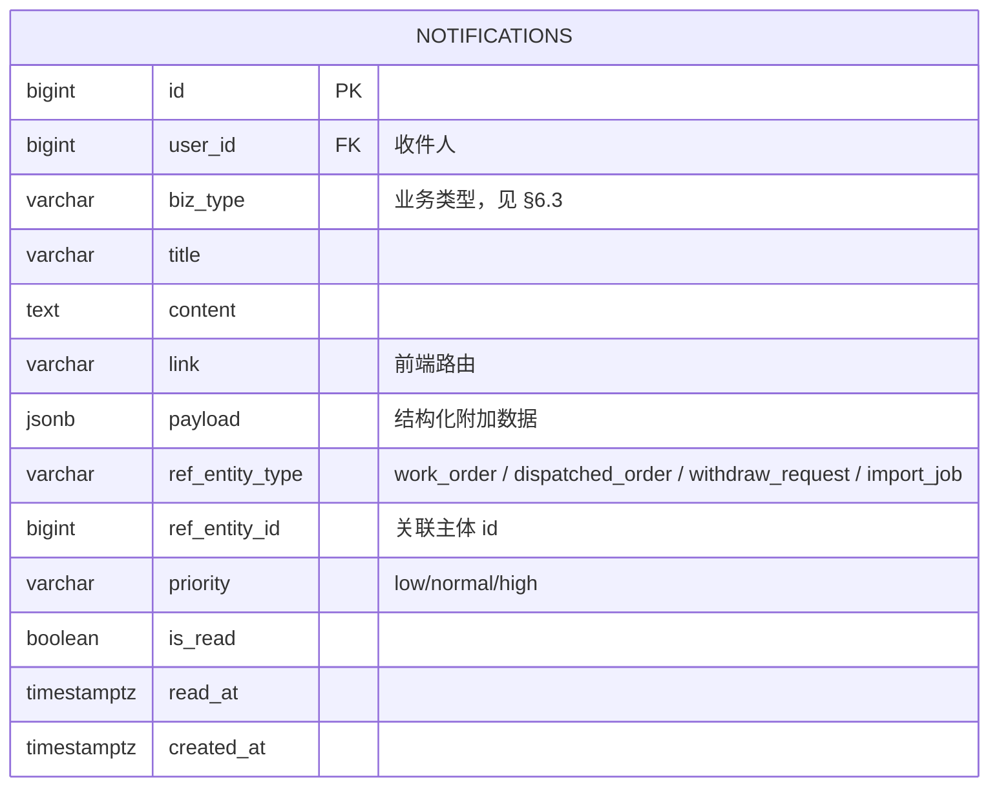
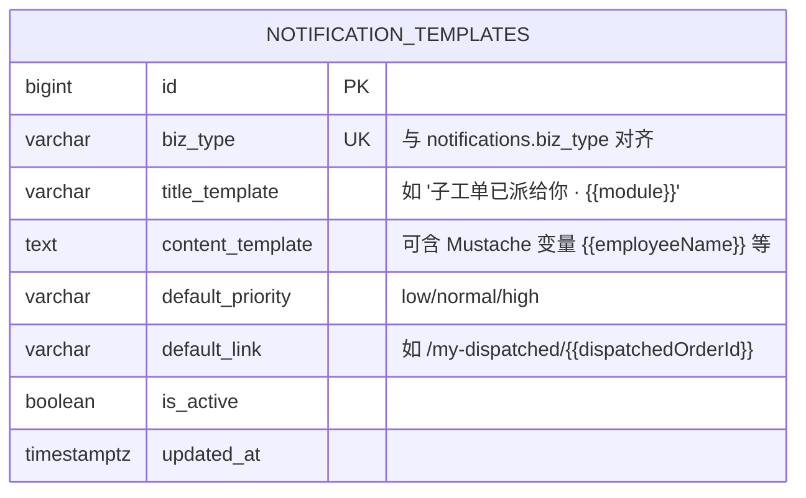

# Phase 6 · 看板与通知设计

> 版本：v1.0（Phase 6 定稿）
> 覆盖：三角色看板指标、指标 SQL、缓存策略、站内通知表设计（ER 第 20/21 张表）、推送方式、通知类型清单。
> 依赖：`docs/Phase3工单核心设计.md`、`docs/Phase4导入与回流设计.md`、`docs/Phase5撤回与审批设计.md`、`docs/数据库ER图.md`。

---

## 1. 看板总览

### 1.1 入口
- `/dashboard`（前端，路由 loader 根据当前主角色自动分发到 salesperson / team_supervisor / manager 三种 UI）。
- API：
  - `GET /api/dashboard/salesperson`
  - `GET /api/dashboard/team/:module`
  - `GET /api/dashboard/manager`

### 1.2 时间口径统一
- 默认统计周期：**本月（自然月）**。
- 支持可选查询参数：`?range=month|7d|30d|custom&from=&to=`，后端范围不得超过 90 天（避免扫描过大）。
- 所有时间基于 `work_orders.submitted_at`（更贴合"派发进入工作流"的时刻）；除非指标名称明确为 `createdAt`。

### 1.3 指标响应基础类型
```ts
interface KpiCard {
  key: string;            // 指标编码
  label: string;          // 中文标签
  value: number;          // 数值
  unit?: string;          // 例 '单'、'小时'、'%'
  trend?: {               // 环比变化（与前一周期）
    delta: number;
    pct: number;          // 百分比，保留 1 位
    direction: 'up' | 'down' | 'flat';
  };
}
interface SeriesPoint { x: string; y: number }   // x = ISO 日期或模块码
interface Series { name: string; data: SeriesPoint[] }
```

---

## 2. 业务员看板 `/api/dashboard/salesperson`

### 2.1 指标定义
| key | 标签 | 口径 |
|-----|------|------|
| `submitted_count` | 本月提单数 | `work_orders.created_by = me AND submitted_at >= month_start` |
| `in_progress_count` | 进行中 | `status = 'processing' AND created_by = me` |
| `completed_count` | 已完成 | `status = 'completed' AND completed_at >= month_start AND created_by = me` |
| `returned_count` | 被退回 | 主工单 `status = 'returned' AND created_by = me`（实时） |
| `avg_duration_hours` | 平均完成时长（小时） | 对本月 completed 工单：`avg(extract(epoch from completed_at - submitted_at)/3600)` |
| `dispatched_pending_mine` | 我需补充/配合的子工单 | 子工单 returned 给我所在主工单，且主工单 `status=returned` |

响应结构：
```ts
interface SalespersonDashboardVo {
  range: { from: string; to: string; preset: string };
  kpis: KpiCard[];
  trends: {
    submittedByDay: Series;          // 每日提单数（柱图）
    completedByDay: Series;          // 每日完成数
    statusDistribution: Series;      // 饼图：pending/processing/completed/returned/withdrawn 当前分布
  };
  recentReturned: Array<{            // 最近退回 Top 10
    workOrderId: number;
    orderNo: string;
    moduleCode: string;
    returnReason: string;
    returnedAt: string;
  }>;
}
```

### 2.2 典型 SQL
```sql
-- 提单数 / 完成数
SELECT
  COUNT(*) FILTER (WHERE submitted_at >= $month_start)                         AS submitted_count,
  COUNT(*) FILTER (WHERE status='processing')                                  AS in_progress_count,
  COUNT(*) FILTER (WHERE status='completed' AND completed_at >= $month_start)  AS completed_count,
  COUNT(*) FILTER (WHERE status='returned')                                    AS returned_count
FROM work_orders
WHERE created_by = $userId;

-- 平均完成时长
SELECT COALESCE(
  ROUND(AVG(EXTRACT(EPOCH FROM (completed_at - submitted_at))/3600)::numeric, 2),
  0
) AS avg_duration_hours
FROM work_orders
WHERE created_by = $userId
  AND status = 'completed'
  AND completed_at >= $month_start;

-- 每日提单数（按日桶化）
SELECT DATE(submitted_at AT TIME ZONE 'Asia/Shanghai') AS day,
       COUNT(*) AS cnt
FROM work_orders
WHERE created_by = $userId AND submitted_at BETWEEN $from AND $to
GROUP BY 1 ORDER BY 1;

-- 最近退回
SELECT do.id, wo.id AS work_order_id, wo.order_no, do.module_code, do.return_reason, do.updated_at AS returned_at
FROM dispatched_orders do
JOIN work_orders wo ON wo.id = do.parent_order_id
WHERE wo.created_by = $userId AND do.status='returned'
ORDER BY do.updated_at DESC
LIMIT 10;
```

---

## 3. 模块主管看板 `/api/dashboard/team/:module`

### 3.1 权限
- 访问者必须是 `<module>_supervisor` / `manager` / `admin`（否则 403）。
- `:module` 必须是 `module_handlers.module_code` 中存在值。

### 3.2 指标
| key | 标签 | 口径 |
|-----|------|------|
| `open_count` | 当前未完成子工单 | `status IN ('pending','processing') AND module_code = :m` |
| `pool_count` | 公共池中 | 同上且 `handler_id IS NULL` |
| `avg_processing_hours` | 平均处理时长 | 对本月 completed：`avg(completed_at - accepted_at)` 小时 |
| `sla_breach_count` | SLA 超时 | `status in (pending, processing)` 且 `now() - dispatched_at > SLA_HOURS` |
| `avg_handler_load` | 人均负载 | `open_count / 该模块活跃处理人数` |
| `completed_month` | 本月完成数 | module 对应 completed |
| `return_rate` | 退回率 | 本月 `returned / (completed + returned)` |

响应：
```ts
interface TeamDashboardVo {
  moduleCode: string;
  range: { from: string; to: string };
  kpis: KpiCard[];
  handlerLoad: Array<{                // 团队成员负载
    userId: number;
    name: string;
    openCount: number;
    completedMonth: number;
    avgHours: number;
    slaBreachCount: number;
  }>;
  trends: {
    completedByDay: Series;
    slaBreachByDay: Series;
  };
  topReturned: Array<{ workOrderId: number; orderNo: string; returnReason: string; returnedAt: string }>;
}
```

### 3.3 SLA 约定（本期固化）
- **派发 SLA**：`now - dispatched_at > 24h` 且仍在 `pending` → 超时。
- **处理 SLA**：`now - accepted_at > 48h` 且仍在 `processing` → 超时。
- SLA_HOURS 放配置（`config.sla.dispatchHours = 24`、`config.sla.processingHours = 48`），未来可由 admin 通过 `module` 粒度配置（本期统一值）。

### 3.4 典型 SQL
```sql
-- 人均负载
SELECT u.id AS user_id, u.real_name,
       COUNT(*) FILTER (WHERE d.status IN ('pending','processing'))                                              AS open_count,
       COUNT(*) FILTER (WHERE d.status='completed' AND d.completed_at >= $month_start)                           AS completed_month,
       COALESCE(AVG(EXTRACT(EPOCH FROM (d.completed_at - d.accepted_at))/3600)
                FILTER (WHERE d.status='completed' AND d.completed_at >= $month_start), 0)::numeric(10,2)        AS avg_hours,
       COUNT(*) FILTER (WHERE d.status IN ('pending','processing')
                          AND now() - d.dispatched_at > INTERVAL '24 hours')                                      AS sla_breach_count
FROM users u
JOIN module_handlers mh ON mh.handler_id = u.id AND mh.module_code = $m AND mh.is_active
LEFT JOIN dispatched_orders d ON d.handler_id = u.id AND d.module_code = $m
GROUP BY u.id, u.real_name
ORDER BY open_count DESC;

-- 退回率
SELECT
  COUNT(*) FILTER (WHERE status='returned' AND updated_at >= $month_start) AS r,
  COUNT(*) FILTER (WHERE status='completed' AND completed_at >= $month_start) AS c
FROM dispatched_orders
WHERE module_code = $m;
-- return_rate = r / (r + c)
```

---

## 4. 管理层看板 `/api/dashboard/manager`

### 4.1 指标
| key | 标签 | 口径 |
|-----|------|------|
| `global_submitted_month` | 全员当月提单 | `work_orders.submitted_at >= month_start` |
| `global_completed_month` | 全员当月完成 | `completed_at >= month_start` |
| `completion_rate` | 完成率 | `completed / submitted`（均为本月） |
| `avg_duration_hours` | 平均时长 | 全员 |
| `open_all` | 当前未完成（含所有模块子工单） | `status IN ('pending','processing')` |
| `return_rate_all` | 全局退回率 | 同上 |

响应：
```ts
interface ManagerDashboardVo {
  range: { from: string; to: string };
  kpis: KpiCard[];
  moduleCompletion: Array<{ moduleCode: string; completed: number; open: number; completionRate: number }>;
  trend: {
    submittedByDay: Series;
    completedByDay: Series;
    returnedByDay: Series;
  };
  topDepartments: Array<{ departmentId: number; name: string; submitted: number; completed: number }>;
}
```

### 4.2 SQL 样例
```sql
-- 模块完成率
SELECT module_code,
       COUNT(*) FILTER (WHERE status='completed' AND completed_at >= $month_start) AS completed,
       COUNT(*) FILTER (WHERE status IN ('pending','processing'))                  AS open
FROM dispatched_orders
GROUP BY module_code;

-- 趋势（按日）
SELECT DATE(submitted_at AT TIME ZONE 'Asia/Shanghai') AS d,
       COUNT(*) AS submitted
FROM work_orders
WHERE submitted_at >= $from
GROUP BY 1
ORDER BY 1;
```

---

## 5. 性能与缓存

### 5.1 复杂度
- 假设日活 500 用户、月提单 3 万、子工单 10 万规模：单次看板 SQL 平均 < 100ms（在建好索引的情况下）。
- 会聚合的关键索引：
  - `work_orders(created_by, submitted_at)`
  - `work_orders(status, completed_at)`
  - `dispatched_orders(module_code, status, completed_at)`
  - `dispatched_orders(handler_id, status)`
  - `dispatched_orders(dispatched_at)`（SLA 扫描用）

### 5.2 缓存策略
- **本期不引入 Redis**（与 Phase 1 约束一致）。
- 使用 NestJS `@nestjs/cache-manager` 内存缓存 + LRU：
  - key 结构：`dashboard:{role}:{userIdOrModule}:{range.hash}`
  - TTL：
    - salesperson / team：**60s**
    - manager：**120s**（聚合更重）
    - 手动刷新按钮直接 `?refresh=true` 绕过缓存。
  - 容量：最多 500 条；单条压缩 JSON，估算 < 5KB。
- 看板数据天然"分钟级可接受延迟"；缓存足以把 DB 压力降一个数量级。
- 后期可替换为 Redis（只改 CacheModule 的 store，不改业务代码）。

### 5.3 防穿透
- 查询参数进缓存前用 Zod 校验并规范化（防止 `?range=xxx` 绕过）。
- `manager` 仅 admin/manager 可访问，基于角色缓存键内置 `role` 维度。

---

## 6. 站内通知

### 6.1 数据模型变更（ER 图变更）

新增两张表：**`notifications`**（通知实例）与 **`notification_templates`**（通知模板，可在后台维护文案）。`notifications` 表在 Phase 1 ER 图中已预设，此次**正式纳入第 20 张表**；`notification_templates` 为**第 21 张表**（新增）。

> 注意：任务描述要求"第 20 张表"。Phase 1 ER 图将 `notifications` 预设为第 19 行补充表，但为了与 Phase 6 任务书严格对齐，本设计把 `notifications` 重新定位为**第 20 张表**（因为 Phase 1 ER 已列入 19 张），`notification_templates` 为**第 21 张表**。架构师将同步更新 `docs/数据库ER图.md` 的总表。

#### 6.1.1 `notifications`

- 索引：
  - `idx_nt_user_unread (user_id, is_read, created_at DESC)`
  - `idx_nt_ref (ref_entity_type, ref_entity_id)`
- 保留策略：90 天后清理（cron 任务）。

#### 6.1.2 `notification_templates`

- 模板由 admin 在 `/admin/notification-templates` 管理（Phase 6 增加该页面，沿用 Phase 2 设计规范）。
- 渲染用 Mustache（`mustache` 或 `handlebars` 二选一；推荐 `mustache`，极轻量，不支持逻辑仅做替换）。

### 6.2 推送方式
- **首选：SSE**（Server-Sent Events）。
  - 端点：`GET /api/notifications/stream`（Authed，长连接，单向 server→client）。
  - nginx 已预留 WebSocket/长连接 header（`connection_upgrade`），SSE 同样受益。
  - 客户端用原生 `EventSource`；断线浏览器自动重连（3s）。
- **降级：轮询**：
  - `GET /api/notifications/unread-count` 每 60s 调用一次（仅在 SSE 断开 > 15s 时启用）。
- **不选 WebSocket 的理由**：SSE 单向足够通知场景，服务端实现更简单（可走 Nest 内置 `@Sse`），不需要 socket.io 等外部依赖。

SSE 事件格式：
```
event: notification
data: {"id":1024,"bizType":"dispatched_new","title":"...","link":"...","priority":"normal","createdAt":"..."}

event: unread_count
data: {"count":3}

: heartbeat   (每 25s 发一条注释行保活)
```

### 6.3 通知类型（biz_type 枚举）

> **v1.2 变更要点**（2026-05-11）：
> - 新增 4 条 `biz_type`：`withdraw_resolved` / `password_reset_by_admin` / `assigned_as_supervisor` / `user_welcome`；保留位新增 `system_announcement`（全局公告广播）。
> - `withdraw_approved` 与 `withdraw_rejected` 在 seed 中**合并为 `withdraw_resolved`**（通过 `isApproved` 变量区分），向下兼容策略见本表注释。
> - 下表新增"默认通道"与"变量清单"两列，与 `notification_templates.default_channels` / `variables` 列一一对应；**必须**与 `backend/src/database/seeds/seed-notification-templates.ts` 保持同步。

#### 6.3.1 既有 biz_type（v1.1 之前）

| biz_type | 触发点 | 接收人 | 优先级 | 默认通道 | 变量清单 | 跨角色可见 |
|----------|--------|--------|--------|----------|----------|------------|
| `dispatched_new` | 新子工单派给 handler（非 pool）或 pool 新增（通知该模块全员） | 指定 handler 或 module 成员 | normal | `in_app` | `{dispatchedOrderId, module, orderNo, employeeName, orderTypeName}` | 该子工单 handler / 主管 |
| `dispatched_returned_to_salesperson` | 子工单被 return | 主工单 `created_by` | high | `in_app + email` | `{workOrderId, orderNo, moduleName, returnReason}` | 业务员本人；主管可列表查询 |
| `work_order_completed` | 主工单 completed（所有子工单已 completed） | `created_by` | low | `in_app` | `{workOrderId, orderNo, employeeName, orderTypeName}` | 业务员 + 部门主管 |
| `field_supplemented` | 字段被后道补充（`field_supplement_logs` 写入） | `created_by` + `sync_to_modules` handlers | normal | `in_app` | `{workOrderId, orderNo, moduleName, fieldNames, count}` | 主工单相关方 |
| `withdraw_requested` | 撤回/修改申请提交 | 全部 `withdraw_approvals.approver` | high | `in_app` | `{requestId, orderNo, requesterName, requestType, reason}` | 审批链上所有审批人 |
| `withdraw_cancelled` | 申请人自撤 | 全部 `withdraw_approvals.approver` | low | `in_app` | `{requestId, orderNo, requesterName}` | 审批链 |
| `sla_breach` | SLA 超时（每 30min 扫描一次） | 该子工单 handler + 模块主管 | high | `in_app + email` | `{dispatchedOrderId, orderNo, moduleName, elapsedHours, thresholdHours}` | 子工单 handler + 模块主管 |
| `import_done` | 批量导入完成 | 导入发起者 | normal | `in_app` | `{jobId, total, success, fail}` | 发起者 |
| `import_failed` | 批量导入失败 | 导入发起者 | high | `in_app + email` | `{jobId, errorSummary}` | 发起者 |
| `reassigned_to_you` | 主管重分派给我 | 新 handler | normal | `in_app` | `{dispatchedOrderId, orderNo, moduleName, reason}` | 新 handler |
| `pool_new` | 公共池新单 | 该模块 handlers 全体 | low | `in_app` | `{dispatchedOrderId, orderNo, moduleName}` | 该模块全员 |

#### 6.3.2 v1.2 新增 biz_type（2026-05-11）

| biz_type | 触发点 | 接收人 | 优先级 | 默认通道 | 变量清单 | 跨角色可见 |
|----------|--------|--------|--------|----------|----------|------------|
| `withdraw_resolved` | 撤回/修改申请最终决议落地（approved 或 rejected，**合并 v1.1 的 withdraw_approved / withdraw_rejected**） | 申请人 `requester_id` | high | `in_app + email` | `{workOrderId, orderNo, resultLabel, isApproved, rejectReason}` | 申请人；主管可在审批列表中查看 |
| `password_reset_by_admin` | 管理员在 `/admin/users` 触发重置密码 | 被重置的用户 | high | `in_app + email` | `{operatorName, resetAt}` | 仅本人；管理员从操作日志查 |
| `assigned_as_supervisor` | 管理员把某用户设为某模块/部门主管 | 被任命的用户 | normal | `in_app` | `{module, departmentName, operatorName, effectiveAt}` | 本人；管理员可查 |
| `user_welcome` | 新用户首次激活或管理员新建账号并下发临时密码 | 新用户 | normal | `in_app + email` | `{realName, username, tempPassword, loginUrl}` | 本人；临时密码只出现在邮件，站内通知不展示 |
| `system_announcement` | 管理员在 `/admin/announcements` 发布系统公告 | 全部启用用户 | normal（可覆写） | `in_app` | `{title, content, link}` | 全员 |

> **向后兼容说明**：
> - `withdraw_approved` / `withdraw_rejected` 旧 biz_type 不再写入新通知，但保留在枚举里供历史数据读取；`NotificationService.send()` 收到这两种时，若 `notification_templates` 里无匹配模板则自动回退到 `withdraw_resolved`（通过 `isApproved` 变量控制文案）。
> - 前端 `bizType` → icon / color 的映射表同步更新，`withdraw_resolved` 复用原 `withdraw_approved` 的绿色/红色（由 `isApproved` 决定）。
> - 历史日志 / SSE 消费端对未知 `biz_type` 走缺省模板；见 §6.4 `NotificationService.send()` 的兜底路径。


### 6.4 通知发送服务

```ts
@Injectable()
export class NotificationService {
  constructor(
    private readonly repo: NotificationsRepository,
    private readonly tpl: NotificationTemplatesRepository,
    private readonly bus: SseBus,
  ) {}

  async send(params: {
    bizType: string;
    userIds: number[];                        // 目标用户（允许批量）
    variables: Record<string, unknown>;       // 模板变量
    refEntityType?: string;
    refEntityId?: number;
  }) {
    const tpl = await this.tpl.findActive(params.bizType);
    if (!tpl) throw new Error(`missing template: ${params.bizType}`);

    const title   = Mustache.render(tpl.titleTemplate, params.variables);
    const content = Mustache.render(tpl.contentTemplate, params.variables);
    const link    = Mustache.render(tpl.defaultLink ?? '', params.variables);

    const rows = params.userIds.map(uid => ({
      userId: uid,
      bizType: params.bizType,
      title, content, link,
      payload: params.variables,
      refEntityType: params.refEntityType,
      refEntityId: params.refEntityId,
      priority: tpl.defaultPriority,
      isRead: false,
    }));
    const saved = await this.repo.bulkInsert(rows);

    for (const row of saved) this.bus.publish(row.userId, row);
  }
}
```

- `SseBus`：进程内 `EventEmitter`，key = `userId`。每个 Nest `@Sse` 控制器订阅；一个用户多标签各自拿一条。
- 发送失败不阻断业务事务：在事务提交后执行（Service 通过 `@OnEvent` 或事务钩子 `tx.commit().then(...)`）。

### 6.5 SLA 扫描任务
- NestJS `@nestjs/schedule` cron：`*/30 * * * *`（每半小时）。
- 扫描：
  ```sql
  SELECT id, module_code, handler_id, parent_order_id
  FROM dispatched_orders
  WHERE status IN ('pending','processing')
    AND (
      (status='pending'    AND now() - dispatched_at > interval '24 hours')
      OR (status='processing' AND now() - accepted_at   > interval '48 hours')
    )
  ```
- 对每条记录 `NotificationService.send({ bizType: 'sla_breach', ... })`；使用 `(dispatchedOrderId, 'sla_breach')` 做去重：一条子工单同一 biz 24 小时内只发一次（查最近一条同 `ref`）。

### 6.6 前端交互
- 右上角铃铛 `<Badge count={unreadCount}>`；点击打开 `<NotificationList />`。
- 单条点击：
  - 调 `POST /api/notifications/:id/read`
  - 跳转 `link`
- "全部已读" 按钮调 `POST /api/notifications/read-all`。
- SSE 连接建立后主动拉一次 `unread-count`，避免断线期遗漏。

### 6.7 接口清单
| 方法 | 路径 | 功能 |
|------|------|------|
| GET | `/api/notifications` | 分页列表（支持 `isRead`、`bizType` 过滤） |
| GET | `/api/notifications/unread-count` | 未读数 |
| GET | `/api/notifications/stream` | SSE 订阅 |
| POST | `/api/notifications/:id/read` | 标记已读 |
| POST | `/api/notifications/read-all` | 全部已读 |
| GET / POST / PUT / DELETE | `/api/admin/notification-templates*` | 模板 CRUD（admin） |

### 6.8 DTO
```ts
export class QueryNotificationsDto extends BasePaginationDto {
  @IsOptional() @IsBoolean() isRead?: boolean;
  @IsOptional() @IsString() bizType?: string;
  @IsOptional() @IsString() priority?: 'low' | 'normal' | 'high';
}

export interface NotificationItemVo {
  id: number;
  bizType: string;
  title: string;
  content: string;
  link?: string;
  priority: 'low' | 'normal' | 'high';
  refEntityType?: string;
  refEntityId?: number;
  isRead: boolean;
  createdAt: string;
  readAt?: string;
}

export class UpsertNotificationTemplateDto {
  @IsString() bizType!: string;
  @IsString() titleTemplate!: string;
  @IsString() contentTemplate!: string;
  @IsOptional() @IsString() defaultLink?: string;
  @IsIn(['low','normal','high']) defaultPriority!: 'low'|'normal'|'high';
  @IsOptional() @IsBoolean() isActive?: boolean;
}
```

---

## 7. 默认模板 Seed（纳入 Phase 1 seed）

```ts
const TEMPLATES = [
  { bizType: 'dispatched_new', titleTemplate: '【新子工单】{{module}}-{{orderNo}}', contentTemplate: '员工：{{employeeName}}，请尽快处理。', defaultLink: '/my-dispatched/{{dispatchedOrderId}}', defaultPriority: 'normal' },
  { bizType: 'dispatched_returned_to_salesperson', titleTemplate: '工单 {{orderNo}} 被退回', contentTemplate: '{{module}} 模块退回原因：{{reason}}', defaultLink: '/work-orders/{{workOrderId}}', defaultPriority: 'high' },
  { bizType: 'work_order_completed', titleTemplate: '工单 {{orderNo}} 已完成', contentTemplate: '员工 {{employeeName}} 的 {{orderType}} 工单全部交付完成。', defaultLink: '/work-orders/{{workOrderId}}', defaultPriority: 'low' },
  { bizType: 'field_supplemented', titleTemplate: '工单 {{orderNo}} 新增 {{count}} 字段', contentTemplate: '{{module}} 模块已补充字段：{{fieldNames}}', defaultLink: '/work-orders/{{workOrderId}}', defaultPriority: 'normal' },
  { bizType: 'withdraw_requested', titleTemplate: '【撤回审批】{{orderNo}}', contentTemplate: '{{requesterName}} 申请 {{requestType}}：{{reason}}', defaultLink: '/withdraw/{{requestId}}', defaultPriority: 'high' },
  { bizType: 'withdraw_approved', titleTemplate: '【撤回通过】{{orderNo}}', contentTemplate: '您的申请已通过。', defaultLink: '/work-orders/{{workOrderId}}', defaultPriority: 'high' },
  { bizType: 'withdraw_rejected', titleTemplate: '【撤回被拒】{{orderNo}}', contentTemplate: '原因：{{reason}}', defaultLink: '/work-orders/{{workOrderId}}', defaultPriority: 'high' },
  { bizType: 'withdraw_cancelled', titleTemplate: '【撤回取消】{{orderNo}}', contentTemplate: '申请人已取消。', defaultPriority: 'low' },
  { bizType: 'sla_breach', titleTemplate: '【SLA 超时】{{module}}-{{orderNo}}', contentTemplate: '已超 {{threshold}} 小时未处理。', defaultLink: '/my-dispatched/{{dispatchedOrderId}}', defaultPriority: 'high' },
  { bizType: 'import_done', titleTemplate: '导入任务 #{{jobId}} 完成', contentTemplate: '成功 {{success}}/{{total}}，失败 {{fail}}。', defaultLink: '/work-orders/import', defaultPriority: 'normal' },
  { bizType: 'import_failed', titleTemplate: '导入任务 #{{jobId}} 失败', contentTemplate: '{{errorSummary}}', defaultLink: '/work-orders/import', defaultPriority: 'high' },
  { bizType: 'reassigned_to_you', titleTemplate: '子工单重新分派给您：{{module}}-{{orderNo}}', contentTemplate: '{{reason}}', defaultLink: '/my-dispatched/{{dispatchedOrderId}}', defaultPriority: 'normal' },
  { bizType: 'pool_new', titleTemplate: '【新公共池任务】{{module}}', contentTemplate: '工单 {{orderNo}} 待认领。', defaultLink: '/my-dispatched?onlyPool=true', defaultPriority: 'low' },
];
```

---

## 8. 测试

### 8.1 单测
- `NotificationService.send`：模板变量替换、缺少模板抛错、批量 userIds 按用户维度落库。
- SLA 扫描去重：同子工单 24 小时内只发一条 `sla_breach`。

### 8.2 e2e
- 业务员提交工单 → handler A 收到 SSE 事件 + 列表出现 + unreadCount +1。
- 模拟 SLA 超时（插入 `dispatched_at` 为 25 小时前的子工单）→ cron 执行后 handler 收到 sla_breach。
- 导入任务完成 → 发起者收到 import_done；失败时发起者收到 import_failed。

---

## 9. 运维与观测
- 结构化日志：`notification_sent`, `sse_connected`, `sse_dropped`。
- 慢查询阈值：看板 SQL > 500ms 告警；缓存命中率指标记入日志。
- SSE 连接上限：单进程建议 ≤ 2000（Node 事件循环可承），超过需上层 nginx sticky + 多实例（Phase 1 不需要）。

---

## 10. 变更纪律
- `notifications` / `notification_templates` 必须同步更新至 `docs/数据库ER图.md` 并广播 `[架构变更]`。
- biz_type 枚举扩展走 `[架构变更]`；任何新类型必须一并在 `notification_templates` 有默认模板。
- 看板指标口径（SLA 阈值、平均时长统计窗口等）调整，同样需要架构师签字并更新本文件。

---

## 11. 看板 SQL 基线 + 响应 DTO（v1.2 增补 · 2026-05-11）

> 本节把 §2/§3/§4 的零散 SQL 统一成可 copy 的"基线 SQL + 缓存策略 + 响应 DTO + 前端图表建议"。所有时间按 `Asia/Shanghai` 展示，DB 以 UTC 存储；使用 `date_trunc('month', created_at AT TIME ZONE 'Asia/Shanghai')` 做月度切片。
>
> 与 Phase 3 的联动：查询返回的 `workOrderId` / `dispatchedOrderId` 均是前端"下钻跳转详情页"的锚点。

### 11.1 业务员看板 `/api/dashboard/salesperson`

#### 11.1.1 SQL（PostgreSQL 16）

```sql
-- 参数：:userId（当前业务员）
-- 产物：本月计数 + 同比 + 月内趋势（按天）
WITH bounds AS (
  SELECT
    date_trunc('month', now() AT TIME ZONE 'Asia/Shanghai')                AS cur_start,
    date_trunc('month', now() AT TIME ZONE 'Asia/Shanghai') + interval '1 month' AS cur_end,
    date_trunc('month', now() AT TIME ZONE 'Asia/Shanghai') - interval '1 month' AS prev_start,
    date_trunc('month', now() AT TIME ZONE 'Asia/Shanghai')                AS prev_end
),
cur AS (
  SELECT
    COUNT(*) FILTER (WHERE wo.status <> 'draft')                                           AS submitted,
    COUNT(*) FILTER (WHERE wo.status = 'draft' OR wo.created_at >= (SELECT cur_start FROM bounds)) AS created,
    COUNT(*) FILTER (WHERE wo.status = 'completed')                                        AS completed,
    COUNT(*) FILTER (WHERE EXISTS (
      SELECT 1 FROM dispatched_orders d
       WHERE d.work_order_id = wo.id AND d.status = 'returned'))                           AS returned,
    COUNT(*) FILTER (WHERE wo.status = 'withdrawn')                                        AS withdrawn
  FROM work_orders wo, bounds
  WHERE wo.created_by = :userId
    AND wo.created_at >= bounds.cur_start
    AND wo.created_at <  bounds.cur_end
),
prev AS (
  SELECT
    COUNT(*) FILTER (WHERE wo.status <> 'draft') AS submitted,
    COUNT(*)                                     AS created,
    COUNT(*) FILTER (WHERE wo.status = 'completed') AS completed
  FROM work_orders wo, bounds
  WHERE wo.created_by = :userId
    AND wo.created_at >= bounds.prev_start
    AND wo.created_at <  bounds.prev_end
),
trend AS (
  SELECT
    to_char(d::date, 'YYYY-MM-DD')                                        AS bucket,
    COUNT(wo.id) FILTER (WHERE wo.status <> 'draft')                      AS submitted,
    COUNT(wo.id) FILTER (WHERE wo.status = 'completed')                   AS completed
  FROM bounds b
  CROSS JOIN generate_series(b.cur_start, b.cur_end - interval '1 day', interval '1 day') d
  LEFT JOIN work_orders wo
    ON wo.created_by = :userId
   AND date_trunc('day', wo.created_at AT TIME ZONE 'Asia/Shanghai') = d
  GROUP BY d
  ORDER BY d
)
SELECT json_build_object(
  'current',  row_to_json(cur.*),
  'previous', row_to_json(prev.*),
  'deltaPct', json_build_object(
    'submitted', CASE WHEN prev.submitted = 0 THEN NULL ELSE round((cur.submitted - prev.submitted)::numeric * 100 / prev.submitted, 1) END,
    'completed', CASE WHEN prev.completed = 0 THEN NULL ELSE round((cur.completed - prev.completed)::numeric * 100 / prev.completed, 1) END
  ),
  'trend', (SELECT json_agg(row_to_json(trend.*) ORDER BY bucket) FROM trend)
) AS payload
FROM cur, prev;
```

#### 11.1.2 缓存与 TTL

- 键：`dashboard:salesperson:{userId}:{yyyymm}`
- TTL：**60 秒**（短 TTL，因为业务员自己会马上看到"我刚才提交的单是否计入"）
- 失效策略：`WorkOrderService.submit / complete / withdraw` 写入后主动 `cache.del(key)`；其余依赖 TTL 自然过期。
- 防穿透：用户无数据时也写 `{empty:true}` 占位 30s。

#### 11.1.3 响应 DTO

```ts
export interface SalespersonDashboardVo {
  current: {
    created: number;
    submitted: number;
    completed: number;
    returned: number;
    withdrawn: number;
  };
  previous: { created: number; submitted: number; completed: number };
  deltaPct: { submitted: number | null; completed: number | null };
  trend: Array<{ bucket: string; submitted: number; completed: number }>;
}
```

#### 11.1.4 前端图表

| 区块 | 图表 | 理由 |
|------|------|------|
| 5 个指标卡 | 数字卡 + 同比箭头（绿升 / 红降） | 直观 |
| 月内趋势 | `echarts` 折线图，X=日期，Y=提交数 + 完成数（两条线） | 时间序列 |
| 异常提示 | 当 `returned / submitted > 10%` 时卡片变红并给文字提示 | 主动发现问题 |

---

### 11.2 团队主管看板 `/api/dashboard/team/:module`

#### 11.2.1 SQL

```sql
-- 参数：:module（contract / onboarding_contact / data_entry / social_security）
--      :supervisorDeptId（当前主管所在部门）
WITH team_ids AS (
  SELECT ur.user_id
    FROM user_roles ur
    JOIN module_handlers mh ON mh.user_id = ur.user_id
   WHERE mh.module_code = :module
     AND ur.department_id = :supervisorDeptId
),
cur_do AS (
  SELECT d.*
    FROM dispatched_orders d
   WHERE d.module_code = :module
     AND (d.handler_id IN (SELECT user_id FROM team_ids) OR d.handler_id IS NULL)
     AND d.created_at >= date_trunc('month', now() AT TIME ZONE 'Asia/Shanghai')
),
counts AS (
  SELECT
    COUNT(*) FILTER (WHERE status = 'pending')                  AS pending,
    COUNT(*) FILTER (WHERE status = 'processing')               AS processing,
    COUNT(*) FILTER (WHERE status = 'completed')                AS completed,
    COUNT(*) FILTER (WHERE status = 'returned')                 AS returned,
    COUNT(*) FILTER (
      WHERE status IN ('pending','processing')
        AND EXTRACT(EPOCH FROM (now() - dispatched_at)) / 3600 > 48
    )                                                           AS sla_breach
  FROM cur_do
),
per_member AS (
  SELECT
    u.id                      AS user_id,
    u.real_name,
    COUNT(d.id)                                         AS total,
    COUNT(d.id) FILTER (WHERE d.status = 'completed')   AS completed,
    AVG(EXTRACT(EPOCH FROM (d.completed_at - d.accepted_at))) FILTER (WHERE d.status = 'completed')
                                                        AS avg_handle_seconds,
    COUNT(d.id) FILTER (
      WHERE d.status IN ('pending','processing')
    )                                                   AS in_flight
  FROM team_ids t
  JOIN users u ON u.id = t.user_id
  LEFT JOIN cur_do d ON d.handler_id = u.id
  GROUP BY u.id, u.real_name
),
top5 AS (
  SELECT user_id, real_name, completed, avg_handle_seconds
    FROM per_member
   WHERE completed > 0
   ORDER BY avg_handle_seconds ASC NULLS LAST, completed DESC
   LIMIT 5
),
pool AS (
  SELECT COUNT(*) AS pool_pending
    FROM cur_do
   WHERE status = 'pending' AND handler_id IS NULL
)
SELECT json_build_object(
  'counts',  (SELECT row_to_json(counts.*) FROM counts),
  'pool',    (SELECT row_to_json(pool.*)   FROM pool),
  'top5',    (SELECT json_agg(row_to_json(top5.*)) FROM top5),
  'members', (SELECT json_agg(row_to_json(per_member.*) ORDER BY real_name) FROM per_member)
) AS payload;
```

#### 11.2.2 缓存与 TTL

- 键：`dashboard:team:{module}:{deptId}:{yyyymmdd}`
- TTL：**30 秒**
- 失效：`DispatchedOrderService.{accept,complete,return}` 主动删键。
- 防穿透：Top5 无数据时写 `{top5: []}` 占位 60s。

#### 11.2.3 DTO

```ts
export interface TeamDashboardVo {
  counts: { pending: number; processing: number; completed: number; returned: number; slaBreach: number };
  pool:   { poolPending: number };
  top5:   Array<{ userId: number; realName: string; completed: number; avgHandleSeconds: number | null }>;
  members: Array<{
    userId: number;
    realName: string;
    total: number;
    completed: number;
    avgHandleSeconds: number | null;
    inFlight: number;
  }>;
}
```

#### 11.2.4 前端图表

| 区块 | 图表 |
|------|------|
| 5 个计数卡 + 池子待领卡 | 数字卡；`slaBreach > 0` 红色闪烁 |
| Top 5 | 横向柱状，X=完成单数，Y=姓名；悬浮展示平均耗时 |
| 成员分布 | 堆叠柱图（pending + processing + completed），每个成员一根 |
| SLA 超期详情 | 表格 + 跳转到子工单详情 |

---

### 11.3 管理层看板 `/api/dashboard/manager`

#### 11.3.1 SQL

```sql
-- 参数：无（管理员看全量）
WITH bounds AS (
  SELECT
    date_trunc('month', now() AT TIME ZONE 'Asia/Shanghai') AS cur_start,
    date_trunc('month', now() AT TIME ZONE 'Asia/Shanghai') + interval '1 month' AS cur_end
),
module_summary AS (
  SELECT
    d.module_code,
    COUNT(*)                                              AS total,
    COUNT(*) FILTER (WHERE d.status = 'pending')          AS pending,
    COUNT(*) FILTER (WHERE d.status = 'processing')       AS processing,
    COUNT(*) FILTER (WHERE d.status = 'completed')        AS completed,
    COUNT(*) FILTER (WHERE d.status = 'returned')         AS returned,
    ROUND(AVG(EXTRACT(EPOCH FROM (d.completed_at - d.dispatched_at))/3600)
          FILTER (WHERE d.status = 'completed'), 2)       AS avg_h
  FROM dispatched_orders d, bounds b
  WHERE d.created_at >= b.cur_start AND d.created_at < b.cur_end
  GROUP BY d.module_code
),
customer_top AS (
  SELECT
    wo.extra_data->>'customer_code' AS customer_code,
    wo.extra_data->>'customer_name' AS customer_name,
    COUNT(*) AS orders
  FROM work_orders wo, bounds b
  WHERE wo.created_at >= b.cur_start AND wo.created_at < b.cur_end
    AND wo.status <> 'draft'
  GROUP BY 1, 2
  ORDER BY orders DESC
  LIMIT 10
),
ratios AS (
  SELECT
    COUNT(*) AS total_submitted,
    COUNT(*) FILTER (WHERE EXISTS (
      SELECT 1 FROM dispatched_orders d WHERE d.work_order_id = wo.id AND d.status = 'returned'
    ))::numeric / NULLIF(COUNT(*),0)                      AS return_ratio,
    COUNT(*) FILTER (WHERE wo.status = 'withdrawn')::numeric / NULLIF(COUNT(*),0) AS withdraw_ratio,
    AVG(EXTRACT(EPOCH FROM (wo.completed_at - wo.submitted_at)) / 3600)
      FILTER (WHERE wo.status = 'completed')              AS avg_close_hours
  FROM work_orders wo, bounds b
  WHERE wo.created_at >= b.cur_start AND wo.created_at < b.cur_end
    AND wo.status <> 'draft'
),
daily_trend AS (
  SELECT
    to_char(d.day, 'YYYY-MM-DD') AS bucket,
    COUNT(wo.id) FILTER (WHERE wo.status <> 'draft') AS submitted,
    COUNT(wo.id) FILTER (WHERE wo.status = 'completed') AS completed
  FROM bounds b
  CROSS JOIN generate_series(b.cur_start, b.cur_end - interval '1 day', interval '1 day') d(day)
  LEFT JOIN work_orders wo
    ON date_trunc('day', wo.created_at AT TIME ZONE 'Asia/Shanghai') = d.day
  GROUP BY d.day
  ORDER BY d.day
)
SELECT json_build_object(
  'modules',  (SELECT json_agg(row_to_json(module_summary.*)) FROM module_summary),
  'topCustomers', (SELECT json_agg(row_to_json(customer_top.*)) FROM customer_top),
  'ratios',   (SELECT row_to_json(ratios.*) FROM ratios),
  'trend',    (SELECT json_agg(row_to_json(daily_trend.*)) FROM daily_trend)
) AS payload;
```

#### 11.3.2 缓存与 TTL

- 键：`dashboard:manager:{yyyymm}`
- TTL：**5 分钟**（300 秒），仅在 `work_orders.status` 进入终态时 `cache.del`。
- 预热：每天 00:10 通过 node-cron 触发一次全量计算，写入缓存；避免早班高峰第一个查询承担冷启动。
- 防穿透：空库时写 `{empty:true}` 占位 10 分钟。

#### 11.3.3 DTO

```ts
export interface ManagerDashboardVo {
  modules: Array<{
    moduleCode: 'contract' | 'onboarding_contact' | 'data_entry' | 'social_security';
    total: number;
    pending: number;
    processing: number;
    completed: number;
    returned: number;
    avgH: number | null;
  }>;
  topCustomers: Array<{ customerCode: string; customerName: string; orders: number }>;
  ratios: {
    totalSubmitted: number;
    returnRatio: number | null;   // 0~1
    withdrawRatio: number | null;
    avgCloseHours: number | null;
  };
  trend: Array<{ bucket: string; submitted: number; completed: number }>;
}
```

#### 11.3.4 前端图表

| 区块 | 图表 |
|------|------|
| 4 模块汇总 | 横向柱状图（堆叠：pending / processing / completed / returned） |
| Top 10 客户 | 横向条形图 + 文字列表 |
| 比率区 | 3 个比率 + 平均时长数字卡；`returnRatio > 8%` 红色 |
| 月度趋势 | 折线图双 Y（左=提交，右=完成），支持下载 CSV |

---

### 11.4 索引建议（支撑上述 SQL）

> 以下索引若不存在，在各自 migration 中补齐（对应 `docs/Phase2到Phase6_migration清单.md`）。

```sql
-- work_orders
CREATE INDEX IF NOT EXISTS idx_wo_created_by_month
  ON work_orders (created_by, date_trunc('month', created_at));
CREATE INDEX IF NOT EXISTS idx_wo_status_created
  ON work_orders (status, created_at);
CREATE INDEX IF NOT EXISTS idx_wo_extra_data_gin
  ON work_orders USING gin (extra_data);           -- 支持 extra_data->>'customer_code'

-- dispatched_orders
CREATE INDEX IF NOT EXISTS idx_do_module_handler_status
  ON dispatched_orders (module_code, handler_id, status);
CREATE INDEX IF NOT EXISTS idx_do_module_created
  ON dispatched_orders (module_code, created_at);
CREATE INDEX IF NOT EXISTS idx_do_sla_scan
  ON dispatched_orders (status, dispatched_at)
  WHERE status IN ('pending', 'processing');
```

### 11.5 与 v1.2 的关系

- 本节 SQL 不涉及 `notification_templates` 新列，**与 v1.2 schema 解耦**；
- `ratios.withdrawRatio` 依赖 `work_orders.status='withdrawn'`，由 `settleWithdrawRequest()` 写入（见 `Phase5撤回与审批设计.md` §10.3）；
- 若未来新增 `dashboard:compliance` 等看板，按本节四元组（SQL / 缓存 / DTO / 图表）模板补齐。

