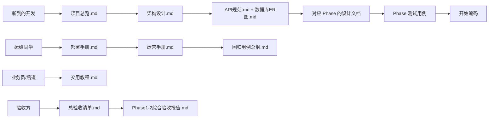

# 📚 docs 文档导航

> 项目全部文档（当前共 60+ 份）集中在此；新增 `项目移交文档终审报告.md` / `GO-NOGO决策支持.md` 作为移交决策入口。
>
> 先读 **入场必读**；部署与日常运营看 **部署运营**；做功能开发看对应 **Phase 设计**；做测试看 **测试**；其它专项按需。

---

## 📋 入场必读

| 文档 | 一句话描述 |
|------|------------|
| [项目总览.md](项目总览.md) | 整体业务背景、技术栈、模块拆分、部署拓扑，新同事第一份读物 |
| [架构设计.md](架构设计.md) | 后端分层、前端结构、派发引擎抽象、字段权限抽象的细化说明 |
| [API规范.md](API规范.md) | 全部 HTTP 接口清单、统一响应、错误码、鉴权约定 |
| [数据库ER图.md](数据库ER图.md) | 19 张业务表 ER 图（mermaid）+ 字段语义 + 索引策略 |
| [开发规范.md](开发规范.md) | 目录/命名/Git/TypeScript 风格/安全底线 |
| [AI修改前必读.md](AI修改前必读.md) | AI/开发人员每次改代码前必须读取的规则入口 |
| [业务规则回归清单.md](业务规则回归清单.md) | 已确认业务规则、角色菜单、状态/月规则的回归清单 |
| [AI修改记录.md](AI修改记录.md) | AI/开发人员每次修改后的要求、规则覆盖、commit 和验证记录 |
| [架构变更日志.md](架构变更日志.md) | 每次大范围设计改动的原因、日期、影响面 |

## 🚀 部署运营

| 文档 | 一句话描述 |
|------|------------|
| [部署手册.md](部署手册.md) | Docker Compose / Windows 原生两种路径，从 0 到可用的完整 SOP |
| [运营手册.md](运营手册.md) | 用户/客户/字段/数据修正/升级/事故应急/备份恢复/监控告警 8 大动作 |

## 📐 Phase 1–6 设计文档

### Phase 1 · 基础设施与认证
- [Phase1测试用例.md](Phase1测试用例.md) — Phase 1 的后端 & 前端测试用例
- [Phase1验收清单.md](Phase1验收清单.md) — Phase 1 交付门禁
- [Phase1验收报告.md](Phase1验收报告.md) — Phase 1 实际验收记录

### Phase 2 · 管理后台
- [Phase2管理后台设计.md](Phase2管理后台设计.md) — 用户/角色/部门/客户/字段/权限/派发规则/模板管理的全量设计
- [Phase2到Phase6_migration清单.md](Phase2到Phase6_migration清单.md) — 所有版本迁移脚本目录
- [Phase2测试用例.md](Phase2测试用例.md) — Phase 2 后端用例
- [Phase2前端测试用例.md](Phase2前端测试用例.md) — Phase 2 前端用例

### Phase 3 · 工单核心 + 派发引擎 + 字段权限
- [Phase3工单核心设计.md](Phase3工单核心设计.md) — 状态机 / 派发时序 / DispatchEngine 接口 / FieldPermission 拦截器
- [DispatchEngine-JSON-AST规范.md](DispatchEngine-JSON-AST规范.md) — 派发 AST 语法 + evaluator 契约
- [Phase3前后端联调契约.md](Phase3前后端联调契约.md) — HTTP 契约 + 字段脱敏 + 错误码映射
- [Phase3前后端联调验证清单.md](Phase3前后端联调验证清单.md) — 前后端对接逐项清单
- [Phase3测试用例.md](Phase3测试用例.md) — Phase 3 全面用例
- [Phase3列表接口压测脚本原型.md](Phase3列表接口压测脚本原型.md) — k6 压测骨架
- [Phase3复测脚本.md](Phase3复测脚本.md) — 返工后回归脚本
- [Phase3后端返工指导.md](Phase3后端返工指导.md) — **Phase 3 后端被评审打回的 P0/P1/P2 清单与验收准则**
- [Phase3字段权限拦截器设计.md](Phase3字段权限拦截器设计.md) — Interceptor + 装饰器 + 4 态输出协议
- [Phase3派发触发调度设计.md](Phase3派发触发调度设计.md) — submit → dispatched → accept/complete/return 的端到端调度

### Phase 4 · 批量导入与 AI 映射
- [Phase4导入与回流设计.md](Phase4导入与回流设计.md) — Excel 解析、AI 映射、失败报告、回流字段补充
- [Phase4AI导入服务分层设计.md](Phase4AI导入服务分层设计.md) — AI 服务的接口/缓存/降级/成本控制
- [Phase4AI映射样本库.md](Phase4AI映射样本库.md) — 训练样本规范与增量机制
- [Phase4测试用例.md](Phase4测试用例.md) — Phase 4 用例

### Phase 5 · 撤回与审批
- [Phase5撤回与审批设计.md](Phase5撤回与审批设计.md) — withdraw_requests / approvals / auto_agree / admin 强制
- [Phase5测试用例.md](Phase5测试用例.md) — Phase 5 用例

### Phase 6 · 看板与通知
- [Phase6看板与通知设计.md](Phase6看板与通知设计.md) — 三层看板 + SSE + 未读桶聚合
- [Phase6测试用例.md](Phase6测试用例.md) — Phase 6 用例

## 🧪 测试

| 文档 | 一句话描述 |
|------|------------|
| [测试策略.md](测试策略.md) | 单元/集成/e2e/性能/回归五层金字塔与工具选型 |
| [回归用例总纲.md](回归用例总纲.md) | L0/L1/L2/L3 四级回归 + 52 条用例 + 发布门禁 |
| [业务规则回归清单.md](业务规则回归清单.md) | 本项目当前必须守住的业务规则回归项；配合根目录 `回归测试.ps1` 使用 |
| [性能测试计划.md](性能测试计划.md) | 核心接口压测目标与 k6 脚本规范 |
| [Phase1-2综合验收报告.md](Phase1-2综合验收报告.md) | Phase 1 + Phase 2 交付后的综合评估 |

## 🔧 专项

| 文档 | 一句话描述 |
|------|------------|
| [DispatchEngine-JSON-AST规范.md](DispatchEngine-JSON-AST规范.md) | 派发规则的 AST 正式语法（别名见上） |
| [Phase4AI映射样本库.md](Phase4AI映射样本库.md) | AI 映射训练数据规约（别名见上） |
| [WCAG 合规检查清单.md](WCAG%20合规检查清单.md) | 前端无障碍检查项 |
| [总验收清单.md](总验收清单.md) | 终用户 71 项验收 checklist |
| [交用教程.md](交用教程.md) | 面向业务员/后道的操作手把手教程 |
| [项目移交文档终审报告.md](项目移交文档终审报告.md) | 架构师对 60+ 文档的终审结论（2026-05-11） |
| [GO-NOGO决策支持.md](GO-NOGO决策支持.md) | GO / NO-GO 决策支持：闭环状态 + 风险矩阵 + 首周观察清单 |

## ⚠️ 已知问题

| 文档 | 一句话描述 |
|------|------------|
| [Phase1已知问题.md](Phase1已知问题.md) | Phase 1 试运行期暴露的问题清单与修复状态 |
| [Phase2已知问题.md](Phase2已知问题.md) | Phase 2 试运行期问题清单 |
| [Phase3已知问题.md](Phase3已知问题.md) | Phase 3 试运行期问题清单 |

---

## 📖 阅读路线推荐

---

## 变更日志

- v1.2（2026-06-08）：新增 `AI修改记录.md`，明确“用户最新明确要求优先于既有规则”，并要求冲突时同步更新规则清单和测试。
- v1.1（2026-06-08）：新增 `AI修改前必读.md`、`业务规则回归清单.md`，并增加根目录 `回归测试.ps1` 作为固定回归入口。
- v1.0（2026-05-11）：初版导航；覆盖 docs/ 全部 42 份 md 文档（新增本文件与 `总验收清单.md` / `交用教程.md` 合计 45 份）。