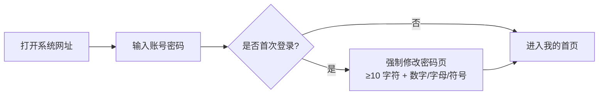
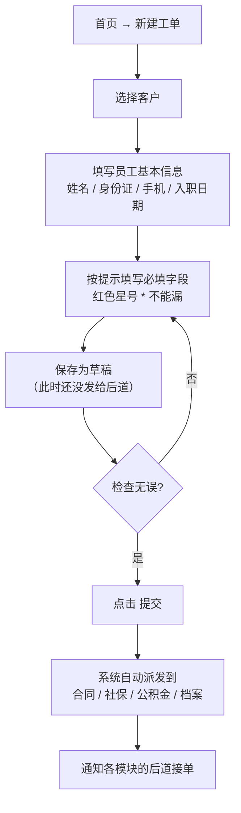
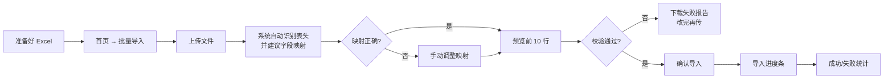
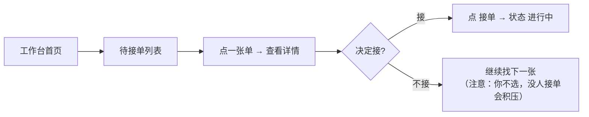
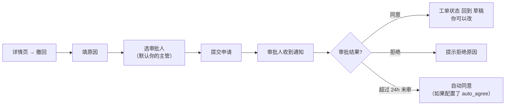

# 交用教程（给业务员和后道同学）

> 版本：v1.0（2026-05-11）
> 面向：**使用系统的业务人员**，不是开发。
>
> 这份教程不讲技术原理，只讲"点哪里、填什么、会看到什么"。遇到搞不懂的按钮或错误提示，可以翻到本文底部的 **常见问题 FAQ**。

---

## 目录
- [1. 登录系统](#1-登录系统)
- [2. 理解你的角色和权限](#2-理解你的角色和权限)
- [3. 业务员：新建一张入职工单](#3-业务员新建一张入职工单)
- [4. 业务员：批量导入 Excel](#4-业务员批量导入-excel)
- [5. 后道：接单、完成、退回](#5-后道接单完成退回)
- [6. 后道：导出应用模板](#6-后道导出应用模板)
- [7. 发起撤回申请](#7-发起撤回申请)
- [8. 看看板理解自己的工作量](#8-看看板理解自己的工作量)
- [附：常见问题 FAQ](#附常见问题-faq)

---

## 1. 登录系统

**一步一步**：

1. 在浏览器打开管理员给你的网址（公司内网，比如 `http://workflow.company.local`）；
2. 输入管理员分配的账号和临时密码（常见格式：`张三` / `Abc@2026`）；
3. 如果是第一次登录，系统会强制你改密码。**新密码要求**：10 位以上、至少 1 个数字 + 1 个字母 + 1 个符号；
4. 改完密码自动进入"我的首页"。

**注意**：
- 密码输错 5 次账号会锁 15 分钟，别着急反复试；
- 找不到账号/忘记密码 → 联系公司 IT 重置，**不要**让同事发自己的密码；
- 系统会自动续签你的登录状态，正常操作不用反复登。

---

## 2. 理解你的角色和权限

系统里的角色一共 5 种：

| 角色 | 你能做什么 |
|------|-----------|
| **业务员**（`salesperson`） | 建单、导入 Excel、查自己建的单、发起撤回 |
| **后道**（`handler`） | 接自己模块的子工单、处理、完成、退回 |
| **模块主管**（`supervisor`） | 看自己模块的所有工单、改派、看模块看板 |
| **管理员**（`admin`） | 全部操作 + 系统配置 + 强制审批 |
| **访客**（`viewer`） | 只看不改（审计 / 新同事观摩） |

> 你属于哪种？头像右上角鼠标悬停或左上菜单「我的」→「个人信息」能看到。

**字段权限的"四种颜色"**：看工单详情时，一个字段可能长这样：

- ⬜ **可见**：正常显示，可以改（如果接口允许）；
- 🔒 **只读**：正常显示，不能改（灰色）；
- ▇▇▇▇ **脱敏**：比如手机号显示成 `138****5678`，代表你能看存在这个人但看不到具体号码；
- ❌ **隐藏**：字段不显示。

如果觉得自己该看的看不到，找模块主管加权限。

---

## 3. 业务员：新建一张入职工单

**一步一步**：

1. 左侧菜单点「我的工单」→ 右上角「新建工单」；
2. **选客户**：从下拉列表选这个员工所属的客户公司（如果没有，找管理员先创建客户）；
3. **填写基本字段**：
   - 带红色 `*` 的是必填；
   - 有些字段是"条件必填"，比如"户籍地 ≠ 本地工作地"时会要求填"暂住证号"；
   - 身份证号、手机号会自动校验格式，格式错了点击「提交」会报错；
4. 点击右下「保存草稿」先把信息存下来，不会通知后道；
5. 再次确认所有信息无误后，点击「提交」。**一旦提交，后道立刻收到任务**；
6. 提交后你会跳到详情页，能看到"派发结果"：哪些模块、分给了谁；
7. 如果提示"当前工单未命中任何派发规则"，找管理员配派发规则。

**友情提示**：
- 提交前草稿可以改任意次；
- 提交后不能直接改 → 要改就发「撤回申请」（看 §7）；
- 如果误点了提交，可以马上点「撤回」。

---

## 4. 业务员：批量导入 Excel

**一步一步**：

1. 用公司的 Excel 模板整理好员工数据（在导入页面可以下载空模板）；
2. 左侧菜单「我的工单」→ 右上角「批量导入」；
3. 拖拽 Excel 文件到上传区，或点击选文件；
4. 系统会自动用 AI 猜表头对应哪些字段，比如你的列叫"身份证号码"，它会映射到字段 `id_card_no`；
5. 页面上会出现"映射表"，左列是你的 Excel 表头，右列是系统字段。**检查一下**，不对的点下拉改掉；
6. 点「下一步」，系统预览前 10 行 + 告诉你：
   - ✅ 多少行校验通过
   - ❌ 多少行有问题（如身份证格式错、必填字段缺失）
7. 如果有失败行，点「下载失败报告」，Excel 每行会告诉你哪个字段错了，改完**重新上传**；
8. 没问题点「确认导入」；
9. 进度条跑完后看"导入结果"：成功多少条、失败多少条；失败的可以再下载报告修后重导。

**注意**：
- 一次建议不超过 1000 条；更大的分多次；
- 同一个文件重复导入，系统会提示"已导入过"不会重复；
- 手工修正过的映射，下次同样表头会记住。

---

## 5. 后道：接单、完成、退回

### 5.1 接单

- 登录后左侧菜单「后道工作台」→ 三栏：**待接单 / 进行中 / 已完成**；
- 「待接单」里是系统派给你的子工单（或者放在 pool 里等你主动接的）；
- 点一条记录查看详情，确认能做了再点右下「接单」；
- 接单成功后自动移到「进行中」。

> **重要**：两个人同时点同一张 pool 单，只有一人会成功；失败的人会看到提示"该工单已被他人接走"，刷新即可。

### 5.2 完成

- 在「进行中」选一张，填写你这边处理的结果字段（比如合同号、缴纳基数等），点右下「完成」；
- 系统会校验你必填的反馈字段，缺一个都不让过；
- 完成后这张单移到「已完成」，主单会检查：**所有模块的子单都 completed → 主单自动 completed**，业务员收到"已办结"通知。

### 5.3 退回

如果发现业务员给的信息有问题（比如户籍地与证件不符），不要闷头改，点「退回」：

1. 填写清楚的原因（至少 5 个字，比如"身份证地址与居住证不符，请补充居住证扫描件"）；
2. 提交后这张子单状态变 `returned`；
3. 所有其它模块的子单都完成或也都退回时，**主单会"召回"给业务员**；
4. 业务员修改后重新提交，会生成新一轮派发，你会再次收到任务。

---

## 6. 后道：导出应用模板

某些模块（比如合同）需要把工单数据导出成 Word 或 Excel 交给客户方，用"导出模板"功能：

1. 在「已完成」里选一张或多张工单；
2. 点右上「导出」；
3. 选模板：
   - 每个客户可能有自己的模板（比如「A 公司合同模板」「B 公司员工表模板」）；
   - 如果没有绑定，系统会用默认模板；
4. 确认字段顺序无误，点「下载」；
5. 浏览器会下载 `.xlsx` 或 `.docx` 文件，按客户要求交付。

> **提示**：如果你常用的模板没有，或字段顺序不对，找管理员在「管理后台 → 导出模板」里调整。

---

## 7. 发起撤回申请

提交后发现错了怎么办？发「撤回申请」：

**步骤**：

1. 进入工单详情，点右上「撤回」；
2. **写清楚原因**：不是"写错了"这种，而是"户籍字段填成本地，实际是外地，需修改"；
3. 选审批人（默认是你的直线主管，admin 账号兜底）；
4. 点「提交申请」；
5. 等审批：
   - **同意** → 工单回到草稿状态，你可以改完再提交；
   - **拒绝** → 看拒绝原因，如果确实需要改，找主管沟通；
   - **超时自动同意** → 某些工单开启了 24 小时超时自动通过的配置；
6. 如果审批人请假/禁用，系统会自动转给管理员（admin）兜底。

---

## 8. 看看板理解自己的工作量

左侧菜单「看板」根据你的角色显示不同视图：

| 你是 | 看到什么 |
|------|----------|
| 业务员 | 自己建了几张、多少在跑、多少完成、平均周期 |
| 后道 | 今日待接单数、进行中数、今日完成数、**平均处理时长**、本周趋势 |
| 模块主管 | 所辖 handler 的排行 + 异常堆积预警 |
| 管理员 | 全公司趋势、各部门完成率、**撤回率**、卡单榜 |

### 关键指标怎么读（个人视图）

- **今日待接单**：你该干但还没接的（越多越危险）；
- **进行中**：已接但还没完成（超过 24 小时没动的会标红）；
- **今日完成数**：你今天处理完的子单；
- **平均处理时长**：从"接单"到"完成"的耗时，过去 7 天平均；
- **趋势折线**：最近 14 天的完成量，可以看到自己是不是在加速。

### 什么时候该找主管？

- 「待接单」突然激增 → 可能派发规则有问题，或同组有人请假；
- 「超过 24 小时未完成」出现红标 → 马上处理或请主管改派；
- 「退回率」比上周高出一截 → 自我检查是否对字段理解有误。

---

## 附：常见问题 FAQ

| 问题 | 解决 |
|------|------|
| 登录提示"账号锁定" | 等 15 分钟再试，或找 IT 重置 |
| 建单时字段缺失 | 找管理员在「字段配置」里新增 |
| 派发时提示"无命中规则" | 找管理员配派发规则，或用 `@dry-run` 模拟 |
| 看不到别人建的工单 | 正常，字段/视图权限按角色分层 |
| Excel 导入总是失败 | 下载失败报告看具体行；最常见是身份证或手机号格式 |
| 接单后想转给同事 | 你自己不能转，找模块主管走「改派」 |
| 撤回申请一直不审 | 超 24h 自动同意（若系统开启了 auto_agree）；或联系 admin 强制处理 |
| 通知铃铛数字对不上 | 点头像刷新一次；如仍不对，反馈 IT |
| 我该如何请假/换人处理 | 找模块主管在「后端管理 → 模块处理人」里临时把你 `is_active=false` |
| 导出的模板字段顺序不对 | 找管理员在「导出模板」里调整字段顺序，不需要你改 |

---

## 遇到系统报错怎么办？

1. **截屏报错信息**（别只记"红色的框"，要把具体文字截下来）；
2. **记下自己刚才的 3 个操作步骤**；
3. 通过公司 IT 工单系统或群里反馈给开发同学；
4. 开发能在 `operation_logs` 里查到你的操作痕迹，**不要**觉得"我乱点了不好意思说"——我们是可以追溯的，说清楚更好修。

---

## 变更日志

- v1.0（2026-05-11）：初版，覆盖业务员/后道 8 大操作场景 + FAQ；对齐 Phase 3 核心功能完成后的产品形态。