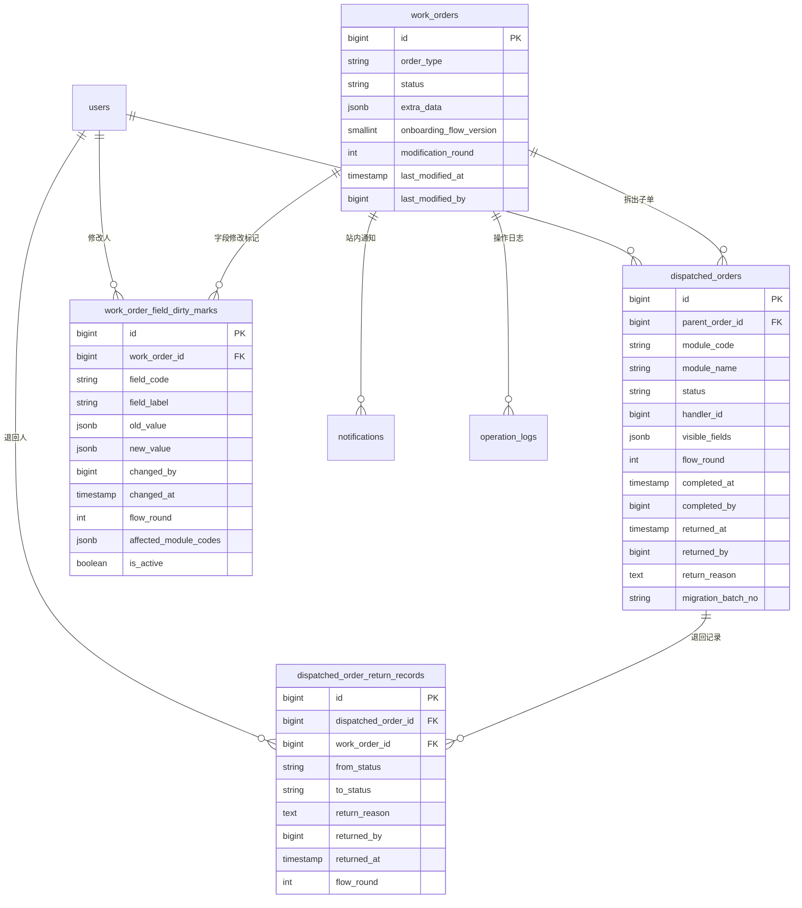

# 入职一拆四架构方案（P1）

> 文档日期：2026-05-15  
> 适用范围：入职主工单由既有“一拆三”升级为“一拆四”；仅产出架构与实施拆解，不包含代码实现。  
> 会议依据：2026-05-15 14:30 业务 / 产品 / 开发三方会议决议。  
> 重要约束：本方案只覆盖 P1 入职模块改造，不重做已完成 P0；邮件 / 短信通知永不做，仅保留站内通知。

---

## 0. 结论摘要

1. **入职主工单升级为一拆四**：在原“入职联系、劳动合同签订、数据录入”基础上新增“社保公积金办理”。
2. **社保公积金一期不按参保省份自动派单**：平台只生成一个“社保公积金办理”子单，默认负责人为“杨杰”或当前配置的社保负责人；省份字段只做信息采集，二期再做省份分流。
3. **业务员修改规则改为两段式**：
   - 所有子单都未完成：业务员可直接修改允许字段，修改字段在所有下游子单详情中标红，并触发站内通知。
   - 任一子单已完成：业务员不可直接修改；必须线下沟通，由已完成节点逐一退回并填写退回原因，全部回到未完成后才能修改，修改后整条主工单重走完整流转。
4. **历史一拆三数据必须补第四子单**：已提交且已有三类子单、但没有“社保公积金办理”的历史入职主工单，迁移时补生成“社保公积金办理”子单，默认未完成，负责人为杨杰。
5. **前端对用户全中文展示**：内部代码可使用 `module_code`、`status` 等技术字段，但页面上只显示“可编辑 / 仅可见 / 隐藏 / 脱敏”“待办理 / 已完成 / 已退回”等中文，不再把 `visible` 等英文枚举露给用户。
6. **P1 对旧 P0 口径的覆盖**：此前“已办结入职工单业务员可直接改并通知下游”的口径，对入职模块不再适用；入职模块按本方案“已完成节点需先退回，再重走流程”执行。

---

## 1. 范围与不在本次范围

### 1.1 本次范围

| 主题 | 本次结论 |
|---|---|
| 入职拆单 | 从一拆三升级为一拆四 |
| 新增子模块 | 社保公积金办理 |
| 社保负责人 | 一期默认杨杰，可由后台配置为当前社保负责人 |
| 社保派单 | 一期不按参保省份自动分流 |
| 业务员修改 | 按“是否已有完成节点”区分直接修改与退回后重走 |
| Dirty 标记 | 字段级记录，供下游详情页标红和通知使用 |
| 历史兼容 | 旧一拆三数据补出第四子单，不丢旧数据 |
| 通知 | 仅站内通知 |

### 1.2 不在本次范围

| 不做项 | 处理口径 |
|---|---|
| 流程可视化配置（清流 / Activiti 风格） | 二期，不影响本轮硬编码状态机落地 |
| 按参保省份自动派单 | 二期；一期只采集省份，不按省份分流 |
| 邮件 / 短信通知 | 永不做，业务方明确只做站内通知 |
| 社保团队内部拆分看板 | 一期由杨杰线下拆分；平台只提供批量标记完成 |
| 重构全局工单状态体系 | 不做全局重构，只在入职模块新增必要状态与字段 |

---

## 2. 一拆四子模块设计

### 2.1 子模块清单

> 技术字段可用英文 code；页面、菜单、标签、按钮必须展示中文名。

| 顺序 | 内部模块 code | 中文名 | 触发条件 | 一期办理角色 / 负责人 | 字段范围 | 与原一拆三关系 |
|---:|---|---|---|---|---|---|
| 1 | `onboarding_contact` | 入职联系 | `是否需要入职联系 = 是` 时生成；若业务确认未来所有入职均需联系，可改为必拆 | 入离职联系专员、共享团队负责人 | 员工基础联系信息、地址、入职材料收集、入职联系反馈 | 原一拆三已有，逻辑保留 |
| 2 | `contract` | 劳动合同签订 | `是否企服发起劳动合同 = 是` 时生成 | 劳动合同专员、共享团队负责人 | 员工基本信息、合同期限、合同主体、合同模板、合同签订反馈 | 原一拆三的 `contract_signing` 统一升级为 `contract`；接口需兼容旧 code |
| 3 | `data_entry` | 数据录入 | 所有入职主工单必生成 | 数据录入组长 / 数据录入负责人 | 入职主工单全量字段，重点处理录入反馈 | 原一拆三已有，必拆逻辑保留 |
| 4 | `social_insurance` | 社保公积金办理 | 所有已提交入职主工单一期默认必生成；省份字段只采集不分流 | 杨杰或后台配置的当前社保负责人 | 参保省份、参保城市、社保公积金办理状态、办理备注、必要身份与入职信息 | P1 新增第四子单；历史一拆三迁移补出 |

### 2.2 社保公积金一期简化方案

1. **不做省份自动派单**：参保省份、参保城市只进入主工单字段和子单详情展示，不参与派单规则匹配。
2. **统一负责人**：北仑项目由“杨杰”作为总负责人统一接单，内部再由福宝团队线下拆分。
3. **平台入口**：新增“社保公积金办理”子单列表与“批量标记完成”入口，支持福宝团队定期登录后批量勾选。
4. **业务员侧展示**：业务员不看福宝内部拆分，只看“社保公积金办理状态：未完成 / 已完成”。
5. **配置优先级**：后台若配置了当前社保负责人，则使用配置负责人；没有配置时兜底为杨杰；仍找不到用户时生成未指派子单并站内通知管理员。

### 2.3 一拆四派发伪流程

```text
业务员提交入职主工单
  ├─ 如果“是否需要入职联系=是” → 生成“入职联系”子单
  ├─ 如果“是否企服发起劳动合同=是” → 生成“劳动合同签订”子单
  ├─ 固定生成“数据录入”子单
  └─ 固定生成“社保公积金办理”子单（负责人=杨杰或当前社保负责人）
```

> 注意：虽然技术上联系 / 合同仍保留条件拆分，但产品对用户表达时可统称“入职一拆四”。如果业务最终确认联系 / 合同也必须全量生成，只需将两个触发条件改为“固定生成”，数据库结构无需再调整。

---

## 3. 数据模型变更

### 3.1 ER 图（逻辑）



### 3.2 表结构变更清单

#### 3.2.1 `work_orders` 主工单表

| 字段 | 类型 | 是否新增 | 说明 |
|---|---|---:|---|
| `onboarding_flow_version` | smallint | 新增 | 入职流程版本：历史一拆三为 3，新一拆四为 4；仅内部使用，页面显示“流程版本”中文 |
| `modification_round` | int | 新增 | 主工单第几轮流转，首次提交为 0，每次退回后重走流程 +1 |
| `last_modified_at` | timestamp | 若无则新增 | 最近一次业务字段修改时间 |
| `last_modified_by` | bigint | 若无则新增 | 最近一次业务字段修改人 |
| `resubmitted_at` | timestamp | 可选新增 | 最近一次退回修改后重新提交时间 |
| `resubmitted_by` | bigint | 可选新增 | 最近一次重新提交人 |

> 说明：`extra_data` 仍是入职字段主存储位置，不拆成 56+ 列；`onboarding_flow_version` 用于接口与前端兼容历史数据。

#### 3.2.2 `dispatched_orders` 子工单表

| 字段 | 类型 | 是否新增 | 说明 |
|---|---|---:|---|
| `module_code` | varchar(64) | 扩展取值 | 新增支持 `social_insurance`；旧 `contract_signing` 查询时兼容为“劳动合同签订” |
| `module_name` | varchar(64) | 若无则新增 | 冗余中文名，便于列表展示与历史快照 |
| `flow_round` | int | 新增 | 对应主工单第几轮流转，便于 dirty 和退回记录对齐 |
| `completed_at` | timestamp | 若无则新增 | 子单完成时间 |
| `completed_by` | bigint | 若无则新增 | 子单完成人 |
| `returned_at` | timestamp | 若无则新增 | 子单退回时间 |
| `returned_by` | bigint | 若无则新增 | 子单退回人 |
| `return_reason` | text | 若无则新增 | 当前轮最近一次退回原因，必填 |
| `snapshot_refreshed_at` | timestamp | 新增 | 业务员修改后刷新子单字段快照的时间 |
| `migration_batch_no` | varchar(64) | 新增 | 标识迁移生成的数据，方便回滚 |

#### 3.2.3 新表：`work_order_field_dirty_marks`

字段级 dirty 标记用于记录“业务员改了哪些字段、旧值是什么、新值是什么、影响哪些子模块”，供下游标红、顶部提示条、站内通知使用。

| 字段 | 类型 | 必填 | 说明 |
|---|---|---:|---|
| `id` | bigserial | 是 | 主键 |
| `work_order_id` | bigint | 是 | 主工单 ID |
| `field_code` | varchar(128) | 是 | 字段编码，例如 `employee_name` |
| `field_label` | varchar(128) | 是 | 字段中文名，例如“员工姓名” |
| `old_value` | jsonb | 否 | 修改前值，敏感字段可只存脱敏值或哈希 |
| `new_value` | jsonb | 否 | 修改后值，敏感字段按权限展示 |
| `changed_by` | bigint | 是 | 修改人 |
| `changed_at` | timestamp | 是 | 修改时间 |
| `flow_round` | int | 是 | 第几轮流转 |
| `affected_module_codes` | jsonb | 是 | 受影响子模块，例如 `["contract", "data_entry"]` |
| `is_active` | boolean | 是 | 是否仍需提示；当前轮流程未全部完成前保持 true |
| `cleared_at` | timestamp | 否 | 标记清除时间 |
| `cleared_by` | bigint | 否 | 标记清除人或系统任务 |
| `clear_reason` | varchar(128) | 否 | 清除原因，例如“本轮流程全部完成” |

建议约束：同一 `work_order_id + field_code + flow_round + is_active=true` 最多一条活跃记录；同一轮再次修改同字段时更新 `new_value` 与 `changed_at`，保留操作日志作为审计明细。

#### 3.2.4 新表：`dispatched_order_return_records`

虽然 `dispatched_orders.return_reason` 存当前轮最近退回原因，但重走流程会清空当前状态字段，因此需要退回记录表保留历史。

| 字段 | 类型 | 必填 | 说明 |
|---|---|---:|---|
| `id` | bigserial | 是 | 主键 |
| `dispatched_order_id` | bigint | 是 | 子工单 ID |
| `work_order_id` | bigint | 是 | 主工单 ID，便于按主单查询 |
| `from_status` | varchar(32) | 是 | 退回前技术状态 |
| `to_status` | varchar(32) | 是 | 退回后技术状态 |
| `return_reason` | text | 是 | 退回原因，前端必须校验非空 |
| `returned_by` | bigint | 是 | 退回人 |
| `returned_at` | timestamp | 是 | 退回时间 |
| `flow_round` | int | 是 | 第几轮流转 |

#### 3.2.5 配置 / 种子数据

| 配置点 | 变更 |
|---|---|
| `dispatch_rules.sub_module` | 新增 `social_insurance`，中文名“社保公积金办理” |
| `module_handlers` | 新增“社保公积金办理”模块负责人，默认杨杰 |
| 字段权限 | 新增社保公积金模块字段权限，页面显示“可编辑 / 仅可见 / 隐藏 / 脱敏” |
| 批量完成权限 | 仅杨杰、当前社保负责人、共享团队负责人、admin 可批量标记完成 |

---

## 4. 状态机变更

### 4.1 主工单中文状态

| 页面中文状态 | 内部状态建议 | 进入条件 | 可操作人 | 关键操作 |
|---|---|---|---|---|
| 草稿 | `draft` | 尚未提交 | 发起人 | 编辑、提交 |
| 流转中 | `processing` | 已派发，至少一个子单未完成 | 相关角色 | 子单办理、业务员按规则修改 |
| 待业务员修改 | `returned` | 存在退回节点，需要业务员处理 | 发起人 | 修改后重新提交 |
| 已完成 | `completed` | 当前轮所有已生成子单均完成 | 相关角色只读；发起人按规则处理 | 若需改，先退回已完成节点 |
| 已作废 | `cancelled` | 发起人 / 管理员作废 | 无 | 只读 |

### 4.2 子工单中文状态

| 页面中文状态 | 内部状态建议 | 说明 |
|---|---|---|
| 待办理 | `pending` | 已生成，等待负责人办理；池模式可待认领 |
| 办理中 | `processing` | 已接单或已开始处理 |
| 已完成 | `completed` | 办理人已标记完成 |
| 已退回 | `returned` | 办理人或负责人退回，必须有退回原因 |

### 4.3 重走完整流程状态图

```mermaid
stateDiagram-v2
  [*] --> 草稿
  草稿 --> 流转中: 提交并一拆四
  流转中 --> 流转中: 所有子单未完成时业务员修改并通知下游
  流转中 --> 已完成: 当前轮所有子单完成
  已完成 --> 已完成: 业务员尝试修改被拦截
  已完成 --> 待业务员修改: 已完成子单逐一退回且填写原因
  流转中 --> 待业务员修改: 部分已完成节点退回后等待全部完成节点退回
  待业务员修改 --> 流转中: 业务员修改后重新提交，整单重走一拆四
  流转中 --> 已作废: 作废
  已完成 --> 已作废: 管理员按权限作废
```



### 4.4 “重走完整流程”的准确定义

当已存在完成节点且业务员确需修改时：

1. 已完成的子单必须由对应办理人 / 模块负责人线下确认后，在系统内点击“退回修改”，填写退回原因。
2. 当本轮所有已完成子单都退回为“已退回”或“待办理 / 办理中”后，系统才允许业务员编辑。
3. 业务员保存并点击“重新提交”后：
   - `work_orders.modification_round + 1`；
   - 当前轮四类子单全部进入新一轮“待办理”；
   - 重新计算是否生成联系 / 合同子单；
   - 社保公积金与数据录入继续必拆；
   - 子单 `flow_round` 更新为新轮次；
   - 清空当前状态字段中的 `return_reason`，但退回记录表保留历史原因；
   - 按新字段快照刷新各子单详情；
   - 发送站内通知给新一轮所有下游办理人。

---

## 5. 业务员数据修改规则

### 5.1 可修改字段边界

业务员只允许修改“业务员发起字段”，不允许修改下游办理字段。字段归属由字段元数据维护。

| 字段归属 | 示例 | 业务员能否修改 | 说明 |
|---|---|---:|---|
| 业务员发起字段 | 员工姓名、身份证、手机号、合同开始日期、参保省份 | 可以 | 受本章规则限制 |
| 入职联系办理字段 | 入职材料收集反馈、联系办理备注 | 不可以 | 只能由联系办理人 / 负责人填写 |
| 合同办理字段 | 合同签订反馈、合同办理备注 | 不可以 | 只能由合同办理人 / 负责人填写 |
| 数据录入字段 | 数据录入反馈、录入备注 | 不可以 | 只能由数据录入角色填写 |
| 社保公积金字段 | 社保公积金办理状态、办理备注 | 不可以 | 只能由杨杰 / 社保负责人 / 授权角色填写 |

### 5.2 规则 A：所有子单节点都未完成

| 条件 | 规则 |
|---|---|
| 判断条件 | 当前主工单本轮所有已生成子单均不是“已完成” |
| 是否允许业务员直接修改 | 允许，仅限业务员发起字段 |
| 保存后主工单状态 | 仍为“流转中” |
| 子单处理 | 不重建子单，只刷新字段快照与 dirty 标记 |
| 下游提醒 | 受影响字段所在子单详情页标红；站内通知下游办理人 |
| 审计 | 写操作日志 + 字段 dirty 标记 |

保存时处理流程：

```text
业务员编辑 → 后端比对旧 extra_data 与新 extra_data
  → 只允许业务员字段变更
  → 写 work_order_field_dirty_marks
  → 更新 work_orders.extra_data、last_modified_at、last_modified_by
  → 刷新所有相关 dispatched_orders 快照
  → 向受影响子模块办理人发送站内通知
```

### 5.3 规则 B：任一子单节点已完成

| 条件 | 规则 |
|---|---|
| 判断条件 | 当前主工单本轮存在至少一个子单为“已完成” |
| 是否允许业务员直接修改 | 不允许，前端置灰，后端强拦截 |
| 需要动作 | 已完成节点逐一线下沟通后退回，退回原因必填 |
| 何时可改 | 本轮所有已完成节点都不再是“已完成”后，业务员才能编辑 |
| 修改后流程 | 整条主工单重走完整一拆四流程 |
| 审计 | 退回记录、重新提交记录、字段 dirty 标记、通知全量记录 |

业务员点击编辑时，如果存在完成节点，页面提示：

> 当前工单已有下游节点完成，不能直接修改。请先与已完成节点办理人线下确认，由办理人在系统内退回并填写原因；全部完成节点退回后，你可以修改并重新提交，工单将重新流转。

### 5.4 与撤回 / 作废关系

| 场景 | 处理口径 |
|---|---|
| 草稿未提交 | 直接编辑，不产生 dirty 标记 |
| 已提交但所有子单未完成 | 走规则 A，不需要撤回 |
| 存在已完成子单 | 不允许用“撤回”绕过，必须走规则 B |
| 业务决定不继续办理 | 走“作废”，不再修改 |
| 已作废工单 | 全部只读，不允许修改或重走 |
| 管理员纠错 | 原则上也走同一审计链路；如需后台修数，必须写操作日志并标注“管理员纠错” |

---

## 6. Dirty 字段标记与前端交互规范

### 6.1 后端接口返回结构建议

在主工单详情、子工单详情字段列表中，为每个字段附带中文权限与 dirty 元信息。

```json
{
  "fieldCode": "employee_name",
  "fieldLabel": "员工姓名",
  "value": "张三",
  "permissionText": "仅可见",
  "dirty": true,
  "dirtyInfo": {
    "changedAt": "2026-05-15 15:20:00",
    "changedByName": "业务员A",
    "oldValueText": "张三三",
    "newValueText": "张三",
    "flowRound": 1
  }
}
```

> 后端可保留技术枚举，但接口给前端应直接给 `permissionText` 和中文状态文案，避免页面出现 `visible`、`readonly` 等英文。

### 6.2 前端标红规范

当字段 `dirty=true` 且当前用户有权看到该字段时：

```html
<div class="form-field data-dirty" data-dirty="true">
  <label>员工姓名</label>
  <span>张三</span>
  <span class="dirty-tag">业务员已修改</span>
</div>
```

CSS 建议：

```css
.data-dirty {
  border-left: 3px solid #ff4d4f;
  background: #fff1f0;
}

.dirty-tag {
  color: #cf1322;
  font-weight: 600;
}
```

### 6.3 顶部蓝色提示条

子单详情页如果存在当前模块可见的 dirty 字段，顶部展示蓝色提示条：

> 业务员已修改 3 个字段，请优先核对页面中红色标记字段。最近修改时间：2026-05-15 15:20。

交互要求：

1. 点击提示条中的“查看修改字段”滚动到第一个标红字段。
2. 鼠标悬浮或点击字段旁“业务员已修改”标签，展示旧值、新值、修改人、修改时间。
3. 敏感字段按当前角色权限展示；无权看旧值时显示“按权限隐藏”。
4. Dirty 字段不要自动弹窗打断办理人操作，避免批量处理场景干扰。

---

## 7. 已完成节点退回机制

### 7.1 退回入口

| 页面 | 谁能退回 | 退回对象 | 必填项 |
|---|---|---|---|
| 子工单详情页 | 当前办理人、模块负责人、admin | 自己负责的已完成子单 | 退回原因 |
| 部门子工单页 | 模块负责人、admin | 本模块已完成子单 | 退回原因 |
| 主工单详情页 | admin 可代操作；业务员只能查看指引 | 指定已完成子单 | 退回原因 |

### 7.2 退回原因规则

1. 退回原因必须填写，建议不少于 5 个汉字。
2. 退回原因写入：
   - `dispatched_orders.return_reason`：当前轮展示；
   - `dispatched_order_return_records.return_reason`：永久审计；
   - `operation_logs`：操作审计；
   - 站内通知正文：通知业务员和相关下游。
3. 退回后页面展示“退回原因”和“退回人 / 时间”。

### 7.3 全部完成节点退回后的可编辑判断

后端判断：

```text
当前轮存在 completed 子单 → 不允许业务员编辑
当前轮不存在 completed 子单，且主工单未作废 → 允许业务员编辑业务员字段
```

不要只依赖前端按钮控制，后端保存接口必须重复校验。

---

## 8. 历史一拆三数据兼容与迁移

### 8.1 版本标识

| 数据类型 | 标识方式 | 前端展示 |
|---|---|---|
| 历史一拆三，尚未迁移 | `onboarding_flow_version=3` 或字段为空 | 不展示版本，只按实际子单展示；管理端可显示“历史流程” |
| 已补第四子单 | `onboarding_flow_version=4` | 展示四个模块状态 |
| 新提交入职工单 | `onboarding_flow_version=4` | 展示四个模块状态 |

### 8.2 哪些历史数据需要补子单

必须补：

1. `order_type = 入职`；
2. 主工单已提交，不是草稿；
3. 未作废、未删除；
4. 已存在 `data_entry`、`onboarding_contact`、`contract` 或旧 `contract_signing` 三类子单；
5. 尚不存在 `social_insurance` 子单。

不自动补：

1. 草稿入职工单：提交时按新一拆四生成；
2. 已作废 / 已删除工单：保持历史只读，不补；
3. 非入职工单：不处理；
4. 已有 `social_insurance` 子单：不重复生成；
5. 历史子单数据异常（例如没有主工单、没有数据录入子单）：不自动补，输出异常清单给运维 / 后端人工确认。

### 8.3 迁移 SQL 草案

> 以下为 PostgreSQL 草案，真实字段名以现有实体为准；执行前必须在测试库演练并备份。

```sql
-- 1) 增量字段：若字段已存在则跳过
ALTER TABLE work_orders
  ADD COLUMN IF NOT EXISTS onboarding_flow_version smallint,
  ADD COLUMN IF NOT EXISTS modification_round int NOT NULL DEFAULT 0,
  ADD COLUMN IF NOT EXISTS last_modified_at timestamp NULL,
  ADD COLUMN IF NOT EXISTS last_modified_by bigint NULL,
  ADD COLUMN IF NOT EXISTS resubmitted_at timestamp NULL,
  ADD COLUMN IF NOT EXISTS resubmitted_by bigint NULL;

ALTER TABLE dispatched_orders
  ADD COLUMN IF NOT EXISTS module_name varchar(64),
  ADD COLUMN IF NOT EXISTS flow_round int NOT NULL DEFAULT 0,
  ADD COLUMN IF NOT EXISTS completed_at timestamp NULL,
  ADD COLUMN IF NOT EXISTS completed_by bigint NULL,
  ADD COLUMN IF NOT EXISTS returned_at timestamp NULL,
  ADD COLUMN IF NOT EXISTS returned_by bigint NULL,
  ADD COLUMN IF NOT EXISTS return_reason text NULL,
  ADD COLUMN IF NOT EXISTS snapshot_refreshed_at timestamp NULL,
  ADD COLUMN IF NOT EXISTS migration_batch_no varchar(64) NULL;

-- 2) Dirty 标记表
CREATE TABLE IF NOT EXISTS work_order_field_dirty_marks (
  id bigserial PRIMARY KEY,
  work_order_id bigint NOT NULL REFERENCES work_orders(id),
  field_code varchar(128) NOT NULL,
  field_label varchar(128) NOT NULL,
  old_value jsonb NULL,
  new_value jsonb NULL,
  changed_by bigint NOT NULL REFERENCES users(id),
  changed_at timestamp NOT NULL DEFAULT now(),
  flow_round int NOT NULL DEFAULT 0,
  affected_module_codes jsonb NOT NULL DEFAULT '[]'::jsonb,
  is_active boolean NOT NULL DEFAULT true,
  cleared_at timestamp NULL,
  cleared_by bigint NULL,
  clear_reason varchar(128) NULL
);

CREATE INDEX IF NOT EXISTS idx_dirty_marks_order_active
  ON work_order_field_dirty_marks(work_order_id, is_active, flow_round);

CREATE UNIQUE INDEX IF NOT EXISTS ux_dirty_marks_active_field_round
  ON work_order_field_dirty_marks(work_order_id, field_code, flow_round)
  WHERE is_active = true;

-- 3) 退回记录表
CREATE TABLE IF NOT EXISTS dispatched_order_return_records (
  id bigserial PRIMARY KEY,
  dispatched_order_id bigint NOT NULL REFERENCES dispatched_orders(id),
  work_order_id bigint NOT NULL REFERENCES work_orders(id),
  from_status varchar(32) NOT NULL,
  to_status varchar(32) NOT NULL,
  return_reason text NOT NULL,
  returned_by bigint NOT NULL REFERENCES users(id),
  returned_at timestamp NOT NULL DEFAULT now(),
  flow_round int NOT NULL DEFAULT 0
);

CREATE INDEX IF NOT EXISTS idx_return_records_work_order
  ON dispatched_order_return_records(work_order_id, flow_round);

-- 4) 给历史一拆三入职主工单补社保公积金子单
WITH social_owner AS (
  SELECT id
  FROM users
  WHERE real_name = '杨杰' AND is_active = true
  ORDER BY id
  LIMIT 1
), eligible_orders AS (
  SELECT w.id AS work_order_id,
         COALESCE(w.modification_round, 0) AS flow_round
  FROM work_orders w
  WHERE w.order_type = 'onboarding'
    AND COALESCE(w.status, '') NOT IN ('draft', 'cancelled', 'deleted')
    AND EXISTS (
      SELECT 1 FROM dispatched_orders d
      WHERE d.parent_order_id = w.id AND d.module_code = 'data_entry'
    )
    AND EXISTS (
      SELECT 1 FROM dispatched_orders d
      WHERE d.parent_order_id = w.id AND d.module_code = 'onboarding_contact'
    )
    AND EXISTS (
      SELECT 1 FROM dispatched_orders d
      WHERE d.parent_order_id = w.id AND d.module_code IN ('contract', 'contract_signing')
    )
    AND NOT EXISTS (
      SELECT 1 FROM dispatched_orders d
      WHERE d.parent_order_id = w.id AND d.module_code = 'social_insurance'
    )
)
INSERT INTO dispatched_orders (
  parent_order_id,
  module_code,
  module_name,
  handler_id,
  status,
  visible_fields,
  flow_round,
  created_at,
  migration_batch_no
)
SELECT e.work_order_id,
       'social_insurance',
       '社保公积金办理',
       (SELECT id FROM social_owner),
       'pending',
       '["employee_name", "id_card", "mobile_phone", "customer_name", "entry_date", "social_insurance_province", "social_insurance_city", "social_insurance_feedback", "social_insurance_remark"]'::jsonb,
       e.flow_round,
       now(),
       '20260515_onboarding_v4'
FROM eligible_orders e;

-- 5) 更新版本号：补过第四子单的入职主工单标识为 4
UPDATE work_orders w
SET onboarding_flow_version = 4
WHERE w.order_type = 'onboarding'
  AND EXISTS (
    SELECT 1 FROM dispatched_orders d
    WHERE d.parent_order_id = w.id
      AND d.module_code = 'social_insurance'
      AND d.migration_batch_no = '20260515_onboarding_v4'
  );

-- 6) 未补但已存在入职历史数据的版本兜底
UPDATE work_orders
SET onboarding_flow_version = COALESCE(onboarding_flow_version, 3)
WHERE order_type = 'onboarding'
  AND onboarding_flow_version IS NULL;
```

### 8.4 回滚方案

```sql
BEGIN;

-- 1) 删除本次迁移补出的社保公积金子单；只删带批次号的数据，避免误删人工创建数据
DELETE FROM dispatched_orders
WHERE module_code = 'social_insurance'
  AND migration_batch_no = '20260515_onboarding_v4';

-- 2) 将没有社保公积金子单的入职主工单版本回退为 3
UPDATE work_orders w
SET onboarding_flow_version = 3
WHERE w.order_type = 'onboarding'
  AND NOT EXISTS (
    SELECT 1 FROM dispatched_orders d
    WHERE d.parent_order_id = w.id
      AND d.module_code = 'social_insurance'
  );

-- 3) 保留新增列和新增表，不建议 drop，避免已产生的新审计数据丢失。
-- 如必须完全回滚结构，需要先备份 work_order_field_dirty_marks 与 dispatched_order_return_records。

COMMIT;
```

回滚原则：

1. 只回滚迁移批次生成的数据，不删除用户上线后手工产生的社保子单。
2. Dirty 标记表、退回记录表属于审计数据，默认不删。
3. 回滚前导出迁移影响清单：主工单 ID、员工姓名、身份证、原三个子单状态、新增子单 ID。

---

## 9. 接口与兼容策略

### 9.1 后端接口调整

| 接口 | 调整点 |
|---|---|
| `POST /api/work-orders/:id/submit` | 入职提交时按一拆四生成子单；写 `onboarding_flow_version=4` |
| `GET /api/work-orders/:id` | 返回四模块状态、dirty 字段摘要、是否允许业务员修改、不可修改原因 |
| `PATCH /api/work-orders/:id` | 保存时执行规则 A / B 校验，生成 dirty 标记和通知 |
| `POST /api/work-orders/:id/resubmit` | 退回修改后重新提交，整单重走一拆四 |
| `POST /api/dispatched-orders/:id/return` | 已完成节点允许退回，退回原因必填，写退回记录 |
| `POST /api/dispatched-orders/social-insurance/batch-complete` | 社保公积金批量标记完成 |
| `GET /api/dispatched-orders` | module 过滤新增 `social_insurance`，兼容旧 `contract_signing` |

### 9.2 旧 `contract_signing` 兼容

1. 数据库中历史 `module_code='contract_signing'` 不强制改值，避免影响历史关联。
2. 后端查询层将 `contract` 与 `contract_signing` 都映射为中文“劳动合同签订”。
3. 新生成数据统一使用 `contract`。
4. 前端不要依赖英文 code 展示模块名，统一使用后端返回的中文 `moduleName`。

### 9.3 前端兼容旧数据

| 场景 | 前端处理 |
|---|---|
| 老主单只有三类子单，尚未迁移 | 按实际子单展示，不报错；社保状态显示“未生成（历史数据）”或由后端隐藏 |
| 老主单已补社保子单 | 展示四模块状态 |
| 合同子单 code 是 `contract_signing` | 显示“劳动合同签订” |
| 后端返回缺少 dirty 字段 | 默认 `dirty=false`，不影响页面渲染 |

---

## 10. 站内通知触发点清单

> 全部通知均写入现有 `notifications` 表或通知服务；不做邮件，不做短信。

| 触发点 | 接收人 | 标题示例 | 内容要点 |
|---|---|---|---|
| 新入职主工单提交并生成社保子单 | 杨杰 / 当前社保负责人 | 新的社保公积金办理子单 | 工单号、员工、客户、参保省份、办理入口 |
| 业务员在所有子单未完成时修改字段 | 受影响子模块当前办理人、模块负责人 | 入职工单字段已修改，请核对 | 修改字段中文名、旧值 / 新值摘要、修改人、时间 |
| 已完成子单被退回 | 业务员、相关模块负责人 | 子单已退回，请处理主工单修改 | 子模块中文名、退回原因、退回人、时间 |
| 全部已完成节点均退回 | 业务员 | 入职工单已可修改 | 提示可以修改并重新提交 |
| 业务员重新提交 | 当前轮所有子单办理人、模块负责人 | 入职工单已重新流转 | 修改字段摘要、新轮次、办理入口 |
| 社保公积金批量标记完成 | 主工单发起人、业务组长可选 | 社保公积金办理已完成 | 批量完成时间、办理人、工单号 |
| 社保负责人未配置且杨杰未找到 | admin / 系统管理员 | 社保公积金子单无人可派 | 工单号、异常原因、需配置负责人 |

通知正文必须使用中文状态和中文模块名，不展示 `social_insurance`、`pending` 等技术值。

---

## 11. 后端实施要点拆解

| 编号 | 任务 | 交付边界 | 依赖 |
|---|---|---|---|
| BE-P1-01 | 数据库迁移 | 新增版本、轮次、dirty 表、退回记录表、社保子单字段 | 无 |
| BE-P1-02 | 模块与负责人种子数据 | 新增“社保公积金办理”模块、默认负责人杨杰、字段权限中文映射 | BE-P1-01 |
| BE-P1-03 | 一拆四派发引擎 | 入职提交生成 data_entry、social_insurance 必拆，联系 / 合同按条件生成 | BE-P1-02 |
| BE-P1-04 | 历史一拆三补子单脚本 | 按本方案 SQL 生成社保子单，输出异常清单和影响清单 | BE-P1-01/02 |
| BE-P1-05 | 业务员修改规则拦截 | 判断是否存在已完成子单；规则 A 允许修改并标 dirty；规则 B 强拦截 | BE-P1-01 |
| BE-P1-06 | DirtyFieldService | 字段 diff、影响模块计算、dirty 写入、快照刷新 | BE-P1-05 |
| BE-P1-07 | 已完成节点退回接口 | 退回原因必填；写退回记录；更新主单“待业务员修改” | BE-P1-01 |
| BE-P1-08 | 重新提交接口 | `modification_round + 1`，整单重走一拆四，通知下游 | BE-P1-03/07 |
| BE-P1-09 | 社保批量完成接口 | 批量勾选、权限校验、操作日志、通知业务员 | BE-P1-02 |
| BE-P1-10 | 站内通知扩展 | 新增本方案通知类型；事务提交后异步发送 | BE-P1-05/07/08/09 |
| BE-P1-11 | 中文文案输出 | 接口返回 `moduleName`、`statusText`、`permissionText` | 全部接口 |

后端关键约束：

1. 所有修改 / 退回 / 重新提交必须写 `operation_logs`。
2. 通知必须在主事务提交后发送，避免回滚误通知。
3. 保存接口不能只信前端按钮，必须后端二次校验。
4. 批量完成要有幂等处理：已完成子单再次勾选不报错，但返回“已完成，无需重复处理”。

---

## 12. 前端实施要点拆解

| 编号 | 任务 | 交付边界 | 依赖 |
|---|---|---|---|
| FE-P1-01 | 入职详情四模块状态展示 | 展示入职联系、劳动合同签订、数据录入、社保公积金办理四块中文状态 | 后端详情接口 |
| FE-P1-02 | 社保公积金子单列表 | 杨杰 / 社保负责人看到待办列表和批量完成入口 | BE-P1-09 |
| FE-P1-03 | 批量标记完成交互 | 多选、确认弹窗、完成结果提示、失败行展示 | BE-P1-09 |
| FE-P1-04 | 业务员编辑规则提示 | 存在完成节点时置灰编辑按钮并展示中文原因 | BE-P1-05 |
| FE-P1-05 | Dirty 字段标红 | 使用 `data-dirty="true"` 和 `.data-dirty` 样式标红 | BE-P1-06 |
| FE-P1-06 | 顶部蓝色提示条 | 展示 dirty 字段数量、最近修改时间、跳转到红色字段 | BE-P1-06 |
| FE-P1-07 | 退回原因弹窗 | 已完成子单退回时必填原因；提交后刷新状态 | BE-P1-07 |
| FE-P1-08 | 重新提交入口 | 全部完成节点退回后，业务员可修改并重新提交 | BE-P1-08 |
| FE-P1-09 | 中文权限文案修正 | 字段权限页面和业务页面显示“可编辑 / 仅可见 / 隐藏 / 脱敏” | 后端中文映射 |
| FE-P1-10 | 旧数据兼容 | 三子单历史数据不崩溃，`contract_signing` 显示为劳动合同签订 | 后端兼容接口 |

前端关键约束：

1. 不把 `visible`、`readonly`、`hidden`、`pending` 等英文枚举展示给用户。
2. 业务员不可修改时，要显示“为什么不能改”和“下一步怎么做”。
3. Dirty 标红只用于下游详情页和相关字段，不要整页红色造成恐慌；顶部提示条用蓝色。
4. 社保批量完成结果要支持部分成功 / 部分失败提示。

---

## 13. QA 验收清单

| 编号 | 用例 | 预期 |
|---|---|---|
| QA-P1-01 | 新建入职工单，条件需要联系和合同 | 生成四个子单，社保负责人为杨杰 |
| QA-P1-02 | 新建入职工单，不需要联系 / 合同 | 至少生成数据录入和社保公积金；页面不报错 |
| QA-P1-03 | 参保省份填写不同省份 | 一期仍派给杨杰，不按省份分流 |
| QA-P1-04 | 社保负责人批量标记完成 | 多个社保子单变为已完成，业务员看到状态完成 |
| QA-P1-05 | 所有子单未完成时业务员修改员工姓名 | 保存成功，下游对应字段标红，收到站内通知 |
| QA-P1-06 | 任一子单已完成时业务员尝试修改 | 前端置灰，后端保存也拒绝 |
| QA-P1-07 | 已完成节点退回不填原因 | 前后端均拒绝 |
| QA-P1-08 | 已完成节点逐一退回后业务员修改并重新提交 | 主单轮次 +1，四模块重新进入待办理 |
| QA-P1-09 | 历史一拆三数据迁移 | 补出社保子单，默认未完成，负责人杨杰，不丢原三子单 |
| QA-P1-10 | 回滚迁移 | 只删除迁移批次生成的社保子单，旧三子单仍在 |
| QA-P1-11 | 字段权限中文展示 | 页面显示“可编辑 / 仅可见 / 隐藏 / 脱敏”，不出现 visible |
| QA-P1-12 | 旧 `contract_signing` 数据 | 页面展示“劳动合同签订”，筛选和详情正常 |

---

## 14. 上线排期建议

| 日期 | 事项 | 交付物 |
|---|---|---|
| 2026-05-17 前 | 架构方案定稿 | 本文档 + 开发拆单依据 |
| 2026-05-18 ~ 05-19 | 业务方梳理需求、制造测试数据、内部跑流程 | 测试数据、异常历史数据清单、社保负责人确认 |
| 2026-05-20 ~ 05-21 | 开发集中改造 2 天 | 后端迁移 / 接口、前端页面 / 交互、QA 首轮回归 |
| 2026-05-22 ~ 05-28 | 修复与联调 | 历史迁移演练、通知回归、权限回归 |
| 2026-05-29 | 入职模块上线试运行 | 一拆四可上线试运行 |

---

## 15. 需要产品 / 业务确认的点

1. **入职联系、劳动合同签订是否仍按原字段条件生成**：本文按旧方案保留条件拆分；若业务要求所有入职都固定生成四个子单，需要产品确认后把联系 / 合同改为必拆。
2. **社保公积金办理是否所有入职都必须生成**：本文按会议要求一期默认必拆；若存在“不需要社保公积金”的特殊客户，需要补一个业务字段或后台规则。
3. **杨杰账号与角色配置**：上线前需确认系统中存在启用状态的“杨杰”用户，并赋予社保公积金办理权限。
4. **历史已完成入职主工单补社保子单后是否需要业务员看到未完成状态**：本文按“补出默认未完成”执行，可能导致已完成历史主单出现新未完成子状态，需要业务确认展示口径。
5. **Dirty 标记清除时机**：本文建议当前轮所有相关子单完成后系统自动清除活跃提示，但审计记录永久保留；如业务希望办理人手动确认后清除，需要另加“已知悉”动作。

---

## 16. 对团队的派单建议

### 后端优先级

1. 先做数据迁移与模块配置；
2. 再做一拆四派发；
3. 再做业务员修改规则、dirty 标记、退回与重走；
4. 最后补通知与批量完成。

### 前端优先级

1. 先保证旧数据和四模块状态展示不崩；
2. 再做社保批量完成；
3. 再做 dirty 标红和蓝色提示条；
4. 最后统一中文字段权限文案。

### QA 优先级

1. 先测新提交一拆四；
2. 再测历史一拆三迁移；
3. 再测业务员修改规则 A / B；
4. 最后测中文文案、通知和批量完成。
