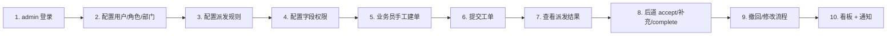
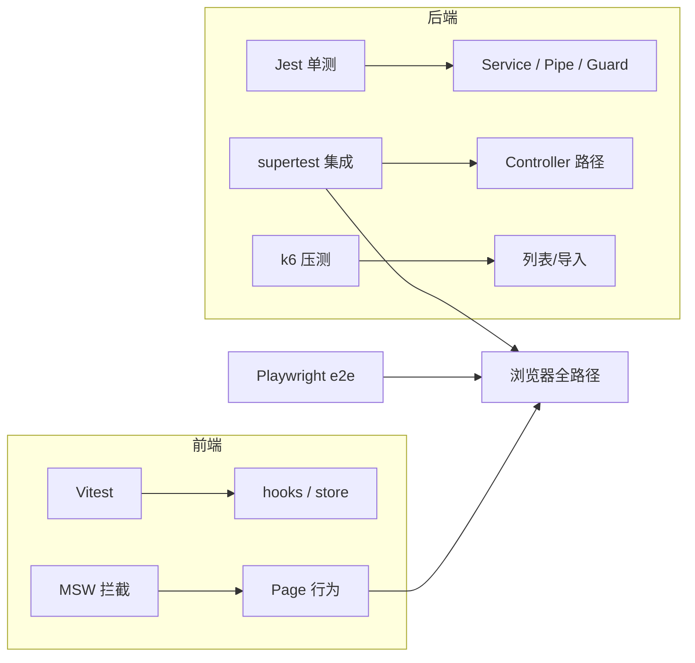

# 回归用例总纲

> ⚠️ 当前演示口径（2026-06-03）：所有 seed/演示账号默认密码统一为 `123456`；`admin123` 是历史旧口径，会返回 401，不可用于演示。本文下方如出现 `admin123`，仅为历史记录/旧脚本背景，不代表当前可用密码。

> 版本：v1.0（2026-05-11，对应架构 v1.2）
> 面向：QA / 后端 / 前端 / Release Manager
> 目的：把 Phase 1-6 各自的测试用例串成**一条全链路回归线**，并给出"每次发布该跑哪些"。
>
> 依赖：
> - `docs/Phase1测试用例.md` / `docs/Phase2测试用例.md` / `docs/Phase2前端测试用例.md` / `docs/Phase3测试用例.md` / `docs/Phase3复测脚本.md`
> - `docs/部署手册.md` / `docs/架构变更日志.md`
> - 实际技术栈：React 18 + antd/pro + Zustand（前端）、NestJS 10 + TypeORM（后端）、PG 16。

---

## 目录
- [1. 回归分级与节奏](#1-回归分级与节奏)
- [2. 全流程回归场景（黄金路径 10 步）](#2-全流程回归场景黄金路径-10-步)
- [3. 环境 × Phase 覆盖矩阵](#3-环境--phase-覆盖矩阵)
- [4. 用例清单（带编号、前置、触点、等级）](#4-用例清单带编号前置触点等级)
- [5. 验证工具分工](#5-验证工具分工)
- [6. 数据准备 & 清理脚本](#6-数据准备--清理脚本)
- [7. 发布门禁 Checklist](#7-发布门禁-checklist)

---

## 1. 回归分级与节奏

| 级别 | 触发 | 范围 | 典型耗时 | 工具 |
|------|------|------|----------|------|
| L0 冒烟 | 每次 PR 提交 | 黄金路径 10 步中的 1/2/6/8/10 | < 5 分钟 | supertest + Playwright（headless） |
| L1 核心回归 | 合并到 main | 黄金路径全 10 步 + 补充必测用例 | ~15 分钟 | 同上 |
| L2 全量回归 | 发版前 | 必测 + 抽样用例 + 性能基线 | 1-2 小时 | + k6 压测 |
| L3 生产回归 | 切流上线前 | 重新跑 L1 + 上线 Checklist | ~30 分钟 | 同上 + 手动巡检 |

**纪律**：L0 / L1 必须全绿才能进入下一级；L2 允许"抽样 + 负责人签字"的豁免。

---

## 2. 全流程回归场景（黄金路径 10 步）



每一步都是一个"接续用例"：**上一步的输出就是下一步的输入**。L1 回归必须 10 步连跑并在 Playwright 里自动化，不允许跳步。

### 2.1 黄金路径的 10 个步骤

| # | 步骤 | 角色 | 入口 | 成功标志 |
|---|------|------|------|----------|
| 1 | 登录 | admin | `POST /api/auth/login` | 返回 token，首登强制跳 `/profile/security` |
| 2 | 用户/角色/部门 | admin | `/admin/users` / `/admin/roles` / `/admin/departments` | 新建 1 业务员 + 4 个模块 handler 共 5 账号 |
| 3 | 派发规则 | admin | `/admin/dispatch-rules` | 4 个 module 各 1 条规则，AST 通过 lint |
| 4 | 字段权限 | admin | `/admin/field-permissions` | 业务员自看 / 模块主管 / admin 三套权限落到 `field_permissions` |
| 5 | 手工建单 | salesperson | `/my/work-orders/new` | `work_orders.status='draft'` |
| 6 | 提交 | salesperson | `POST /api/work-orders/:id/submit` | 生成 N 条 `dispatched_orders`，`status='submitted'` |
| 7 | 派发结果 | salesperson | `/my/work-orders/:id` | 前端展示 N 个子工单卡，每个含 handler 信息 |
| 8 | 后道处理 | handler | `/my-dispatched/:id` 的 accept / complete | 子工单 `status` 经 `processing → completed` |
| 9 | 撤回/修改 | salesperson + handler | `POST /work-orders/:id/withdraw` + approvals | `settleWithdrawRequest` 落地，通知 `withdraw_resolved` |
| 10 | 看板 + 通知 | 各角色 | `/dashboard` + 通知铃 | 指标更新；`notifications` 可见，SSE 推送正常 |

### 2.2 每步"必测触点"

- **1-4**：登录 JWT 过期续签 / RBAC 阻断 / 字段权限 matrix 校验
- **5-6**：字段动态渲染 / 必填校验 / JSON-AST 派发匹配
- **7-8**：字段补充规则 / 只读 & 脱敏矩阵 / 退回路径
- **9**：并发 approval 冲突、auto_agree、admin 强制
- **10**：看板 SQL 口径 / SSE 断连重连 / 未读计数一致性

---

## 3. 环境 × Phase 覆盖矩阵

> 行：黄金路径 10 步；列：三种运行环境。✔ = 必跑；○ = 抽样；— = 本期不覆盖。

| 步骤 | Docker Compose | Windows 原生（dev） | 生产镜像（pre-prod） |
|------|----------------|----------------------|------------------------|
| 1 登录 | ✔ | ✔ | ✔ |
| 2 用户/角色/部门 | ✔ | ✔ | ✔ |
| 3 派发规则 | ✔ | ✔ | ○（抽样） |
| 4 字段权限 | ✔ | ✔ | ✔ |
| 5 手工建单 | ✔ | ✔ | ✔ |
| 6 提交 + 派发 | ✔ | ✔ | ✔ |
| 7 派发结果可视 | ✔ | ○ | ✔ |
| 8 后道处理 | ✔ | ✔ | ✔ |
| 9 撤回/修改 | ✔ | ○ | ✔ |
| 10 看板 + 通知 | ✔ | ○（SSE 受网络限制可能降级） | ✔ |

**环境说明**：
- **Docker Compose**：QA 日常验证主力。`docker compose up -d` 起全量，附带种子数据。
- **Windows 原生（dev）**：开发机日常，依赖 `tests/setup-windows-native.ps1`；端口 5173/3000/5432。
- **生产镜像（pre-prod）**：与生产等价的镜像，跑在预生产 VPC；所有配置从 secret manager 注入。

---

## 4. 用例清单（带编号、前置、触点、等级）

> 编号约定：`R-<Phase>-<子域>-<序号>`；L0/L1/L2 对应"冒烟/核心/全量"。

### 4.1 Phase 1 基础（8 条）

| 编号 | 名称 | 前置数据 | 触点 | 等级 |
|------|------|----------|------|------|
| R-1-AUTH-01 | admin 登录 + 强制改密跳转 | seed 后默认 admin/admin123 | `POST /auth/login` 响应含 `mustChangePassword=true` | L0 |
| R-1-AUTH-02 | 错误密码 5 次锁定 | 任一启用账号 | 第 6 次返回 429 / 2003 | L1 |
| R-1-AUTH-03 | token 过期自动跳登录 | 登录态 | 前端拦截器 catch 401 | L1 |
| R-1-USER-01 | 新建业务员 + 禁用再启用 | admin 登录 | `users.is_active` 变更 + 操作日志 | L1 |
| R-1-ROLE-01 | 角色增改删 + 引用保护 | admin 登录 | 被 user_roles 引用时删除返回 4000 | L1 |
| R-1-DEPT-01 | 部门树 CRUD + 循环引用拒绝 | admin 登录 | parent_id 闭环返回 4000 | L1 |
| R-1-CUST-01 | 客户新增 + 黑名单 | admin | 黑名单客户不可在 work_orders 引用 | L2 |
| R-1-FIELD-01 | 字段配置读取 54 字段 | seed | 响应数 = 54 + 类型匹配 | L1 |

### 4.2 Phase 2 管理后台（9 条）

| 编号 | 名称 | 前置 | 触点 | 等级 |
|------|------|------|------|------|
| R-2-FIELD-02 | 新增动态字段 | admin | 表单渲染时出现新字段 | L1 |
| R-2-DISP-01 | 合法 AST 保存 | admin + 4 module | AST lint 通过 | L0 |
| R-2-DISP-02 | 非法 AST 拒绝 | admin | 返回 4301 + 错误行 | L1 |
| R-2-DISP-03 | AST 试运行 | admin + 样本工单 | 预览返回命中的 module | L1 |
| R-2-PERM-01 | 字段权限矩阵修改 | admin | 前端表单受控显示 | L1 |
| R-2-PERM-02 | 低权限用户请求字段返回脱敏 | salesperson | 响应里 id_card_no = '****' | L1 |
| R-2-SUPP-01 | 字段补充规则触发 | data_entry module | 子工单 completed 后，主工单 extra_data 新值 | L1 |
| R-2-AUDIT-01 | admin 改权限后 operation_logs 落档 | admin | action_type='permission_change' | L1 |
| R-2-EXPORT-01 | 导出模板配置 | admin | 模板保存后 `/export/preview` 返回预览 | L2 |

### 4.3 Phase 3 工单核心（12 条）

| 编号 | 名称 | 前置 | 触点 | 等级 |
|------|------|------|------|------|
| R-3-WO-01 | 手工建单 draft | salesperson | `status='draft'` | L0 |
| R-3-WO-02 | 提交 + 派发 | salesperson + 4 规则 | 产生 4 条 `dispatched_orders` | L0 |
| R-3-WO-03 | 必填字段缺失拒绝提交 | salesperson | 422 + 字段列表 | L1 |
| R-3-WO-04 | 条件必填联动 | salesperson | `need_company_contract=true` → `contract_subject` 必填 | L1 |
| R-3-WO-05 | 字段权限过滤 | 不同角色 | `visibleFieldCodes` 差异 | L1 |
| R-3-DO-01 | handler accept | handler | `status='processing'` | L0 |
| R-3-DO-02 | handler complete + 补充数据 | handler | `feedback_data` 写入 | L0 |
| R-3-DO-03 | handler return 带 reason | handler | `status='returned'` + 主工单通知 | L1 |
| R-3-DO-04 | 跨用户 accept 拒绝 | 非授权用户 | 403 + 5000 | L1 |
| R-3-LIST-01 | 业务员自看列表 | salesperson | 过滤 `created_by=self` | L1 |
| R-3-LIST-02 | 主管跨部门列表 | supervisor | 按部门聚合 | L2 |
| R-3-LIST-03 | 列表 p95 < 800ms | 1000 单 | k6 脚本 | L2 |

### 4.4 Phase 4 批量导入（8 条）

| 编号 | 名称 | 前置 | 触点 | 等级 |
|------|------|------|------|------|
| R-4-IMP-01 | 标准模板预览 | sample-01.xlsx | suggestion 100% 命中 | L0 |
| R-4-IMP-02 | 中英混合预览 | sample-03.xlsx | suggestion ≥ 90% | L1 |
| R-4-IMP-03 | 没 API key 走降级 | OPENAI_API_KEY 空 | `fallback:true` + 相似度命中 | L1 |
| R-4-IMP-04 | 导入确认 1000 行 | confirm | `success_rows + fail_rows = 1000` | L1 |
| R-4-IMP-05 | 单行失败不炸全批 | 故意插入 1 条必填缺失 | 999 成功 + 1 失败报表 | L1 |
| R-4-IMP-06 | 错误 Excel 下载 | 失败 job | 返回 xlsx + 错误列高亮红 | L1 |
| R-4-IMP-07 | 超时重跑 | LLM mock 超时 | `retry_count` 累加 | L2 |
| R-4-IMP-08 | 进度轮询 | 大文件 import | `status` 经过 parsing → ai_mapping → validating → writing → completed | L1 |

### 4.5 Phase 5 撤回审批（7 条）

| 编号 | 名称 | 前置 | 触点 | 等级 |
|------|------|------|------|------|
| R-5-WD-01 | 发起撤回 | salesperson + 非 draft 单 | `withdraw_requests.status='pending'` | L0 |
| R-5-WD-02 | 审批全部 agree | 全部 handler agree | `settle()` 落 approved → `work_orders.status='withdrawn'` | L0 |
| R-5-WD-03 | 任一 reject | 1 handler reject | 落 rejected，主单不变 | L1 |
| R-5-WD-04 | auto_agree 超时 | auto_agree_after 已过 | cron 扫描自动置 auto_agree → 最终 approved | L1 |
| R-5-WD-05 | admin 强制 | admin | `force_withdraw_approve` 落 operation_logs | L1 |
| R-5-WD-06 | modify 字段级合并 | salesperson + modify_data | extra_data 合并 + 版本号自增 | L1 |
| R-5-WD-07 | 同主单禁止并发申请 | 已有 pending | 返回 4502 | L1 |

### 4.6 Phase 6 看板与通知（8 条）

| 编号 | 名称 | 前置 | 触点 | 等级 |
|------|------|------|------|------|
| R-6-DASH-01 | 业务员看板月计数 | 当月有单 | `deltaPct` 非 null 且符号正确 | L1 |
| R-6-DASH-02 | 团队看板 Top 5 | 该模块有 ≥ 5 handler | 按 completed 降序返回 5 条 | L1 |
| R-6-DASH-03 | 管理层看板客户 Top 10 | seed 数据 | 返回 10 条 + 回退/撤回比率 | L2 |
| R-6-DASH-04 | 缓存 TTL 生效 | 连续 2 次请求 | 第 2 次命中缓存（X-Cache: HIT） | L2 |
| R-6-NT-01 | dispatched_new 通知 | 派发子工单 | handler 收到 SSE + 站内 | L0 |
| R-6-NT-02 | SSE 断连重连 | 关闭网络 10s 后恢复 | 未读计数保持一致 | L1 |
| R-6-NT-03 | withdraw_resolved 文案 | withdraw approved | 文案含 `isApproved=true` 分支 | L1 |
| R-6-NT-04 | 旧 biz_type 兼容 | 历史 `withdraw_approved` 记录 | 回落 `withdraw_resolved` 模板渲染 | L2 |

**汇总**：L0 共 **8 条**；L1 共 **37 条**；L2 共 **7 条**；合计 **52 条核心用例**。

---

## 5. 验证工具分工



### 5.1 后端

- **Jest 单测**：`@nestjs/testing` + `TestingModule`，覆盖 Service 逻辑、Pipe、Interceptor、Guard。
- **supertest 集成**：启真实 Nest 应用 + **测试 DB（独立 schema）**；跑 API 黑盒。覆盖黄金路径 1-9 的后端侧。
- **测试 DB**：用 `pg_dump` 产出的 seed fixture 每跑一轮恢复；不许用 sqlite 模拟。

### 5.2 前端

- **Vitest + Testing Library**：hooks / Zustand store / 纯组件单测；**本项目技术栈固定为 React 18 + antd 5 + @ant-design/pro-components，Vitest 之外不引入第二套单测框架**。
- **MSW**：Mock Service Worker 拦截 axios 请求；前端单测与 Storybook 都走它。
- **特别提醒**：之前有文档错标为 Vue3 + Pinia，以 `frontend/package.json` 为准。

### 5.3 端到端

- **Playwright**：跨浏览器跑黄金路径；固化 `tests/e2e/golden-path.spec.ts`；失败截图 + trace 自动归档到 CI artifact。

### 5.4 压测

- **k6**：`docs/Phase3列表接口压测脚本原型.md`；列表 p95 < 800 ms、批量导入 1000 行 < 60 s。

---

## 6. 数据准备 & 清理脚本

### 6.1 fixture 分层

| 层 | 内容 | 重置频率 |
|----|------|----------|
| base | 部门 × 3、角色 × 4、字段 × 54、派发规则 × 4 | 每次 e2e 启动 |
| scenario | 5 业务员 + 10 handler + 500 历史工单 | 每次 L1 启动 |
| case | 每个用例内 `beforeEach` 临时建 | 每用例 |

### 6.2 清理

```bash
# 后端一键重置测试 DB（仅用于 e2e 环境）
pnpm --filter backend test:db:reset

# Playwright 保留最近 3 次 trace，旧的清理
pnpm --filter tests e2e:trim
```

**红线**：测试数据库与开发/生产**必须物理隔离**（不同 database，不同端口或 schema）。

---

## 7. 发布门禁 Checklist

> 回归全绿不等于可发布；还需核对以下项。

- [ ] L1 全绿（37 条 + 黄金路径 10 步）
- [ ] 新引入的 migration 已补 `down()`，且 `docs/Phase2到Phase6_migration清单.md` 已更新
- [ ] 变更涉及 schema → `docs/架构变更日志.md` 追加条目
- [ ] 前端 `frontend/package.json` 与 `docs/项目总览.md §3.2` 一致；如新增库，本文件 §5.2 同步
- [ ] 通知模板变更已覆盖 `withdraw_resolved` 兼容路径
- [ ] 性能基线 p95 未退化（对比上次基准）
- [ ] 上线 checklist（`docs/部署手册.md §6`）逐项绿灯

---

## 变更日志

- v1.0 (2026-05-11)：首版，覆盖 52 条核心用例 + 黄金路径 10 步 + 三环境矩阵。
