# 数据库 ER 图（PostgreSQL 16）

> 版本：v1.2（`notification_templates` 扩展 `default_channels` / `variables` 两列，并接收 4 条新 `biz_type`）
> 数据库：PostgreSQL 16，使用 JSONB 存非结构化数据，所有主键 `bigserial`，时间列一律 `timestamptz`（以 UTC 存储，应用层按 `Asia/Shanghai` 展示）。
> 扩展性约束：本期实现入职工单，表结构必须兼容「续签 / 离职 / 待遇申报 / 月度批量业务」。凡是不确定的扩展方向，用枚举字符串 + JSONB 承接，不写死为"入职"。

> **【架构变更 v1.2 · 必读】**
> `notification_templates` 增加两列 `default_channels` (JSONB) 与 `variables` (JSONB, JSON Schema Draft 2020-12)。同时 `biz_type` 枚举新增 4 条：`withdraw_resolved`、`password_reset_by_admin`、`assigned_as_supervisor`、`user_welcome`（另沿用 v1.1 列出的 `dispatched_new / dispatched_returned_to_salesperson / field_supplemented / withdraw_requested / work_order_completed / sla_breach / import_done / import_failed / system_announcement`）。
> - 后端 Phase 6 运行前**必须**先执行 `v1.2-notification-templates-extend-cols` migration（见 `docs/Phase2到Phase6_migration清单.md`），否则 `NotificationService.send()` 因读不到渠道与变量 schema 会抛错；
> - 新 `biz_type` 不会影响已上线模块，但 Reviewer 在代码审查时需确认：`notification_templates` seed 与 `Phase6看板与通知设计.md` §6.3 枚举表保持一致；
> - 向后兼容：旧行自动补 `default_channels='{"in_app":true,"email":false,"sms":false}'`、`variables=NULL`（视为"不校验变量"），旧 Seed 无需改数据，只需重跑 seed 即可 upsert。

> 变更日志（完整见 `docs/架构变更日志.md`）：
> - v1.2 (2026-05-11)：`notification_templates` 扩展 `default_channels` / `variables`，新增 4 条 `biz_type`。
> - v1.1 (2026-05-11)：`notifications` 正式编号为 №20；新增 `notification_templates` (№21) 承接通知文案模板。Phase 6 看板与通知模块依赖这两张表。
> - v1.0 (2026-05-01)：初始 19 张表（基础域 + 业务域 + 审计域 + 任务域）。

---

## 1. 总览 ER 图

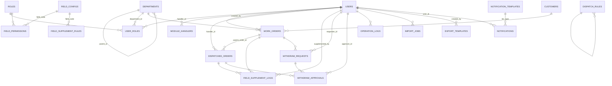
```mermaid
erDiagram
    DEPARTMENTS ||--o{ DEPARTMENTS : "parent_id"
    DEPARTMENTS ||--o{ USER_ROLES : "department_id"
    USERS ||--o{ USER_ROLES : ""
    ROLES ||--o{ USER_ROLES : ""
    ROLES ||--o{ FIELD_PERMISSIONS : ""
    FIELD_CONFIGS ||--o{ FIELD_PERMISSIONS : "field_code"
    FIELD_CONFIGS ||--o{ FIELD_SUPPLEMENT_RULES : "field_code"
    USERS ||--o{ MODULE_HANDLERS : "handler_id"
    USERS ||--o{ WORK_ORDERS : "created_by"
    CUSTOMERS ||--o{ WORK_ORDERS : ""
    DEPARTMENTS ||--o{ WORK_ORDERS : ""
    WORK_ORDERS ||--o{ DISPATCHED_ORDERS : "parent_order_id"
    USERS ||--o{ DISPATCHED_ORDERS : "handler_id"
    WORK_ORDERS ||--o{ FIELD_SUPPLEMENT_LOGS : ""
    DISPATCHED_ORDERS ||--o{ FIELD_SUPPLEMENT_LOGS : ""
    USERS ||--o{ FIELD_SUPPLEMENT_LOGS : "supplemented_by"
    WORK_ORDERS ||--o{ WITHDRAW_REQUESTS : ""
    USERS ||--o{ WITHDRAW_REQUESTS : "requester_id"
    WITHDRAW_REQUESTS ||--o{ WITHDRAW_APPROVALS : ""
    DISPATCHED_ORDERS ||--o{ WITHDRAW_APPROVALS : ""
    USERS ||--o{ WITHDRAW_APPROVALS : "approver_id"
    USERS ||--o{ OPERATION_LOGS : ""
    USERS ||--o{ IMPORT_JOBS : ""
    USERS ||--o{ EXPORT_TEMPLATES : "created_by"
    USERS ||--o{ NOTIFICATIONS : "user_id"
    NOTIFICATION_TEMPLATES ||--o{ NOTIFICATIONS : "biz_type"
    DISPATCH_RULES ||--o{ DISPATCH_RULES : ""
```

> 上图为主关系一览，细节字段见各表定义。

---

## 2. 基础域（Identity / Organization）

### 2.1 departments 部门
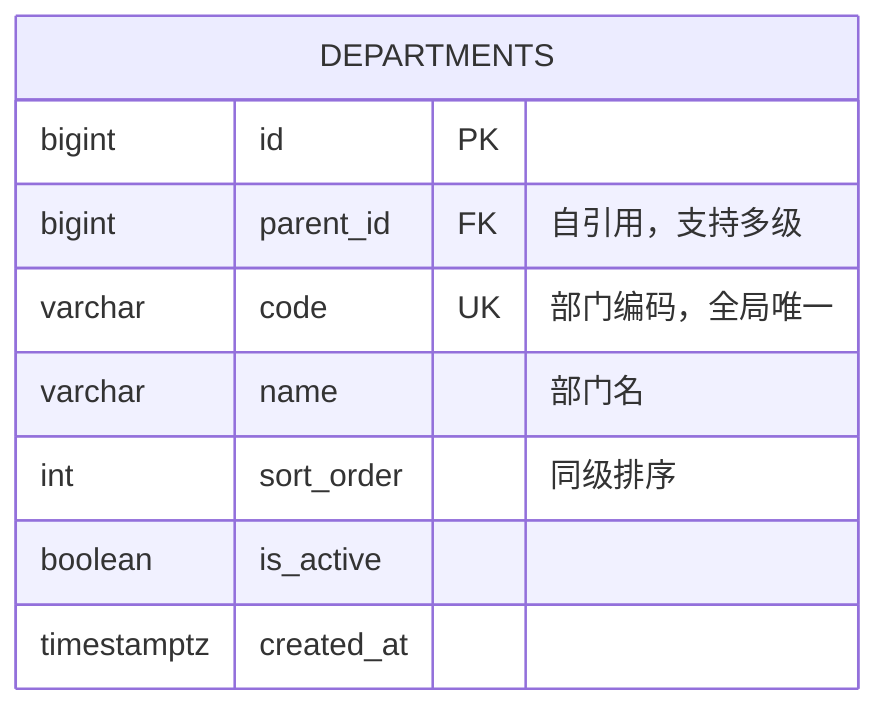
```mermaid
erDiagram
    DEPARTMENTS {
        bigint id PK
        bigint parent_id FK "自引用，支持多级"
        varchar code UK "部门编码，全局唯一"
        varchar name "部门名"
        int sort_order "同级排序"
        boolean is_active
        timestamptz created_at
    }
```
- 索引：`idx_dept_parent (parent_id)`、`uk_dept_code (code)`
- 软删除：`is_active=false`
- 扩展：部门树支持后续业务模块挂接（如新增税务团队）。

### 2.2 users 用户
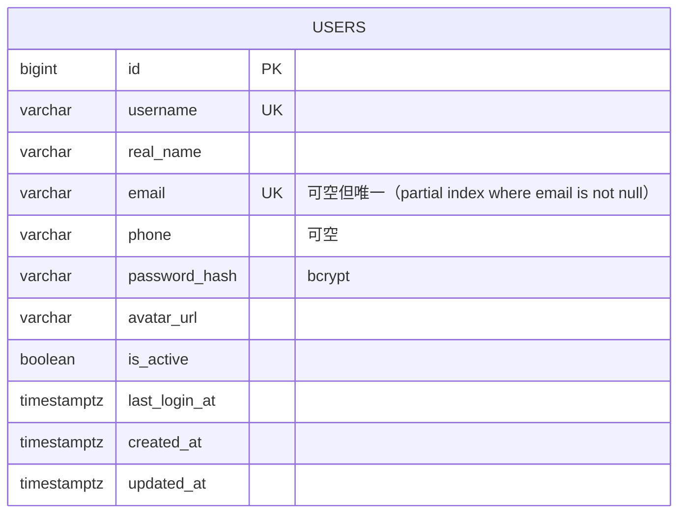
```mermaid
erDiagram
    USERS {
        bigint id PK
        varchar username UK
        varchar real_name
        varchar email UK "可空但唯一（partial index where email is not null）"
        varchar phone "可空"
        varchar password_hash "bcrypt"
        varchar avatar_url
        boolean is_active
        timestamptz last_login_at
        timestamptz created_at
        timestamptz updated_at
    }
```
- 索引：`uk_users_username`、`uk_users_email_notnull (email) where email is not null`
- 密码字段永不回传到前端（TypeORM `@Column({ select: false })`）。

### 2.3 roles 角色
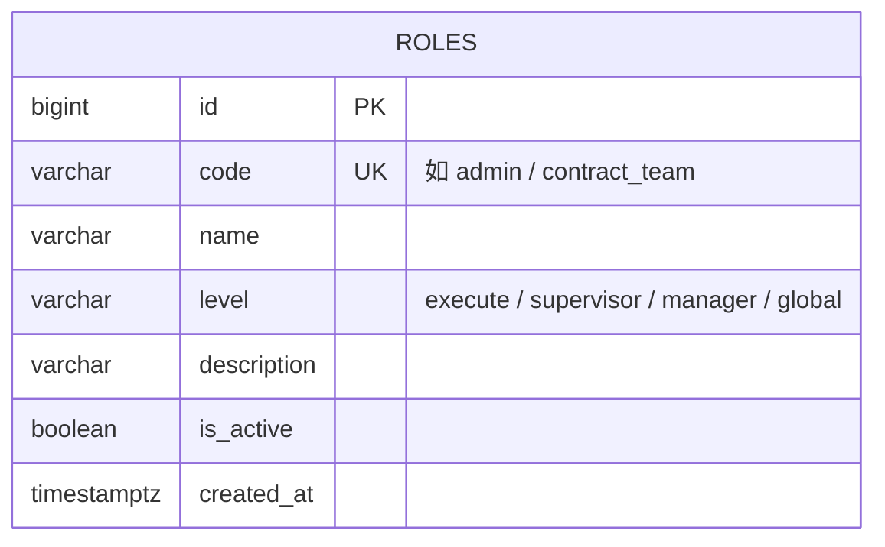
```mermaid
erDiagram
    ROLES {
        bigint id PK
        varchar code UK "如 admin / contract_team"
        varchar name
        varchar level "execute / supervisor / manager / global"
        varchar description
        boolean is_active
        timestamptz created_at
    }
```
- `level` 仅用于看板聚合与默认权限分层；权限真实依据在 `field_permissions` / 业务守卫中。
- 新建业务模块时 **不建议** 为每个后道岗单独加 `role`，而是给已有角色补字段权限（除非组织权限结构确实需要）。

### 2.4 user_roles 用户-角色多对多（含部门上下文）
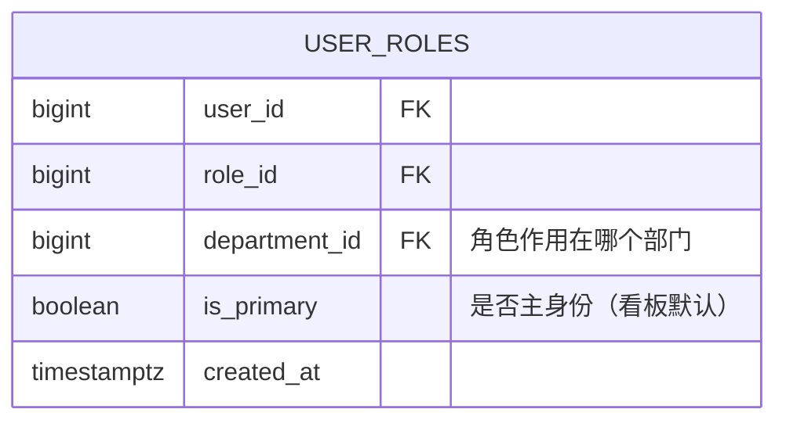
```mermaid
erDiagram
    USER_ROLES {
        bigint user_id FK
        bigint role_id FK
        bigint department_id FK "角色作用在哪个部门"
        boolean is_primary "是否主身份（看板默认）"
        timestamptz created_at
    }
```
- **复合主键**：`(user_id, role_id, department_id)`；保证一人可在多个部门扮演多角色。
- 索引：`idx_user_roles_user (user_id)`、`idx_user_roles_role (role_id)`、`idx_user_roles_dept (department_id)`
- 当用户仅有一个角色时 `is_primary=true`；前端登录后默认该身份。

### 2.5 customers 客户档案
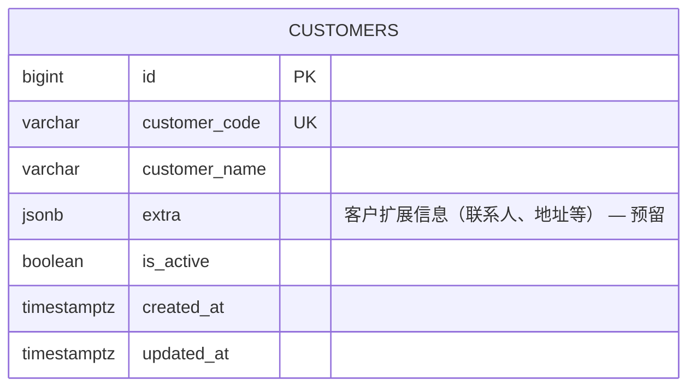
```mermaid
erDiagram
    CUSTOMERS {
        bigint id PK
        varchar customer_code UK
        varchar customer_name
        jsonb extra "客户扩展信息（联系人、地址等） — 预留"
        boolean is_active
        timestamptz created_at
        timestamptz updated_at
    }
```
- 客户扩展信息走 `extra` JSONB 承接，避免早期建多列。

---

## 3. 配置域（表驱动核心）

### 3.1 field_configs 字段配置
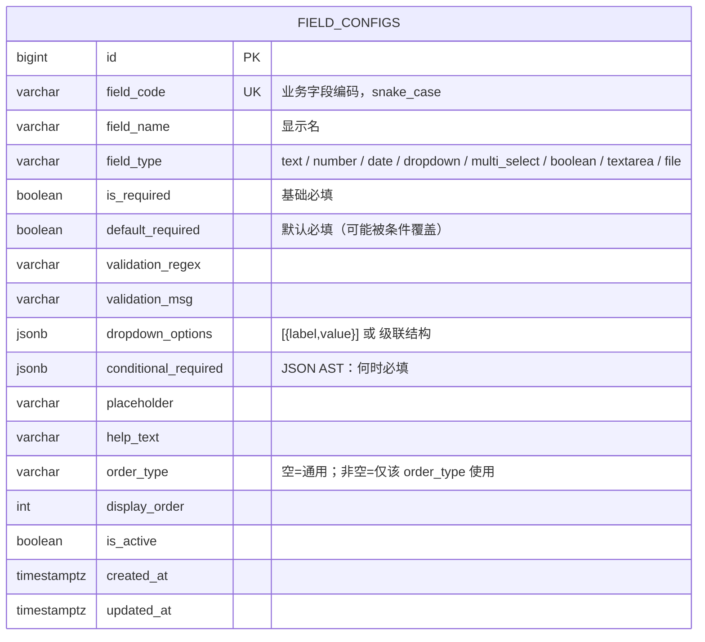
```mermaid
erDiagram
    FIELD_CONFIGS {
        bigint id PK
        varchar field_code UK "业务字段编码，snake_case"
        varchar field_name "显示名"
        varchar field_type "text / number / date / dropdown / multi_select / boolean / textarea / file"
        boolean is_required "基础必填"
        boolean default_required "默认必填（可能被条件覆盖）"
        varchar validation_regex
        varchar validation_msg
        jsonb dropdown_options "[{label,value}] 或 级联结构"
        jsonb conditional_required "JSON AST：何时必填"
        varchar placeholder
        varchar help_text
        varchar order_type "空=通用；非空=仅该 order_type 使用"
        int display_order
        boolean is_active
        timestamptz created_at
        timestamptz updated_at
    }
```
- `order_type = NULL` 表示通用字段（如姓名、身份证、手机号），所有业务复用。
- `conditional_required` 示例：`{"op":"EQ","field":"need_company_contract","value":"是"}`。
- 索引：`uk_field_code (field_code)`、`idx_fc_order_type (order_type, is_active)`
- 扩展：Phase 2 起若要做字段版本化，加 `version` 列 + 历史表；本期不做。

### 3.2 field_permissions 字段权限
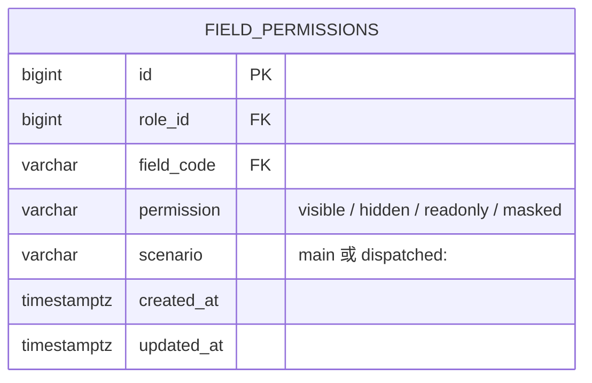
```mermaid
erDiagram
    FIELD_PERMISSIONS {
        bigint id PK
        bigint role_id FK
        varchar field_code FK
        varchar permission "visible / hidden / readonly / masked"
        varchar scenario "main 或 dispatched:<module_code>"
        timestamptz created_at
        timestamptz updated_at
    }
```
- **唯一键**：`uk_fp (role_id, field_code, scenario)`；同角色同场景同字段不重复。
- `scenario` 采用字符串表达，主工单用 `main`，子工单用 `dispatched:contract` / `dispatched:onboarding_contact` 等。
- 索引：`idx_fp_role (role_id)`、`idx_fp_scenario (scenario)`
- 多角色合并策略在应用层实现（见 `docs/架构设计.md` §3.3.2）。

### 3.3 dispatch_rules 派发规则
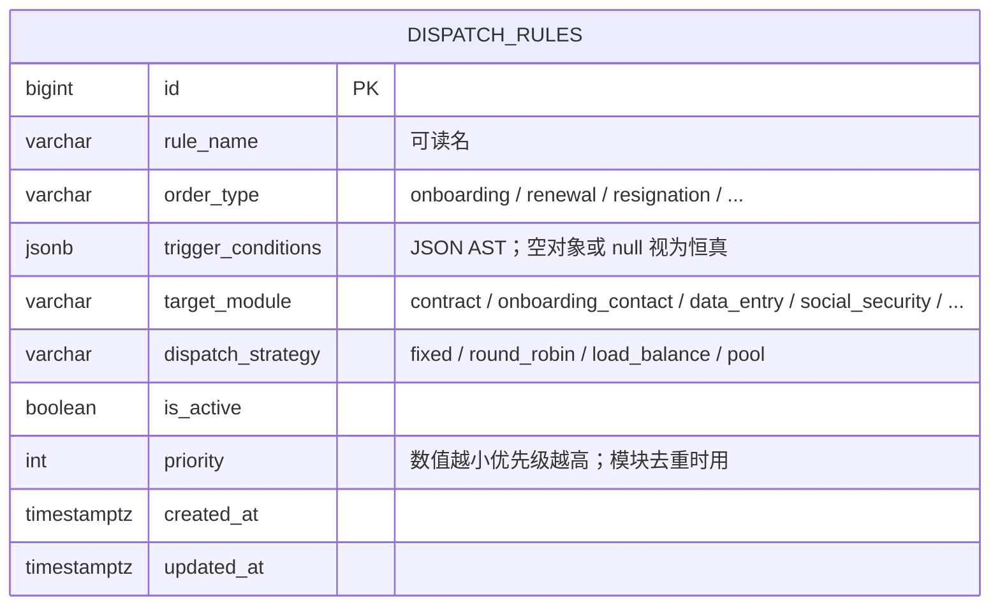
```mermaid
erDiagram
    DISPATCH_RULES {
        bigint id PK
        varchar rule_name "可读名"
        varchar order_type "onboarding / renewal / resignation / ..."
        jsonb trigger_conditions "JSON AST；空对象或 null 视为恒真"
        varchar target_module "contract / onboarding_contact / data_entry / social_security / ..."
        varchar dispatch_strategy "fixed / round_robin / load_balance / pool"
        boolean is_active
        int priority "数值越小优先级越高；模块去重时用"
        timestamptz created_at
        timestamptz updated_at
    }
```
- 索引：`idx_dr_type_active (order_type, is_active)`、`idx_dr_module (target_module)`
- 扩展：未来多租户加 `tenant_id`；多语言加 `i18n_key`。

### 3.4 module_handlers 模块处理人
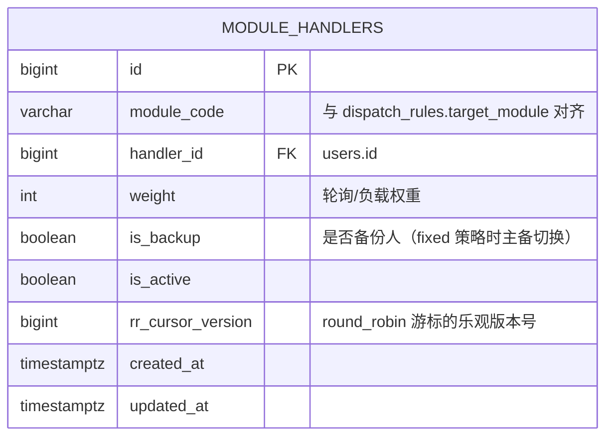
```mermaid
erDiagram
    MODULE_HANDLERS {
        bigint id PK
        varchar module_code "与 dispatch_rules.target_module 对齐"
        bigint handler_id FK "users.id"
        int weight "轮询/负载权重"
        boolean is_backup "是否备份人（fixed 策略时主备切换）"
        boolean is_active
        bigint rr_cursor_version "round_robin 游标的乐观版本号"
        timestamptz created_at
        timestamptz updated_at
    }
```
- 唯一键：`uk_mh (module_code, handler_id)`
- 索引：`idx_mh_module_active (module_code, is_active)`
- `rr_cursor_version` 用于 round_robin 并发安全：分派时 `UPDATE ... WHERE rr_cursor_version = ?`。

### 3.5 field_supplement_rules 字段补充规则
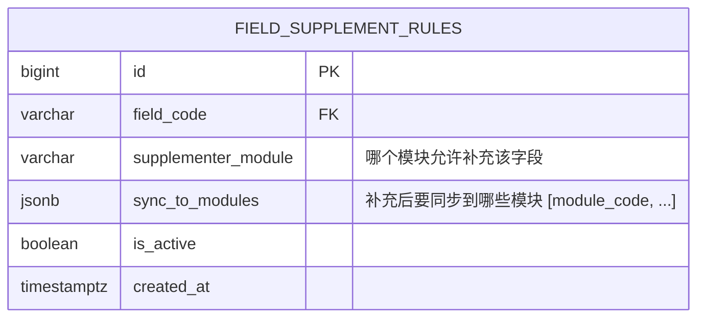
```mermaid
erDiagram
    FIELD_SUPPLEMENT_RULES {
        bigint id PK
        varchar field_code FK
        varchar supplementer_module "哪个模块允许补充该字段"
        jsonb sync_to_modules "补充后要同步到哪些模块 [module_code, ...]"
        boolean is_active
        timestamptz created_at
    }
```
- 唯一键：`uk_fsr (field_code, supplementer_module)`
- 典型：`bank_name / bank_account` 由 `onboarding_contact` 补充，同步到 `data_entry / social_security`。

### 3.6 export_templates 导出模板
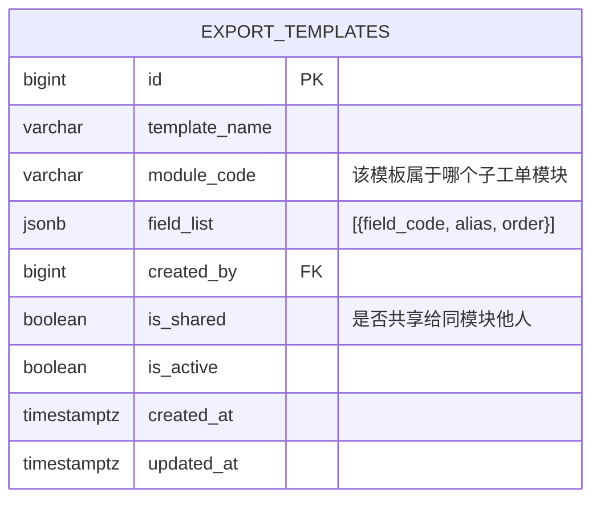
```mermaid
erDiagram
    EXPORT_TEMPLATES {
        bigint id PK
        varchar template_name
        varchar module_code "该模板属于哪个子工单模块"
        jsonb field_list "[{field_code, alias, order}]"
        bigint created_by FK
        boolean is_shared "是否共享给同模块他人"
        boolean is_active
        timestamptz created_at
        timestamptz updated_at
    }
```
- 索引：`idx_et_module (module_code, is_active)`、`idx_et_creator (created_by)`

---

## 4. 业务域

### 4.1 work_orders 主工单
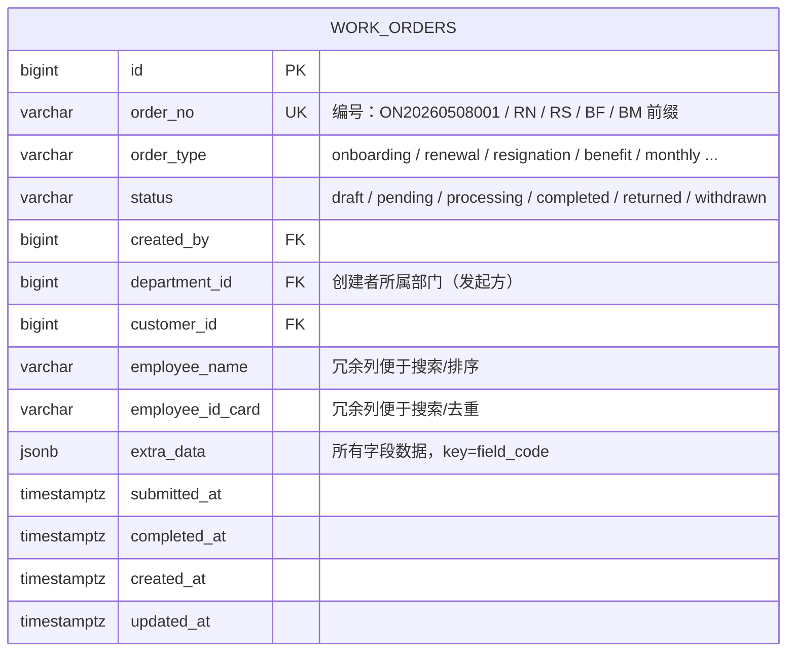
```mermaid
erDiagram
    WORK_ORDERS {
        bigint id PK
        varchar order_no UK "编号：ON20260508001 / RN / RS / BF / BM 前缀"
        varchar order_type "onboarding / renewal / resignation / benefit / monthly ..."
        varchar status "draft / pending / processing / completed / returned / withdrawn"
        bigint created_by FK
        bigint department_id FK "创建者所属部门（发起方）"
        bigint customer_id FK
        varchar employee_name "冗余列便于搜索/排序"
        varchar employee_id_card "冗余列便于搜索/去重"
        jsonb extra_data "所有字段数据，key=field_code"
        timestamptz submitted_at
        timestamptz completed_at
        timestamptz created_at
        timestamptz updated_at
    }
```
- 索引：
  - `uk_wo_order_no`
  - `idx_wo_status_type (status, order_type)`
  - `idx_wo_creator (created_by)`
  - `idx_wo_customer (customer_id)`
  - `idx_wo_idcard (employee_id_card)`
  - `idx_wo_extra_gin (extra_data jsonb_path_ops) USING GIN` — 支持按字段值模糊搜索
- 关键约束：`employee_name` / `employee_id_card` 是冗余列，提交时由 Service 从 `extra_data.姓名/身份证` 写入；保持两边一致通过触发器或 Service 双写（推荐 Service 双写，便于跨库移植）。
- **为什么用 JSONB**：不同 `order_type` 字段差异大；`field_configs` 可能在后台被改；与其为每个业务建一张宽表，不如用 JSONB + 配置驱动渲染。查询性能用 GIN 索引保障。

### 4.2 dispatched_orders 子工单
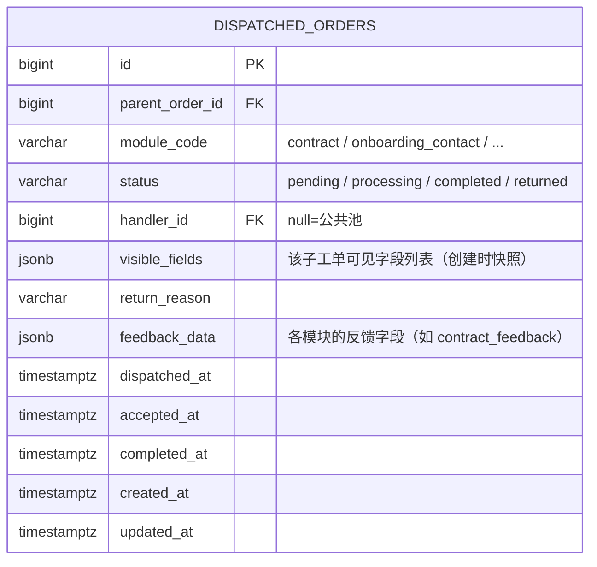
```mermaid
erDiagram
    DISPATCHED_ORDERS {
        bigint id PK
        bigint parent_order_id FK
        varchar module_code "contract / onboarding_contact / ..."
        varchar status "pending / processing / completed / returned"
        bigint handler_id FK "null=公共池"
        jsonb visible_fields "该子工单可见字段列表（创建时快照）"
        varchar return_reason
        jsonb feedback_data "各模块的反馈字段（如 contract_feedback）"
        timestamptz dispatched_at
        timestamptz accepted_at
        timestamptz completed_at
        timestamptz created_at
        timestamptz updated_at
    }
```
- 索引：
  - `idx_do_parent (parent_order_id)`
  - `idx_do_module_status (module_code, status)`
  - `idx_do_handler_status (handler_id, status)` 用于"我的待办"查询
- 幂等约束：`uk_do_parent_module (parent_order_id, module_code)` — **同一主工单每个模块最多一条子工单**；避免多规则命中重复派发。
- `visible_fields` 冗余存储是为了即使后台改了 `field_permissions`，历史子工单能稳定展示。
- `feedback_data` 承接"合同反馈 / 入职联系反馈 / 数据录入反馈"等，键为 `field_code`。

### 4.3 field_supplement_logs 字段补充日志
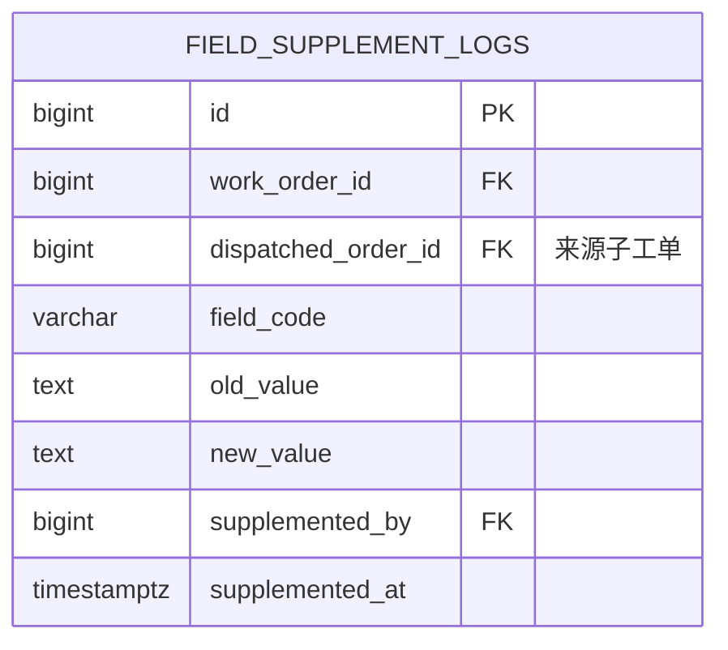
```mermaid
erDiagram
    FIELD_SUPPLEMENT_LOGS {
        bigint id PK
        bigint work_order_id FK
        bigint dispatched_order_id FK "来源子工单"
        varchar field_code
        text old_value
        text new_value
        bigint supplemented_by FK
        timestamptz supplemented_at
    }
```
- 索引：`idx_fsl_wo (work_order_id)`、`idx_fsl_do (dispatched_order_id)`、`idx_fsl_field (field_code)`
- 值以字符串化形式记录，便于审计；如需结构化，未来加 `old_value_json / new_value_json`。

### 4.4 withdraw_requests 撤回/修改申请
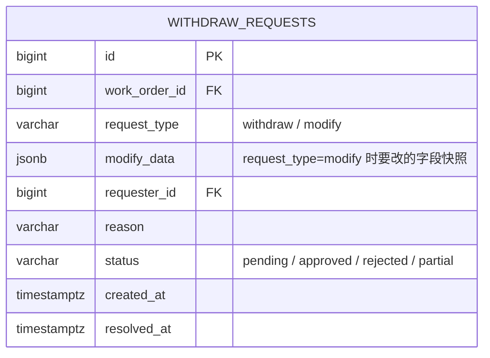
```mermaid
erDiagram
    WITHDRAW_REQUESTS {
        bigint id PK
        bigint work_order_id FK
        varchar request_type "withdraw / modify"
        jsonb modify_data "request_type=modify 时要改的字段快照"
        bigint requester_id FK
        varchar reason
        varchar status "pending / approved / rejected / partial"
        timestamptz created_at
        timestamptz resolved_at
    }
```
- 索引：`idx_wr_wo (work_order_id)`、`idx_wr_status (status)`、`idx_wr_requester (requester_id)`
- `partial` 状态保留：允许按子工单粒度部分通过（Phase 5 功能，本期定义字段但不走分支）。

### 4.5 withdraw_approvals 撤回审批明细
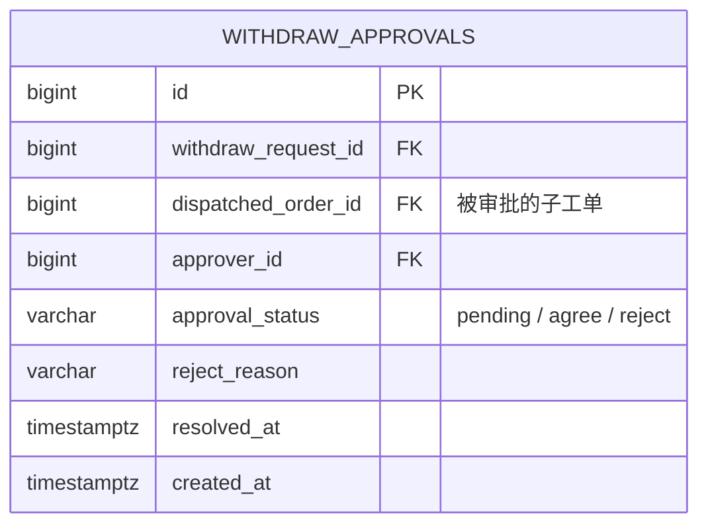
```mermaid
erDiagram
    WITHDRAW_APPROVALS {
        bigint id PK
        bigint withdraw_request_id FK
        bigint dispatched_order_id FK "被审批的子工单"
        bigint approver_id FK
        varchar approval_status "pending / agree / reject"
        varchar reject_reason
        timestamptz resolved_at
        timestamptz created_at
    }
```
- 唯一键：`uk_wa (withdraw_request_id, dispatched_order_id)`
- 索引：`idx_wa_approver_status (approver_id, approval_status)` 支撑"待我审批"查询

### 4.6 operation_logs 操作日志
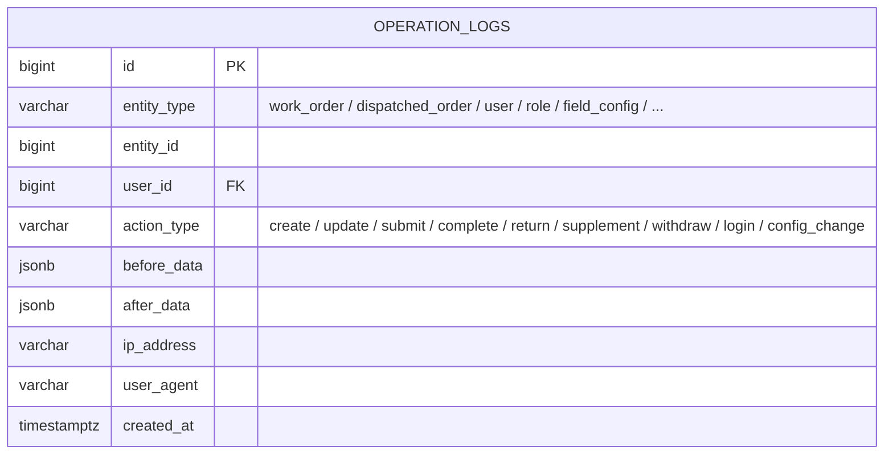
```mermaid
erDiagram
    OPERATION_LOGS {
        bigint id PK
        varchar entity_type "work_order / dispatched_order / user / role / field_config / ..."
        bigint entity_id
        bigint user_id FK
        varchar action_type "create / update / submit / complete / return / supplement / withdraw / login / config_change"
        jsonb before_data
        jsonb after_data
        varchar ip_address
        varchar user_agent
        timestamptz created_at
    }
```
- 索引：
  - `idx_ol_entity (entity_type, entity_id)`
  - `idx_ol_user_time (user_id, created_at DESC)`
  - `idx_ol_action_time (action_type, created_at DESC)`
- 保留策略：本期永久保留；后期按季度归档。

### 4.7 import_jobs 导入任务
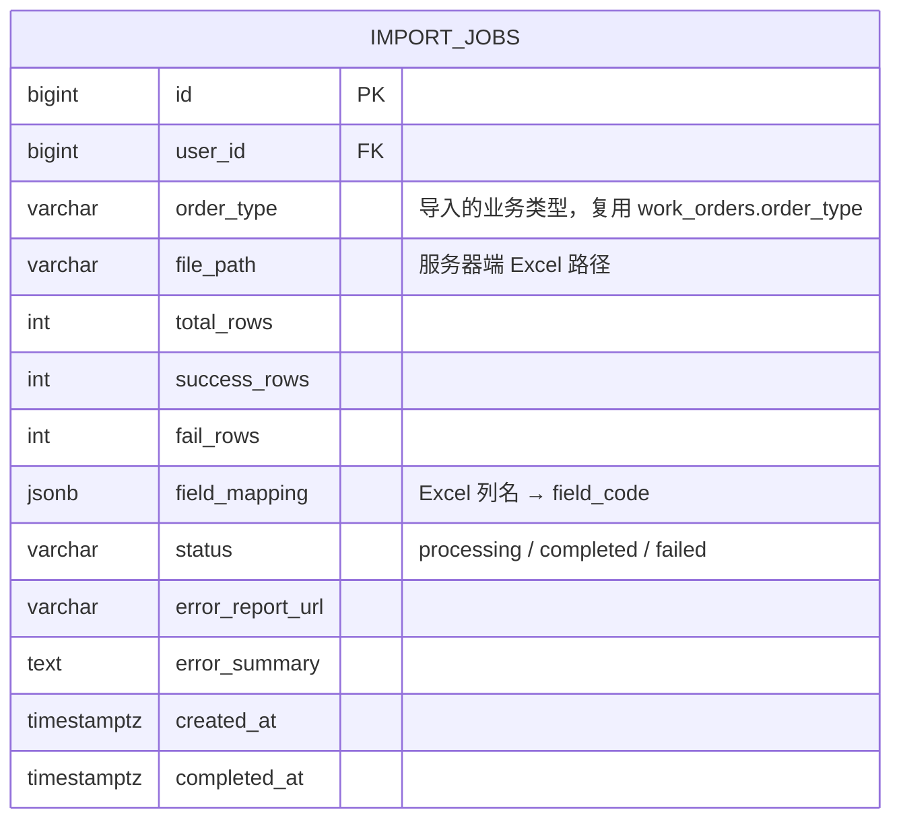
```mermaid
erDiagram
    IMPORT_JOBS {
        bigint id PK
        bigint user_id FK
        varchar order_type "导入的业务类型，复用 work_orders.order_type"
        varchar file_path "服务器端 Excel 路径"
        int total_rows
        int success_rows
        int fail_rows
        jsonb field_mapping "Excel 列名 → field_code"
        varchar status "processing / completed / failed"
        varchar error_report_url
        text error_summary
        timestamptz created_at
        timestamptz completed_at
    }
```
- 索引：`idx_ij_user_time (user_id, created_at DESC)`、`idx_ij_status (status)`

### 4.8 notifications 站内通知（Phase 6 正式启用，№20）
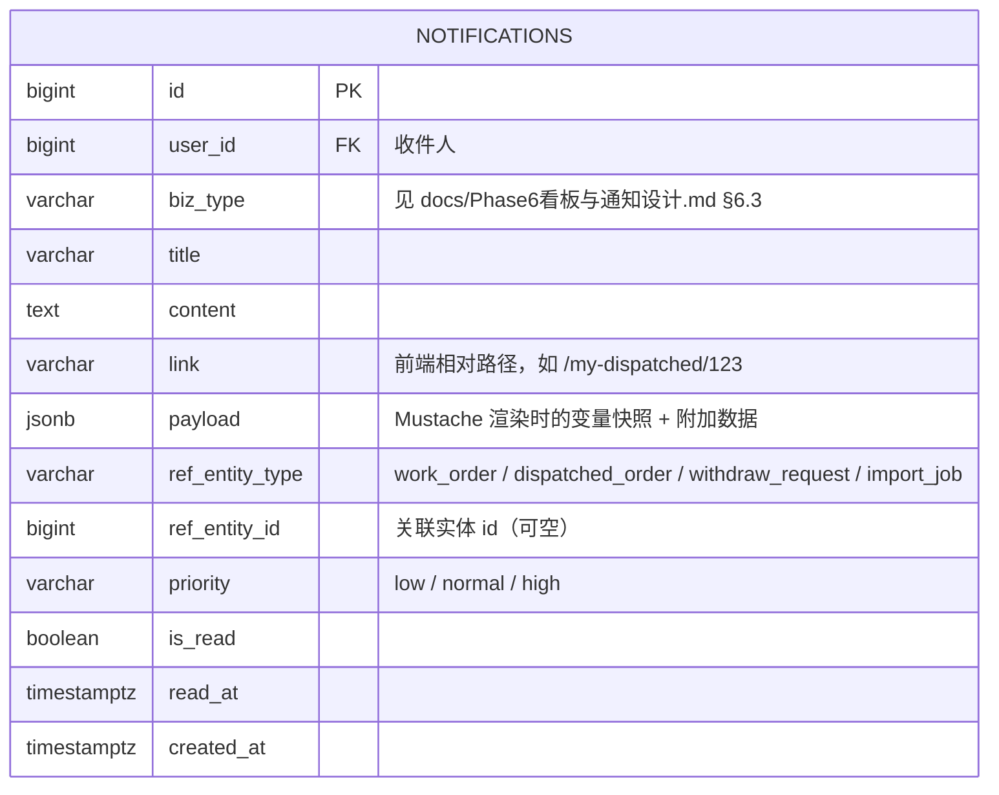
```mermaid
erDiagram
    NOTIFICATIONS {
        bigint id PK
        bigint user_id FK "收件人"
        varchar biz_type "见 docs/Phase6看板与通知设计.md §6.3"
        varchar title
        text content
        varchar link "前端相对路径，如 /my-dispatched/123"
        jsonb payload "Mustache 渲染时的变量快照 + 附加数据"
        varchar ref_entity_type "work_order / dispatched_order / withdraw_request / import_job"
        bigint ref_entity_id "关联实体 id（可空）"
        varchar priority "low / normal / high"
        boolean is_read
        timestamptz read_at
        timestamptz created_at
    }
```
- 索引：
  - `idx_nt_user_unread (user_id, is_read, created_at DESC)` — 未读列表 / 未读计数
  - `idx_nt_ref (ref_entity_type, ref_entity_id)` — 按实体反查通知（SLA 去重用）
  - `idx_nt_biz_created (biz_type, created_at DESC)` — 按类型审查
- 约束：`priority IN ('low','normal','high')`；`is_read=false` 时 `read_at` 必须为 NULL。
- 保留策略：90 天后由 cron 清理已读；未读永久保留（由上层业务干预）。
- 设计预留：未来可加 `channel (inbox / email / sms)`、`locale` 等；本期只做站内（inbox）。

### 4.9 notification_templates 通知模板（Phase 6 新增，№21；v1.2 扩展）
```mermaid
erDiagram
    NOTIFICATION_TEMPLATES {
        bigint id PK
        varchar biz_type UK "与 notifications.biz_type 对齐"
        varchar title_template "Mustache 模板，如 '子工单已派给你 · {{module}}'"
        text content_template "Mustache 模板"
        varchar default_link "默认跳转路由，如 /my-dispatched/{{dispatchedOrderId}}"
        varchar default_priority "low / normal / high"
        jsonb default_channels "v1.2 新增：{\"in_app\":true,\"email\":false,\"sms\":false}"
        jsonb variables "v1.2 新增：JSON Schema Draft-2020-12，描述模板变量形状"
        boolean is_active
        timestamptz created_at
        timestamptz updated_at
    }
```
- 唯一键：`uk_nt_biz (biz_type)`
- 由 admin 在 `/admin/notification-templates` 维护；Seed 植入全部默认 `biz_type`（见 `backend/src/database/seeds/seed-notification-templates.ts`）。
- 渲染约束：只允许 `{{var}}` 简单变量替换（Mustache），不执行逻辑，避免注入风险。
- 关系：`notification_templates.biz_type` 作为**逻辑外键**被 `notifications.biz_type` 引用；不建数据库外键以便旧数据保持可读（模板被软删除后历史通知仍可展示）。
- **v1.2 新增列语义**：
  - `default_channels`（JSONB，NOT NULL，DEFAULT `'{"in_app":true,"email":false,"sms":false}'::jsonb`）：模板在下发通知时默认走哪些通道。`NotificationService.send()` 在找不到用户偏好时回落到此值。允许的 key 固定为 `in_app` / `email` / `sms`，未来新通道通过架构变更加入；
  - `variables`（JSONB，NULL 允许）：模板所需变量的 JSON Schema（Draft 2020-12）。`NotificationService.send()` 在渲染前用 Ajv 校验，不通过则拒发并记录 `notification_render_failed` 日志；当列值为 NULL 时视为"不校验"，为兼容旧行而保留。
- **索引**：`default_channels` / `variables` 不建 GIN 索引（运行时按 `biz_type` 拉单条模板即可，没有按通道查询的场景）。

---

## 5. 全部 21 张表列表

| 序 | 域 | 表名 | 用途简述 |
|---|----|------|----------|
| 1 | 组织 | `departments` | 树形部门 |
| 2 | 身份 | `users` | 用户 |
| 3 | 身份 | `roles` | 角色 |
| 4 | 身份 | `user_roles` | 用户-角色-部门 三元组 |
| 5 | 业务 | `customers` | 客户档案 |
| 6 | 配置 | `field_configs` | 字段定义（表驱动核心） |
| 7 | 配置 | `field_permissions` | 角色×字段×场景权限 |
| 8 | 配置 | `dispatch_rules` | 派发规则（JSON AST 条件） |
| 9 | 配置 | `module_handlers` | 模块处理人池 |
| 10 | 配置 | `field_supplement_rules` | 字段回流允许配置 |
| 11 | 配置 | `export_templates` | 导出模板 |
| 12 | 业务 | `work_orders` | 主工单 |
| 13 | 业务 | `dispatched_orders` | 子工单 |
| 14 | 业务 | `field_supplement_logs` | 字段补充日志 |
| 15 | 业务 | `withdraw_requests` | 撤回/修改申请 |
| 16 | 业务 | `withdraw_approvals` | 审批明细 |
| 17 | 审计 | `operation_logs` | 操作日志 |
| 18 | 任务 | `import_jobs` | 批量导入任务 |
| 19 | 配置 | `module_rr_state`（预留） | round_robin 游标；本期复用 `module_handlers.rr_cursor_version`，暂不建表 |
| 20 | 消息 | `notifications` | 站内通知 |
| 21 | 消息 | `notification_templates` | 通知模板 |

> 说明：№19 为"预留位"——Phase 3 RR 策略的游标通过 `module_handlers.rr_cursor_version` 乐观锁实现，暂不新建独立表；若未来需要独立 state 表再启用该编号。本期实际物理建表 **20** 张（1~18 + 20 + 21）。

---

## 6. 外键与级联策略

| 外键 | 策略 | 原因 |
|------|------|------|
| `user_roles.user_id → users.id` | ON DELETE CASCADE | 删除用户则清理授权关系 |
| `user_roles.role_id → roles.id` | ON DELETE RESTRICT | 防止误删在用角色 |
| `work_orders.created_by → users.id` | ON DELETE RESTRICT | 历史归档依赖 |
| `dispatched_orders.parent_order_id → work_orders.id` | ON DELETE CASCADE | 主工单删除时子工单随之清理（实际不应删主工单） |
| `dispatched_orders.handler_id → users.id` | ON DELETE SET NULL | 处理人离职回到公共池 |
| `module_handlers.handler_id → users.id` | ON DELETE CASCADE | 处理人离职移除其派发能力 |
| `field_permissions.role_id → roles.id` | ON DELETE CASCADE | 删除角色清理权限 |
| `field_supplement_logs.*` | ON DELETE RESTRICT | 审计必须完整 |
| `operation_logs.*` | 无 FK（记录为冗余值） | 日志独立，不受引用约束阻止写入 |

---

## 7. 关键字段规范

- **时间列**：统一 `timestamptz`，默认 `created_at` 由数据库 `now()` 生成；`updated_at` 由 TypeORM `@UpdateDateColumn` 或触发器更新。
- **JSONB 列**：对频繁查询的路径建 GIN 索引（仅 `work_orders.extra_data` 建全表 GIN，其它按需加 expression index）。
- **枚举列**：用 `varchar` + 应用层枚举常量 + CHECK 约束（如 `status IN (...)`）。不用 PG `ENUM` 类型以便未来扩展。
- **软删除**：统一用 `is_active` 布尔列；彻底删除仅在审计数据之外允许。
- **编号生成**：`work_orders.order_no` 由 Service 生成，算法：`前缀(2-3字母) + YYYYMMDD + 当日流水4位`；数据库层加唯一约束。

---

## 8. 迁移与 Seed 约束（交给后端）

- 迁移脚本放 `backend/src/database/migrations/`，命名 `{timestamp}-{desc}.ts`，**每次改表都写迁移**，禁止 `synchronize: true` 上生产。
- 初始 Seed 放 `backend/src/database/seeds/`，至少包含：
  - 11 个默认角色（需求 §3.1）
  - 5 个默认部门（需求 §3.2）
  - 54 个入职字段的 `field_configs`（需求 §7）
  - 4 条默认派发规则（需求 §3.4）
  - 字段权限矩阵（需求 §8，逐场景逐角色写入）
  - 默认 admin 账号（用户名 `admin`，初始密码 `admin123`，首次登录强制改密）

---

## 9. 扩展示例（以"续签"为例，说明无须改表）

续签业务的典型做法：
1. 后台新增 `order_type = 'renewal'` 的字段（比如"续签期限类型"），在 `field_configs` 加行。
2. `field_permissions` 给 `contract_team` / `contract_supervisor` 配置 `scenario = 'dispatched:contract'` 的可见/可编辑字段。
3. `dispatch_rules` 加一条 `order_type=renewal`、`target_module=contract` 的规则（`trigger_conditions = {}` 恒真）。
4. 前端动态表单自动识别新的 `order_type` 并渲染。

**无需任何 DDL 变更**，这是表驱动设计的核心价值。
