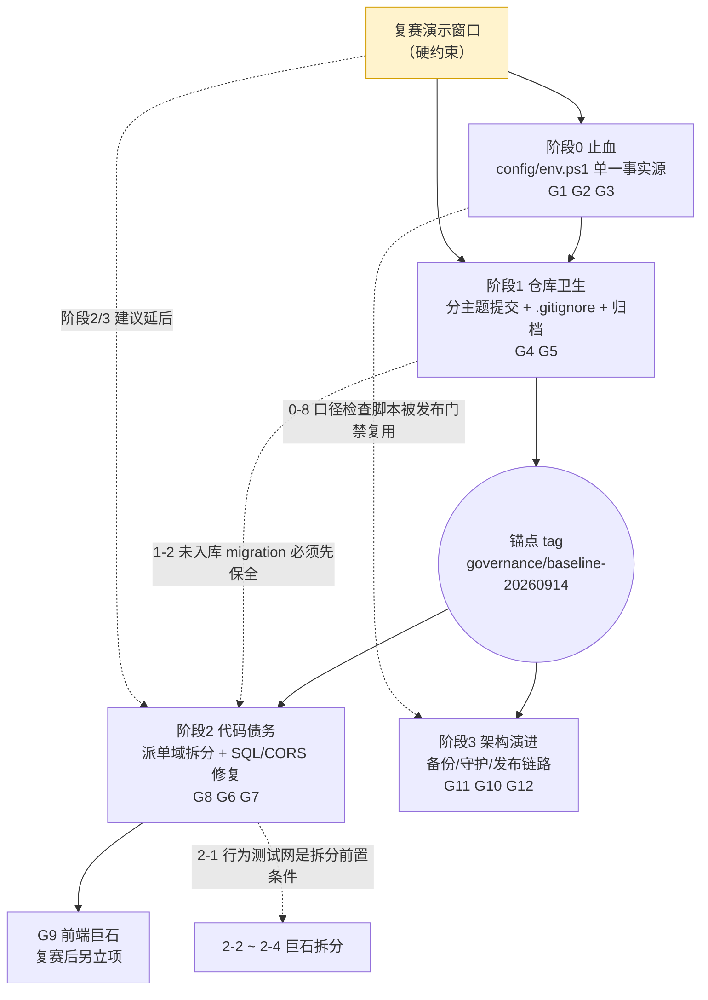
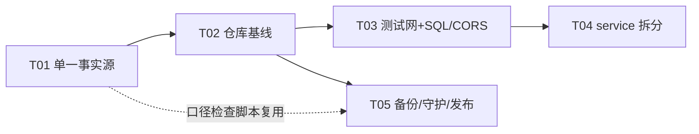

# 智派工单系统 治理计划（2026-09-14）

- 编制：架构师 高见远
- 适用形态：局域网单机服务器（浏览器 → Vite 前端 5173 → Vite proxy → NestJS 后端 → PostgreSQL 16 便携版）
- 约束基线：`AGENTS.md`、`docs/AI修改前必读.md`、`docs/业务规则回归清单.md`、`docs/project-rules/AGENTS.md`
- 前置原则：**治理不得长期冻结功能开发**；复赛演示可用性优先；每阶段可独立交付、可独立回滚。
- 本文档为计划文档，不含任何代码改动。所有落点以「文件:行」形式给出，便于工程师直接执行。

---

## 0. 实测事实基线（本计划所有决策的依据）

### 0.1 端口/环境口径的 5 处互斥声明（逐一核实）

| # | 来源文件（行号） | 后端端口 | 前端端口 | PG 端口 | PG 主机 | 备注 |
|---|---|---|---|---|---|---|
| 1 | `架构设计文档.md:23,32,42,49,73,89,113,166` | 3000 | 5173 | **5432** | 127.0.0.1 | 文档口径 |
| 2 | `日常启动.ps1:18,20,21,25,27` | 3000 | 5173 | **5433** | 127.0.0.1 | 显式注入 `$env:PORT=3000`、`$env:DB_PORT=5433`、`AUTO_SEED=false` |
| 3 | `升级启动.ps1:14,17,18` | 3000 | 5173 | **5433** | — | 与日常启动同口径 |
| 4 | `局域网启动.ps1:17,18,23,159` | 3000 | 5173 | **未注入 env，但输出文案写 5432** | — | 第 159 行打印 `127.0.0.1:5432`，与真实依赖（`backend/.env` 的 5433）矛盾 |
| 5 | `backend/.env:2,6` | **3001** | — | **5433** | 127.0.0.1 | 进程 env 覆盖 → 实测监听 3000，即 `.env` 的 3001 长期是"假配置" |
| 6 | `backend/.env.example:2,9` | 3000 | — | **5432** | 127.0.0.1 | 模板与真实 `.env` 双双不一致 |
| 7 | 根 `.env:7,12,16,18` | — | — | 5432 / `127.0.0.1:15432` | `postgres` | Docker/Nginx 生产口径，与本地原生启动无关 |
| 8 | `frontend/vite.config.ts:8,17` | proxy→3000 | 5173 | — | — | 未设 `strictPort`，5173 被占时静默漂移到 5178 |

**结论**：真实运行态 = 后端 3000 + 前端 5173（易漂移）+ PG **5433**。唯一「与实测一致但仅被部分脚本采用」的口径是 **3000 / 5173 / 5433**。

### 0.2 其他已核实事实

| 项 | 证据 | 影响 |
|---|---|---|
| 工作区脏 | `git status --porcelain` = 219 条（88 M / 1 D / 130 ??） | 无法建立"治理前基线"，任何重构都无法安全回滚 |
| 未跟踪 migration | `backend/src/database/migrations/` 下 `20260911001000`、`20260913100000`、`20260914100000`、`20260914200000`、`20260914210000`、`20260914220000` 共 6 份未入库 | **属生产资产，绝不可丢弃或误 ignore**（`20260914220000` 是业务员导入权限补偿迁移，见 `AI修改记录.md` 末节） |
| 临时产物未全覆盖 | `.gitignore:71-76` 只覆盖 `.tmp_local_e2e/` 的 2 个子目录；`backend/.tmp_orig_validation_spec.ts`、`backend/check-*.js`(6 份)、`/.release/` 均未被忽略；`*.log` 已被忽略（`.gitignore:16-18`） | 脏状态长期不可清 |
| 启动脚本委托链缺陷 | `快速启动.ps1:10` 向 `日常启动.ps1` 传 `-Restart`，但 `日常启动.ps1:1-4` 未声明该参数 | 快速启动在部分调用下直接抛参数错误 |
| CORS 无约束 | `backend/src/main.ts:19` `app.enableCors()` 无 origin 白名单 | 局域网内任意源可携凭证跨源调用 |
| 原生 SQL 缺陷 | `backend/src/modules/dashboard/dashboard.service.ts:1082` `leader-trend fallback` 告警（历史日志含 `syntax error at or near $1`） | 仪表盘 leader-trend 长期走降级分支，数据口径可能失真 |
| 巨石文件 | 后端 `dispatched-order.service.ts` 4431 / `work-order.service.ts` 2333 / `in-service-orders` 1854 / `dashboard.service.ts` 1460；前端 `MyDispatched/Detail/index.tsx` 1641、`Admin/DispatchConfig` 1430 | 派单域一处改动回归面极大 |
| 文档漂移 | 根目录 44 份 `.md` 状态报告（`CURRENT-STATUS.md`、`FINAL-*.md`、`8个问题*.md` 等）；`docs/` 202 项 | 新会话误读旧口径风险高 |
| 发布意图未收敛 | `/.release/`（多个 `*-runtime`、`SOURCE_COMMIT*`、`*.tar`）+ 根 `.env`(Docker/nginx) + `docs/deploy/` 发布记录 | 生产/演示/本地三套链路混杂 |

---

## 1. 问题总览与优先级矩阵

评分口径：影响面（1-5，5=全员/演示直接受影响）× 修复成本（1-5，5=最高）。P0 = 高影响且低成本或阻塞其他治理；P1 = 影响明确但可排在演示冻结期后；P2 = 长期演进项。

| ID | 问题 | 影响面 | 成本 | 象限 | 定级 | 定级理由 |
|---|---|---|---|---|---|---|
| G1 | 端口/环境 5 套口径互斥（§0.1），且 `局域网启动.ps1:159` 输出与真实值矛盾 | 5 | 1 | 高影响·低成本 | **P0** | 每次排障都在错信息下推理；新会话/AI 误配概率最高；改动纯配置，回归面极小 |
| G2 | `vite.config.ts` 无 `strictPort` → 前端静默漂移 5173→5178 | 4 | 1 | 高影响·低成本 | **P0** | 同事访问的 `http://SERVER_IP:5173` 直接打不开，是最典型的"演示当场翻车"故障模式 |
| G3 | `快速启动.ps1` 传未定义参数 `-Restart` | 3 | 1 | 中影响·低成本 | **P0** | 一行修复；不修则日常启动入口不稳定 |
| G4 | 219 处未提交变更 + 6 份未入库生产 migration + `.tmp_local_e2e/`、`check-*.js` 污染 | 5 | 2 | 高影响·低成本 | **P0** | 无干净基线 → 阶段2 的巨石重构无法安全回滚；未跟踪 migration 有误删风险（属"资产保全是前置"类） |
| G5 | 根目录 44 份 + `docs/` 202 份历史报告与新会话规则入口冲突 | 4 | 2 | 中高影响·低成本 | **P1** | `AGENTS.md:9-13` 已固定唯一入口，历史文档只干扰不致断；可归档不需急删 |
| G6 | `dashboard.service.ts:1082` leader-trend 原生 SQL 参数化缺陷（走 fallback） | 4 | 2 | 中影响·低成本 | **P1** | 数据口径可能失真 → 演示时仪表盘数字错误属高风险；但需先定位 SQL 分支再改并补测 |
| G7 | `main.ts:19` CORS 无白名单 | 3 | 1 | 中影响·低成本 | **P1** | 单机局域网风险有限；改白名单需注意不能挡掉 `SERVER_IP:5173` 与 Vite proxy 链路 |
| G8 | 后端 4 个巨石 service（4431/2333/1854/1460 行） | 5 | 5 | 高影响·高成本 | **P1** | 派单域是业务心脏，回归面最大；必须建立在 G4 干净基线 + G9 回归网之上，不能与功能开发并行抢占 |
| G9 | 前端巨石页面（1641/1430 行） | 3 | 4 | 中影响·高成本 | **P2** | 已有 `AI修改前必读.md:136-154` 的固定测试保护，收益低于后端拆分 |
| G10 | 发布链路三套并存（`.release/`、根 `.env` Docker、`docs/deploy/`） | 4 | 4 | 中高影响·高成本 | **P2** | 影响可复制部署，不影响当场演示 |
| G11 | 单点故障 + 无守护自愈 + 无定期备份演练 | 5 | 3 | 高影响·中成本 | **P1** | 服务器宕机 = 全员不可用；`pg_dump` 未自动化属数据安全红线，优先级应高于代码美观 |
| G12 | HTTP 明文 + 局域网外不可达 | 3 | 4 | 中影响·高成本 | **P2** | 局域网明文可接受；HTTPS 需内网证书信任，演示前引入是自找风险 |

**P0 集合（必须最先做，合计 1~2 人日）：G1、G2、G3、G4。**

---

## 2. 分阶段路线图

### 阶段 0：止血 —— 端口与环境单一事实源（P0：G1/G2/G3）

**目标**：全仓库只剩一处定义端口/主机/路径；任何脚本、文档、模板的端口声明都能被这一处校验；前端端口冲突时报错而非漂移。

**统一口径（推荐默认，待用户确认 → 见 §6 D1）**

| 项 | 统一值 | 理由 |
|---|---|---|
| PostgreSQL | `127.0.0.1:5433` / `ticket_system` | 便携版实例实测监听 5433；改回 5432 需动 `postgresql.conf`+重启数据库，风险不对等 |
| 后端 | `0.0.0.0:3000`（健康检查 `http://127.0.0.1:3000/api/health`） | 与实测进程、`停止系统.ps1:10`、架构文档一致 |
| 前端 dev | `0.0.0.0:5173` + `strictPort:true` | 与 `架构设计文档.md:42`、`局域网启动.ps1:18`、防火墙规则一致 |
| Docker 生产 | 保留 `HTTP_PORT=8080`、容器内 `postgres:5432` | 属另一部署形态，独立命名空间，不与本地口径冲突；只需在文档中显式分区说明 |

**动作清单（落到文件级）**

| # | 动作 | 落点 |
|---|---|---|
| 0-1 | 新建单一事实源：`config/env.ps1`，导出 `$DbHost=127.0.0.1`、`$DbPort=5433`、`$DbName=ticket_system`、`$BackendHost=0.0.0.0`、`$BackendPort=3000`、`$FrontendPort=5173`、`$NodeDir=D:\AI\node-v20.20.2-win-x64`、`$PgBin`、`$PgData`、`$HealthUrl`、`$LanApiBase`；文件内不写密码（密码仍从 `backend/.env` 读取，沿用 `日常启动.ps1:29-41` 的解析逻辑） | 新增 `config/env.ps1` |
| 0-2 | 5 个启动/停止脚本改为 `. config\env.ps1` 后引用变量，删除各自硬编码行 | `日常启动.ps1:15-21`、`局域网启动.ps1:13-18`、`升级启动.ps1:14-18`、`停止系统.ps1:10`、`快速启动.ps1` |
| 0-3 | `局域网启动.ps1` 补 `$env:DB_HOST/$env:DB_PORT/$env:DB_DATABASE` 显式注入（当前只靠 `.env` 兜底），并把第 159 行文案改为读变量输出 | `局域网启动.ps1:21-25,159` |
| 0-4 | `backend/.env`：`PORT=3001` → `PORT=3000`（消除"假配置"）；`DB_PORT=5433` 保持；`DB_PASSWORD`/`JWT_*` 一律不动 | `backend/.env:2` |
| 0-5 | `backend/.env.example`：`DB_PORT=5432` → `5433`，并在头部加"仅示例，真实值见 config/env.ps1"注释 | `backend/.env.example:6-14` |
| 0-6 | `vite.config.ts`：`port: Number(process.env.VITE_PORT ?? 5173)` + `strictPort: true`；proxy target 从 `BACKEND_PORT` 环境变量派生（默认 3000） | `frontend/vite.config.ts:8,16-17` |
| 0-7 | 修委托链：`日常启动.ps1` 声明 `[switch]$Restart` 并实现"先调停止系统再启动"，或 `快速启动.ps1` 停止透传该参数 | `日常启动.ps1:1-4` / `快速启动.ps1:10` |
| 0-8 | 新增自检脚本 `scripts/检查环境口径.ps1`：解析 `config/env.ps1`，grep 5 个启动脚本 + `backend/.env*` + `vite.config.ts` + `架构设计文档.md` 端口章节，任一漂移即非零退出（治理成果可持续的唯一保障） | 新增文件 |
| 0-9 | `架构设计文档.md` 端口章节改写：5432→5433、增加"Docker 生产形态 vs 本地局域网形态"分区表、声明"端口以 `config/env.ps1` 为唯一事实源" | `架构设计文档.md:23,32,42,49,73,89,113,166` |

**验收标准（全部可机检）**

1. `netstat -ano | findstr LISTENING` 实测：`0.0.0.0:3000`、`0.0.0.0:5173`、`127.0.0.1:5433` 三项与 `config/env.ps1` 一致。
2. 依次执行 `日常启动.ps1`、`局域网启动.ps1`、`升级启动.ps1`、`停止系统.ps1` 均成功退出，且打印的数据库端口 = 5433。
3. 人为占用 5173 后启动前端，**Vite 直接报错退出**（不再出现 5178）。
4. `scripts/检查环境口径.ps1` 退出码 0；`grep -rn "3001" backend/.env`、`grep -n "5432" 架构设计文档.md` 均为空（Docker 章节除外，用显式标注豁免）。
5. `Invoke-WebRequest http://<LAN_IP>:5173` 与 `http://<LAN_IP>:3000/api/health` 双 200；同事机可访问。

**预估工作量**：0.8~1.2 人日（配置改动 0.4，自检脚本 0.4，文档 0.2）。

**风险与回滚点**

| 风险 | 缓解 | 回滚 |
|---|---|---|
| 改 `backend/.env PORT` 后被其他遗留脚本依赖 3001（如 `.tmp_local_e2e/start-backend-3010.ps1` 系 E2E 专用） | 全库 grep `3001` 后逐处确认；E2E 临时脚本一律不改（已属归档对象） | 单 commit 回退：`git revert <sha>` |
| `strictPort` 把"能起来但端口不对"变成"直接起不来" | 启动脚本已有占用者检测（`日常启动.ps1:49-60`）会给出进程名；文档写明处置方法 | 移除 `strictPort` 一行 |
| PG 若真实端口非 5433（便携版被重装） | 0-8 自检脚本会立即报出，且 `日常启动.ps1:84-86` 已有前置断言 | 只改 `config/env.ps1` 一处 |
| 演示当天窗口 | 本阶段改动不含业务逻辑，但**必须在演示日之前完成并回归**（见 §6 D10） | — |

---

### 阶段 1：仓库卫生 —— 基线收敛 + 忽略规则 + 文档归档（P0：G4 / P1：G5）

**目标**：`git status` 归零，建立"治理前干净基线 + 可回滚锚点 tag"；一次性产物不再进 `git status`；历史报告只归档不删除。

**动作清单**

| # | 动作 | 落点 |
|---|---|---|
| 1-1 | 先补 `.gitignore` 再提交（避免临时物被顺手提交）：追加 `/.release/`、`/.tmp_local_e2e/`（整目录，替代现 `.gitignore:73-74` 的 2 个子目录）、`backend/.tmp_*`、`/tmp_*`（根级已有，扩到子目录 `**/.tmp_*`）、`backend/check-*.js`、`backend/temp-*`、`*.bak`、`/test-*.ps1`、`/tmp_*.ps1`、`docs/archive/` **不**忽略 | `.gitignore:16-77` |
| 1-2 | **先入库 6 份未跟踪 migration**（`20260911001000`…`20260914220000`）为独立 commit，message 标注对应 `AI修改记录.md` 小节；确认 123+6=129 份迁移文件全部 tracked | `backend/src/database/migrations/` |
| 1-3 | 88 处已修改文件按主题分 6 组提交，每组一次 `回归测试.ps1 -SkipBuild`：① customer-portal 与 portal-review ② dispatched-orders 派单域 ③ imports/模板与字段校验 ④ work-orders 与 validation/resubmit ⑤ seeds + role-action-permissions ⑥ 测试与文档。**禁止一次性巨型提交** | `git add -p` 分组 |
| 1-4 | 未跟踪的测试/源码文件（`backend/test/*.spec.ts` 9 份、`probation-date-validation.ts`、`legacy-province-write.guard.ts` 等）判定归属：属业务实现 → 随 1-3 对应组入库；属临时验证 → 移入 `scripts/oneoff/` 并忽略 | `backend/test/`、`backend/src/modules/work-orders/` |
| 1-5 | 一次性脚本物理迁移：`backend/check-*.js`(6)、`extract_office_sources.ps1`、`tmp_work_order_api.ps1` → `scripts/oneoff/`；`.tmp_local_e2e/` 中被 `docs/AI修改记录.md` 引用为证据的脚本 → `docs/deploy/evidence/2026-09/`（保留可追溯），其余整目录忽略不删 | 新增 `scripts/oneoff/` |
| 1-6 | 根目录 44 份历史报告 `git mv` → `docs/archive/2026-Q3/`（保留改名历史）；新增 `docs/archive/README.md` 索引：文件、生成日期、状态（已过时/仍有效/被哪份取代）；`AI_README.md`、`README.md`、`AGENTS.md`、`架构设计文档.md`、`业务*指南` 等仍在用的**留在根目录** | 根目录 → `docs/archive/2026-Q3/` |
| 1-7 | 归档目录顶部横幅统一加一句"本目录只作历史留痕，不是规则来源，规则见 `AGENTS.md`"；在 `docs/AI修改前必读.md:1` 之后新增第 0.5 节「禁止把 `docs/archive/**` 与根目录历史报告当作口径来源」 | 归档文件 + `docs/AI修改前必读.md` |
| 1-8 | 打治理锚点：`git tag governance/baseline-20260914`（阶段2 的唯一回滚锚点） | — |
| 1-9 | `.release/` 处置：确认可由发布脚本再生后整目录忽略；`SOURCE_COMMIT*` 说明写入 `docs/deploy/` | `.gitignore` |

**验收标准**

1. `git status --porcelain` **输出为空**（不是"变少"）。
2. `git ls-files backend/src/database/migrations | wc -l` = 129，`git status --porcelain backend/src/database/migrations` 为空。
3. `git check-ignore -v backend/.tmp_orig_validation_spec.ts backend/check-fields.js .release/` 全部命中规则。
4. 根目录 `.md` 文件数 ≤ 10；`docs/archive/2026-Q3/README.md` 覆盖全部归档件。
5. `git tag -l governance/*` 存在；`git revert` 演练（对探针 commit）成功。
6. `回归测试.ps1`（全量，含 build）通过一次，作为基线绿。

**预估工作量**：1.5~2.5 人日（大头在 1-3 的分组审查与逐组回归）。

**风险与回滚点**

| 风险 | 缓解 | 回滚 |
|---|---|---|
| 分组提交时把"半成品功能代码"入库 | 每组提交前跑对应模块测试；不确定的文件保留在工作区（先只提交已验证组） | 逐 commit revert；基线未打 tag 前不推进阶段2 |
| 误 `git clean -fd` 删掉未跟踪的**业务文件** | 严禁 clean；1-4 必须先 `git ls-files --others` 逐个判定 | 从 `.tmp_local_e2e/` 备份或 IDE 本地历史恢复 |
| 归档 `git mv` 后旧链接失效（`AI修改记录.md` 引用根目录路径） | 归档前 grep 交叉引用，被引用文件保留或留 stub 指针文件 | `git mv` 可逆 |
| 用户仍在用 `CURRENT-STATUS.md` 等作为交接材料 | 归档不删除 + `docs/archive/README.md` 索引保留可查 | — |

---

### 阶段 2：代码债务 —— 派单域解耦 + 数据口径修复（P1：G8/G6/G7）

**目标**：把"一处改动回归面极大"的派单域拆成可独立测试的单元；行为**零变化**（纯结构重构）；同时修掉仪表盘 SQL 降级与 CORS 白名单两个 P1 缺陷。

**动作清单**

| # | 动作 | 落点 | 手法 |
|---|---|---|---|
| 2-1 | 先补行为基线测试（无测试不重构）：为 `dispatched-order.service` 的接单/派单/退回/办结/改单/导出 6 类关键路径补特征测试（characterization test），断言"输入 → DTO 输出 + 状态迁移 + 权限裁剪结果" | `backend/test/dispatched-order.behavior.spec.ts` 新增 | 以现有 `test/business-closed-loop.e2e-spec.ts` 为模板 |
| 2-2 | `dispatched-order.service.ts`(4431行) 拆为 facade + 5 个协作 service，公开方法签名与 controller/DTO 完全不变：`DispatchedOrderQueryService`（列表/筛选/`applyUserScope`）、`DispatchedOrderActionService`（接单/转派/退回）、`DispatchedOrderStatusService`（9 状态流转 + 枚举校验）、`DispatchedOrderValidationService`（已有 `work-order-validation.service.ts` 参照）、`DispatchedOrderExportService`(exceljs) | `backend/src/modules/dispatched-orders/` 新 5 文件 + `dispatched-order.service.ts` 瘦身为委托门面 | 门面模式，`@Injectable()` + 模块 providers 追加；禁改 `main.ts` 中间件链 |
| 2-3 | `work-order.service.ts`(2333) 抽 `WorkOrderScopeService`（`applyUserScope` 唯一实现点）、`WorkOrderResubmitService` 已存在 → 合并委托；接入未跟踪的 `probation-date-validation.ts` / `legacy-province-write.guard.ts` | `backend/src/modules/work-orders/` | 同上 |
| 2-4 | `in-service-orders.service.ts`(1854) 抽查询构造器 + 子工单状态视图；`dashboard.service.ts`(1460) 抽每个统计卡片为独立 provider | `backend/src/modules/in-service-orders/`、`dashboard/` | 每卡片单独可测 |
| 2-5 | **修 G6**：定位 `dashboard.service.ts:1082` 上方原生 SQL 分支（`$1` 语法错误典型成因：在 TypeORM `query()` 里写了 PG 原生 `$1` 占位而参数未随 `query(sql, params)` 传入，或把 `:name` 与 `$1` 混用）。统一改为命名参数 + 显式 params 数组；补单测覆盖"有数据 / 无数据 / 跨月份"三种；**消除 fallback 静默降级**：降级时同时返回可识别标记（不改变前端契约，仅日志升级为 error + 指标计数） | `backend/src/modules/dashboard/dashboard.service.ts` | — |
| 2-6 | **修 G7**：`main.ts` CORS 改为白名单函数，允许 `http://localhost:5173`、`http://127.0.0.1:5173`、`http://<LAN_IP>:5173`、`http://<LAN_IP>:3000`、`http://localhost:3000`，白名单来源 `config/env.ps1` 同源的环境变量 `ALLOWED_ORIGINS`；`credentials: true`；保留 `/events`、`/socket.io` 的 ws 通道可用 | `backend/src/main.ts:19` | 不能挡掉 `局域网启动.ps1` 打印的 LAN 访问 URL |
| 2-7 | 前端仅做低风险拆分（G9 降级为"顺带"）：`MyDispatched/Detail/index.tsx`(1641) 抽 `useDetailNavigation`（接 `utils/dispatchedDetailNavigation.test.ts`）、`utils/dispatchedStatusFilter`（已有测试）；页面壳保留 | `frontend/src/pages/MyDispatched/Detail/` | 禁改 `routeVisibility.ts` |
| 2-8 | 文件行数红线制度化：新增/重写文件 ≤ 600 行；写入 `docs/project-rules/AGENTS.md`，并在 `scripts/检查环境口径.ps1` 之外新增 `scripts/检查结构红线.ps1` | `docs/project-rules/AGENTS.md`、新增脚本 | — |

**验收标准**

1. `dispatched-order.service.ts` ≤ 400 行（纯门面）；新 5 个 service 各 ≤ 800 行。
2. **未新增/未删除任何对外 HTTP 路由与 DTO 字段**：`git diff --stat backend/src/**/*.controller.ts backend/src/**/*.dto.ts` 为空或仅注释。
3. `AI修改前必读.md:136-154` 列出的 18 个固定前端测试 + `backend/test/business-closed-loop.e2e-spec.ts` + 9 状态枚举测试全部通过。
4. `回归测试.ps1` 全量通过；后端 2-1 新增行为测试 100% 通过，且在重构前后**结果逐字节一致**（同一 fixture 快照对比）。
5. 日志中不再出现 `leader-trend fallback`；leader-trend 返回真实数据（人工核对与 SQL 客户端直查一致）。
6. 跨源探测：非白名单 origin 请求返回不含 `Access-Control-Allow-Origin`；LAN 页面登录 + 派单 + 办结全链路可用（真实浏览器，不 mock）。
7. 每个 2-x 子步一个独立 commit，任一子步可单独 revert 而不影响其他。

**预估工作量**：4~6 人日（2-1 测试网 1.5、2-2 派单域 2、2-3/2-4 1.5、2-5 0.5、2-6 0.3、2-7 0.5）。**建议排在复赛演示之后**；若必须前置，只做 2-1 + 2-5 + 2-6（约 2.5 人日，零业务结构风险）。

**风险与回滚点**

| 风险 | 缓解 | 回滚 |
|---|---|---|
| 隐式行为漂移（字段权限、状态机旁路、事务边界） | 2-1 先建网；每抽一个 service 就跑全量回归；`FieldPermissionInterceptor` 相关测试必须绿 | 单 service 级 revert（每步一 commit） |
| TypeORM 事务跨服务后失效（`dataSource.transaction` 被拆散） | 事务边界统一保留在 facade 或 `*ActionService` 内部，禁止跨 service 传 manager 之外的上下文 | 回退到 facade 原实现 |
| 循环依赖（DispatchedOrder ↔ WorkOrder） | 用 `forwardRef` 前先尝试下沉共享逻辑到第三个 service | — |
| 与功能开发冲突（同一文件并行改动） | 阶段2 期间**派单域功能需求进冻结队列**，或按文件级 owner 排他（见 §6 D9） | 基线 tag `governance/baseline-20260914` |
| CORS 白名单误伤同事访问 | 白名单从 `config/env.ps1` 同源生成，改 IP 只需改一处；上线前用 LAN IP 实测 | 单 commit 回退到 `app.enableCors()` |

---

### 阶段 3：架构演进 —— 发布链路收敛 + 可靠性（P1：G11 / P2：G10/G12）

**目标**：把"演示能跑"升级为"服务可恢复、发布可重复、数据可回滚"。不做微服务化、不做换栈。

**动作清单**

| # | 动作 | 落点 |
|---|---|---|
| 3-1 | 备份自动化：`scripts/备份数据库.ps1`（`pg_dump -p 5433 -Fc ticket_system` → `backups/`，保留 14 份 + 每日 03:00 计划任务），并在 `docs/deploy/` 写**恢复演练手册**（含 RTO 目标 ≤ 15 分钟） | 新增脚本 + 文档 |
| 3-2 | 服务守护：便携版 PG 注册为 Windows 服务（`pg_ctl register`）；后端用 NSSM 或 `Microsoft.PowerShell.Utility` 计划任务实现"崩溃自动重启 + 开机自启"，健康探测沿用 `日常启动.ps1:61-71` 的 `Wait-Http200` | `config/env.ps1` + 新增 `服务安装.ps1` |
| 3-3 | 发布链路单一化：`发布.ps1` 一个入口（构建 → 打 tar → 传服务器 → 迁移 → 健康检查 → 回滚备份），`.release/` 由它独占写入；`SOURCE_COMMIT*` 语义写入 `docs/deploy/发布链路说明.md`；根 `.env` 重命名职责为 `.env.docker`（保留符号链接兼容 compose），并在文件头注明"本地原生启动不读此文件" | 新增 `发布.ps1`、`docs/deploy/`、根 `.env` |
| 3-4 | 端口一致性纳入发布门禁：`scripts/检查环境口径.ps1` 作为 `发布.ps1` 第 1 步失败即中止（防口径再漂移） | 阶段0 产物 |
| 3-5 | 数据同步：保留 socket.io `/events`（`vite.config.ts:27-35` 已代理），把仪表盘 + 我的待办的"手动刷新"升级为事件驱动增量刷新；**范围限定 2 个页面**，不做全局 | 前端 2 页 + 后端事件发布点 |
| 3-6 | HTTPS（可选，默认暂缓）：若需外网/合规，用 Caddy 反代 3000/5173 + 内网根证书分发手册；演示环境不引入 | `docs/deploy/HTTPS方案.md`（仅出方案） |
| 3-7 | 可观测性最小集：`traceIdMiddleware`（`main.ts:21` 已有）贯通到日志行；错误率与健康端点 `api/health` 增加 DB 连通性检查；日志轮转（避免 `backend-run.*.log` 无限增长） | `backend/src/` |

**验收标准**

1. 停服 → 用最新备份恢复 → 关键 3 表行数/摘要与备份前一致（人工核对留痕）。
2. 服务器重启后 60 秒内：PG + 后端 + 前端全部自愈，`api/health` 200，同事无需人工干预。
3. `发布.ps1` 一键完成一次发布，且口径检查失败时能中止并有明确提示（注入错端口做门禁演练）。
4. 待办/仪表盘在双浏览器窗口下 ≤ 3 秒感知状态变化（不再依赖刷新）。
5. 文档层：`架构设计文档.md` 的部署章节与 `发布.ps1` 实际行为一致（由 3-4 脚本反查）。

**预估工作量**：3~5 人日（3-1/3-2 各 0.8，3-3 1.5，3-5 1，3-6 仅方案 0.5，3-7 0.4）。全部排在复赛之后。

**风险与回滚点**：计划任务与手动脚本**双入口抢端口** → 守护方案上线时同步把启动脚本改为"健康则复用"（`日常启动.ps1:106,119` 已有该语义，保持一致）；备份占盘 → 保留策略上限 + `backups/` 已在 `.gitignore:13`；HTTPS 引入证书信任失败 → 默认暂缓，仅出方案不落生产。

---

## 3. 阶段间依赖关系

**关键依赖说明**

1. **阶段0 → 阶段1 无强序但建议先 0**：阶段0 改的脚本/`.env` 会进入阶段1 的提交集，先定口径可避免"提交了错口径再改一遍"。
2. **阶段1 是阶段2 的硬前置**：219 处脏变更下做 4431 行拆分 = 无法区分"我的重构改动"与"别人已有改动"，回滚能力丧失。
3. **阶段2 内部 2-1 → 2-2/2-3/2-4 是硬序**（无测试网不重构）；2-5、2-6 与 2-2 无依赖，可插队到演示前做（低风险高收益）。
4. **阶段3 与阶段2 可并行**（不同文件面），但 3-4 依赖阶段0 的 0-8 自检脚本。
5. **G9（前端巨石）显式后置**：避免与派单域后端拆分同时改同一条业务链路。

---

## 4. 每项动作的规范落点（文档 / 测试）

| 动作 | 需更新文档 | 必须跑的验证 |
|---|---|---|
| 0-1~0-9 端口口径统一 | `docs/AI修改记录.md`（追加一节）；`架构设计文档.md`（端口/拓扑章节）；`docs/project-rules/AGENTS.md`（新增"端口唯一事实源"条款）；若涉及 `.env.example` 说明则同步 | `回归测试.ps1 -SkipBuild`；三条启动脚本实跑 + `netstat` 留证；LAN 双机访问 |
| 1-1~1-9 仓库卫生 | `docs/AI修改记录.md`（记录提交分组与 tag）；`docs/archive/2026-Q3/README.md`（新建）；`docs/AI修改前必读.md` §8 提交前检查清单追加 `.release/`、`backend/.tmp_*` | 每组提交前 `-SkipBuild`；分组完成后**全量** `回归测试.ps1`（含 build）；`git status` 归零截图 |
| 1-2 migration 保全 | `docs/AI修改记录.md` 交叉引用对应生产发布记录（`docs/deploy/入职期限字段修复发布-20260914.md` 等） | `backend/test/onboarding-duration-migrations.spec.ts`、`restore-business-import-migration.spec.ts`；TypeORM migration 幂等演练 |
| 2-1~2-4 巨石拆分 | `docs/AI修改记录.md`（每次一小条）；`docs/API规范.md` 若目录结构变则更新模块清单；`docs/project-rules/AGENTS.md` 新增 600 行红线 | `AI修改前必读.md` §7 全部 18 个固定测试；`business-closed-loop.e2e-spec.ts`；派单域行为测试；全量 `回归测试.ps1` |
| 2-5 leader-trend SQL | `docs/业务规则回归清单.md`：**若发现降级分支与既有统计口径（按派发/创建月份，见 `AI修改前必读.md:57`）不同，必须先指冲突再定稿**；`docs/AI修改记录.md` | dashboard 单测 + `src/pages/Dashboard/index.test.tsx`；SQL 直查对账 |
| 2-6 CORS | `架构设计文档.md` 安全章节（现 `:231` 只提防火墙）；`docs/AI修改记录.md` | 后端权限/登录相关 spec；LAN 真实浏览器全链路 |
| 3-1~3-7 | `docs/deploy/发布链路说明.md`、`恢复演练手册`、`HTTPS方案.md`；`架构设计文档.md` 部署拓扑；`docs/AI修改记录.md` | 恢复演练留痕、重启自愈计时、发布门禁负向测试 |
| 全阶段通用 | 每阶段收尾在 `docs/AI修改记录.md` 追加「治理阶段 N 完成」小节：改了什么 / 为什么 / 如何验证 / commit 号 / 是否有未提交无关文件（`AI修改前必读.md` §9 五要素） | 阶段收尾必跑一次**全量** `回归测试.ps1` |

**不得顺手改的清单（来自 `docs/业务规则回归清单.md`）**：9 状态枚举及筛选项、月份统计口径（派发/创建月份，不默认完成时间）、`routeVisibility.ts` 菜单/角色矩阵、改密链路与 `mustChangePassword` 同步语义、列表状态保留与"返回列表"来源优先规则、表格 `dataIndex` ↔ DTO ↔ service 过滤三层一致性。阶段2 的行为测试网必须以这些为断言基线。

---

## 5. 明确不做清单

### 5.1 归档而非删除

| 对象 | 处置 | 原因 |
|---|---|---|
| 根目录 44 份状态/交付报告（`CURRENT-STATUS.md`、`FINAL-DELIVERY-REPORT.md`、`FINAL-PROJECT-REPORT.md`、`FINAL-STATUS.md`、`LATEST-UPDATE.md`、`MILESTONE-50-PERCENT.md`、`PROJECT-COMPLETION-REPORT.md`、`PROJECT-SUMMARY.md`、`EXECUTION-LOG.md`、`DELIVERY-CHECKLIST.md`、`TASK-CHECKLIST.md`、`8个问题*.md`、`Phase0-*.md`、`System-Deep-Understanding-Report.md` 等） | `git mv` → `docs/archive/2026-Q3/` + 索引 | 承载历史验收/交付证据链，删除即失去追溯；且被 `docs/AI修改记录.md` 多处引用 |
| 权限体系三份重构长文（`Permission-*.md`、`权限体系优化完整规划.md`、`系统权限综合分析报告.md`、`frontend-permission-analysis.md`、`permission-config-root-cause-analysis.md`） | → `docs/archive/permission/` | 权限现状以代码 + 回归清单为准，文档只作设计沿革 |
| `docs/` 内 Phase1~Phase7 / P0~P7 / 0520 / 0603 系列期次报告 | 原地加"已过时"横幅，不移动（数量大、移动成本高，`docs/` 本身已是次级入口） | 成本收益不划算；只需在 `AI修改前必读.md` 声明"非规则来源" |
| `.tmp_local_e2e/` 中被生产发布记录引用的验证脚本与 `root-cause*.txt` | → `docs/deploy/evidence/2026-09/`，目录整体不再作为代码 | 是发布证据，不是可维护源码 |
| `backend/*.log`、`backend-run.*.log`、`frontend-run.*.log` | 保留磁盘文件（滚动/清理交给 3-7），仅靠 `.gitignore:16-18` 排除入库 | 排障仍需回溯近期日志 |

### 5.2 暂缓（"看似该修"但不做）

| 项 | 不做理由 | 重启条件 |
|---|---|---|
| 微服务化 / 换 Nest 之外框架 / 换 ORM / 上 K8s | 单机局域网形态下纯增复杂度，与演示目标相反 | 用户量跨出 LAN 或多门店 |
| 把 PG 端口从 5433 改回 5432（为"对齐文档"） | 需改便携版配置 + 重启数据库，风险 > 收益；正确做法是改文档迁就实测 | 决定统一为 Docker 形态部署时 |
| HTTPS / 外网门户对外暴露 | 内网证书信任成本高，演示期引入等于制造当场故障 | 复赛通过、进入真实外网试用 |
| 全仓库 ESLint/Prettier 格式化落地 | 会产生万行级 diff，污染 `git blame` 与回滚能力 | 阶段2 完成后仅对**新增文件**启用 |
| 重写历史 123 份 migration / 压缩 schema | 生产已执行到 136，改历史 = 制造不可复现环境（`AI修改记录.md` 明示迁移只能追加） | 永不做 |
| 为通过测试而删断言 / 加"临时兼容" | `AI修改前必读.md:94-95` 明令禁止 | 永不做 |
| 一次性 `git clean -xfd` 清脏 | 会连带删掉 6 份未入库 migration 与业务源码（`??` 中混有实现文件） | 仅在对已备份 worktree 做实验时 |
| 把 `backend/.env` 里的 `DB_PASSWORD`/`JWT_SECRET` 强制改为读系统环境变量 | 局域网单机 + `.env` 已忽略入库（`.gitignore:9`）；改造会让 5 个启动脚本连锁失效 | 阶段3 若上守护/多机时一并处理 |
| 前端巨石页面（G9）全量重写 | 已有固定测试保护，重写风险 > 债务成本 | 阶段2 之后单独立项 |
| 删除 `.claude/`、`.codex/`、`.aionrs/`（脏变更里含 6 个 SKILL.md 修改） | 属工具配置，与业务无关且用户可能在用；本轮不纳入提交也不删除 | 用户明确要求时 |
| 修复"数据同步靠刷新"的全站方案 | 阶段3 限定 2 个页面，全局推送需先解决字段权限与服务端事件语义 | 派单域拆分完成后 |

---

## 6. 待明确事项（含推荐默认值）

| ID | 需你决策 | 备选项 | **推荐默认** |
|---|---|---|---|
| D1 | 端口统一采用哪套？ | A 采用实测：PG 5433 / 后端 3000 / 前端 5173；B 采用文档：PG 5432（需改便携版 PG 并重启数据库） | **A（5433/3000/5173）**，文档与 `.env.example` 向实测收敛，Docker 生产形态单独分区命名 |
| D2 | 允许直接把 `backend/.env` 的 `PORT=3001` 改成 3000？ | 是 / 保留 3001 并让脚本改注入 3001 | **是，改 3000**（3001 实为长期失效的假配置，保留会继续误导排障） |
| D3 | 是否启用 `vite strictPort`？ | 是（占用即报错）/ 否（继续漂移） | **是**，并在 `AI修改前必读.md` 写明"5173 被占时如何定位占用进程" |
| D4 | 219 处脏变更的处置方式 | A 分 6 主题提交（推荐）；B 一次性大提交；C 丢弃全部 | **A**，并**禁止** C。是否需要我先产出"分组清单"给你逐组确认？（默认我按 1-3 自主执行） |
| D5 | 未跟踪文件中 `backend/test/*.spec.ts`、`probation-date-validation.ts`、`legacy-province-write.guard.ts` 等是否入库？ | 入库 / 移入 `scripts/oneoff/` / 删除 | **入库**（是被业务代码引用的实现，删或忽略会导致 build 失败） |
| D6 | `backend/check-*.js`(6 份)、`.tmp_local_e2e/*` 处置 | A 移 `scripts/oneoff/` 并忽略；B 直接删；C 原地忽略 | **A**（证据类先迁 `docs/deploy/evidence/`） |
| D7 | 根目录 44 份报告 `git mv` 到 `docs/archive/2026-Q3/` 是否批准（含 `CURRENT-STATUS.md`、`FINAL-*.md`）？哪些必须留在根目录？ | 全部归档 / 部分保留 | **全部归档**，仅留 `README.md`、`AI_README.md`、`AGENTS.md`、`CLAUDE.md`、`架构设计文档.md`、`业务*指南*`、`同事*指南*`、`局域网部署指南.md`、`权限配置文档.md`、`管理员权限配置清单.md` |
| D8 | 阶段2 巨石拆分是否排在复赛演示之后？ | A 演示后全做；B 演示前只做 2-1+2-5+2-6（≈2.5 人日）；C 演示前全做 | **B**：演示前只补测试网 + 修 leader-trend + CORS（低风险高收益），派单域拆分等结构性改动全部后置 |
| D9 | 阶段2 期间派单域功能需求冻结？ | 完全冻结 / 只冻结这 5 个巨石文件 / 不冻结靠排他 | **只冻结这 5 个文件**（文件级 owner 排他），其余功能照常开发 |
| D10 | 回归执行力度 | 每动作 `-SkipBuild` + 每阶段收尾全量 / 仅阶段收尾全量 | **前者**；且阶段0/1 收尾各跑一次全量作为基线绿 |
| D11 | `.release/` 是否整目录忽略并允许由发布脚本重写？ | 是 / 保留部分产物入库 | **是**（先确认 `SOURCE_COMMIT*` 语义写入文档） |
| D12 | 阶段3 是否包含"便携版 PG 注册为 Windows 服务"（需要管理员权限安装）？ | 是 / 用计划任务替代 | **是**，若安装受限则退化为计划任务方案 |

---

## 7. 附：给工程师的任务分解（≤5 任务，按依赖排序）

| 任务 | 名称 | 主要文件 | 依赖 | 优先级 | 工作量 |
|---|---|---|---|---|---|
| T01 | 单一事实源与启动链路对齐（阶段0） | 新增 `config/env.ps1`、`scripts/检查环境口径.ps1`；改 `日常启动.ps1`、`局域网启动.ps1`、`升级启动.ps1`、`停止系统.ps1`、`快速启动.ps1`、`backend/.env`、`backend/.env.example`、`frontend/vite.config.ts`、`架构设计文档.md` | 无 | P0 | 1 人日 |
| T02 | 仓库基线收敛（阶段1：忽略规则 + 分组提交 + 归档 + tag） | 改 `.gitignore`、`docs/AI修改前必读.md`；新增 `docs/archive/2026-Q3/README.md`、`scripts/oneoff/`；提交 88 M + 迁移/测试文件 | T01 | P0 | 2 人日 |
| T03 | 派单域行为测试网 + 两个 P1 缺陷修复 | 新增 `backend/test/dispatched-order.behavior.spec.ts`；改 `backend/src/modules/dashboard/dashboard.service.ts`、`backend/src/main.ts` | T02 | P1 | 2.5 人日（其中 3.1 SQL/CORS 可演示前插入） |
| T04 | 后端巨石 service 拆分（facade + 协作 service） | 改/新增 `backend/src/modules/dispatched-orders/*`、`work-orders/*`、`in-service-orders/*`、`dashboard/*`、`docs/project-rules/AGENTS.md`、`scripts/检查结构红线.ps1` | T03 | P1 | 3.5 人日 |
| T05 | 可靠性与发布链路收敛（阶段3） | 新增 `scripts/备份数据库.ps1`、`服务安装.ps1`、`发布.ps1`、`docs/deploy/*`（恢复演练/发布链路/HTTPS 方案）；改根 `.env`→`.env.docker`、仪表盘与待办刷新 | T02（部分依赖 T01 的 0-8） | P2 | 4 人日 |

**依赖设计意图**：T02 之后分叉出 T03→T04（代码债务线）与 T05（可靠性线）两条可并行轨道，避免线性长链；T03 的 SQL/CORS 修复可在演示前从主线抽出单独交付。

**Shared Knowledge（贯穿约定）**
- 端口/主机/路径只从 `config/env.ps1` 读取；任何脚本禁止再硬编码 3000/5173/5433。
- 治理改动**不得触碰**：9 状态枚举、月份统计口径、`routeVisibility.ts`、`FieldPermissionInterceptor` 语义、改密链路。
- 重构保持 HTTP 路由与 DTO 契约字节级不变；新文件 ≤ 600 行；行为等价性由 T03 测试网证明。
- migration 只能追加，不能修改历史；每次治理动作在 `docs/AI修改记录.md` 留一条五要素记录（改了什么/为什么/如何验证/commit 号/是否有未提交无关文件）。
- 回滚单位是 commit，锚点是 tag `governance/baseline-20260914`；`.env` 内密码/JWT 永不入库、永不改写。

---

*本计划仅新增此文件，未修改任何其他文件或代码。*
