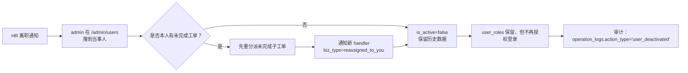
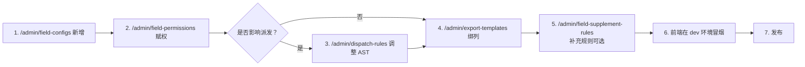
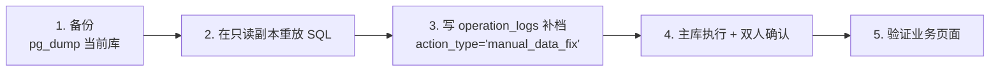
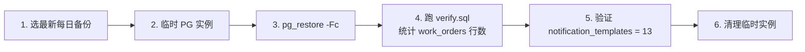

# 运营手册

> 版本：v1.0（2026-05-11，对应架构 v1.2）
> 面向：上线后日常运营 admin / DBA / SRE / 客户成功
> 目的：把"上线以后的事"串成**标准动作**——谁做、什么时候做、做错了怎么回滚。
>
> 与相关文档的分工：
> - `docs/部署手册.md`：**首次上线**怎么把系统跑起来；
> - `docs/运营手册.md`（本文件）：**日常运营**里的标准流程 + 事故响应 + 备份恢复；
> - `docs/架构变更日志.md`：任何 schema / 枚举改动的权威记录。

---

## 目录
- [1. 用户上/下线流程](#1-用户上下线流程)
- [2. 客户上/下线流程](#2-客户上下线流程)
- [3. 字段 / 规则变更流程](#3-字段--规则变更流程)
- [4. 数据修正流程（DB 级别）](#4-数据修正流程db-级别)
- [5. 升级 Playbook（带 migration 的版本）](#5-升级-playbook带-migration-的版本)
- [6. 事故应急](#6-事故应急)
- [7. 数据备份与恢复](#7-数据备份与恢复)
- [8. 监控指标 & 告警](#8-监控指标--告警)

---

## 1. 用户上/下线流程

### 1.1 新员工入职 → admin 授权

```mermaid
flowchart LR
    HR[HR 提供入职表] --> A1[admin 在 /admin/departments<br/>确认部门已存在]
    A1 --> A2[/admin/users 新建账号<br/>用户名 = 企业邮箱前缀]
    A2 --> A3[分配 role 与 department]
    A3 --> A4[后端自动发 user_welcome 通知<br/>邮件含临时密码]
    A4 --> B1[用户首登强制改密]
    B1 --> B2[验收：能看到对应角色的菜单]
```

**硬约束**：
- 临时密码仅出现在邮件，**禁止**站内通知或 IM 发送；
- 首登强制跳 `/profile/security`，强度：≥ 10 字符且含数字/字母/符号；
- 新建账号立刻写一条 `operation_logs`，`action_type='user_created'`，`target_user_id=<新用户 id>`。

### 1.2 离职 / 调岗 → 尽权



**规则**：
- **不删用户行**，只 `is_active=false`；历史工单里的 `created_by` / `handler_id` 仍可解析姓名；
- 离职者名下"处于 pending/processing"的子工单由模块主管在 `/admin/dispatched-orders/reassign` 批量重分派；
- 若用户曾是主管（departments / module_handlers 里引用了他），离职前要先 `/admin/departments/:id/transfer-supervisor`，否则会阻断降级。

### 1.3 批量入/离

- 用 `/admin/users/import` 上传 Excel，走 Phase 4 导入通道；
- 离职批量：写一条 `operation_logs` 记录申请人和理由（合规留痕）；
- 每批处理完发一条 `import_done` 通知给发起者。

---

## 2. 客户上/下线流程

### 2.1 上线新客户

1. admin 在 `/admin/customers` 新建客户；必填：客户名、统一社会信用代码、联系人、联系电话。
2. 如客户有"特殊合同模板"：在 `/admin/export-templates` 关联客户 id，导出时优先匹配该模板。
3. 客户新建不发通知（不是用户实体），只写 `operation_logs.action_type='customer_created'`。

### 2.2 下线客户（冻结）

- `customers.is_active=false`（保留历史工单）；
- 前端业务员建单时的客户下拉过滤 `is_active=true`；
- 如果下线客户名下还有 `processing` 工单，**允许**继续处理，但**禁止**基于该客户新建工单。

### 2.3 黑名单客户

- `customers.is_blacklisted=true`：业务员建单选到时前端直接拦截并提示"该客户已加入黑名单，请联系管理员"；
- 操作人留痕：`operation_logs.action_type='customer_blacklisted'` 必须带 `reason`。

---

## 3. 字段 / 规则变更流程

### 3.1 追加一个新字段（例："紧急联系人关系"）



**规则**：
- 字段 code 必须小写下划线（示例：`emergency_contact_relation`）；
- `field_configs.section` 按分组填写（basic / contract / social_security / ...）；
- 字段权限矩阵**必须**为每个启用角色给出 read/write/masked 三态之一，否则前端渲染会报"字段权限缺失"；
- 新字段默认**不**进入已存在工单的 `extra_data`；旧工单保持原貌。

### 3.2 派发规则变更

- 所有变更保存前跑 `/admin/dispatch-rules/:id/dry-run`，用最近 10 条 `work_orders` 做影子验证；
- 命中率偏离超过 ±20% → 弹红色警告；
- 上线后 30 分钟内观察 `operation_logs.action_type='dispatch_executed'`，如出现大量 `no_rule_matched` → 立即回滚。

### 3.3 变更审批

- 任何"字段 / 规则 / 权限"变更都会写 `operation_logs`；
- Phase 6 团队主管看板的"变更事件"卡会实时显示最近 24h 的变更数，便于交接验收。

---

## 4. 数据修正流程（DB 级别）

> 有人就会犯错。系统允许**在严格管控下**直接改库，但必须走四步曲。

### 4.1 四步曲



### 4.2 硬规则

- **禁止**在生产直接 `DELETE`；只能 `UPDATE ... SET is_active=false` 或 `status='archived'`；
- 所有修正 SQL 必须在 PR 里留痕（即便不进代码也要存工单附件）；
- 凡改 `work_orders` / `dispatched_orders` 的状态列，先在同事务里写一条 `operation_logs`；
- 双人原则：admin 提交 SQL，由另一 admin 在生产执行。

### 4.3 `operation_logs` 补档模板

```sql
INSERT INTO operation_logs
  (operator_id, action_type, target_type, target_id, payload, reason, created_at)
VALUES
  (:adminId, 'manual_data_fix', 'work_orders', :workOrderId,
   '{"before":{"status":"processing"},"after":{"status":"completed"},"sql":"UPDATE ... WHERE id=..."}'::jsonb,
   '业务反馈 handler 遗漏 complete，已当面确认',
   now());
```

---

## 5. 升级 Playbook（带 migration 的版本）

### 5.1 发布前一天

- [ ] Release Notes 发到 Slack，标注 migration 列表 + 影响面；
- [ ] 备份生产库：`pg_dump -Fc work_order > work_order_$(date +%F).dump`；
- [ ] 在 pre-prod 先跑一遍完整升级，记录 migration 耗时；
- [ ] 执行 `docs/回归用例总纲.md` 的 L2 全量回归，全绿；
- [ ] `docs/架构变更日志.md` 补上新条目。

### 5.2 发布窗口（建议 22:00 后）


### 5.3 回滚准则

- migration 跑失败：pg_restore + 回滚镜像，**不**手工改库；
- migration 成功但后端起不来：回滚镜像 + 跑 migration 的 down；
- 业务数据异常但无法立刻修复：公告"先观察 24h"，不要反复回滚 migration。

---

## 6. 事故应急

> **原则**：先止血，再查根因。不要在未止血前追问"谁写的"。

### 6.1 DB 损坏 / 连接爆满

1. `psql -c "SELECT pg_terminate_backend(pid) FROM pg_stat_activity WHERE state='idle in transaction' AND state_change < now() - interval '10 min';"`
2. 连接池满：backend 重启（Compose 或 systemd）；
3. 磁盘满：清理 `operation_logs` > 180 天（先归档再删）；
4. 无法恢复：走 §7 pg_restore。

### 6.2 审计日志丢失

1. 查最后一条 `operation_logs` 的 `created_at`；
2. 对比 backend 日志（pino JSON），把缺失窗口的审计事件**补写**进去（`action_type` 打上 `recovered_from_app_log` 前缀，便于审计识别）；
3. 事故后排查 `@Audit` 装饰器是否被误饶过。

### 6.3 撤回流程卡死

**症状**：`withdraw_requests.status='pending'` 长期不落地。

**排查顺序**：
1. `SELECT id, work_order_id, created_at, auto_agree_after FROM withdraw_requests WHERE status IN ('pending','partial') AND created_at < now() - interval '3 days';` —— 找出老单；
2. 查 `withdraw_approvals.status` —— 有没有 approver 是禁用账号导致永远不动？有则走 `/admin/withdraw-requests/:id/admin-resolve`（admin 强制）；
3. `auto_agree_after` 为 NULL：手动补值，等 node-cron 下一轮扫；
4. cron 任务没起来：检查 `SCHEDULER_ENABLED=true`，backend 启动日志里 `[WithdrawAutoAgreeCron] enabled` 是否出现。

### 6.4 导入任务 100% 失败

1. `SELECT ai_fallback_reason, COUNT(*) FROM import_jobs WHERE status='failed' AND created_at > now() - interval '1 hour' GROUP BY 1;`
2. 若全部 `no_api_key`：OPENAI_API_KEY 丢了，补 env 重启；
3. 若全部 `timeout`：LLM 服务不稳定，临时把 `AI_TIMEOUT_MS` 调大 3 倍，并公告"批量导入将退回本地相似度"；
4. 若 `schema_invalid`：prompt 被污染，回滚 prompt 到上一版本（参考 `docs/Phase4AI映射样本库.md` §5）。

### 6.5 全面故障定级（供 Oncall 参考）

| 级别 | 标志 | 响应时间 | 决策人 |
|------|------|----------|--------|
| P0 | 登录 / 建单不可用，影响全部用户 | 15 分钟 | SRE + admin |
| P1 | 单模块不可用（如撤回），影响部分用户 | 1 小时 | backend Owner |
| P2 | 单页面异常或统计口径偏差 | 当天 | QA + 前端 |
| P3 | 体验问题 | 下一迭代 | 产品 |

---

## 7. 数据备份与恢复

### 7.1 备份计划

| 频率 | 对象 | 工具 | 保留 | 存储 |
|------|------|------|------|------|
| 每日 02:00 | 全库（逻辑） | `pg_dump -Fc` | 30 天 | 同区域对象存储 + 加密 |
| 每周一 02:00 | 全库（物理） | `pg_basebackup` | 90 天 | 异地对象存储 |
| 每月 1 日 | 全库 + 上传目录 | pg_dump + tar `uploads/` | 365 天 | 离线 |
| 实时 | WAL 归档 | `archive_command` | 7 天 | 同区域 |

### 7.2 备份脚本骨架（放 `ops/backup.sh`）

```bash
#!/usr/bin/env bash
set -euo pipefail
TS=$(date +%Y%m%d_%H%M%S)
BACKUP_DIR=/data/backups
mkdir -p "$BACKUP_DIR"
pg_dump -Fc -h "$PGHOST" -U "$PGUSER" work_order \
  | gpg --symmetric --cipher-algo AES256 --batch --passphrase "$BACKUP_PASSPHRASE" \
  > "$BACKUP_DIR/work_order_$TS.dump.gpg"

aws s3 cp "$BACKUP_DIR/work_order_$TS.dump.gpg" "s3://$BACKUP_BUCKET/daily/"
find "$BACKUP_DIR" -name 'work_order_*.dump.gpg' -mtime +7 -delete
```

### 7.3 恢复演练（每月一次）



**演练通过标准**：恢复耗时 < 30 分钟；数据行数偏差 < 0.01%；关键配置（字段 / 规则 / 模板）完好。

### 7.4 PITR（时间点恢复）

- 依赖 WAL 归档 + 基础备份；
- 灾难时执行：`pg_basebackup` 还原到指定时间，然后 `recovery.conf` 指定 `recovery_target_time`；
- 每半年演练一次，复原到"12 小时前"。

---

## 8. 监控指标 & 告警

### 8.1 Prometheus 指标名约定

> 指标命名风格：`<domain>_<subject>_<metric>{labels}`；histogram 单位秒，counter 走 `_total` 后缀。

#### 8.1.1 HTTP / API

| 指标 | 类型 | 用途 |
|------|------|------|
| `http_requests_total{method, route, status}` | counter | 5xx 率 = `sum(rate(http_requests_total{status=~"5.."}[5m])) / sum(rate(http_requests_total[5m]))` |
| `http_request_duration_seconds{route}` | histogram | p95 / p99 延迟 |
| `http_requests_inflight` | gauge | 正在处理的请求数 |

#### 8.1.2 数据库

| 指标 | 类型 | 用途 |
|------|------|------|
| `db_connections_active` | gauge | 连接池用量 |
| `db_query_duration_seconds{query_type}` | histogram | 慢查询 |
| `db_slow_queries_total{query}` | counter | 单条慢 SQL 命中次数 |

#### 8.1.3 业务

| 指标 | 类型 | 用途 |
|------|------|------|
| `import_jobs_total{status}` | counter | 导入任务失败率 = `rate(import_jobs_total{status="failed"}[1h]) / rate(import_jobs_total[1h])` |
| `import_jobs_duration_seconds` | histogram | 单任务耗时 |
| `withdraw_requests_stuck{status}` | gauge | **撤回卡死数量**：`status IN ('pending','partial') AND created_at < now() - interval '3 days'` 的 count |
| `notifications_send_failed_total{biz_type, reason}` | counter | 通知发送失败 |
| `sla_breach_total{module}` | counter | SLA 超时次数（Phase 6 定时扫一次就 +N） |
| `ai_fallback_total{reason}` | counter | AI 降级率 |

#### 8.1.4 基础设施

| 指标 | 类型 | 用途 |
|------|------|------|
| `nodejs_heap_used_bytes` | gauge | 内存 |
| `nodejs_eventloop_lag_seconds` | gauge | 事件循环延迟 |
| `process_cpu_seconds_total` | counter | CPU |

### 8.2 告警规则（抓核心，不要降噪）

| 告警 | 表达式 | 严重度 | 响应 |
|------|--------|--------|------|
| API 5xx 率飙升 | 5 分钟平均 > 2% | P0 | 立即页面化 oncall |
| API p95 > 2s | 10 分钟平均 | P1 | 查慢查询 + 下游依赖 |
| DB 连接用量 > 80% | 持续 5 分钟 | P1 | 查连接泄漏 / 扩池 |
| 导入失败率 > 30% | 1 小时窗口 | P1 | 走 §6.4 排查 |
| 撤回卡死数量 > 10 | 任意时刻 | P2 | 走 §6.3 排查 |
| 通知发送失败 > 1%/5min | 1 小时累积 | P2 | 查 `notification_render_failed` 日志 |
| SLA breach 突增 | 1 小时 > 上周同期 200% | P2 | 查模块人手 |
| 备份任务失败 | 任一夜跑未完成 | P1 | 立即手跑 |

### 8.3 日志规范

- 结构化 JSON（pino），必填字段：`timestamp, level, traceId, module, action, userId?, payload?`；
- `ERROR` 级日志必须带 `err.stack`；
- `operation_logs` 与应用日志**双写**：应用日志用于告警，`operation_logs` 用于合规审计。

### 8.4 仪表盘建议（Grafana）

1. **Overview**：5xx 率 / p95 / QPS / 活跃用户数；
2. **Import**：任务队列长度 / 成功率 / 平均耗时 / AI 降级率；
3. **Withdraw**：pending 数量 / 平均决议时长 / auto_agree 命中率；
4. **Notification**：发送量 / 失败率 / SSE 在线连接数；
5. **DB**：连接数 / 慢查询 Top 10 / WAL 滞后。

---

## 变更日志

- v1.0 (2026-05-11)：首版，覆盖用户/客户/字段/数据修正/升级/应急/备份/监控 8 类标准动作。
