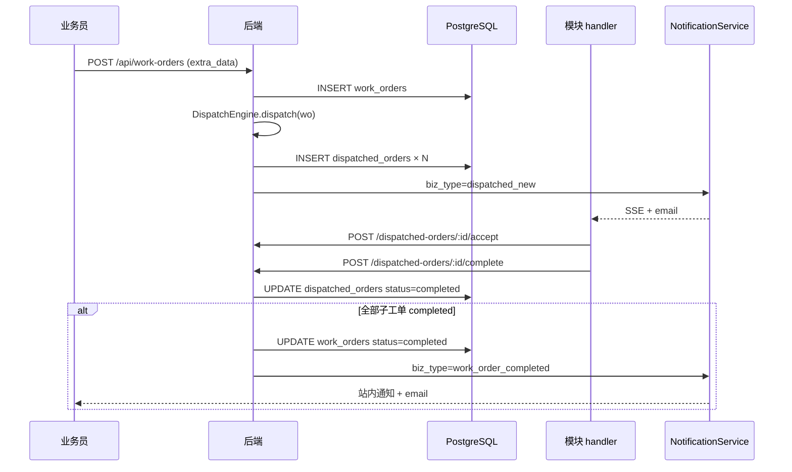
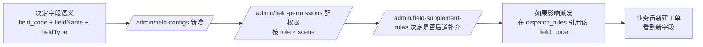
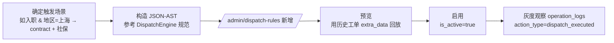
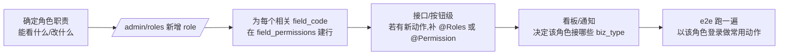

# 项目总览

> 版本：v1.0（2026-05-11）
> 对应架构版本：v1.2（见 `docs/数据库ER图.md` 顶部说明）
> 面向：新入场同事 / 外部评审 / 交付验收
> 目的：一页看懂"本系统是什么、做到了哪、下一步是什么"；再顺着文档索引深入各子域。
>
> **纠错日志**：
> - 2026-05-11：**§3 技术栈纠错** —— 初版误把前端写成 Vue 3 + Element Plus + ECharts + MSW；**实际为 React 18 + TypeScript + Ant Design Pro (antd 5.x) + react-router + Zustand + Vite**，已按 `frontend/package.json` / `backend/package.json` 核实重写。同步核查 §2 / §4 / §5 未出现同类错误。

---

## 目录
- [1. 目标、范围、非目标](#1-目标范围非目标)
- [2. Phase 1-6 功能协作图](#2-phase-1-6-功能协作图)
- [3. 技术栈总览](#3-技术栈总览)
- [4. 文档索引](#4-文档索引)
- [5. 维护者手册](#5-维护者手册)

---

## 1. 目标、范围、非目标

### 1.1 目标

- 把"客户入职单据上传 → 多模块接力交付"的线下流程**数字化**，替代原 Excel / 微信接龙；
- 全链路**可审计**：所有提交、派发、退回、撤回、修改都有痕迹；
- **一人配置，全员受益**：字段、派发规则、角色权限均走数据库配置，而非代码分支；
- 为后续 **续签 / 离职 / 待遇申报 / 月度批量业务** 预留通用扩展位。

### 1.2 范围（本期交付）

| 域 | 能力 |
|----|------|
| 基础 | 用户 / 角色 / 部门 / 客户 / 字段配置 / 字段权限 |
| 工单 | 入职工单 的创建、提交、派发、接单、补充、退回、完成、归档 |
| 批量 | Excel 批量导入（AI 字段映射 + 降级相似度） |
| 审批 | 撤回 / 修改 申请，多层 approver，auto_agree 超时自动通过，admin 强制 |
| 协作 | 看板（业务员 / 模块主管 / 管理层）、站内通知、SSE 推送 |
| 运维 | 操作日志 + 读权限隔离、导出模板、健康检查 |

### 1.3 非目标（本期明确不做）

- 续签 / 离职 / 待遇申报 的业务流（通过 `work_orders.order_type` + JSONB 预留，下一期开）；
- 外部系统对接（薪酬系统 / 社保系统 / 银行代发）；
- 移动 App（只保证浏览器响应式兼容，无原生 App）；
- 多租户 SaaS 化（本期单租户）；
- 复杂 BI（看板只出固化指标，不接 Metabase / Superset）；
- 全文搜索（预留 `operation_logs` / `work_orders.extra_data` GIN，不建 FTS）。

---

## 2. Phase 1-6 功能协作图

```mermaid
flowchart TB
    subgraph Phase1[Phase 1 · 基础设施]
        P1A[用户/角色/部门/客户]
        P1B[字段配置/字段权限]
        P1C[JWT 登录 + bcrypt]
    end

    subgraph Phase2[Phase 2 · 管理后台]
        P2A[动态字段维护<br/>field_configs]
        P2B[派发规则维护<br/>dispatch_rules + JSON-AST]
        P2C[字段权限矩阵<br/>field_permissions]
        P2D[字段补充规则<br/>field_supplement_rules]
    end

    subgraph Phase3[Phase 3 · 工单核心]
        P3A[工单 CRUD]
        P3B[DispatchEngine 派发]
        P3C[子工单 accept/complete/return]
        P3D[字段补充/联动/只读矩阵]
    end

    subgraph Phase4[Phase 4 · 批量导入]
        P4A[Excel 解析]
        P4B[AI 字段映射<br/>OpenAI/Qwen/DeepSeek]
        P4C[字段校验 + 错误 Excel]
        P4D[import_jobs 异步]
    end

    subgraph Phase5[Phase 5 · 撤回审批]
        P5A[发起申请]
        P5B[多审批人 + auto_agree]
        P5C[settleWithdrawRequest]
        P5D[admin 强制]
        P5E[@Audit 操作日志]
        P5F[导出模板]
    end

    subgraph Phase6[Phase 6 · 看板与通知]
        P6A[业务员/团队/管理层 看板]
        P6B[NotificationService]
        P6C[SSE 实时推送]
        P6D[SLA 扫描]
    end

    P1A --> P2A
    P1B --> P2C
    P2A --> P3A
    P2B --> P3B
    P2C --> P3D
    P2D --> P3D
    P3A --> P4A
    P3C --> P5A
    P3B --> P6A
    P3C --> P6A
    P4D --> P6B
    P5C --> P6B
    P3B --> P6B
    P3C --> P6B
    P6D --> P6B
```

### 2.1 关键数据流（"创建工单到完成归档"）



### 2.2 Phase 间耦合点（出问题时先查这里）

| 耦合点 | 上游 | 下游 | 出故障症状 |
|--------|------|------|------------|
| 字段权限 | Phase 2 配置 | Phase 3 接口过滤 | 用户看不到本应可见的字段 |
| JSON-AST 派发规则 | Phase 2 配置 | Phase 3 派发 | 工单没被派到任何模块（`pending` 卡死） |
| `notification_templates` | Phase 6 seed | 全部 Phase 触发通知 | 通知发不出去 / 渲染失败 |
| `settleWithdrawRequest()` | Phase 5 | Phase 3 主/子工单状态 | approve 后主工单没变 `withdrawn` |
| `import_jobs.status` 状态机 | Phase 4 | 前端进度条 | 一直卡 `processing` |

---

## 3. 技术栈总览

### 3.1 后端（以 `backend/package.json` 为真）

- **运行时**：Node.js 20（LTS）
- **语言**：TypeScript 5.5
- **框架**：NestJS 10（`@nestjs/common` / `core` / `platform-express` / `config`）
- **ORM**：TypeORM 0.3 + `pg`；所有表结构变更走 migration，**不开 synchronize**
- **DB**：PostgreSQL 16（JSONB、GIN、`date_trunc`、`FILTER (WHERE)`、CTE、`percentile_cont`）
- **鉴权**：`@nestjs/jwt` + `@nestjs/passport` + `passport-jwt` + `bcrypt`（轮数生产 ≥ 12）
- **校验**：`class-validator` + `class-transformer`（DTO 必须标注装饰器） + `ajv`（通知模板变量 schema、导入字段条件规则）
- **测试**：`jest` + `ts-jest` + `supertest`（集成）；e2e 与 Playwright 由 `tests/` 驱动
- **规划中（非当前已装依赖，上线前按 `docs/Phase2到Phase6_migration清单.md` 与 Phase 4-6 文档陆续引入）**：
  - 异步队列：BullMQ（导入任务异步化，Phase 4）
  - 定时任务：node-cron（SLA 扫描、`auto_agree_after` 结算，Phase 5/6）
  - Excel：`exceljs`（写导出 / 错误报表）+ `xlsx`（读上传表）
  - 日志：pino（结构化 JSON）
  - AI 客户端：OpenAI / Qwen / DeepSeek（provider 注册式 + 降级相似度）

### 3.2 前端（以 `frontend/package.json` 为真）

- **语言**：TypeScript 5.5
- **框架**：React 18（`react` / `react-dom` ^18.3）
- **UI 库**：Ant Design 5（`antd` ^5.22） + `@ant-design/pro-components` ^2.7（ProLayout / ProTable / ProForm） + `@ant-design/icons`
- **路由**：`react-router-dom` ^6.28
- **状态管理**：Zustand ^4.5（轻量，按领域切 store）
- **HTTP**：axios ^1.7（统一封装拦截器：token 注入、401 刷新、错误码分发）
- **构建**：Vite 5（`@vitejs/plugin-react`） + Less
- **时间**：dayjs ^1.11（全局按 `Asia/Shanghai` 展示）
- **规划中**：
  - 图表：ECharts 5（Phase 6 看板）
  - Mock：MSW（联调与前端单测）
  - 表格工具：ProTable 自定义列持久化、导出按钮

### 3.3 运行时

- **反代**：nginx（HTTPS、SSE 需 `proxy_buffering off; proxy_read_timeout 3600s`）
- **容器**：Docker Compose（backend / frontend / nginx / postgres 四容器）
- **可选**：Linux systemd 单机部署，或 Windows 原生（见 `docs/部署手册.md` §3）
- **CI/CD**：预留 GitHub Actions / GitLab CI，跑 lint + test + build + 镜像推送

### 3.4 代码组织（工作区）

```
工单系统/
├── backend/              NestJS 应用
│   ├── src/
│   │   ├── modules/       领域模块（auth / users / work-orders / ...）
│   │   ├── database/
│   │   │   ├── migrations/
│   │   │   └── seeds/
│   │   └── common/        拦截器、过滤器、装饰器（如 @Audit）
│   └── package.json
├── frontend/             React 18 + AntD Pro SPA
│   ├── src/
│   │   ├── pages/         路由级页面
│   │   ├── components/    通用 UI
│   │   ├── stores/        Zustand stores
│   │   ├── api/           axios 客户端封装
│   │   └── layouts/       ProLayout 布局
│   └── package.json
├── docs/                 本文档集合
├── tests/                跨端自动化（playwright / setup 脚本）
└── docker/               docker-compose.yml + nginx.conf 等
```

> **纪律**：后端/前端依赖项一旦有增减，**必须**同步修订本节与 `docs/架构设计.md`；禁止"代码里装了但总览没写"。

---

## 4. 文档索引

> 所有文档在 `docs/` 下；下表按阅读路径组织，**按需检索**。

### 4.1 总览 & 规范（入场必读）

| 文档 | 用途 |
|------|------|
| `项目总览.md`（本文件） | 一页入门 |
| `架构设计.md` | 逻辑架构、目录组织、依赖注入原则 |
| `API规范.md` | 统一响应体、错误码、分页、鉴权 |
| `开发规范.md` | 命名、提交、PR、lint、DTO/Entity 约定 |
| `测试策略.md` | 金字塔、覆盖率红线、e2e 数据准备 |
| `数据库ER图.md` | **v1.2** 全部 21 张表 + 字段说明 |
| `架构变更日志.md` | v1.0 → v1.1 → v1.2 完整变更史 |
| `部署手册.md` | 环境、启动、Checklist、安全、FAQ |

### 4.2 Phase 1（基础设施）

| 文档 | 用途 |
|------|------|
| `Phase1测试用例.md` | 登录、用户、角色、字段配置的测试设计 |
| `Phase1验收清单.md` | 验收 Checklist |
| `Phase1验收报告.md` / `Phase1已知问题.md` | 验收留痕 |
| `Phase1-2综合验收报告.md` | 跨 Phase 合并验收 |

### 4.3 Phase 2（管理后台）

| 文档 | 用途 |
|------|------|
| `Phase2管理后台设计.md` | 字段/规则/权限/补充规则 维护界面与接口 |
| `Phase2测试用例.md` / `Phase2前端测试用例.md` | 测试用例 |
| `Phase2已知问题.md` | 已知问题 |
| `DispatchEngine-JSON-AST规范.md` | 派发规则的 AST 语义（eq/in/and/or/exists） |

### 4.4 Phase 3（工单核心）

| 文档 | 用途 |
|------|------|
| `Phase3工单核心设计.md` | 工单/子工单状态机、字段权限、派发联动 |
| `Phase3前后端联调契约.md` | 3 场景 + 4 module 的完整请求/响应样本 |
| `Phase3测试用例.md` / `Phase3复测脚本.md` | 测试 |
| `Phase3列表接口压测脚本原型.md` | 压测 |
| `性能测试计划.md` | 整体性能计划 |

### 4.5 Phase 4（批量导入）

| 文档 | 用途 |
|------|------|
| `Phase4导入与回流设计.md` | 接口协议、Prompt、降级 |
| `Phase4AI导入服务分层设计.md` | **运行时** 五层服务 + 观测 + 测试 |
| `Phase4AI映射样本库.md` | 10 组 golden samples + 评估指标 |

### 4.6 Phase 5（撤回审批）

| 文档 | 用途 |
|------|------|
| `Phase5撤回与审批设计.md` | 综述 §1-9 + **落实 §10**（状态机、SQL、settle 伪代、auto_agree cron、强制审批、权限矩阵、modify_data） |

### 4.7 Phase 6（看板与通知）

| 文档 | 用途 |
|------|------|
| `Phase6看板与通知设计.md` | 看板 §2-5 + 通知 §6-9 + **SQL 基线 §11**（三种看板 SQL + DTO + 图表建议） |

### 4.8 跨 Phase

| 文档 | 用途 |
|------|------|
| `Phase2到Phase6_migration清单.md` | 全部 migration 按时间线排序，SQL up/down + 回滚 |

---

## 5. 维护者手册

### 5.1 如何加新字段

> 目标：不改代码，只改配置，就能在入职工单上多出一列并参与派发/权限/补充流程。



**检查点**：
- `field_type` 从 `text / textarea / number / date / boolean / dropdown / multi_dropdown` 中选；新类型走 `[架构变更]`；
- `required / visible_scenes` 正确；
- 如果是**补充字段**（业务员看不到，后道填），`field_permissions` 里业务员 role 的 `visible=false` + 后道 role 的 `editable=true`；
- 如果被派发规则引用，重启派发缓存或让 rule cache 过期。

### 5.2 如何加新派发规则



**硬约束**：
- 规则必须带 `priority`，冲突时大者胜；
- `module_code` 只能是 4 个正式模块 (`contract / onboarding_contact / data_entry / social_security`)，新模块走架构变更；
- AST 只支持白名单算子（eq / ne / in / nin / and / or / exists / gt / lt / between）；禁用自定义函数；
- 修改规则必写 `operation_log`，`@Audit('rule_update', ...)`。

### 5.3 如何加新角色



**不要踩的坑**：
- 新角色忘了补 `field_permissions` → 页面上该角色看不到任何字段；
- 忘了给该角色进 `module_handlers` → 派发规则结果为空池；
- 通知遗漏 → 在 `Phase6看板与通知设计.md` §6.3 的"跨角色可见"列里评估是否要加。

### 5.4 加新通知 biz_type

1. 架构师广播 `[架构变更]`；
2. 更新 `数据库ER图.md` + `架构变更日志.md` + `Phase6看板与通知设计.md §6.3`；
3. 在 `seed-notification-templates.ts` 追加模板，含 `default_channels` 与 `variables`；
4. `NotificationService.send()` 处的触发点补齐；
5. 前端 `bizType → icon / color` 映射补齐。

### 5.5 发布新 migration

流程见 `docs/Phase2到Phase6_migration清单.md §0 发布纪律` + `§3 Runbook`；**每次 PR 必须**同时改 migration 代码 + 本清单 + `架构变更日志.md`。

---

## 变更日志

- v1.0 (2026-05-11)：首版，覆盖 Phase 1-6 全景 + v1.2 架构。
