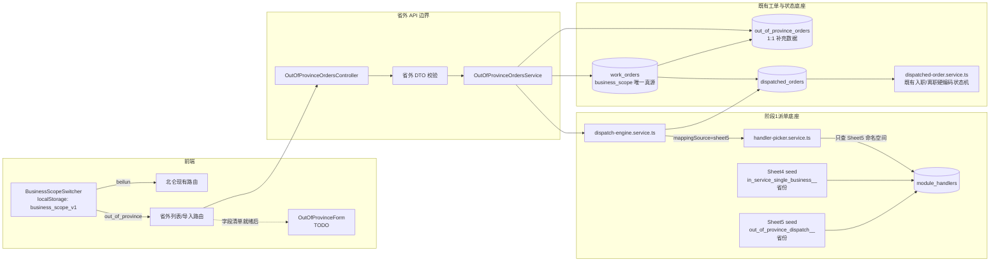

# 阶段3省外派单架构契约

> 任务 ID：`47089233-66de-4683-a94e-9e9ef0fdc9b9`  
> 适用范围：省外增员、省外减员及其派单、列表、导入；供 backend/frontend/qa 对齐  
> 依据：`docs/在职管理与省外派单-方案定稿-20260726.md`、阶段1 P0 最终实现 `4408cdf`  
> 优先级：本契约以本次任务明确约束为准；“前端不把 businessScope 放入 appStore”覆盖定稿文档 4.2 节的旧建议。

## 1. 决策摘要

1. 新增 `OrderType.OUT_OF_PROVINCE_INCREASE = 'out_of_province_increase'` 与 `OrderType.OUT_OF_PROVINCE_DECREASE = 'out_of_province_decrease'`。
2. 增员复用入职状态流转，减员复用离职状态流转；只在 `dispatched-order.service.ts` 现有硬编码判断中加别名分支，不新建状态枚举、状态机或 workflow definition。
3. Sheet5 是独立数据源，使用 `mappingSource: 'sheet5'`、基础模块码 `out_of_province_dispatch` 和 DB 查询键 `out_of_province_dispatch__<省份>`。Sheet4 始终使用另一组值，禁止交叉回退。
4. `businessScope` 取值为 `beilun | out_of_province`。唯一持久化真源是 `work_orders.business_scope`；省外补充 Entity 不复制状态或范围字段。
5. 前端切换器只使用 `localStorage['business_scope_v1']` 决定路由，不进入 Zustand/appStore，也不作为后端鉴权依据。省外 API 由独立路径和后端常量确定范围。
6. 不删除、不复用 `dispatch_rules.assignee_user_id` / `fallback_user_id`；这两个历史死字段不参与 Sheet5 初派或转派。

## 2. 模块边界图



### 2.1 所有权边界

| 模块 | 拥有的数据/职责 | 不得承担的职责 |
|---|---|---|
| 前端切换器 | 当前展示范围、localStorage 持久化、切换后导航 | 不保存服务端数据范围；不写 appStore；不替后端鉴权或过滤 |
| 省外 Controller/DTO | API 路径、参数白名单、枚举与省份校验、响应形状 | 不实现状态跳转；不接受客户端伪造持久化范围 |
| 省外 Service | 创建/导入省外主单、固定范围、调用既有派单与状态服务、强制范围过滤 | 不复制入职/离职状态机；不直接查 Sheet4 |
| `WorkOrder` | 工单公共字段、`orderType`、`businessScope`、主状态 | 不保存 Sheet5 名册 |
| `OutOfProvinceOrder` | 省外特有且已有业务来源的补充字段、与主单 1:1 关联 | 不复制 `status`、`handlerId`、`businessScope`；未知表单字段不臆造 |
| `DispatchedOrder` / 现有状态服务 | 子单处理人和九态流转 | 不识别前端 localStorage |
| 派单引擎 | 从父单 orderType/province 生成 Sheet5 上下文并选择初派人 | 不自动跨 Sheet 回退；不读 assignee/fallback 死字段 |
| Sheet5 seed | 省外省份到有序专员名单 | 不承载 Sheet4 在职单项业务映射 |

## 3. OrderType 与状态机契约

### 3.1 枚举

`backend/src/entities/enums.ts` 必须包含：

```ts
export enum OrderType {
  // 既有值保持不变
  OUT_OF_PROVINCE_INCREASE = 'out_of_province_increase',
  OUT_OF_PROVINCE_DECREASE = 'out_of_province_decrease',
}
```

前端如需常量，只镜像相同字符串；不得增加第三个笼统 `out_of_province` OrderType 代替增/减员。`OUT_OF_PROVINCE` 若已作为模块类型存在，只能表达模块分类，不能作为工单业务类型写入数据。

### 3.2 流转映射

| 省外 OrderType | 复用流转 | 实现要求 |
|---|---|---|
| `OUT_OF_PROVINCE_INCREASE` | `ONBOARDING`（入职/增员） | 所有“是否为入职流”的硬编码分支把该值视为别名；子单仍使用既有 `DispatchedOrderStatus` 与接单、办理、完成、退回、修改/撤回/作废审批逻辑 |
| `OUT_OF_PROVINCE_DECREASE` | `RESIGNATION`（离职/减员） | 所有“是否为离职流”的硬编码分支把该值视为别名；复用既有减员反馈、完成校验和审批逻辑 |

建议在 `dispatched-order.service.ts` 文件内增加两个最小谓词，替换仅与本次分支相关的直接比较：

```ts
const isOnboardingFlow = (type: OrderType) =>
  type === OrderType.ONBOARDING || type === OrderType.OUT_OF_PROVINCE_INCREASE;

const isResignationFlow = (type: OrderType) =>
  type === OrderType.RESIGNATION || type === OrderType.OUT_OF_PROVINCE_DECREASE;
```

这是局部别名，不是新状态机。禁止创建 `OutOfProvinceStatus`、复制 action/service 流程、或让 `WorkflowDefinition.definition_json` 驱动省外实际流转。现有九种子单状态及月份、审批、通知口径全部保持。

## 4. Sheet5 映射结构契约

### 4.1 源数据结构

阶段1 P0 已决定不新建 `province_handlers` 表。Sheet4/Sheet5 在源数据层独立扫描，最终写入既有 `module_handlers`；“两表独立”由显式源标识、枚举元数据和互斥命名空间保证。

`province-handler.seed.ts` 中 Sheet5 行必须满足：

```ts
type ProvinceMappingSource = 'sheet4' | 'sheet5';

interface ProvinceHandlerSeed {
  mappingSource: ProvinceMappingSource;       // Sheet5 固定 'sheet5'
  moduleCode: DispatchModuleCode;             // 固定 OUT_OF_PROVINCE_DISPATCH
  moduleType: ModuleType;                     // 固定 OUT_OF_PROVINCE
  teamRole: TeamRole;                         // 固定 OUT_OF_PROVINCE
  province: string;                           // PROVINCES_27 中的简称
  handlerText: string;                        // "主办" 或 "主办/备选"
  handlerUsernames: readonly string[];         // 按 '/' 顺序解析
  orderTypes: readonly OrderType[];           // 恰含省外增员、减员
  rowOrder: number;                           // Sheet5 原始行序
  isActive: boolean;
}
```

建议保留两个独立常量后再汇总导出，避免维护时误编辑另一 Sheet：

```ts
const SHEET4_PROVINCE_HANDLER_SEEDS: readonly ProvinceHandlerSeed[] = [/* ... */];
const SHEET5_PROVINCE_HANDLER_SEEDS: readonly ProvinceHandlerSeed[] = [/* ... */];
export const PROVINCE_HANDLER_SEEDS = [
  ...SHEET4_PROVINCE_HANDLER_SEEDS,
  ...SHEET5_PROVINCE_HANDLER_SEEDS,
];
```

真实名册未提供前保留显式 placeholder 并跳过缺失账号，禁止编造用户或拿 Sheet4 人员填 Sheet5。

### 4.2 物理存储和命名空间

| 维度 | Sheet4（在职单项） | Sheet5（省外增减员） |
|---|---|---|
| `mappingSource` | `sheet4` | `sheet5` |
| 基础模块码 | `in_service_single_business` | `out_of_province_dispatch` |
| DB `module_handlers.module_code` | `in_service_single_business__<省份>` | `out_of_province_dispatch__<省份>` |
| `moduleType` | `in_service` | `out_of_province` |
| `teamRole` | `in_service_team` | `out_of_province_team` |
| 适用 OrderType | `in_service` | 省外增员、省外减员 |
| 查询入口 | picker + `mappingSource:'sheet4'` | picker + `mappingSource:'sheet5'` |

数据库写入字段沿用 `module_handlers`：`module_code`、`handler_id`、`weight`、`is_backup`、`is_active`。其余字段是 seed 校验元数据，不伪装成表列。

### 4.3 禁止混用规则

1. Sheet5 查询只允许组装 `out_of_province_dispatch__<省份>`；不得查询无命名空间的 `out_of_province_dispatch` 作为人员池。
2. Sheet5 缺省份、非法省份、主办账号缺失或停用时返回 `null`/进入待指派告警；不得回退 Sheet4、普通 module handler、备选人、assignee 或 fallback。
3. Sheet4 与 Sheet5 即使同省、同用户名也必须各有独立 seed 行和独立 `module_handlers` 行。
4. seed 更新不得清理另一来源的命名空间；幂等 upsert 只触达本来源的键。
5. 省外增减员规则的 `targetModule/subModule` 统一为 `out_of_province_dispatch`；增员/减员语义由 `orderType` 保留，不能用两个业务模块码替代 Sheet5 查询键。

### 4.4 双人省份

Sheet5 当前仅福建为双人省份；真实名册仍待业务提供。示例：

```ts
{
  mappingSource: 'sheet5',
  moduleCode: DispatchModuleCode.OUT_OF_PROVINCE_DISPATCH,
  moduleType: ModuleType.OUT_OF_PROVINCE,
  teamRole: TeamRole.OUT_OF_PROVINCE,
  province: '福建',
  handlerText: 'fujian_primary/fujian_transfer_backup',
  handlerUsernames: ['fujian_primary', 'fujian_transfer_backup'],
  orderTypes: [
    OrderType.OUT_OF_PROVINCE_INCREASE,
    OrderType.OUT_OF_PROVINCE_DECREASE,
  ],
  rowOrder: 1,
  isActive: true,
}
```

写入规则：排前者 `weight=100,isBackup=false`，排后者 `weight=1,isBackup=true`。初派永远只选排前者，不轮询；排后者只出现在同省转派候选中。主办停用时初派返回空，不自动把备选升级为默认。转派候选接口契约：

```ts
listProvinceTransferCandidates(input: {
  moduleCode: DispatchModuleCode.OUT_OF_PROVINCE_DISPATCH;
  province: string;
  mappingSource: 'sheet5';
}): Promise<Array<{ handlerId: string; isBackup: boolean; order: number }>>;
```

## 5. businessScope 数据隔离契约

### 5.1 取值和持久化

```ts
export enum BusinessScope {
  BEILUN = 'beilun',
  OUT_OF_PROVINCE = 'out_of_province',
}
```

在 `WorkOrder` Entity 增加唯一真源字段：

```ts
@Column({ name: 'business_scope', type: 'varchar', length: 32, default: BusinessScope.BEILUN })
businessScope!: BusinessScope;
```

迁移必须：

1. 加兼容列并把全部历史 `work_orders` 显式回填为 `beilun`。
2. 设置 `NOT NULL` 与默认值，增加至少 `(business_scope, order_type, created_at)` 索引。
3. 不改历史 `order_type/status/handler_id`，不碰 assignee/fallback 字段。
4. 回滚只移除新增索引/列；上线后已有省外数据时，禁止直接执行会丢范围信息的 down migration。

`OutOfProvinceOrder` 为显式新增 Entity，但仅作为 `WorkOrder` 的 1:1 省外补充表：至少包含 `id`、唯一 `workOrderId` FK、`province`、导入来源标识/原始数据引用（已有来源时才增加）和时间戳。它不得再存一份 `businessScope/status/handlerId`。省外增减员继续走 `work_orders -> dispatched_orders` 的原状态机，不发生双写。

### 5.2 Entity/DTO/API 规则

| 层 | 契约 |
|---|---|
| Entity | `WorkOrder.businessScope` 必填；省外记录恒为 `out_of_province`，历史及北仑新单恒为 `beilun` |
| Create/Import DTO | 客户端不提交或不能覆盖 `businessScope`；省外 Service 根据专用 endpoint 写死 `OUT_OF_PROVINCE`。`orderType` 只允许两个省外枚举，`province` 必须来自 `PROVINCES_27` |
| Response DTO | 列表、详情、导入结果显式返回 `businessScope` 和精确 `orderType`，便于 QA 断言 |
| Shared Query DTO | 若复用共享查询，`businessScope` 必须 `@IsEnum(BusinessScope)`；不能接受任意字符串 |
| Service Query | 省外所有 list/detail/export/import-result 查询强制 `w.business_scope = 'out_of_province'`；北仑现有入口强制 `w.business_scope = 'beilun'` |
| 子单查询 | join `d.parent_order_id = w.id` 后过滤父单范围；禁止仅按 `d.module_code` 猜范围 |
| ID 读取/动作 | 先按 ID + 期望范围加载再鉴权；范围不符返回 404，避免跨范围 ID 枚举和误操作 |

### 5.3 API 路径

采用专用路径作为最强范围边界，前端无需依赖全局请求拦截器：

```text
GET  /out-of-province-orders?orderType=out_of_province_increase|out_of_province_decrease
GET  /out-of-province-orders/:id
POST /out-of-province-orders/import/preview
POST /out-of-province-orders/import/confirm
```

- Controller 将范围常量传入 Service，Service 仍强制过滤；不能仅靠前端传 `businessScope`。
- 现有北仑 `/work-orders`、`/dispatched-orders` 等入口保持兼容，默认/强制 `beilun`。
- 管理员若需跨范围报表，必须另设明确权限与查询入口；本期不因管理员身份取消默认过滤。
- 导入预览不持久化；确认导入须在同一事务中写主单范围、省外补充行并调用派单。
- `OutOfProvinceForm` 本期不开放。禁止用入职/离职表单模板替代；单条创建端点可保留后端能力但前端不得暴露未知字段。

## 6. 派单引擎接入契约

阶段1底座是阶段3硬前置。阶段3只接线，不重构整个引擎。

### 6.1 `dispatch-engine.service.ts`

现有入口保持：

```ts
evaluate(workOrder: WorkOrder, manager?: EntityManager): Promise<DispatchedOrder[]>;
evaluateDetailed(workOrder: WorkOrder, manager?: EntityManager): Promise<DispatchEvaluationResult>;
```

省外分支必须满足：

1. 仅当 `workOrder.orderType` 是省外增员/减员且规则模块码是 `OUT_OF_PROVINCE_DISPATCH` 时构造上下文。
2. province 优先从已校验的省外补充数据/规范字段读取；兼容阶段1已有 `extraData.province/provinceName/'省份'` 只作为迁移过渡。进入 picker 前使用 `PROVINCES_27` 校验。
3. 调用 picker：

```ts
handlerPicker.pick(strategy, DispatchModuleCode.OUT_OF_PROVINCE_DISPATCH, manager, {
  province,
  mappingSource: 'sheet5',
});
```

4. `applyModuleConfig` 二次选人时继续携带原 `provinceDispatchContext`，不得覆盖第一次 Sheet5 结果为普通团队选择结果。
5. 旧 ONBOARDING/RENEWAL/RESIGNATION/BENEFIT 分支无映射上下文时走原路径。

规则数据示意：

```ts
[
  { orderType: OUT_OF_PROVINCE_INCREASE, targetModule: OUT_OF_PROVINCE_DISPATCH },
  { orderType: OUT_OF_PROVINCE_DECREASE, targetModule: OUT_OF_PROVINCE_DISPATCH },
]
```

### 6.2 `handler-picker.service.ts`

保持已有调用兼容，只增加可选参数：

```ts
pick(
  strategy: DispatchStrategy,
  moduleCode: string,
  manager?: EntityManager,
  context?: { province?: string; mappingSource?: 'sheet4' | 'sheet5' },
): Promise<string | null>;
```

行为：

- 无 `context.mappingSource`：完全沿用现有 fixed/round-robin/load-balance/team-claim/pool。
- `mappingSource='sheet5'`：断言基础模块码只能是 `out_of_province_dispatch`，查询 `out_of_province_dispatch__<省份>`。
- 初派过滤 `isActive=true,isBackup=false`，按 weight DESC 后稳定排序，取第一人。
- 非法上下文或无主办返回 `null` 并记录带 mappingSource/province/moduleCode 的告警。
- 绝不降级到 Sheet4 或普通模块候选；绝不读取 `DispatchRule.assigneeUserId/fallbackUserId`。

## 7. 前端切换器边界

1. 类型固定为 `'beilun' | 'out_of_province'`，localStorage key 固定 `business_scope_v1`；未知值、读取异常均回退 `beilun`。
2. 切换器只决定导航/菜单展示：北仑进入现有路由，省外进入省外列表/导入路由；刷新后从 localStorage 恢复。
3. 禁止向 `userStore/appStore` 添加 `businessScope`、action 或持久化配置。
4. 省外页面调用 `/out-of-province-orders/**`；北仑页面调用原 endpoint。localStorage 值不是请求鉴权依据，也不用于拼接任意 scope 参数。
5. 直接粘贴 URL 时仍由 `routeVisibility`/角色权限判断；切换器不能放宽角色权限。
6. 两个范围的列表筛选、分页、最近路径缓存使用不同 key，避免前端状态串页。

## 8. 迁移顺序与风险

### 8.1 强制顺序

1. 合入阶段1最终底座：`enums.ts`、`province-handler.seed.ts`、`dispatch-engine.service.ts`、`handler-picker.service.ts` 及正式契约测试。
2. 加 `work_orders.business_scope` 迁移并回填北仑数据；部署代码前验证旧数据计数不变。
3. 加省外补充 Entity/DTO/Service/Controller 和省外规则；只通过导入创建。
4. 装载 Sheet5 真实名册后启用派单规则；名册未提供时 placeholder 跳过并显式告警，不假成功。
5. 开前端路由、列表、导入；`OutOfProvinceForm` 保持 TODO。
6. 跑阶段3定向测试和阶段4全局回归，再开放菜单。

### 8.2 风险矩阵

| 风险 | 严重度 | 控制措施 |
|---|---|---|
| 当前分支未包含阶段1 P0，省外规则落入旧普通选人路径 | P0 | 以阶段1契约测试通过作为 Phase3 启动门禁 |
| Sheet4/Sheet5 同省误共用处理人 | P0 | 命名空间 + mappingSource 双校验；缺映射返回空，禁止跨源 fallback |
| businessScope 仅前端过滤导致越权/串数据 | P0 | DB 非空列；list/detail/action 后端按父单范围过滤；跨范围 ID 返回 404 |
| applyModuleConfig 二次覆盖 Sheet5 初派人 | P0 | ChildToCreate 保留 provinceDispatchContext 并在二次选人继续传递 |
| 增员/减员复制状态机后与旧流程漂移 | P0 | 只增加 OrderType 别名分支，复用现有服务与九态枚举 |
| 旧数据被误判为省外 | P0 | migration 全量回填 `beilun`，上线前后做按范围计数 |
| 福建双人被当轮询或自动备援 | P1 | 初派排除 isBackup；备选仅转派接口返回；主办失效返回 null |
| 真实名册缺失却用占位用户派单 | P1 | placeholder 无账号时 seed 跳过并告警；上线门禁要求业务名册核对 |
| 省外字段不完整却复用北仑表单 | P1 | OutOfProvinceForm 不开放；等待菜鸟模板/浙江自签字段清单 |
| 新索引或 enum migration 锁表 | P1 | 分步迁移、低峰执行、预先备份；PostgreSQL enum 使用兼容策略 |
| 报表/通知/看板遗漏范围条件 | P1 | 阶段4逐项回归，省外数据加入时断言北仑计数不变 |
| 删除历史 assignee/fallback 引发兼容故障 | P1 | 字段保留，省外实现不读取也不迁移删除 |

## 9. 验收标准

### 9.1 Backend/数据

- [ ] 两个 OrderType 名称和值精确匹配契约，原枚举值不变。
- [ ] 增员所有动作与入职同一状态服务；减员所有动作与离职同一状态服务；没有新增状态枚举/状态表。
- [ ] `work_orders.business_scope` 非空；迁移后全部历史记录为 `beilun`。
- [ ] 省外导入记录同时满足精确省外 OrderType 和 `businessScope=out_of_province`。
- [ ] 省外列表/详情/动作无法读取或修改同 ID 的北仑记录；北仑入口不返回省外记录。
- [ ] 子单列表通过父单 join 过滤范围，不仅按 moduleCode 过滤。
- [ ] Sheet5 恰有 27 省独立 seed 行；moduleType/teamRole/orderTypes 元数据全部正确。
- [ ] 福建按 `主办/转派备选` 顺序解析；初派总是主办，重复派单不轮询；备选只出现在转派候选。
- [ ] Sheet5 缺失时返回 null/待指派，不使用 Sheet4 或历史 assignee/fallback。
- [ ] 省外增员、减员都把 picker 上下文传为 `mappingSource:'sheet5'`。
- [ ] 旧入职、续签、离职派单不携带 mappingSource，结果与改造前一致。

### 9.2 Frontend

- [ ] 切换到省外后进入省外路由，刷新仍保持；切回北仑后回现有路由。
- [ ] localStorage key/value 为 `business_scope_v1` 与 `beilun|out_of_province`；非法值回北仑。
- [ ] `userStore/appStore` 无 businessScope 字段、action 或持久化配置。
- [ ] 省外列表只调用省外 endpoint；导入可识别增员和减员并显示后端返回范围。
- [ ] `OutOfProvinceForm` 不使用入职/离职模板，页面/代码留业务字段清单 TODO。
- [ ] routeVisibility 与角色权限继续生效，切换器不能绕过 403。

### 9.3 QA/E2E/回归

- [ ] 单测覆盖 Sheet5 普通省份、福建双人默认人、主办停用、缺映射、非法省份、Sheet4/Sheet5 禁止回退。
- [ ] 单测覆盖北仑/省外 list/detail/action 双向隔离和历史数据回填。
- [ ] E2E：切换省外 -> 导入增员 -> 派到对应 Sheet5 主办；导入减员同样验证。
- [ ] E2E：切回北仑，既有入职/续签/离职创建、派单、流转、完成正常且看不到省外数据。
- [ ] 根目录 `回归测试.ps1` 全通过；同时验证角色菜单、后道分工、消息通知、数据看板、批量导入办理。

## 10. 待办与非本期范围

1. **OutOfProvinceForm TODO**：等待业务提供菜鸟模板和浙江自签字段清单。在此之前禁止拿北仑入职/离职模板顶替。
2. **Sheet4/Sheet5 真实名册 TODO**：业务需提供账号可解析的最终名单并确认 Sheet5 福建“排前默认、排后转派备选”。placeholder 只保护结构，不能作为上线派单数据。
3. 后台名册管理页、跨范围管理员报表、省外单项业务均不属于本期；当前用 seed 和专用 API 完成最小闭环。
