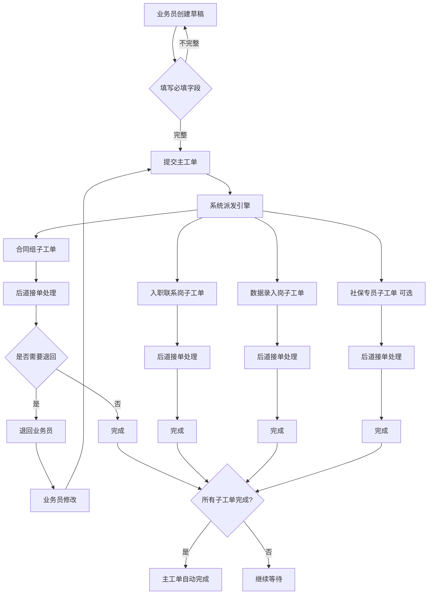
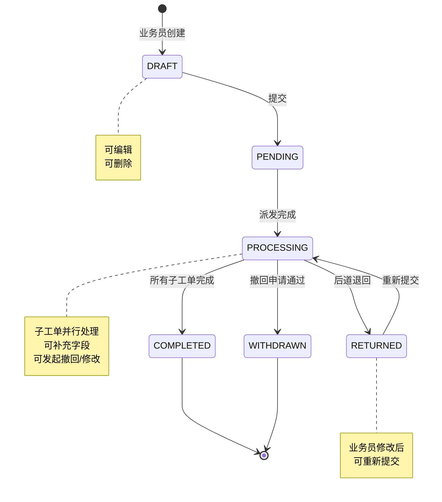

# 工单系统业务流程完整指南

> 文档版本：1.0  
> 生成日期：2026-08-02  
> 目标：为团队成员提供系统业务流程的完整理解  
> 作者：业务流程专家

---

## 目录

1. [系统概览](#1-系统概览)
2. [工单生命周期](#2-工单生命周期)
3. [角色与职责](#3-角色与职责)  
4. [核心业务规则](#4-核心业务规则)
5. [关键业务场景](#5-关键业务场景)
6. [数据模型与状态流转](#6-数据模型与状态流转)
7. [权限体系](#7-权限体系)
8. [通知机制](#8-通知机制)

---

## 1. 系统概览

### 1.1 系统定位

工单系统是一个**多角色协作的业务流程管理平台**，用于将"客户入职单据上传 → 多模块接力交付"的线下流程数字化。系统通过主工单和子工单的两层结构，实现业务流程的并行处理和精细化管理。

### 1.2 核心价值

- **全链路可审计**：所有提交、派发、退回、撤回、修改都有痕迹
- **表驱动配置**：字段、派发规则、角色权限走数据库配置，无需改代码
- **灵活扩展**：为续签/离职/待遇申报/月度批量业务预留通用扩展位

### 1.3 技术栈

**后端**：
- NestJS 10 + TypeScript 5.5 (strict)
- TypeORM 0.3 + PostgreSQL 16
- JWT + Passport 鉴权
- class-validator 全局校验

**前端**：
- React 18 + TypeScript 5.5
- Ant Design 5 + Ant Design Pro Components
- React Router 6 + Zustand 4
- Axios 统一封装

---

## 2. 工单生命周期

### 2.1 工单类型概览

| 类型 | 代码 | 说明 | 子工单模块 | 当前阶段 |
|------|------|------|-----------|----------|
| 入职管理 | onboarding | 员工入职办理 | 合同/入职联系/数据录入/社保 | ✅ 已实现 |
| 续签管理 | renewal | 劳动合同续签 | (预留扩展) | 🔄 架构预留 |
| 离职管理 | resignation | 员工离职办理 | (预留扩展) | 🔄 架构预留 |
| 待遇申报 | benefit | 待遇申报业务 | (预留扩展) | 🔄 架构预留 |
| 月度批量 | monthly | 月度批量业务 | (预留扩展) | 🔄 架构预留 |


### 2.2 入职工单完整流程



### 2.3 主工单状态机

| 状态 | 代码 | 说明 | 可转移到 |
|------|------|------|----------|
| 草稿 | DRAFT | 业务员创建但未提交 | PENDING |
| 待派发 | PENDING | 提交后等待派发(瞬态) | PROCESSING |
| 处理中 | PROCESSING | 子工单已派发 | RETURNED, COMPLETED, WITHDRAWN |
| 已退回 | RETURNED | 后道退回修改 | PROCESSING |
| 已完成 | COMPLETED | 所有子工单完成 | (终态) |
| 已撤回 | WITHDRAWN | 撤回申请通过 | (终态) |

### 2.4 子工单状态机

| 状态 | 代码 | 说明 | 可转移到 |
|------|------|------|----------|
| 待接单 | PENDING | 等待后道接单 | PROCESSING |
| 处理中 | PROCESSING | 已接单处理中 | COMPLETED, RETURNED |
| 已完成 | COMPLETED | 后道完成处理 | (终态) |
| 已退回 | RETURNED | 退回业务员修改 | PENDING |

### 2.5 子工单类型(模块)

入职工单标准派发4个子工单模块:

| 模块代码 | 模块名称 | 职责 | 是否必须 |
|---------|---------|------|---------|
| contract | 劳动合同签订 | 准备合同、签署、归档 | ✅ 必须 |
| onboarding_contact | 入职联系 | 联系员工、安排入职事宜 | ✅ 必须 |
| data_entry | 数据录入 | 完善员工详细信息 | ✅ 必须 |
| social_security | 社保办理 | 办理社保公积金 | ❓ 条件派发 |

---

## 3. 角色与职责

### 3.1 角色体系概览

系统采用**角色-部门-用户**三维权限模型，支持一人多角色。

```
用户 (User)
  └── 用户角色关联 (UserRole)
        ├── 角色 (Role)
        └── 部门 (Department)
```

### 3.2 核心角色清单

| 角色代码 | 角色名称 | 层级 | 主要职责 |
|---------|---------|------|---------|
| admin | 系统管理员 | global | 系统配置、全局数据查看 |
| biz_member | 业务员 | execute | 创建工单、处理退回 |
| biz_group_leader | 业务组长 | supervisor | 查看团队工单、审批撤回 |
| biz_director | 业务负责人 | manager | 查看全局业务数据、决策支持 |
| contract_team | 合同专员 | execute | 处理劳动合同子工单 |
| contract_supervisor | 合同主管 | supervisor | 审批、重新分配 |
| onboarding_contact_team | 入职联系专员 | execute | 处理入职联系子工单 |
| data_entry_team | 数据录入专员 | execute | 处理数据录入子工单 |
| social_security_team | 社保专员 | execute | 处理社保子工单 |

### 3.3 角色权限矩阵

| 操作 | 业务员 | 业务组长 | 业务负责人 | 后道专员 | 后道主管 | 管理员 |
|------|--------|---------|----------|---------|---------|--------|
| 创建工单 | ✅ | ✅ | ✅ | ❌ | ❌ | ✅ |
| 查看自己创建的工单 | ✅ | ✅ | ✅ | ❌ | ❌ | ✅ |
| 查看团队工单 | ❌ | ✅ | ✅ | ❌ | ✅ | ✅ |
| 查看全局工单 | ❌ | ❌ | ✅ | ❌ | ❌ | ✅ |
| 提交工单 | ✅ | ✅ | ✅ | ❌ | ❌ | ✅ |
| 修改草稿 | ✅ | ✅ | ✅ | ❌ | ❌ | ✅ |
| 处理退回 | ✅ | ✅ | ✅ | ❌ | ❌ | ✅ |
| 发起撤回/修改 | ✅ | ✅ | ✅ | ❌ | ❌ | ✅ |
| 接单处理 | ❌ | ❌ | ❌ | ✅ | ✅ | ✅ |
| 退回工单 | ❌ | ❌ | ❌ | ✅ | ✅ | ✅ |
| 完成子工单 | ❌ | ❌ | ❌ | ✅ | ✅ | ✅ |
| 补充字段 | ❌ | ❌ | ❌ | ✅ | ✅ | ✅ |
| 审批撤回 | ❌ | ✅ | ❌ | ✅ | ✅ | ✅ |
| 重新分配子工单 | ❌ | ❌ | ❌ | ❌ | ✅ | ✅ |
| 配置字段/规则 | ❌ | ❌ | ❌ | ❌ | ❌ | ✅ |


---

## 4. 核心业务规则

### 4.1 派发规则引擎

系统通过**派发引擎(DispatchEngine)**根据配置自动将主工单拆分为子工单。

#### 4.1.1 派发规则配置

派发规则存储在`dispatch_rules`表，包含:

- **规则名称** (rule_name): 可读描述
- **工单类型** (order_type): 匹配哪类工单
- **触发条件** (trigger_conditions): JSON AST表达式
- **目标模块** (target_module): 派发到哪个模块
- **派发策略** (dispatch_strategy): 如何分配处理人
- **优先级** (priority): 数值越小优先级越高

#### 4.1.2 条件表达式示例

```json
{
  "op": "AND",
  "children": [
    {
      "op": "EQ",
      "field": "need_company_contract",
      "value": "是"
    },
    {
      "op": "IN",
      "field": "customer_code",
      "value": ["C001", "C002", "C003"]
    }
  ]
}
```

支持的操作符:
- 比较: EQ(等于), NE(不等于), GT(大于), LT(小于), IN(包含于), EXISTS(字段存在)
- 逻辑: AND(与), OR(或)

#### 4.1.3 派发策略

| 策略 | 代码 | 说明 |
|------|------|------|
| 固定分配 | FIXED | 分配给配置的第一个处理人 |
| 轮询 | ROUND_ROBIN | 按权重轮流分配 |
| 负载均衡 | LOAD_BALANCE | 分配给待办最少的人 |
| 公共池 | POOL | 不指定处理人,放入模块公共池 |

#### 4.1.4 派发去重规则

同一模块如果被多条规则命中,**只创建一个子工单**,采用最高优先级规则的处理人分配。

### 4.2 字段权限体系

字段权限通过`field_permissions`表配置,支持**角色 × 场景 × 字段**三维控制。

#### 4.2.1 权限模式

| 模式 | 代码 | 前端表现 | 后端行为 |
|------|------|---------|---------|
| 可见可编辑 | VISIBLE | 正常显示,可编辑 | 完整返回 |
| 只读 | READONLY | 正常显示,禁用编辑 | 完整返回,标记readonly |
| 脱敏 | MASKED | 部分隐藏显示 | 脱敏后返回(如身份证前6后4) |
| 隐藏 | HIDDEN | 不显示 | 不返回 |

#### 4.2.2 场景划分

- **主工单场景** (scenario=main): 业务员创建/编辑主工单
- **子工单场景** (scenario=dispatched:<module_code>): 后道处理对应模块子工单

#### 4.2.3 多角色权限合并

用户可能拥有多个角色,权限合并策略:**取最宽松的**

优先级: VISIBLE > READONLY > MASKED > HIDDEN

### 4.3 字段补充与回流

#### 4.3.1 字段补充场景

后道模块可以补充主工单中的字段数据,典型场景:

- 入职联系岗补充: 联系结果、入职确认时间、反馈意见
- 数据录入岗补充: 手机号、邮箱、紧急联系人
- 合同组补充: 合同编号、合同签署日期

#### 4.3.2 补充规则配置

`field_supplement_rules`表定义:

- **字段代码** (field_code): 哪个字段可被补充
- **补充模块** (supplementer_module): 由哪个模块补充
- **同步目标** (sync_to_modules): 补充后同步到哪些模块

示例:
```json
{
  "field_code": "bank_account",
  "supplementer_module": "onboarding_contact",
  "sync_to_modules": ["data_entry", "social_security"]
}
```

#### 4.3.3 并发冲突处理

使用**乐观锁**防止字段补充冲突:
- 前端提交时携带`workOrderUpdatedAt`时间戳
- 后端校验时间戳匹配
- 不匹配则返回错误,要求刷新后重试

### 4.4 审批流程

#### 4.4.1 撤回/修改申请

业务员可以对已提交的工单发起:

- **撤回申请** (request_type=WITHDRAW): 完全撤销工单
- **修改申请** (request_type=MODIFY): 修改部分字段后继续流转

#### 4.4.2 审批人规则

系统自动确定审批人:

1. 查找所有**未完成**的子工单 (status != COMPLETED)
2. 为每个子工单创建审批记录 (WithdrawApproval)
3. 审批人 = 子工单的当前处理人 (handler_id)
4. 如果子工单未分配处理人,审批人 = 业务员自己

#### 4.4.3 审批状态流转

```
PENDING (待审批)
  ├─ 所有人同意 → APPROVED (通过)
  ├─ 任一人拒绝 → REJECTED (拒绝)
  ├─ 部分人同意 → PARTIAL (部分同意,等待其他人)
  └─ 业务员取消 → CANCELLED (已取消)
```

#### 4.4.4 审批结算逻辑

**撤回申请通过**:
- 主工单状态 → WITHDRAWN
- 所有未完成子工单 → COMPLETED
- 子工单returnReason设为"主工单已撤回"

**修改申请通过**:
- 更新主工单extraData(合并modifyData)
- 主工单状态保持PROCESSING
- 子工单继续流转


---

## 5. 关键业务场景

### 5.1 入职员工办理全流程

#### 场景描述
业务员张三为ABC公司新员工李四办理入职手续。

#### 步骤详解

**Step 1: 创建草稿** (T+0天 09:00)
```
操作人: 张三 (业务员)
操作: 创建工单
填写: 
  - 客户: ABC公司
  - 部门: 销售部  
  - 员工姓名: 李四
  - 身份证号: 320***********1234
  - 入职日期: 2024-01-15
  - 是否需要公司合同: 是
状态: DRAFT
```

**Step 2: 提交派发** (T+0天 09:30)
```
操作人: 张三
操作: 提交工单
系统行为:
  1. 主工单状态: DRAFT → PENDING → PROCESSING
  2. 派发引擎评估规则
  3. 创建4个子工单:
     - 合同组 (分配给王五)
     - 入职联系岗 (分配给赵六)
     - 数据录入岗 (放入公共池)
     - 社保专员 (分配给孙七,条件派发)
  4. 通知王五、赵六、孙七
```

**Step 3-6: 后道并行处理** (T+0天 10:00 - T+1天 16:00)

各模块独立处理,可能顺序:

```
[合同组 - 王五]
  10:00 接单 (PENDING → PROCESSING)
  10:30 补充字段: 合同编号、签署日期
  14:00 完成 (PROCESSING → COMPLETED)

[入职联系岗 - 赵六]  
  11:00 接单
  14:30 补充字段: 联系结果、入职确认时间
  15:00 完成

[数据录入岗 - 李八从池中接单]
  13:00 接单
  13:30 补充字段: 手机、邮箱、紧急联系人
  15:30 完成

[社保专员 - 孙七]
  次日10:00 接单
  次日15:00 补充字段: 社保基数、公积金账号
  次日16:00 完成
```

**Step 7: 主工单自动完成** (T+1天 16:00)
```
系统行为:
  1. 检测到所有子工单已完成
  2. 主工单状态: PROCESSING → COMPLETED
  3. 记录completedAt时间
  4. 通知张三: 工单已完成
```

### 5.2 离职员工办理全流程

> **注**: 离职管理当前为架构预留阶段,以下为规划流程。

#### 场景描述
业务员发起员工离职工单,需办理社保停保、劳动关系解除、档案归档等。

#### 预期子工单模块
1. 社保停保
2. 劳动关系解除
3. 档案归档  
4. 离职证明(可选)

### 5.3 异常处理: 退回场景

#### 场景描述
数据录入岗发现身份证号有误,退回业务员修改。

#### 步骤详解

**T+0天 10:15 - 后道发现问题**
```
操作人: 李八 (数据录入岗)
操作: 退回工单
退回原因: "身份证号格式错误,请核实"
系统行为:
  1. 子工单状态: PROCESSING → RETURNED
  2. 主工单状态: PROCESSING → RETURNED
  3. 通知张三
```

**T+0天 11:00 - 业务员修改**
```
操作人: 张三
操作: 修改工单数据
修改: 更正身份证号
限制: 只能修改extraData,不能改客户/部门
```

**T+0天 11:10 - 重新提交**
```
操作人: 张三
操作: 重新提交
系统行为:
  1. RETURNED状态的子工单 → PENDING
  2. 主工单状态: RETURNED → PROCESSING
  3. 清空returnReason
  4. 更新dispatchedAt
  5. 其他未退回子工单状态不变
```

### 5.4 异常处理: 撤回场景

#### 场景描述
客户取消订单,业务员需撤回工单。

#### 步骤详解

**T+0天 12:00 - 发起撤回**
```
操作人: 张三
操作: 发起撤回申请
申请类型: WITHDRAW
申请原因: "客户取消订单"
系统行为:
  1. 创建WithdrawRequest (status=PENDING)
  2. 查找未完成子工单: 合同组/入职联系岗/数据录入岗
  3. 创建3条WithdrawApproval:
     - 审批人: 王五 (合同组)
     - 审批人: 赵六 (入职联系岗)
     - 审批人: 李八 (数据录入岗)
  4. 通知3位审批人
```

**T+0天 12:30-13:30 - 审批过程**
```
12:30 王五同意
  → 审批1: PENDING → AGREE
  → 申请: PENDING → PARTIAL

13:00 赵六同意  
  → 审批2: PENDING → AGREE
  → 申请: PARTIAL (仍有李八未审批)

13:30 李八同意
  → 审批3: PENDING → AGREE
  → 申请: PARTIAL → APPROVED
  → 执行撤回:
      主工单: PROCESSING → WITHDRAWN
      3个子工单: → COMPLETED
      returnReason: "主工单已撤回"
  → 通知张三: 申请已通过
```

---

## 6. 数据模型与状态流转

### 6.1 核心数据表

#### 6.1.1 基础域表

| 表名 | 说明 | 关键字段 |
|------|------|---------|
| users | 用户表 | username, realName, passwordHash |
| roles | 角色表 | code, name, level |
| user_roles | 用户角色关联 | userId, roleId, departmentId |
| departments | 部门树 | code, name, parentId |
| customers | 客户档案 | customerCode, customerName |

#### 6.1.2 配置域表

| 表名 | 说明 | 关键字段 |
|------|------|---------|
| field_configs | 字段配置 | fieldCode, fieldType, isRequired, orderType |
| field_permissions | 字段权限 | roleId, fieldCode, permission, scenario |
| dispatch_rules | 派发规则 | orderType, triggerConditions, targetModule |
| module_handlers | 模块处理人 | moduleCode, handlerId, weight, isBackup |
| field_supplement_rules | 字段补充规则 | fieldCode, supplementerModule, syncToModules |

#### 6.1.3 业务域表

| 表名 | 说明 | 关键字段 |
|------|------|---------|
| work_orders | 主工单 | orderNo, orderType, status, extraData(JSONB) |
| dispatched_orders | 子工单 | parentOrderId, moduleCode, handlerId, status |
| withdraw_requests | 撤回申请 | workOrderId, requestType, requesterId, status |
| withdraw_approvals | 撤回审批 | requestId, dispatchedOrderId, approverId, approvalStatus |
| field_supplement_logs | 字段补充日志 | workOrderId, fieldCode, oldValue, newValue |

#### 6.1.4 辅助域表

| 表名 | 说明 | 关键字段 |
|------|------|---------|
| notifications | 通知表 | userId, bizType, title, content, isRead |
| operation_logs | 操作日志 | userId, entityType, actionType, beforeData, afterData |
| import_jobs | 导入任务 | status, totalRows, successRows, errorRows |
| export_templates | 导出模板 | moduleCode, fieldList(JSONB), isShared |

### 6.2 JSONB字段详解

#### 6.2.1 work_orders.extra_data

存储所有业务字段数据,key为fieldCode:

```json
{
  "employee_name": "李四",
  "id_card_no": "320***********1234",
  "mobile": "138****5678",
  "onboarding_date": "2024-01-15",
  "need_company_contract": "是",
  "base_salary": "8000",
  "bank_name": "中国工商银行",
  "bank_account": "6222************4321"
}
```

#### 6.2.2 dispatch_rules.trigger_conditions

派发规则的条件表达式(JSON AST):

```json
{
  "op": "AND",
  "children": [
    { "op": "EQ", "field": "need_company_contract", "value": "是" },
    { "op": "NE", "field": "customer_code", "value": null }
  ]
}
```

#### 6.2.3 field_supplement_rules.sync_to_modules

字段补充后同步的模块列表:

```json
["data_entry", "social_security"]
```

### 6.3 完整状态流转图




---

## 7. 权限体系

### 7.1 权限体系架构

系统采用**RBAC + 字段级权限**混合模型:

```
用户 (User)
  ├─ UserRole (用户角色关联)
  │    ├─ Role (角色)
  │    └─ Department (部门上下文)
  │
  └─ 权限计算
       ├─ 路由权限 (RouteVisibility)
       ├─ 操作权限 (RoleActionPermission)
       └─ 字段权限 (FieldPermission)
```

### 7.2 路由权限

前端路由通过`routeVisibility.ts`配置角色可见性:

```typescript
export const routeVisibility = {
  '/work-orders': ['admin', 'biz_member', 'biz_group_leader'],
  '/my-dispatched': ['contract_team', 'onboarding_contact_team'],
  '/admin': ['admin'],
  // ...
}
```

守卫组件`RouteGuard`检查当前用户角色,无权限跳转403。

### 7.3 数据范围权限

| 角色 | 主工单 | 子工单 | 团队工单 |
|------|--------|--------|---------|
| 业务员 | 仅自己创建 | 仅自己工单的 | ❌ |
| 业务组长 | 仅自己创建 | 仅自己工单的 | ✅ 本组 |
| 业务负责人 | ❌ 不查看具体工单 | ❌ | ✅ 全公司 |
| 后道专员 | ❌ | 分配给自己+公共池 | ❌ |
| 后道主管 | ❌ | 本模块全部 | ✅ 本模块 |
| 管理员 | ✅ 全部 | ✅ 全部 | ✅ 全部 |

### 7.4 字段级权限实例

以"身份证号"字段为例:

| 角色 | 场景 | 权限 | 前端表现 |
|------|------|------|---------|
| 业务员 | 主工单创建 | VISIBLE | 完整显示,可编辑 |
| 合同专员 | 合同子工单 | VISIBLE | 完整显示,可编辑 |
| 入职联系岗 | 入职联系子工单 | MASKED | 320***********1234 |
| 数据录入岗 | 数据录入子工单 | VISIBLE | 完整显示,可编辑 |
| 业务负责人 | 仪表盘统计 | HIDDEN | 不显示 |

### 7.5 权限校验流程

**后端校验**:
```typescript
@UseGuards(JwtAuthGuard, RolesGuard)
@Roles('admin', 'biz_member')
@UseInterceptors(FieldPermissionInterceptor)
async getWorkOrderDetail(@Param('id') id: string, @CurrentUser() user: User) {
  // 1. JwtAuthGuard: 校验JWT token
  // 2. RolesGuard: 校验角色
  // 3. Service: 校验数据范围(是否有权查看该工单)
  // 4. FieldPermissionInterceptor: 过滤字段权限
  return await this.service.getDetail(id, user);
}
```

**前端校验**:
```typescript
// 路由守卫
<Route element={<RouteGuard allowedRoles={['admin', 'biz_member']} />}>
  <Route path="/work-orders/:id" element={<WorkOrderDetail />} />
</Route>

// 字段渲染
{hasFieldPermission('id_card_no', 'VISIBLE') && (
  <Form.Item label="身份证号">
    <Input value={maskedIdCard} disabled={isReadonly} />
  </Form.Item>
)}
```

---

## 8. 通知机制

### 8.1 通知触发时机

| 业务类型 | 触发时机 | 接收人 | 标题 |
|---------|---------|--------|------|
| dispatched_new | 子工单派发 | 子工单处理人 | 新子工单待处理 |
| dispatched_returned | 子工单退回 | 主工单创建人 | 子工单已退回 |
| withdraw_requested | 撤回申请创建 | 未完成子工单处理人 | 撤回申请待审批 |
| withdraw_resolved | 撤回申请结算 | 申请人 | 撤回申请已通过/拒绝 |
| work_order_completed | 主工单完成 | 主工单创建人 | 工单已完成 |
| field_supplemented | 字段补充完成 | 相关模块处理人 | 字段已更新 |

### 8.2 通知数据结构

```typescript
interface Notification {
  id: string;
  userId: string;           // 接收人
  bizType: string;          // 业务类型
  title: string;            // 标题
  content: string;          // 内容
  link: string;             // 跳转链接
  payload: Record<string, any>; // 附加数据
  isRead: boolean;          // 是否已读
  readAt: Date | null;      // 阅读时间
  createdAt: Date;          // 创建时间
}
```

### 8.3 通知渠道

当前支持:
- **站内通知**: ✅ 已实现,存入notifications表
- **SSE推送**: ✅ 已实现,实时推送到前端
- **邮件通知**: 🔄 架构预留
- **短信通知**: 🔄 架构预留

### 8.4 通知模板

通知内容通过`notification_templates`表配置:

```typescript
{
  biz_type: 'withdraw_requested',
  title_template: '撤回申请待审批',
  content_template: '工单 {{orderNo}} 的撤回申请需要您审批',
  default_channels: {
    in_app: true,
    email: false,
    sms: false
  },
  variables: {
    type: 'object',
    properties: {
      orderNo: { type: 'string' },
      requesterName: { type: 'string' },
      reason: { type: 'string' }
    }
  }
}
```

---

## 9. 技术实现要点

### 9.1 并发控制

#### 9.1.1 乐观锁(字段补充)

```typescript
// 前端提交时携带版本号
const payload = {
  fieldCode: 'bank_account',
  newValue: '6222...4321',
  workOrderUpdatedAt: workOrder.updatedAt // 版本标识
};

// 后端检查版本
const result = await this.repo
  .update({ 
    id,
    updatedAt: payload.workOrderUpdatedAt 
  }, {
    extraData: newData,
    updatedAt: new Date()
  });

if (result.affected === 0) {
  throw new ConflictException('工单已被他人修改');
}
```

#### 9.1.2 悲观锁(撤回审批)

```typescript
await manager.query(
  'SELECT * FROM withdraw_requests WHERE id = $1 FOR UPDATE',
  [requestId]
);
// 事务内执行审批结算逻辑
```

#### 9.1.3 分布式锁(工单提交)

```typescript
// PostgreSQL advisory lock
await manager.query(
  'SELECT pg_advisory_xact_lock(hashtext($1))',
  [`work_order:submit:${id}`]
);
// 事务内执行派发流程
```

### 9.2 性能优化

#### 9.2.1 JSONB索引

```sql
CREATE INDEX idx_wo_extra_gin 
  ON work_orders 
  USING GIN (extra_data jsonb_path_ops);
```

支持高效查询:
```sql
SELECT * FROM work_orders 
WHERE extra_data @> '{"customer_code": "C001"}';
```

#### 9.2.2 查询优化

- 主工单列表: 按created_at降序+limit分页
- 子工单列表: 组合索引(handler_id, status, dispatched_at)
- 通知列表: 组合索引(user_id, is_read, created_at)

#### 9.2.3 缓存策略

- 字段配置: Redis缓存,30分钟TTL
- 派发规则: Redis缓存,10分钟TTL
- 用户角色: 内存缓存,登录时加载

### 9.3 数据一致性

#### 9.3.1 事务边界

关键操作必须在事务内:
- 提交工单 + 派发子工单
- 完成子工单 + 检查主工单完成
- 撤回申请结算 + 更新工单状态

#### 9.3.2 审计日志

所有关键操作写入`operation_logs`:

```typescript
@Audit('work_order', 'submit')
async submit(id: string, user: User) {
  // Service逻辑
  // AuditInterceptor自动记录before/after
}
```

---

## 10. 常见问题FAQ

### Q1: 子工单可以跨类型吗?

**A**: 不可以。每个主工单的`order_type`决定了它可以派发哪些子工单模块。入职工单只能派发入职相关的4个模块,不能派发离职模块。

### Q2: 业务员能看到子工单详情吗?

**A**: 业务员可以看到子工单的**状态和处理进度**,但不能看到子工单的**详细处理过程和后道补充的字段**。

### Q3: 撤回申请需要所有人同意吗?

**A**: 是的。撤回申请采用**一票否决制**,必须所有未完成子工单的处理人都同意,申请才能通过。任何一人拒绝,申请立即失败。

### Q4: 修改申请和撤回申请的区别?

**A**: 
- **撤回申请**: 完全撤销工单,所有未完成子工单强制完成,主工单进入WITHDRAWN终态
- **修改申请**: 只修改部分字段,子工单继续流转,主工单保持PROCESSING状态

### Q5: 退回和撤回的区别?

**A**:
- **退回(Return)**: 后道发起,将子工单退回给业务员修改,业务员修改后重新提交,子工单重新派发
- **撤回(Withdraw)**: 业务员发起,需要后道审批,通过后主工单进入终态

### Q6: 字段补充会通知其他模块吗?

**A**: 是的。如果字段补充规则配置了`sync_to_modules`,补充完成后会通知相关模块的处理人。

### Q7: 一个用户可以有多个角色吗?

**A**: 可以。系统支持一人多角色。权限合并时取最宽松的(VISIBLE > READONLY > MASKED > HIDDEN)。

### Q8: 主工单什么时候自动完成?

**A**: 当且仅当**所有子工单**的状态都是COMPLETED时,主工单自动变为COMPLETED。任何一个子工单未完成,主工单保持PROCESSING状态。

### Q9: 派发规则优先级如何工作?

**A**: 
- priority数值越小优先级越高(0 > 1 > 2...)
- 同一模块被多条规则命中时,只创建一个子工单,采用最高优先级规则的处理人分配
- 不同模块的规则互不影响,各自创建子工单

### Q10: 公共池工单如何分配?

**A**: 派发到公共池的子工单(handler_id=null),任何有该模块权限的后道人员都可以接单。先接先得,接单后handler_id更新为接单人。

---

## 11. 附录

### 11.1 关键术语表

| 术语 | 英文 | 说明 |
|------|------|------|
| 主工单 | Work Order | 业务员创建的顶层工单 |
| 子工单 | Dispatched Order | 从主工单派发出的模块工单 |
| 派发引擎 | Dispatch Engine | 根据规则自动拆分工单的核心模块 |
| 字段权限 | Field Permission | 控制不同角色对字段的可见性和可编辑性 |
| 撤回申请 | Withdraw Request | 业务员发起的工单撤回申请 |
| 修改申请 | Modify Request | 业务员发起的工单修改申请 |
| 字段补充 | Field Supplement | 后道模块补充主工单字段数据 |
| 退回 | Return | 后道将子工单退回给业务员修改 |

### 11.2 状态码对照表

**主工单状态**:
- DRAFT: 草稿
- PENDING: 待派发(瞬态)
- PROCESSING: 处理中
- RETURNED: 已退回
- COMPLETED: 已完成
- WITHDRAWN: 已撤回

**子工单状态**:
- PENDING: 待接单
- PROCESSING: 处理中
- COMPLETED: 已完成
- RETURNED: 已退回

**撤回申请状态**:
- PENDING: 待审批
- PARTIAL: 部分同意
- APPROVED: 已通过
- REJECTED: 已拒绝
- CANCELLED: 已取消

**审批记录状态**:
- PENDING: 待审批
- AGREE: 同意
- REJECT: 拒绝

### 11.3 相关文档索引

- 架构设计: `docs/架构设计.md`
- 数据库ER图: `docs/数据库ER图.md`
- 入职管理流程: `docs/入职管理工单流转流程.md`
- 业务规则回归清单: `docs/业务规则回归清单.md`
- AI操作手册: `docs/project-rules/CLAUDE.md`
- API规范: `docs/API规范.md`
- 开发规范: `docs/开发规范.md`

### 11.4 联系方式

- 技术架构问题: 查阅`docs/架构设计.md`
- 业务流程问题: 查阅本文档或`docs/入职管理工单流转流程.md`
- 权限配置问题: 查阅`docs/业务组动态权限补充说明.md`
- 测试验收问题: 查阅`docs/回归用例总纲.md`

---

**文档结束**

生成时间: 2026-08-02  
文档版本: 1.0  
作者: 业务流程专家  
审核状态: 待审核

